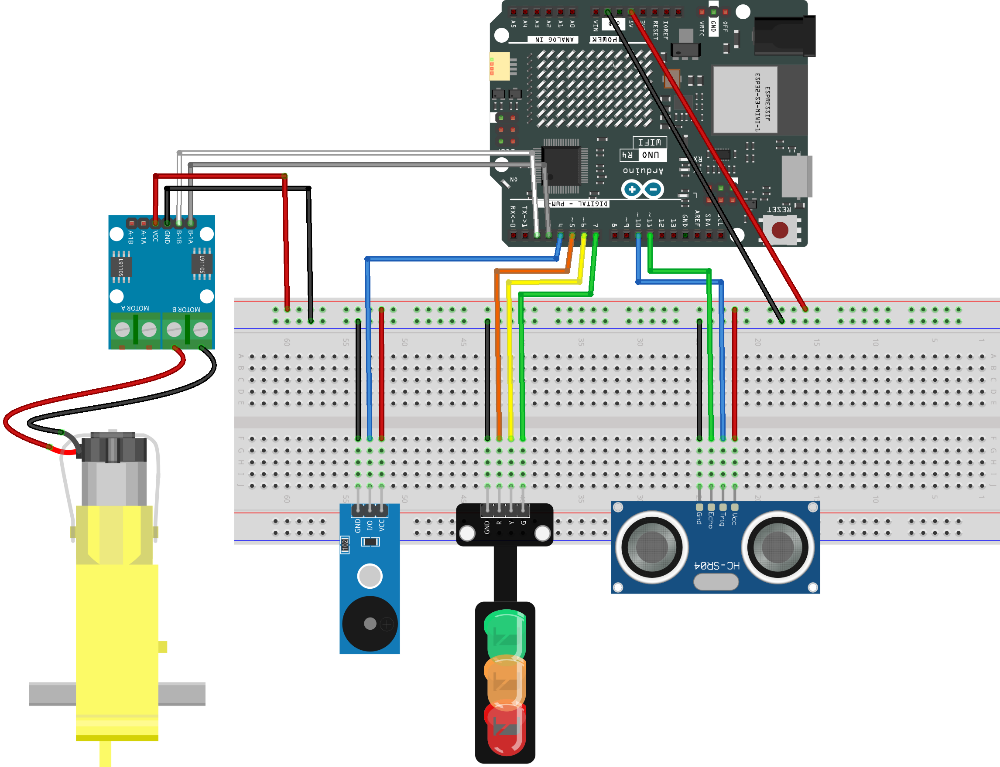

.. _smart_stop3:

Smart Stop 3.0
==============================================================

.. note::
  
  🌟 Welcome to the SunFounder Facebook Community! Whether you're into Raspberry Pi, Arduino, or ESP32, you'll find inspiration, help ideas here.
   
  - ✅ Be the first to get free learning resources. 
   
  - ✅ Stay updated on new products & exclusive giveaways. 
   
  - ✅ Share your creations and get real feedback.
   
  * 👉 Need faster updates or support? Click [|link_sf_facebook|] join our Facebook community 

  * 👉 Or join our WhatsApp group: Click [|link_sf_whatsapp|]
   
  * 🎁 Looking for parts?Check out our all-in-one kits below — packed with components, beginner-friendly guides, and tons of fun.
  
  .. list-table::
    :widths: 20 20 20
    :header-rows: 1

    *   - Name	
        - Includes Arduino board
        - PURCHASE LINK
    *   - Elite Explorer Kit
        - Arduino Uno R4 WiFi
        - |link_elite_buy|
    *   - Universal Maker Sensor Kit
        - ×
        - |link_umsk_buy|
    *   - 3 in 1 Ultimate Starter Kit	
        - Arduino Uno R3
        - |link_arduinor3_buy|

Course Introduction
------------------------

In this lesson, you’ll learn how to use an L9110 Motor Driver Module, an Ultrasonic Sensor Module, a 1602 LCD, and a TT motor with the Arduino UNO R3 to create a Smart Stop 2.0 system.

As the obstacle gets closer to the Ultrasonic Sensor Module, the LCD screen displays the distance to obstacles and the servo speed. When the distance exceeds the predefined safety threshold, the green light switches to a flashing red light as a warning, the TT motor gradually slows down until it comes to a stop.

.. .. raw:: html

..    <iframe width="700" height="394" src="https://www.youtube.com/embed/Ao_hR9dFvOc?si=ryIcOk0LiWaqFwXc" title="YouTube video player" frameborder="0" allow="accelerometer; autoplay; clipboard-write; encrypted-media; gyroscope; picture-in-picture; web-share" referrerpolicy="strict-origin-when-cross-origin" allowfullscreen></iframe>

.. note::

  If this is your first time working with an Arduino project, we recommend downloading and reviewing the basic materials first.
  
  * :ref:`install_arduino`
  * :ref:`introduce_arduino`

**Required Components**

In this project, we need the following components:

.. list-table::
    :widths: 5 20 5 20
    :header-rows: 1

    *   - SN
        - COMPONENT INTRODUCTION	
        - QUANTITY
        - PURCHASE LINK

    *   - 1
        - Arduino UNO R4 Minima/Arduino UNO R4 WIFI
        - 1
        - |link_unor4_wifi_buy|
    *   - 2
        - USB Cable
        - 1
        - 
    *   - 3
        - Breadboard
        - 1
        - |link_breadboard_buy|
    *   - 4
        - Wires
        - Several
        - |link_wires_buy|
    *   - 5
        - L9110 Motor Driver Module
        - 1
        - 
    *   - 6
        - Ultrasonic Sensor Module
        - 1
        - |link_ultrasonic_buy|
    *   - 7
        - TT Motor
        - 1
        - 
    *   - 8
        - Buzzer Modudle
        - 1
        - |link_buzzer_module_buy|
    *   - 9
        - Traffic Light LED
        - 1
        - |link_trafficlinght_buy|

**Wiring**

**Common Connections:**

* **Ultrasonic Sensor Module**

  - **Trig:** Connect to **10** on the Arduino.
  - **Echo:** Connect to **11** on the Arduino.
  - **GND:** Connect to breadboard’s negative power bus.
  - **VCC:** Connect to breadboard’s red power bus.

* **TT Motor**

  -  Connect to **MOTOR B** on the L9110 Motor Driver Module.

* **L9110 Motor Driver Module**

  - **GND:** Connect to breadboard’s negative power bus.
  - **VCC:** Connect to breadboard’s red power bus.
  - **B-1B:** Connect to **2** on the Arduino.
  - **B-1A:** Connect to **3** on the Arduino.

* **Buzzer Module**

  - **I/0:** Connect to **4** on the Arduino.
  - **＋:** Connect to breadboard’s red power bus. 
  - **－:** Connect to breadboard’s negative power bus.

* **Traffic light LED**

  - **R:** Connect to **5** on the Arduino.
  - **Y:** Connect to **6** on the Arduino.
  - **G:** Connect to **7** on the Arduino.
  - **GND:** Connect to breadboard’s negative power bus.

**Writing the Code**

.. note::

    * You can copy this code into **Arduino IDE**. 
    * Don't forget to select the board(Arduino UNO R4 WiFi) and the correct port before clicking the **Upload** button.

.. code-block:: arduino

      // ================= Pin Definitions =================
      const int motorPinA = 3;   // L9110 B-1A (PWM speed control)
      const int motorPinB = 2;   // L9110 B-1B (direction)

      const int trigPin = 10;    // Ultrasonic trigger pin
      const int echoPin = 11;    // Ultrasonic echo pin

      const int buzzerPin = 4;   // Passive buzzer

      const int redPin = 5;      // Traffic light - Red
      const int yellowPin = 6;   // Traffic light - Yellow
      const int greenPin = 7;    // Traffic light - Green

      // ================= Distance Thresholds (cm) =================
      const int STOP_DISTANCE = 5;    // Stop when distance < 5 cm
      const int SLOW_DISTANCE = 20;   // Slow down when distance < 20 cm

      // ================= Motor Parameters =================
      const int MIN_MOTOR_PWM = 75;   // Minimum PWM to make motor rotate
      const int MAX_MOTOR_PWM = 255;  // Maximum motor speed

      // ================= Buzzer Timing =================
      unsigned long previousBeepTime = 0;
      bool beepState = false;

      // ================= Setup =================
      void setup() {
        pinMode(motorPinA, OUTPUT);
        pinMode(motorPinB, OUTPUT);

        pinMode(trigPin, OUTPUT);
        pinMode(echoPin, INPUT);

        pinMode(buzzerPin, OUTPUT);

        pinMode(redPin, OUTPUT);
        pinMode(yellowPin, OUTPUT);
        pinMode(greenPin, OUTPUT);

        // Set motor direction (one direction only)
        digitalWrite(motorPinB, LOW);
      }

      // ================= Main Loop =================
      void loop() {
        int distance = readDistance();        // Get distance in cm
        int speed = calculateSpeed(distance); // Convert distance to motor speed

        controlMotor(speed);                  // Drive the motor
        updateTrafficLight(distance);         // Update traffic lights
        updateBuzzer(distance);               // Control buzzer sound

        delay(50);  // Small delay for stable reading
      }

      // ================= Read Distance =================
      int readDistance() {
        long duration;

        digitalWrite(trigPin, LOW);
        delayMicroseconds(2);
        digitalWrite(trigPin, HIGH);
        delayMicroseconds(10);
        digitalWrite(trigPin, LOW);

        // Read echo pulse, timeout prevents blocking
        duration = pulseIn(echoPin, HIGH, 25000);

        if (duration == 0) {
          return 100;  // No obstacle detected
        }

        return duration / 58;  // Convert to centimeters
      }

      // ================= Distance to Speed =================
      int calculateSpeed(int distance) {
        if (distance < STOP_DISTANCE) {
          return 0;  // Stop motor
        }

        if (distance < SLOW_DISTANCE) {
          // Map distance to valid motor speed range
          return map(distance, STOP_DISTANCE, SLOW_DISTANCE - 1,
                    MIN_MOTOR_PWM, MAX_MOTOR_PWM);
        }

        return MAX_MOTOR_PWM;  // Full speed
      }

      // ================= Motor Control =================
      void controlMotor(int speed) {
        analogWrite(motorPinA, speed);   // Set motor speed
        digitalWrite(motorPinB, LOW);    // Fixed direction
      }

      // ================= Traffic Light Control =================
      void updateTrafficLight(int distance) {
        digitalWrite(redPin, LOW);
        digitalWrite(yellowPin, LOW);
        digitalWrite(greenPin, LOW);

        if (distance < STOP_DISTANCE) {
          digitalWrite(redPin, HIGH);        // Stop
        } else if (distance < SLOW_DISTANCE) {
          digitalWrite(yellowPin, HIGH);     // Slow down
        } else {
          digitalWrite(greenPin, HIGH);      // Go
        }
      }

      // ================= Buzzer Control =================
      void updateBuzzer(int distance) {
        unsigned long currentTime = millis();

        if (distance < STOP_DISTANCE) {
          // Fast warning beep
          if (currentTime - previousBeepTime >= 100) {
            previousBeepTime = currentTime;
            beepState = !beepState;
            beepState ? tone(buzzerPin, 2000) : noTone(buzzerPin);
          }
        }
        else if (distance < SLOW_DISTANCE) {
          // Slow warning beep
          if (currentTime - previousBeepTime >= 500) {
            previousBeepTime = currentTime;
            beepState = !beepState;
            beepState ? tone(buzzerPin, 800) : noTone(buzzerPin);
          }
        }
        else {
          noTone(buzzerPin);  // Silent
        }
      }
