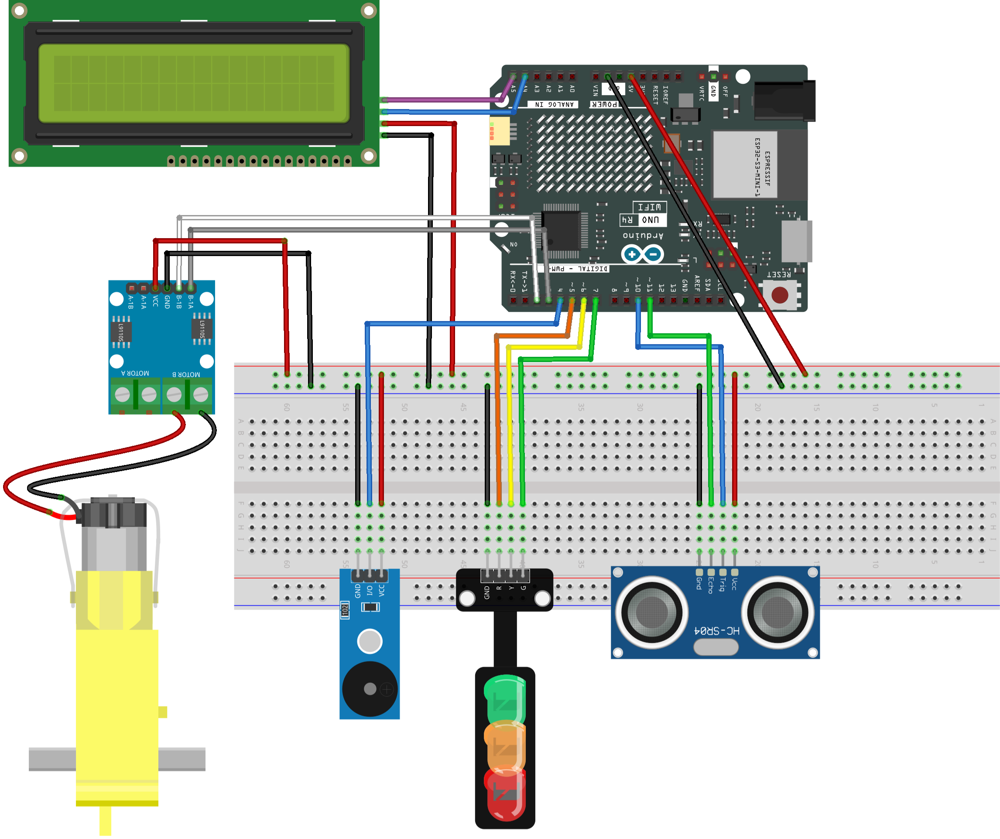

.. _smart_stop4:

Smart Stop 4.0
==============================================================

.. note::
  
  🌟 Welcome to the SunFounder Facebook Community! Whether you're into Raspberry Pi, Arduino, or ESP32, you'll find inspiration, help ideas here.
   
  - ✅ Be the first to get free learning resources. 
   
  - ✅ Stay updated on new products & exclusive giveaways. 
   
  - ✅ Share your creations and get real feedback.
   
  * 👉 Need faster updates or support? Click [|link_sf_facebook|] join our Facebook community 

  * 👉 Or join our WhatsApp group: Click [|link_sf_whatsapp|]
   
Kit purchase
------------------------

Looking for parts? Check out our all-in-one kits below — packed with components, beginner-friendly guides, and tons of fun.

.. image:: img/ultimate_sensor_kit.png
   :width: 100%
   :align: center
   :target: https://www.sunfounder.com/collections/arduino-kits-bundles/products/sunfounder-ultimate-sensor-kit-with-original-arduino-uno-r4-minima?ref=jbzmncle

.. raw:: html

     

.. list-table::
   :widths: 20 20 20
   :header-rows: 1

   * - Name
     - Includes Arduino board
     - PURCHASE LINK
   * - Elite Explorer Kit
     - Arduino Uno R4 WiFi
     - |link_elite_buy|
   * - 3 in 1 Ultimate Starter Kit
     - Arduino Uno R4 Minima
     - |link_arduinor4_buy|

Course Introduction
------------------------

In this lesson, you’ll learn how to use an L9110 Motor Driver Module, an Ultrasonic Sensor Module, an I2C LCD Module, a 1602 LCD, and a TT motor with the Arduino UNO R3 to create a Smart Stop 2.0 system.

As the obstacle gets closer to the Ultrasonic Sensor Module, the LCD screen displays the distance to obstacles and the servo speed. When the distance exceeds the predefined safety threshold, the green light switches to a flashing red light as a warning, the TT motor gradually slows down until it comes to a stop.

.. raw:: html

 <iframe width="700" height="394" src="https://www.youtube.com/embed/_WoZojtIqF8?si=eiE2Klw8YBnm7pzr" title="YouTube video player" frameborder="0" allow="accelerometer; autoplay; clipboard-write; encrypted-media; gyroscope; picture-in-picture; web-share" referrerpolicy="strict-origin-when-cross-origin" allowfullscreen></iframe>

.. note::

  If this is your first time working with an Arduino project, we recommend downloading and reviewing the basic materials first.
  
  * :ref:`install_arduino`
  * :ref:`introduce_arduino`

**Required Components**

In this project, we need the following components:

.. list-table::
    :widths: 5 20 5 20
    :header-rows: 1

    *   - SN
        - COMPONENT INTRODUCTION	
        - QUANTITY
        - PURCHASE LINK

    *   - 1
        - Arduino UNO R4 Minima/Arduino UNO R4 WIFI
        - 1
        - |link_unor4_wifi_buy|
    *   - 2
        - USB Cable
        - 1
        - 
    *   - 3
        - Breadboard
        - 1
        - |link_breadboard_buy|
    *   - 4
        - Wires
        - Several
        - |link_wires_buy|
    *   - 5
        - L9110 Motor Driver Module
        - 1
        - 
    *   - 6
        - Ultrasonic Sensor Module
        - 1
        - |link_ultrasonic_buy|
    *   - 7
        - TT Motor
        - 1
        - 
    *   - 8
        - Buzzer Modudle
        - 1
        - |link_buzzer_module_buy|
    *   - 9
        - Traffic Light LED
        - 1
        - |link_trafficlinght_buy|
    *   - 10
        - I2C LCD 1602
        - 1
        - |link_i2clcd1602_buy|

**Wiring**

**Common Connections:**

* **Ultrasonic Sensor Module**

  - **Trig:** Connect to **10** on the Arduino.
  - **Echo:** Connect to **11** on the Arduino.
  - **GND:** Connect to breadboard’s negative power bus.
  - **VCC:** Connect to breadboard’s red power bus.

* **TT Motor**

  -  Connect to **MOTOR B** on the L9110 Motor Driver Module.

* **L9110 Motor Driver Module**

  - **GND:** Connect to breadboard’s negative power bus.
  - **VCC:** Connect to breadboard’s red power bus.
  - **B-1B:** Connect to **2** on the Arduino.
  - **B-1A:** Connect to **3** on the Arduino.

* **Buzzer Module**

  - **I/0:** Connect to **4** on the Arduino.
  - **＋:** Connect to breadboard’s red power bus. 
  - **－:** Connect to breadboard’s negative power bus.

* **Traffic light LED**

  - **R:** Connect to **5** on the Arduino.
  - **Y:** Connect to **6** on the Arduino.
  - **G:** Connect to **7** on the Arduino.
  - **GND:** Connect to breadboard’s negative power bus.

* **I2C LCD 1602**

  - **SDA:** Connect to **A4** on the Arduino.
  - **SCL:** Connect to **A5** on the Arduino.
  - **GND:** Connect to breadboard’s negative power bus.
  - **VCC:** Connect to breadboard’s red power bus.

**Writing the Code**

.. note::

    * You can copy this code into **Arduino IDE**. 
    * To install the library, use the Arduino Library Manager and search for **LiquidCrystal I2C** and install it.
    * Don't forget to select the board(Arduino UNO R4 WiFi) and the correct port before clicking the **Upload** button.

.. code-block:: arduino

      #include <Wire.h>
      #include <LiquidCrystal_I2C.h>

      // I2C 16x2 LCD, most common address is 0x27
      LiquidCrystal_I2C lcd(0x27, 16, 2);

      // Motor driver pins (L9110, motor connected to B channel)
      // motorPinA provides PWM signal for speed control
      // motorPinB is kept LOW to fix the motor direction
      const int motorPinA = 3;
      const int motorPinB = 2;

      // Ultrasonic sensor pins (HC-SR04)
      const int trigPin = 10;    // Sends ultrasonic pulse
      const int echoPin = 11;    // Receives echo pulse

      // Passive buzzer pin (requires tone() function)
      const int buzzerPin = 4;

      // Traffic light LED pins
      const int redPin    = 5;
      const int yellowPin = 6;
      const int greenPin  = 7;

      // Distance thresholds in centimeters
      // Below STOP_DISTANCE: motor stops immediately
      // Below SLOW_DISTANCE: motor slows down
      const int STOP_DISTANCE = 5;
      const int SLOW_DISTANCE = 20;

      // Motor speed limits
      // Motor may not rotate reliably below MIN_MOTOR_PWM
      const int MIN_MOTOR_PWM = 75;
      const int MAX_MOTOR_PWM = 255;

      // Variables used to control buzzer timing without delay()
      unsigned long previousBeepTime = 0;
      bool beepState = false;

      void setup() {

        // Motor driver pins
        pinMode(motorPinA, OUTPUT);
        pinMode(motorPinB, OUTPUT);

        // Ultrasonic sensor pins
        pinMode(trigPin, OUTPUT);
        pinMode(echoPin, INPUT);

        // Buzzer and LED pins
        pinMode(buzzerPin, OUTPUT);
        pinMode(redPin, OUTPUT);
        pinMode(yellowPin, OUTPUT);
        pinMode(greenPin, OUTPUT);

        // Fix motor direction by keeping motorPinB LOW
        digitalWrite(motorPinB, LOW);

        // Initialize LCD
        lcd.init();
        lcd.backlight();

        // Display startup message
        lcd.setCursor(0, 0);
        lcd.print("Smart Stop 3.0");
        lcd.setCursor(0, 1);
        lcd.print("System Ready");
        delay(1000);
        lcd.clear();
      }

      void loop() {

        // Measure distance from ultrasonic sensor (cm)
        int distance = readDistance();

        // Convert distance into motor speed (PWM value)
        int speed = calculateSpeed(distance);

        // Drive motor using calculated speed
        controlMotor(speed);

        // Update LEDs, buzzer and LCD display
        updateTrafficLight(distance);
        updateBuzzer(distance);
        updateLCD(distance);

        // Small delay for stable sensor readings
        delay(50);
      }

      int readDistance() {
        long duration;

        // Send a 10 microsecond trigger pulse
        digitalWrite(trigPin, LOW);
        delayMicroseconds(2);
        digitalWrite(trigPin, HIGH);
        delayMicroseconds(10);
        digitalWrite(trigPin, LOW);

        // Measure echo pulse duration
        // Timeout prevents the program from blocking
        duration = pulseIn(echoPin, HIGH, 25000);

        // If no echo is detected, assume the object is far away
        if (duration == 0) {
          return 100;
        }

        // Convert time (microseconds) to distance (centimeters)
        return duration / 58;
      }

      int calculateSpeed(int distance) {

        // Stop motor immediately if object is too close
        if (distance < STOP_DISTANCE) {
          return 0;
        }

        // Gradually increase speed as distance increases
        // map() converts distance range into PWM range
        if (distance < SLOW_DISTANCE) {
          return map(distance,
                    STOP_DISTANCE,
                    SLOW_DISTANCE - 1,
                    MIN_MOTOR_PWM,
                    MAX_MOTOR_PWM);
        }

        // Safe distance: run motor at full speed
        return MAX_MOTOR_PWM;
      }

      void controlMotor(int speed) {

        // Output PWM signal to motorPinA
        // motorPinB stays LOW to keep direction unchanged
        analogWrite(motorPinA, speed);
        digitalWrite(motorPinB, LOW);
      }

      void updateTrafficLight(int distance) {

        // Turn off all LEDs before updating state
        digitalWrite(redPin, LOW);
        digitalWrite(yellowPin, LOW);
        digitalWrite(greenPin, LOW);

        if (distance < STOP_DISTANCE) {
          digitalWrite(redPin, HIGH);        // Stop
        }
        else if (distance < SLOW_DISTANCE) {
          digitalWrite(yellowPin, HIGH);     // Slow down
        }
        else {
          digitalWrite(greenPin, HIGH);      // Go
        }
      }

      void updateBuzzer(int distance) {
        unsigned long currentTime = millis();

        // Fast beeping when object is very close
        if (distance < STOP_DISTANCE) {
          if (currentTime - previousBeepTime >= 100) {
            previousBeepTime = currentTime;
            beepState = !beepState;
            beepState ? tone(buzzerPin, 2000) : noTone(buzzerPin);
          }
        }
        // Slow beeping as a warning
        else if (distance < SLOW_DISTANCE) {
          if (currentTime - previousBeepTime >= 500) {
            previousBeepTime = currentTime;
            beepState = !beepState;
            beepState ? tone(buzzerPin, 800) : noTone(buzzerPin);
          }
        }
        // No sound when it is safe
        else {
          noTone(buzzerPin);
          beepState = false;
        }
      }

      void updateLCD(int distance) {

        // Display distance on the first line
        lcd.setCursor(0, 0);
        lcd.print("Dist: ");
        lcd.print(distance);
        lcd.print(" cm   ");   // Extra spaces clear leftover characters

        // Display system state on the second line
        lcd.setCursor(0, 1);

        if (distance < STOP_DISTANCE) {
          lcd.print("State: STOP ");
        }
        else if (distance < SLOW_DISTANCE) {
          lcd.print("State: SLOW ");
        }
        else {
          lcd.print("State: GO   ");
        }
      }
