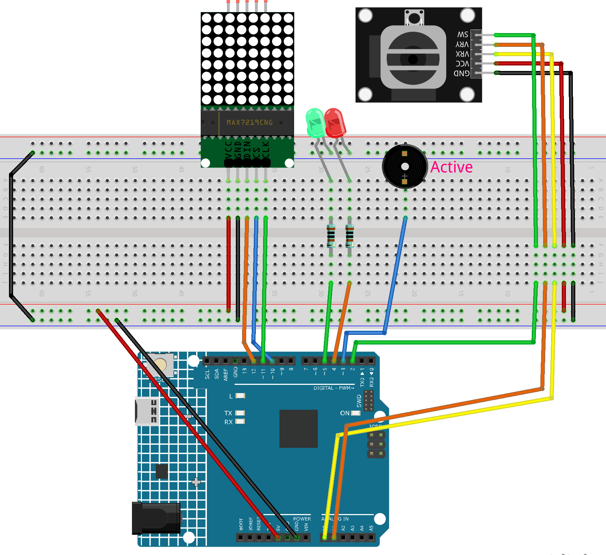

.. _snake_game2.0:

Snake Game 2.0
==============================================================

.. note::

  🌟 Welcome to the SunFounder Facebook Community! Whether you're into Raspberry Pi, Arduino, or ESP32, you'll find inspiration, help ideas here.
   
  - ✅ Be the first to get free learning resources. 
   
  - ✅ Stay updated on new products & exclusive giveaways. 
   
  - ✅ Share your creations and get real feedback.
   
  * 👉 Need faster updates or support? Click [|link_sf_facebook|] join our Facebook community 

  * 👉 Or join our WhatsApp group: Click [|link_sf_whatsapp|]
  
  * 🎁 Looking for parts?Check out our all-in-one kits below — packed with components, beginner-friendly guides, and tons of fun.

  .. list-table::
    :widths: 20 20 20
    :header-rows: 1

    *   - Name	
        - Includes Arduino board
        - PURCHASE LINK
    *   - Elite Explorer Kit	
        - Arduino Uno R4 WiFi
        - |link_elite_buy|
    *   - 3 in 1 Ultimate Starter Kit
        - Arduino Uno R4 Minima
        - |link_arduinor4_buy|

Course Introduction
------------------------

In this lesson, we’ll use a MAX7219 Dot Matrix Module, a joystick module, and an Arduino board to play a Snake game.

The snake’s movement will be controlled using the joystick.

.. .. raw:: html
 
..  <iframe width="700" height="394" src="https://www.youtube.com/embed/SzU_UkM_nhI?si=GyJVj01gund2IvVO" title="YouTube video player" frameborder="0" allow="accelerometer; autoplay; clipboard-write; encrypted-media; gyroscope; picture-in-picture; web-share" referrerpolicy="strict-origin-when-cross-origin" allowfullscreen></iframe>

.. note::

  If this is your first time working with an Arduino project, we recommend downloading and reviewing the basic materials first.
  
  * :ref:`install_arduino`
  * :ref:`introduce_arduino`

**Required Components**

In this project, we need the following components:

.. list-table::
    :widths: 5 20 5 20
    :header-rows: 1

    *   - SN
        - COMPONENT INTRODUCTION	
        - QUANTITY
        - PURCHASE LINK

    *   - 1
        - Arduino UNO R4 Minima/Arduino UNO R4 WIFI
        - 1
        - |link_unor4_wifi_buy|
    *   - 2
        - USB Type-C cable
        - 1
        - 
    *   - 3
        - Breadboard
        - 1
        - |link_breadboard_buy|
    *   - 4
        - Wires
        - Several
        - |link_wires_buy|
    *   - 5
        - Joystick Module
        - 1
        - |link_joystick_buy|
    *   - 6
        - MAX7219 Dot Matrix Module
        - 1
        - |link_martix1_buy|
    *   - 7
        - LED
        - 2
        - |link_led_buy|
    *   - 8
        - Active Buzzer
        - 1
        - 

**Wiring**

**Common Connections:**

* **MAX7219 Dot Matrix Module**

  - **CLK:** Connect to **11** on the Arduino.
  - **CS:** Connect to **10** on the Arduino.
  - **DIN:** Connect to **12** on the Arduino.
  - **GND:** Connect to breadboard’s negative power bus.
  - **VCC:** Connect to breadboard’s red power bus.

* **Joystick Module**

  - **SW:** Connect to **2** on the Arduino.
  - **VRY:** Connect to **A1** on the Arduino.
  - **VRX:** Connect to **A0** on the Arduino.
  - **GND:** Connect to breadboard’s negative power bus.
  - **VCC:** Connect to breadboard’s red power bus.

* **Active Buzzer**

  - **＋:** Connect to **3** on the Arduino.
  - **－:** Connect to breadboard’s negative power bus.

* **LEDS**

  - **Green:** Connect the LED **anode** to a **1kΩ resistor**, then to **5** on the Arduino, and the **cathode** to  the negative power bus on the breadboard.
  - **Red:** Connect the LED **anode** to a **1kΩ resistor**, then to **4** on the Arduino, and the **cathode** to  the negative power bus on the breadboard.

**Writing the Code**

.. note::

    * You can copy this code into **Arduino IDE**. 
    * To install the library, use the Arduino Library Manager and search for **LedControl** and install it.
    * Don't forget to select the board(Arduino UNO R4 WIFI) and the correct port before clicking the **Upload** button.

.. code-block:: arduino

      #include <LedControl.h>

      // -------------------- MAX7219 --------------------
      LedControl lc = LedControl(12, 11, 10, 1); // DIN=12, CLK=11, CS=10, 1 device

      // -------------------- Joystick -------------------
      // According to your readings:
      //   X axis: up=0, down=1023  -> vertical axis
      //   Y axis: left=0, right=1023 -> horizontal axis
      const int xPin = A0;     // vertical axis (X on the module)
      const int yPin = A1;     // horizontal axis (Y on the module)
      const int swPin = 2;     // SW (INPUT_PULLUP)

      // -------------------- I/O Add-ons ----------------
      const int buzzerPin = 3;   // Active buzzer on D3
      const int redLEDPin = 4;   // Red LED on D4
      const int greenLEDPin = 5; // Green LED on D5

      // -------------------- Grid/Snake -----------------
      #define GRID_SIZE 8
      int snake[64][2];        // (x,y) for each segment
      int snakeLength = 3;     // initial length
      int direction = 0;       // 0=R,1=D,2=L,3=U
      bool gameOverFlag = false;

      // -------------------- Speed ----------------------
      int moveSpeed = 300;     // ms
      const int minSpeed = 100;

      // -------------------- Food -----------------------
      int foodX, foodY;

      // -------------------- Joystick calibration --------
      int centerX = 512;       // vertical axis center (xPin)
      int centerY = 512;       // horizontal axis center (yPin)
      const int TRIGGER = 220; // tilt threshold to decide direction (tune 180~260)

      // -------------- Forward Declarations -------------
      void resetGame();
      void updateSnake();          // eat-after-predict version
      void displaySnakeAndFood();
      void updateDirection();
      bool checkCollision();
      void gameOver();
      void generateFood();
      // buzzer helpers
      void beepOnce(unsigned int ms);     // short beep
      void gameOverSound();               // end jingle

      void setup() {
        lc.shutdown(0, false);
        lc.setIntensity(0, 5);
        lc.clearDisplay(0);

        pinMode(swPin, INPUT_PULLUP);

        pinMode(buzzerPin, OUTPUT);
        pinMode(redLEDPin, OUTPUT);
        pinMode(greenLEDPin, OUTPUT);
        digitalWrite(buzzerPin, LOW);

        // LEDs at game start: red OFF, green ON
        digitalWrite(redLEDPin, LOW);
        digitalWrite(greenLEDPin, HIGH);

        Serial.begin(9600);

        // ------- Auto-calibrate joystick center -------
        long sx = 0, sy = 0;
        for (int i = 0; i < 50; ++i) {
          sx += analogRead(xPin); // vertical
          sy += analogRead(yPin); // horizontal
          delay(5);
        }
        centerX = sx / 50;
        centerY = sy / 50;
        // Serial.print("Center X="); Serial.print(centerX);
        // Serial.print(" Y="); Serial.println(centerY);

        // Optional RNG seed (use a floating analog pin if available)
        // randomSeed(analogRead(A2));

        resetGame();
      }

      void loop() {
        if (gameOverFlag) {
          if (digitalRead(swPin) == LOW) { // press to restart
            delay(200); // debounce
            resetGame();
          }
          return;
        }

        // Direction sampling (fast)
        static unsigned long lastDirectionTime = 0;
        if (millis() - lastDirectionTime > 50) {
          updateDirection();
          lastDirectionTime = millis();
        }

        // Movement tick
        static unsigned long lastMoveTime = 0;
        if (millis() - lastMoveTime > moveSpeed) {
          updateSnake();
          if (checkCollision()) {
            gameOver();
            return;
          }
          displaySnakeAndFood();
          lastMoveTime = millis();
        }
      }

      // -------------------- Game Control --------------------
      void resetGame() {
        lc.clearDisplay(0);
        snakeLength = 3;
        direction = 0;
        gameOverFlag = false;
        moveSpeed = 300;

        // LEDs: red OFF, green ON
        digitalWrite(redLEDPin, LOW);
        digitalWrite(greenLEDPin, HIGH);

        // Initial snake (vertical, heading right)
        snake[0][0] = 4; snake[0][1] = 2; // head
        snake[1][0] = 4; snake[1][1] = 1;
        snake[2][0] = 4; snake[2][1] = 0;

        generateFood();
        displaySnakeAndFood();
      }

      // eat-after-predict: grow immediately on the same tick
      void updateSnake() {
        // 1) Predict new head
        int nx = snake[0][0];
        int ny = snake[0][1];
        if (direction == 0) ny += 1;       // right
        else if (direction == 1) nx += 1;  // down
        else if (direction == 2) ny -= 1;  // left
        else if (direction == 3) nx -= 1;  // up

        // 2) Will eat?
        bool willEat = (nx == foodX && ny == foodY);
        if (willEat && snakeLength < GRID_SIZE * GRID_SIZE) {
          snakeLength++; // grow first to keep old tail
        }

        // 3) Shift body
        for (int i = snakeLength - 1; i > 0; --i) {
          snake[i][0] = snake[i - 1][0];
          snake[i][1] = snake[i - 1][1];
        }

        // 4) Place new head
        snake[0][0] = nx;
        snake[0][1] = ny;

        // 5) If ate: beep + new food + speed up
        if (willEat) {
          beepOnce(40); // short, non-intrusive beep
          generateFood();
          moveSpeed = max(minSpeed, moveSpeed - 40);
        }
      }

      void displaySnakeAndFood() {
        lc.clearDisplay(0);

        // draw snake
        for (int i = 0; i < snakeLength; i++) {
          int rotatedRow = snake[i][1];
          int rotatedCol = GRID_SIZE - 1 - snake[i][0];
          if (rotatedRow >= 0 && rotatedRow < GRID_SIZE &&
              rotatedCol >= 0 && rotatedCol < GRID_SIZE) {
            lc.setLed(0, rotatedRow, rotatedCol, true);
          }
        }

        // draw food
        int rotatedFoodRow = foodY;
        int rotatedFoodCol = GRID_SIZE - 1 - foodX;
        lc.setLed(0, rotatedFoodRow, rotatedFoodCol, true);
      }

      void updateDirection() {
        // Read raw values
        int rawX = analogRead(xPin); // vertical: up=0, down=1023
        int rawY = analogRead(yPin); // horizontal: left=0, right=1023

        // Compute offsets from calibrated centers
        int dx = rawY - centerY; // horizontal uses Y
        int dy = rawX - centerX; // vertical   uses X

        // If you find the direction inverted, uncomment one or both lines:
        // dx = -dx; // invert horizontal
        // dy = -dy; // invert vertical

        int ax = abs(dx), ay = abs(dy);

        // Choose dominant axis and apply trigger threshold; forbid immediate reversal
        if (ax > ay && ax > TRIGGER) {
          if (dx > 0 && direction != 2) direction = 0; // right
          else if (dx < 0 && direction != 0) direction = 2; // left
        } else if (ay > ax && ay > TRIGGER) {
          if (dy > 0 && direction != 3) direction = 1; // down
          else if (dy < 0 && direction != 1) direction = 3; // up
        }
      }

      bool checkCollision() {
        // boundary
        if (snake[0][0] < 0 || snake[0][0] >= GRID_SIZE ||
            snake[0][1] < 0 || snake[0][1] >= GRID_SIZE) {
          return true;
        }
        // self
        for (int i = 1; i < snakeLength; i++) {
          if (snake[0][0] == snake[i][0] && snake[0][1] == snake[i][1]) {
            return true;
          }
        }
        return false;
      }

      void gameOver() {
        gameOverFlag = true;

        // LEDs at game over: red ON, green OFF
        digitalWrite(redLEDPin, HIGH);
        digitalWrite(greenLEDPin, LOW);

        // Light up all LEDs on matrix
        for (int i = 0; i < GRID_SIZE; i++) {
          for (int j = 0; j < GRID_SIZE; j++) {
            lc.setLed(0, i, j, true);
          }
        }

        // Play end jingle (active buzzer via digital pulses)
        gameOverSound();

        delay(2000); // hold the animation
        lc.clearDisplay(0);
      }

      void generateFood() {
        int availablePositions[GRID_SIZE * GRID_SIZE][2];
        int availableCount = 0;

        for (int x = 0; x < GRID_SIZE; x++) {
          for (int y = 0; y < GRID_SIZE; y++) {
            bool isOccupied = false;
            for (int i = 0; i < snakeLength; i++) {
              if (snake[i][0] == x && snake[i][1] == y) { isOccupied = true; break; }
            }
            if (!isOccupied) {
              availablePositions[availableCount][0] = x;
              availablePositions[availableCount][1] = y;
              availableCount++;
            }
          }
        }

        // If full, treat as win (stop spawning)
        if (availableCount == 0) {
          gameOverFlag = true;
          return;
        }

        int randomIndex = random(0, availableCount);
        foodX = availablePositions[randomIndex][0];
        foodY = availablePositions[randomIndex][1];
      }

      // -------------------- Buzzer Helpers --------------------
      // Active buzzer short pulse
      void beepOnce(unsigned int ms) {
        digitalWrite(buzzerPin, HIGH);
        delay(ms);
        digitalWrite(buzzerPin, LOW);
      }

      // Simple 3-part end sound (short-short-long)
      void gameOverSound() {
        beepOnce(150);
        delay(70);
        beepOnce(150);
        delay(120);
        beepOnce(300);
      }
