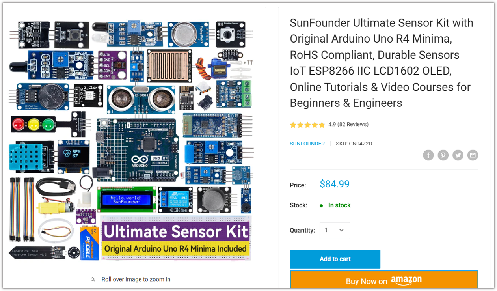
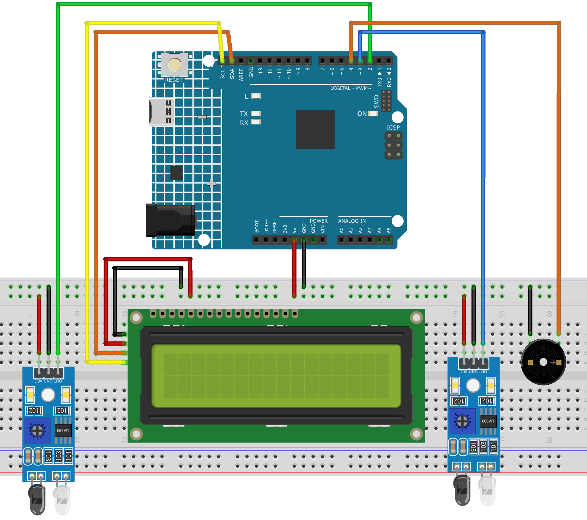

.. _speed_detection:

Speed Detection
==============================================================

.. note::
  
  🌟 Welcome to the SunFounder Facebook Community! Whether you're into Raspberry Pi, Arduino, or ESP32, you'll find inspiration, help ideas here.
   
  - ✅ Be the first to get free learning resources. 
   
  - ✅ Stay updated on new products & exclusive giveaways. 
   
  - ✅ Share your creations and get real feedback.
   
  * 👉 Need faster updates or support? Click [|link_sf_facebook|] join our Facebook community 

  * 👉 Or join our WhatsApp group: Click [|link_sf_whatsapp|]
   
Kit purchase
------------------------

Looking for parts? Check out our all-in-one kits below — packed with components, beginner-friendly guides, and tons of fun.

.. raw:: html

     

.. list-table::
   :widths: 20 20 20
   :header-rows: 1

   * - Name
     - Includes Arduino board
     - PURCHASE LINK
   * - Elite Explorer Kit
     - Arduino Uno R4 WiFi
     - |link_elite_buy|
   * - 3 in 1 Ultimate Starter Kit
     - Arduino Uno R4 Minima
     - |link_arduinor4_buy|

Course Introduction
------------------------

This Arduino project functions as a basic speed detection system using two infrared (IR) sensors and an LCD display. 

When a vehicle passes the front sensor, the system starts a timer; it stops the timer once the vehicle triggers the back sensor. 

Using the known distance between the sensors, the system calculates the vehicle's speed and displays it in km/h on a 16x2 I2C LCD. 

If the speed exceeds a set threshold (e.g., 60 km/h), a buzzer alerts for overspeeding. The LCD resets after each detection cycle, ready for the next vehicle.

.. raw:: html
 
  <iframe width="700" height="394" src="https://www.youtube.com/embed/6tRpIKP6tBY?si=IOseJOS-UzYaJD-5" title="YouTube video player" frameborder="0" allow="accelerometer; autoplay; clipboard-write; encrypted-media; gyroscope; picture-in-picture; web-share" referrerpolicy="strict-origin-when-cross-origin" allowfullscreen></iframe>

.. note::

  If this is your first time working with an Arduino project, we recommend downloading and reviewing the basic materials first.
  
  * :ref:`install_arduino`
  * :ref:`introduce_arduino`

**Required Components**

In this project, we need the following components:

.. list-table::
    :widths: 5 20 5 20
    :header-rows: 1

    *   - SN
        - COMPONENT INTRODUCTION	
        - QUANTITY
        - PURCHASE LINK

    *   - 1
        - Arduino UNO R4 Minima
        - 1
        - |link_unor4_buy|
    *   - 2
        - USB Type-C cable
        - 1
        - 
    *   - 3
        - Breadboard
        - 1
        - |link_breadboard_buy|
    *   - 4
        - Wires
        - Several
        - |link_wires_buy|
    *   - 5
        - I2C LCD 1602
        - 1
        - |link_i2clcd1602_buy|
    *   - 6
        - IR Obstacle Avoidance Sensor Module
        - 2
        - |link_IR_module_buy|
    *   - 7
        - Passive Buzzer
        - 1
        - |link_passive_buzzer_buy|

**Wiring**

**Common Connections:**

* **Passive Buzzer**

  - **＋:** Connect to **4** on the Arduino.
  - **－:** Connect to breadboard’s negative power bus.

* **I2C LCD 1602**

  - **SDA:** Connect to **A4** on the Arduino.
  - **SCL:** Connect to **A5** on the Arduino.
  - **GND:** Connect to breadboard’s negative power bus.
  - **VCC:** Connect to breadboard’s red power bus.

* **IR Obstacle Avoidance Sensor Module Front**

  - **OUT:** Connect to **2** on the Arduino.
  - **GND:** Connect to breadboard’s negative power bus.
  - **VCC:** Connect to breadboard’s red power bus.

* **IR Obstacle Avoidance Sensor Module Back**

  - **OUT:** Connect to **3** on the Arduino.
  - **GND:** Connect to breadboard’s negative power bus.
  - **VCC:** Connect to breadboard’s red power bus.

**Writing the Code**

.. note::

    * You can copy this code into **Arduino IDE**. 
    * To install the library, use the Arduino Library Manager and search for **LiquidCrystal I2C** and install it.
    * Don't forget to select the board(Arduino UNO R4 Minima/WIFI) and the correct port before clicking the **Upload** button.

.. code-block:: arduino

    #include <Wire.h>
    #include <LiquidCrystal_I2C.h>

    // Initialize LCD with I2C address 0x27, 16 columns and 2 rows
    LiquidCrystal_I2C lcd(0x27, 16, 2); // Common I2C addresses: 0x27 or 0x3F

    // Define pin numbers for IR sensors and buzzer
    const int irFront = 2;   // Front IR sensor connected to digital pin 2
    const int irBack = 3;    // Back IR sensor connected to digital pin 3
    const int buzzer = 4;    // Active buzzer connected to digital pin 4

    unsigned long t1 = 0, t2 = 0; // Time markers for calculating speed
    bool carDetected = false;    // Flag to track if a car has been detected
    float distance = 1.30;       // Distance between IR sensors in meters (e.g. 1.30 meters)

    void setup() {
      pinMode(irFront, INPUT);   // Set front IR sensor as input
      pinMode(irBack, INPUT);    // Set back IR sensor as input
      pinMode(buzzer, OUTPUT);   // Set buzzer pin as output

      lcd.init();                // Initialize the LCD
      lcd.backlight();           // Turn on LCD backlight
      lcd.setCursor(0, 0);       
      lcd.print("No car detected"); // Display default message
    }

    void loop() {
      // Wait for a car to pass the front sensor
      if (!carDetected && digitalRead(irFront) == LOW) {
        carDetected = true;        // Mark that a car has been detected
        t1 = millis();             // Record time when front sensor is triggered

        lcd.clear();
        lcd.setCursor(0, 0);
        lcd.print("searching...");

        while (digitalRead(irBack) == HIGH); // Wait until back sensor is triggered
        t2 = millis();             // Record time when back sensor is triggered

        unsigned long deltaT = t2 - t1;        // Calculate time difference in milliseconds
        float timeSec = deltaT / 1000.0;       // Convert time to seconds
        float speed = (distance / timeSec) * 3.6; // Calculate speed in km/h

        lcd.clear();
        lcd.setCursor(0, 0);
        lcd.print("SPeed: ");
        lcd.print((int)speed);
        lcd.print("KM/Hr");

        lcd.setCursor(0, 1);
        if (speed <= 60.0) {
          lcd.print("Normal Sreed");         // Display if speed is within limit
        } else {
          lcd.print("Over Speeding");        // Display warning for overspeed
          digitalWrite(buzzer, HIGH);        // Turn on buzzer
          delay(1000);                       // Wait 1 second
          digitalWrite(buzzer, LOW);         // Turn off buzzer
        }

        delay(3000);                          // Display result for 3 seconds
        lcd.clear();
        lcd.setCursor(0, 0);
        lcd.print("No car detected");        // Reset to default message
        carDetected = false;                 // Ready for next car
      }
    }
