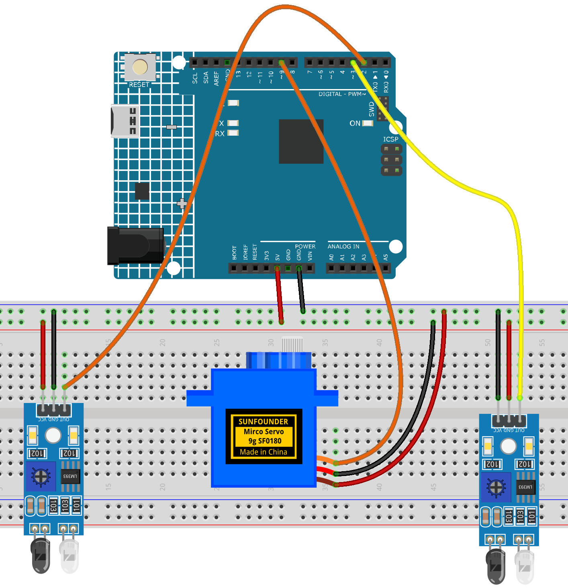

.. _speed_detection2.0:

Speed Detection 2.0
==============================================================

.. note::
  
  🌟 Welcome to the SunFounder Facebook Community! Whether you're into Raspberry Pi, Arduino, or ESP32, you'll find inspiration, help ideas here.
   
  - ✅ Be the first to get free learning resources. 
   
  - ✅ Stay updated on new products & exclusive giveaways. 
   
  - ✅ Share your creations and get real feedback.
   
  * 👉 Need faster updates or support? Click [|link_sf_facebook|] join our Facebook community 

  * 👉 Or join our WhatsApp group: Click [|link_sf_whatsapp|]
   
  * 🎁 Looking for parts?Check out our all-in-one kits below — packed with components, beginner-friendly guides, and tons of fun.
  
  .. list-table::
    :widths: 20 20 20
    :header-rows: 1

    *   - Name	
        - Includes Arduino board
        - PURCHASE LINK
    *   - Elite Explorer Kit	
        - Arduino Uno R4 WiFi
        - |link_elite_buy|
    *   - 3 in 1 Ultimate Starter Kit
        - Arduino Uno R4 Minima
        - |link_arduinor4_buy|
    *   - Universal Maker Sensor Kit
        - ×
        - |link_umsk_buy|

Course Introduction
------------------------

This Arduino project detects speed using two IR sensors and a servo. When an object passes the first sensor, a timer starts; it stops at the second sensor. 

Using the known distance, the system calculates speed and maps it to a servo angle.

.. raw:: html
 
  <iframe width="700" height="394" src="https://www.youtube.com/embed/xxojafspny4?si=Ufz2U3-J4G4nvo_Z" title="YouTube video player" frameborder="0" allow="accelerometer; autoplay; clipboard-write; encrypted-media; gyroscope; picture-in-picture; web-share" referrerpolicy="strict-origin-when-cross-origin" allowfullscreen></iframe>

.. note::

  If this is your first time working with an Arduino project, we recommend downloading and reviewing the basic materials first.
  
  * :ref:`install_arduino`
  * :ref:`introduce_arduino`

**Required Components**

In this project, we need the following components:

.. list-table::
    :widths: 5 20 5 20
    :header-rows: 1

    *   - SN
        - COMPONENT INTRODUCTION	
        - QUANTITY
        - PURCHASE LINK

    *   - 1
        - Arduino UNO R4 Minima
        - 1
        - |link_unor4_buy|
    *   - 2
        - USB Type-C cable
        - 1
        - 
    *   - 3
        - Breadboard
        - 1
        - |link_breadboard_buy|
    *   - 4
        - Wires
        - Several
        - |link_wires_buy|
    *   - 5
        - Digital Servo Motor
        - 1
        - |link_motor_buy|
    *   - 6
        - IR Obstacle Avoidance Sensor Module
        - 2
        - |link_IR_module_buy|

**Wiring**

**Common Connections:**

* **Digital Servo Motor**

  - Connect to breadboard’s positive power bus.
  - Connect to breadboard’s negative power bus.
  - Connect to  **9** on the Arduino.

* **IR Obstacle Avoidance Sensor Module Front**

  - **OUT:** Connect to **2** on the Arduino.
  - **GND:** Connect to breadboard’s negative power bus.
  - **VCC:** Connect to breadboard’s red power bus.

* **IR Obstacle Avoidance Sensor Module Back**

  - **OUT:** Connect to **3** on the Arduino.
  - **GND:** Connect to breadboard’s negative power bus.
  - **VCC:** Connect to breadboard’s red power bus.

**Writing the Code**

.. note::

    * You can copy this code into **Arduino IDE**. 
    * Don't forget to select the board(Arduino UNO R4 Minima/WIFI) and the correct port before clicking the **Upload** button.

.. code-block:: arduino

      #include <Servo.h>

      #define IR1_PIN 2
      #define IR2_PIN 3
      #define SERVO_PIN 9

      Servo myServo;

      unsigned long t1 = 0;
      unsigned long t2 = 0;
      bool waitingForIR2 = false;

      float distance_cm = 10.0; // Distance between IR1 and IR2 in cm
      float speed = 0; // Speed in cm/s

      void setup() {
        Serial.begin(9600);
        pinMode(IR1_PIN, INPUT);
        pinMode(IR2_PIN, INPUT);
        
        myServo.attach(SERVO_PIN);

        // Initialize servo to -90° (corresponds to 180° in servo signal)
        myServo.write(180);
        delay(500);
      }

      void loop() {
        // Detect vehicle passing IR1
        if (digitalRead(IR1_PIN) == LOW && !waitingForIR2) {
          t1 = millis();
          waitingForIR2 = true;
          Serial.println("IR1 triggered");
          delay(50); // Debounce delay
        }

        // Detect vehicle passing IR2
        if (waitingForIR2 && digitalRead(IR2_PIN) == LOW) {
          t2 = millis();
          waitingForIR2 = false;
          Serial.println("IR2 triggered");

          // Calculate speed in cm/s
          float timeTaken = (t2 - t1) / 1000.0;
          if (timeTaken > 0) {
            speed = distance_cm / timeTaken;
            Serial.print("Speed: ");
            Serial.print(speed);
            Serial.println(" cm/s");

            // Map speed to servo angle (-90 to +90), max speed = 60 cm/s
            int angle = map(constrain(speed, 0, 60), 0, 60, -90, 90);
            angle = constrain(angle, -90, 90);

            // Convert -90~90 to servo range 0~180 (-90° → 180, +90° → 0)
            int servoPos = 90 - angle;
            myServo.write(servoPos);

            delay(1000); // Display time

            // Return to -90° (servo signal 180°)
            myServo.write(180);
            delay(500);
          }
        }
      }
