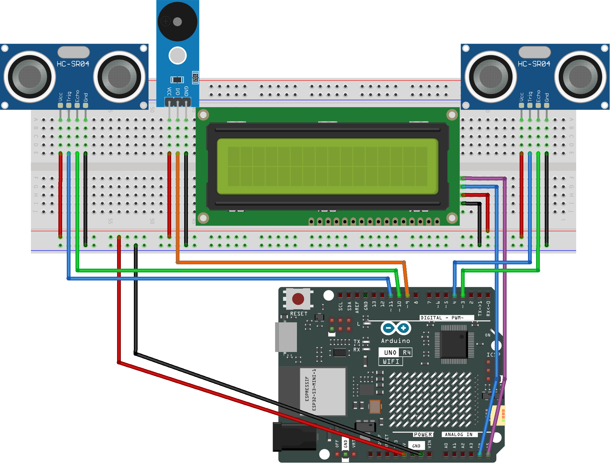

.. _speed_detection3.0:

Speed Detection 3.0
==============================================================

.. note::
  
  🌟 Welcome to the SunFounder Facebook Community! Whether you're into Raspberry Pi, Arduino, or ESP32, you'll find inspiration, help ideas here.
   
  - ✅ Be the first to get free learning resources. 
   
  - ✅ Stay updated on new products & exclusive giveaways. 
   
  - ✅ Share your creations and get real feedback.
   
  * 👉 Need faster updates or support? Click [|link_sf_facebook|] join our Facebook community 

  * 👉 Or join our WhatsApp group: Click [|link_sf_whatsapp|]
   
Kit purchase
------------------------

Looking for parts? Check out our all-in-one kits below — packed with components, beginner-friendly guides, and tons of fun.

.. image:: img/ultimate_sensor_kit.png
   :width: 100%
   :align: center
   :target: https://www.sunfounder.com/collections/arduino-kits-bundles/products/sunfounder-ultimate-sensor-kit-with-original-arduino-uno-r4-minima?ref=jbzmncle

.. raw:: html

     

.. list-table::
   :widths: 20 20 20
   :header-rows: 1

   * - Name
     - Includes Arduino board
     - PURCHASE LINK
   * - Elite Explorer Kit
     - Arduino Uno R4 WiFi
     - |link_elite_buy|
   * - 3 in 1 Ultimate Starter Kit
     - Arduino Uno R4 Minima
     - |link_arduinor4_buy|

Course Introduction
------------------------

This Arduino project functions as a basic speed detection system using two Ultrasonic Sensor Modules and an LCD display and buzzer moudle.  When an object passes the first sensor, a timer starts; it stops at the second sensor. 

.. raw:: html
 
  <iframe width="700" height="394" src="https://www.youtube.com/embed/DjaRAb95ZrM?si=-6J8eeDYRfVzx9Xk" title="YouTube video player" frameborder="0" allow="accelerometer; autoplay; clipboard-write; encrypted-media; gyroscope; picture-in-picture; web-share" referrerpolicy="strict-origin-when-cross-origin" allowfullscreen></iframe>

.. note::

  If this is your first time working with an Arduino project, we recommend downloading and reviewing the basic materials first.
  
  * :ref:`install_arduino`
  * :ref:`introduce_arduino`

**Required Components**

In this project, we need the following components:

.. list-table::
    :widths: 5 20 5 20
    :header-rows: 1

    *   - SN
        - COMPONENT INTRODUCTION	
        - QUANTITY
        - PURCHASE LINK

    *   - 1
        - Arduino UNO R4 Minima
        - 1
        - |link_unor4_buy|
    *   - 2
        - USB Type-C cable
        - 1
        - 
    *   - 3
        - Breadboard
        - 1
        - |link_breadboard_buy|
    *   - 4
        - Wires
        - Several
        - |link_wires_buy|
    *   - 5
        - I2C LCD 1602
        - 1
        - |link_i2clcd1602_buy|
    *   - 6
        - Ultrasonic Sensor Module
        - 2
        - |link_ultrasonic_buy|
    *   - 7
        - Buzzer Modudle
        - 1
        - |link_buzzer_module_buy|

**Wiring**

**Common Connections:**

* **I2C LCD 1602**

  - **SDA:** Connect to **A4** on the Arduino.
  - **SCL:** Connect to **A5** on the Arduino.
  - **GND:** Connect to breadboard’s negative power bus.
  - **VCC:** Connect to breadboard’s red power bus.

* **Ultrasonic Sensor Module Front**

  - **Trig:** Connect to **4** on the Arduino.
  - **Echo:** Connect to **3** on the Arduino.
  - **GND:** Connect to breadboard’s negative power bus.
  - **VCC:** Connect to breadboard’s red power bus.

* **Ultrasonic Sensor Module Back**

  - **Trig:** Connect to **11** on the Arduino.
  - **Echo:** Connect to **10** on the Arduino.
  - **GND:** Connect to breadboard’s negative power bus.
  - **VCC:** Connect to breadboard’s red power bus.

* **Buzzer Module**

  - **I/0:** Connect to **9** on the Arduino.
  - **＋:** Connect to breadboard’s red power bus. 
  - **－:** Connect to breadboard’s negative power bus.

**Writing the Code**

.. note::

    * You can copy this code into **Arduino IDE**. 
    * To install the library, use the Arduino Library Manager and search for **LiquidCrystal I2C** and install it.
    * Don't forget to select the board(Arduino UNO R4 Minima/WIFI) and the correct port before clicking the **Upload** button.

.. code-block:: arduino

      #include <Wire.h>
      #include <LiquidCrystal_I2C.h>

      // ---------------- LCD ----------------
      // I2C LCD (address: 0x27, 16x2)
      LiquidCrystal_I2C lcd(0x27, 16, 2);

      // ---------------- Ultrasonic Sensor Pins ----------------
      // Front ultrasonic sensor
      #define TRIG1 4
      #define ECHO1 3

      // Back ultrasonic sensor
      #define TRIG2 11
      #define ECHO2 10

      // ---------------- Passive Buzzer ----------------
      #define BUZZER_PIN 9

      // ---------------- Parameters ----------------
      float gateDistance = 1.30;   // Distance between two sensors (meters)
      float speedLimit   = 40.0;   // Speed limit (km/h)
      float triggerDist  = 15.0;   // Detection distance (cm)

      // ---------------- State Variables ----------------
      bool firstGateTriggered = false;
      bool speedCalculated    = false;

      unsigned long t1 = 0;
      unsigned long t2 = 0;

      // ---------------- Ultrasonic Distance Function ----------------
      // Measure distance using ultrasonic sensor (return: cm)
      float getDistanceCM(int trigPin, int echoPin) {
        digitalWrite(trigPin, LOW);
        delayMicroseconds(2);
        digitalWrite(trigPin, HIGH);
        delayMicroseconds(10);
        digitalWrite(trigPin, LOW);

        long duration = pulseIn(echoPin, HIGH, 30000);
        if (duration == 0) return -1;

        return duration * 0.034 / 2;
      }

      void setup() {
        // Set pin modes for ultrasonic sensors
        pinMode(TRIG1, OUTPUT);
        pinMode(ECHO1, INPUT);
        pinMode(TRIG2, OUTPUT);
        pinMode(ECHO2, INPUT);

        // Set buzzer pin as output
        pinMode(BUZZER_PIN, OUTPUT);

        // Initialize LCD
        lcd.init();
        lcd.backlight();

        // Show startup message
        lcd.setCursor(0, 0);
        lcd.print("Speed Detector");
        lcd.setCursor(0, 1);
        lcd.print("Waiting...");
      }

      void loop() {
        // Read distances from both ultrasonic sensors
        float d1 = getDistanceCM(TRIG1, ECHO1);
        delay(40);  // Prevent ultrasonic interference
        float d2 = getDistanceCM(TRIG2, ECHO2);

        // First sensor detects object
        if (!firstGateTriggered && d1 > 0 && d1 < triggerDist) {
          firstGateTriggered = true;
          t1 = millis();

          lcd.clear();
          lcd.setCursor(0, 0);
          lcd.print("Vehicle detected");
          lcd.setCursor(0, 1);
          lcd.print("Measuring...");
        }

        // Second sensor detects object
        if (firstGateTriggered && !speedCalculated && d2 > 0 && d2 < triggerDist) {
          t2 = millis();
          speedCalculated = true;

          float deltaT = (t2 - t1) / 1000.0;

          lcd.clear();

          if (deltaT > 0.05) {  // Ignore false trigger
            float speed = (gateDistance / deltaT) * 3.6;

            lcd.setCursor(0, 0);
            lcd.print("Speed:");
            lcd.print(speed, 1);
            lcd.print("km/h");

            lcd.setCursor(0, 1);
            if (speed > speedLimit) {
              lcd.print("Over Speed!");

              // Beep 3 times
              for (int i = 0; i < 3; i++) {
                tone(BUZZER_PIN, 2000);
                delay(200);
                noTone(BUZZER_PIN);
                delay(200);
              }
            } else {
              lcd.print("Normal");
            }
          } else {
            lcd.print("Invalid data");
          }

          delay(3000);

          // Reset system
          firstGateTriggered = false;
          speedCalculated = false;

          lcd.clear();
          lcd.setCursor(0, 0);
          lcd.print("Speed Detector");
          lcd.setCursor(0, 1);
          lcd.print("Waiting...");
        }
      }
