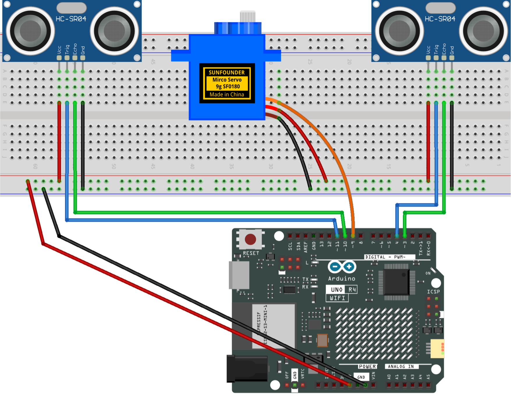

.. _speed_detection4.0:

Speed Detection 4.0
==============================================================

.. note::
  
  🌟 Welcome to the SunFounder Facebook Community! Whether you're into Raspberry Pi, Arduino, or ESP32, you'll find inspiration, help ideas here.
   
  - ✅ Be the first to get free learning resources. 
   
  - ✅ Stay updated on new products & exclusive giveaways. 
   
  - ✅ Share your creations and get real feedback.
   
  * 👉 Need faster updates or support? Click [|link_sf_facebook|] join our Facebook community 

  * 👉 Or join our WhatsApp group: Click [|link_sf_whatsapp|]
   
Kit purchase
------------------------

Looking for parts? Check out our all-in-one kits below — packed with components, beginner-friendly guides, and tons of fun.

.. image:: img/ultimate_sensor_kit.png
   :width: 100%
   :align: center
   :target: https://www.sunfounder.com/collections/arduino-kits-bundles/products/sunfounder-ultimate-sensor-kit-with-original-arduino-uno-r4-minima?ref=jbzmncle

.. raw:: html

     

.. list-table::
   :widths: 20 20 20
   :header-rows: 1

   * - Name
     - Includes Arduino board
     - PURCHASE LINK
   * - Elite Explorer Kit
     - Arduino Uno R4 WiFi
     - |link_elite_buy|
   * - 3 in 1 Ultimate Starter Kit
     - Arduino Uno R4 Minima
     - |link_arduinor4_buy|

Course Introduction
------------------------

This Arduino project detects speed using two IR sensors and a servo. When an object passes the first sensor, a timer starts; it stops at the second sensor. 

Using the known distance, the system calculates speed and maps it to a servo angle.

.. .. raw:: html
 
..  <iframe width="700" height="394" src="https://www.youtube.com/embed/xxojafspny4?si=Ufz2U3-J4G4nvo_Z" title="YouTube video player" frameborder="0" allow="accelerometer; autoplay; clipboard-write; encrypted-media; gyroscope; picture-in-picture; web-share" referrerpolicy="strict-origin-when-cross-origin" allowfullscreen></iframe>

.. note::

  If this is your first time working with an Arduino project, we recommend downloading and reviewing the basic materials first.
  
  * :ref:`install_arduino`
  * :ref:`introduce_arduino`

**Required Components**

In this project, we need the following components:

.. list-table::
    :widths: 5 20 5 20
    :header-rows: 1

    *   - SN
        - COMPONENT INTRODUCTION	
        - QUANTITY
        - PURCHASE LINK

    *   - 1
        - Arduino UNO R4 Minima
        - 1
        - |link_unor4_buy|
    *   - 2
        - USB Type-C cable
        - 1
        - 
    *   - 3
        - Breadboard
        - 1
        - |link_breadboard_buy|
    *   - 4
        - Wires
        - Several
        - |link_wires_buy|
    *   - 5
        - Digital Servo Motor
        - 1
        - |link_motor_buy|
    *   - 6
        - Ultrasonic Sensor Module
        - 2
        - |link_ultrasonic_buy|

**Wiring**

**Common Connections:**

* **Digital Servo Motor**

  - Connect to breadboard’s positive power bus.
  - Connect to breadboard’s negative power bus.
  - Connect to  **9** on the Arduino.

* **Ultrasonic Sensor Module Front**

  - **Trig:** Connect to **4** on the Arduino.
  - **Echo:** Connect to **3** on the Arduino.
  - **GND:** Connect to breadboard’s negative power bus.
  - **VCC:** Connect to breadboard’s red power bus.

* **Ultrasonic Sensor Module Back**

  - **Trig:** Connect to **11** on the Arduino.
  - **Echo:** Connect to **10** on the Arduino.
  - **GND:** Connect to breadboard’s negative power bus.
  - **VCC:** Connect to breadboard’s red power bus.

**Writing the Code**

.. note::

    * You can copy this code into **Arduino IDE**. 
    * Don't forget to select the board(Arduino UNO R4 Minima/WIFI) and the correct port before clicking the **Upload** button.

.. code-block:: arduino

      #include <Servo.h>

      // Front ultrasonic sensor
      #define TRIG1 4
      #define ECHO1 3

      // Back ultrasonic sensor
      #define TRIG2 11
      #define ECHO2 10

      // Servo
      #define SERVO_PIN 9
      Servo myServo;

      // ---------------------- Tunable parameters ----------------------
      // Distance between two sensors (cm). Change to your real spacing.
      const float SENSOR_GAP_CM = 10.0;

      // Trigger threshold (cm). Object is considered "detected" when distance < this.
      const float DETECT_THRESHOLD_CM = 20.0;

      // Speed range for gauge mapping (cm/s). 0..MAX_SPEED maps to -90..+90 degrees.
      const float MAX_SPEED_CM_S = 60.0;

      // Anti-repeat trigger window (ms)
      const unsigned long COOLDOWN_MS = 150;

      // Timeout for pulseIn (microseconds). 30000us ~ 5m max, safe for HC-SR04.
      const unsigned long PULSE_TIMEOUT_US = 30000;

      // How long to show the gauge result (ms)
      const unsigned long HOLD_MS = 1000;
      // ---------------------------------------------------------------

      // State
      bool waitingForSecond = false;
      unsigned long t1_ms = 0;
      unsigned long lastTrigger_ms = 0;

      // A small helper to read distance (cm) from an HC-SR04-like sensor.
      // Returns: distance in cm; returns -1 if timeout/no reading.
      float readDistanceCm(uint8_t trigPin, uint8_t echoPin) {
        // Trigger pulse
        digitalWrite(trigPin, LOW);
        delayMicroseconds(2);
        digitalWrite(trigPin, HIGH);
        delayMicroseconds(10);
        digitalWrite(trigPin, LOW);

        // Read echo pulse
        unsigned long duration = pulseIn(echoPin, HIGH, PULSE_TIMEOUT_US);
        if (duration == 0) return -1.0; // timeout

        // Sound speed ~ 0.034 cm/us. Divide by 2 for round trip.
        float distance = (duration * 0.034f) / 2.0f;
        return distance;
      }

      // Map speed (0..MAX_SPEED_CM_S) to a gauge angle (-90..+90),
      // then convert to servo position (0..180).
      int speedToServoPos(float speed_cm_s) {
        // Clamp speed
        if (speed_cm_s < 0) speed_cm_s = 0;
        if (speed_cm_s > MAX_SPEED_CM_S) speed_cm_s = MAX_SPEED_CM_S;

        // Linear map to angle -90..+90
        float angle = (speed_cm_s / MAX_SPEED_CM_S) * 180.0f - 90.0f; // -90..+90

        // Convert "gauge angle" to servo write value.
        // Keep same style as original project: servoPos = 90 - angle
        int servoPos = (int)(90.0f - angle);

        // Clamp servo bounds
        if (servoPos < 0) servoPos = 0;
        if (servoPos > 180) servoPos = 180;
        return servoPos;
      }

      void setup() {
        Serial.begin(115200);

        pinMode(TRIG1, OUTPUT);
        pinMode(ECHO1, INPUT);

        pinMode(TRIG2, OUTPUT);
        pinMode(ECHO2, INPUT);

        myServo.attach(SERVO_PIN);

        // Initialize gauge pointer to left side (like original: 180 corresponds to -90° style)
        myServo.write(180);
        delay(300);

        Serial.println("=== Speed Detection 2.0 (Dual Ultrasonic) ===");
        Serial.print("SENSOR_GAP_CM = "); Serial.println(SENSOR_GAP_CM);
        Serial.print("DETECT_THRESHOLD_CM = "); Serial.println(DETECT_THRESHOLD_CM);
        Serial.print("MAX_SPEED_CM_S = "); Serial.println(MAX_SPEED_CM_S);
      }

      void loop() {
        unsigned long now = millis();

        // Read both distances
        float dFront = readDistanceCm(TRIG1, ECHO1);
        float dBack  = readDistanceCm(TRIG2, ECHO2);

        // Optional debug (comment out if too noisy)
        // Serial.print("Front: "); Serial.print(dFront); Serial.print(" cm, ");
        // Serial.print("Back: ");  Serial.print(dBack);  Serial.println(" cm");

        // Basic validity
        bool frontDetected = (dFront > 0 && dFront < DETECT_THRESHOLD_CM);
        bool backDetected  = (dBack  > 0 && dBack  < DETECT_THRESHOLD_CM);

        // Cooldown to prevent repeated triggers while object stays in front
        bool cooldownOK = (now - lastTrigger_ms) > COOLDOWN_MS;

        // 1) Front sensor triggers start timing
        if (!waitingForSecond && cooldownOK && frontDetected) {
          t1_ms = now;
          waitingForSecond = true;
          lastTrigger_ms = now;

          Serial.print("[Front] Detected at t1 = ");
          Serial.print(t1_ms);
          Serial.println(" ms");
        }

        // 2) Back sensor triggers stop timing and compute speed
        if (waitingForSecond && cooldownOK && backDetected) {
          unsigned long t2_ms = now;
          waitingForSecond = false;
          lastTrigger_ms = now;

          unsigned long dt_ms = (t2_ms >= t1_ms) ? (t2_ms - t1_ms) : 0;

          Serial.print("[Back ] Detected at t2 = ");
          Serial.print(t2_ms);
          Serial.print(" ms, dt = ");
          Serial.print(dt_ms);
          Serial.println(" ms");

          if (dt_ms > 0) {
            float time_s = dt_ms / 1000.0f;
            float speed_cm_s = SENSOR_GAP_CM / time_s;

            Serial.print("Speed = ");
            Serial.print(speed_cm_s, 2);
            Serial.println(" cm/s");

            int servoPos = speedToServoPos(speed_cm_s);
            Serial.print("ServoPos = ");
            Serial.println(servoPos);

            // Show result on gauge
            myServo.write(servoPos);
            delay(HOLD_MS);

            // Return to start position
            myServo.write(180);
            delay(200);
          } else {
            Serial.println("dt_ms == 0, ignored.");
          }
        }

        // Safety: if front triggered but back never arrives, reset after some time
        if (waitingForSecond && (now - t1_ms) > 5000) {
          waitingForSecond = false;
          Serial.println("Timeout waiting for back sensor. Reset.");
          myServo.write(180);
        }

        delay(10); // small loop delay
      }
