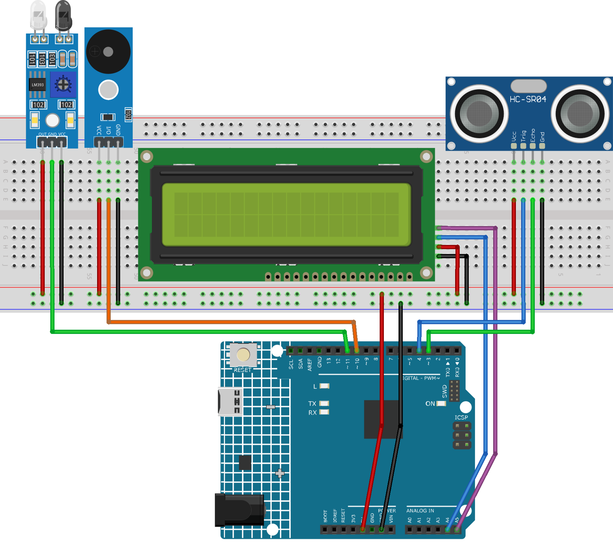

.. _speed_detection5.0:

Speed Detection 5.0
==============================================================

.. note::
  
  🌟 Welcome to the SunFounder Facebook Community! Whether you're into Raspberry Pi, Arduino, or ESP32, you'll find inspiration, help ideas here.
   
  - ✅ Be the first to get free learning resources. 
   
  - ✅ Stay updated on new products & exclusive giveaways. 
   
  - ✅ Share your creations and get real feedback.
   
  * 👉 Need faster updates or support? Click [|link_sf_facebook|] join our Facebook community 

  * 👉 Or join our WhatsApp group: Click [|link_sf_whatsapp|]
   
Kit purchase
------------------------

Looking for parts? Check out our all-in-one kits below — packed with components, beginner-friendly guides, and tons of fun.

.. image:: img/ultimate_sensor_kit.png
   :width: 100%
   :align: center
   :target: https://www.sunfounder.com/collections/arduino-kits-bundles/products/sunfounder-ultimate-sensor-kit-with-original-arduino-uno-r4-minima?ref=jbzmncle

.. raw:: html

     

.. list-table::
   :widths: 20 20 20
   :header-rows: 1

   * - Name
     - Includes Arduino board
     - PURCHASE LINK
   * - Elite Explorer Kit
     - Arduino Uno R4 WiFi
     - |link_elite_buy|
   * - 3 in 1 Ultimate Starter Kit
     - Arduino Uno R4 Minima
     - |link_arduinor4_buy|

Course Introduction
------------------------

This Arduino project detects speed using IR sensor and Ultrasonic Sensor Module. When an object passes the first sensor, a timer starts; it stops at the second sensor. 

.. .. raw:: html
 
..  <iframe width="700" height="394" src="https://www.youtube.com/embed/ajpo0CW8Ce8?si=ACEi0Blsv0lwbo-L" title="YouTube video player" frameborder="0" allow="accelerometer; autoplay; clipboard-write; encrypted-media; gyroscope; picture-in-picture; web-share" referrerpolicy="strict-origin-when-cross-origin" allowfullscreen></iframe>

.. note::

  If this is your first time working with an Arduino project, we recommend downloading and reviewing the basic materials first.
  
  * :ref:`install_arduino`
  * :ref:`introduce_arduino`

**Required Components**

In this project, we need the following components:

.. list-table::
    :widths: 5 20 5 20
    :header-rows: 1

    *   - SN
        - COMPONENT INTRODUCTION	
        - QUANTITY
        - PURCHASE LINK

    *   - 1
        - Arduino UNO R4 Minima
        - 1
        - |link_unor4_buy|
    *   - 2
        - USB Type-C cable
        - 1
        - 
    *   - 3
        - Breadboard
        - 1
        - |link_breadboard_buy|
    *   - 4
        - Wires
        - Several
        - |link_wires_buy|
    *   - 5
        - Ultrasonic Sensor Module
        - 1
        - |link_ultrasonic_buy|
    *   - 6
        - IR Obstacle Avoidance Sensor Module
        - 1
        - |link_IR_module_buy|
    *   - 7
        - I2C LCD 1602
        - 1
        - |link_i2clcd1602_buy|
    *   - 8
        - Buzzer Modudle
        - 1
        - |link_buzzer_module_buy|

**Wiring**

**Common Connections:**

* **I2C LCD 1602**

  - **SDA:** Connect to **A4** on the Arduino.
  - **SCL:** Connect to **A5** on the Arduino.
  - **GND:** Connect to breadboard’s negative power bus.
  - **VCC:** Connect to breadboard’s red power bus.

* **Ultrasonic Sensor Module**

  - **Trig:** Connect to **4** on the Arduino.
  - **Echo:** Connect to **3** on the Arduino.
  - **GND:** Connect to breadboard’s negative power bus.
  - **VCC:** Connect to breadboard’s red power bus.

* **IR Obstacle Avoidance Sensor Module**

  - **OUT:** Connect to **11** on the Arduino.
  - **GND:** Connect to breadboard’s negative power bus.
  - **VCC:** Connect to breadboard’s red power bus.

* **Buzzer Module**

  - **I/0:** Connect to **10** on the Arduino.
  - **＋:** Connect to breadboard’s red power bus. 
  - **－:** Connect to breadboard’s negative power bus.

**Writing the Code**

.. note::

    * You can copy this code into **Arduino IDE**. 
    * To install the library, use the Arduino Library Manager and search for **LiquidCrystal I2C** and install it.
    * Don't forget to select the board(Arduino UNO R4 Minima/WIFI) and the correct port before clicking the **Upload** button.

.. code-block:: arduino

      #include <Wire.h>
      #include <LiquidCrystal_I2C.h>

      // LCD address is usually 0x27 for a 16x2 I2C LCD.
      LiquidCrystal_I2C lcd(0x27, 16, 2);

      // Ultrasonic sensor pins
      #define TRIG1 4
      #define ECHO1 3

      // Obstacle sensor OUT pin connects to D11.
      #define OBSTACLE_PIN 11

      // Buzzer connects to D10.
      #define BUZZER_PIN 10

      // Distance between the ultrasonic sensor and obstacle sensor, in meters.
      float gateDistance = 1.30;

      // Speed <= 30 km/h shows "Normal"; speed > 30 km/h shows "Over Speed!".
      float speedLimit = 30.0;

      // The ultrasonic sensor triggers when an object is closer than this distance.
      float triggerDist = 15.0;

      // These variables store the current detection state.
      bool firstGateTriggered = false;
      bool speedCalculated = false;

      // t1: time when the ultrasonic sensor is triggered.
      // t2: time when the obstacle sensor is triggered.
      unsigned long t1 = 0;
      unsigned long t2 = 0;

      // Measure distance with the ultrasonic sensor and return the value in cm.
      float getDistanceCM(int trigPin, int echoPin) {
        digitalWrite(trigPin, LOW);
        delayMicroseconds(2);

        digitalWrite(trigPin, HIGH);
        delayMicroseconds(10);
        digitalWrite(trigPin, LOW);

        // pulseIn measures how long the echo pin stays HIGH.
        long duration = pulseIn(echoPin, HIGH, 30000);

        // If no echo is received, return -1 as invalid data.
        if (duration == 0) {
          return -1;
        }

        // Convert echo time to distance.
        // 0.034 cm/us is the approximate speed of sound.
        return duration * 0.034 / 2;
      }

      // Reset the system and show the waiting screen.
      void resetSystem() {
        firstGateTriggered = false;
        speedCalculated = false;

        lcd.clear();
        lcd.setCursor(0, 0);
        lcd.print("Speed Detector");
        lcd.setCursor(0, 1);
        lcd.print("Waiting...");
      }

      // One short beep means the result is normal.
      void shortBeep() {
        tone(BUZZER_PIN, 1500);
        delay(120);
        noTone(BUZZER_PIN);
      }

      // Beep 4 times when the speed is over the limit.
      void overSpeedAlert() {
        for (int i = 0; i < 4; i++) {
          tone(BUZZER_PIN, 2000);
          delay(200);

          noTone(BUZZER_PIN);
          delay(200);
        }
      }

      void setup() {
        pinMode(TRIG1, OUTPUT);
        pinMode(ECHO1, INPUT);

        // Most obstacle sensors use OUT to output HIGH or LOW.
        pinMode(OBSTACLE_PIN, INPUT);

        pinMode(BUZZER_PIN, OUTPUT);

        // Use Serial Monitor to check sensor values during testing.
        Serial.begin(9600);

        lcd.init();
        lcd.backlight();

        resetSystem();
      }

      void loop() {
        // Read the ultrasonic distance.
        float d1 = getDistanceCM(TRIG1, ECHO1);

        // Most obstacle modules output LOW when an object is detected.
        int obstacleState = digitalRead(OBSTACLE_PIN);

        // Print sensor values for debugging.
        Serial.print("Distance: ");
        Serial.print(d1);
        Serial.print(" cm | Obstacle: ");
        Serial.println(obstacleState);

        // The ultrasonic sensor is the first detection point.
        if (!firstGateTriggered && d1 > 0 && d1 < triggerDist) {
          firstGateTriggered = true;
          t1 = millis();

          lcd.clear();
          lcd.setCursor(0, 0);
          lcd.print("Object detected");
          lcd.setCursor(0, 1);
          lcd.print("Measuring...");
        }

        // If the second sensor is not triggered within 5 seconds, reset the system.
        if (firstGateTriggered && !speedCalculated && millis() - t1 > 5000) {
          lcd.clear();
          lcd.setCursor(0, 0);
          lcd.print("Timeout");
          lcd.setCursor(0, 1);
          lcd.print("Try again");

          delay(1500);
          resetSystem();
        }

        // The obstacle sensor is the second detection point.
        if (firstGateTriggered && !speedCalculated && obstacleState == LOW) {
          t2 = millis();
          speedCalculated = true;

          // Convert the time difference from milliseconds to seconds.
          float deltaT = (t2 - t1) / 1000.0;

          lcd.clear();

          // Ignore very small time differences to avoid false triggers.
          if (deltaT > 0.05) {
            // Speed = distance / time, then convert m/s to km/h.
            float speed = (gateDistance / deltaT) * 3.6;

            lcd.setCursor(0, 0);
            lcd.print("Speed:");
            lcd.print(speed, 1);
            lcd.print("km/h");

            lcd.setCursor(0, 1);

            if (speed > speedLimit) {
              lcd.print("Over Speed!");
              overSpeedAlert();
            } else {
              lcd.print("Normal");
              shortBeep();
            }

            Serial.print("Speed: ");
            Serial.print(speed);
            Serial.println(" km/h");
          } else {
            lcd.setCursor(0, 0);
            lcd.print("Invalid data");
          }

          delay(1500);
          resetSystem();
        }

        delay(50);
      }