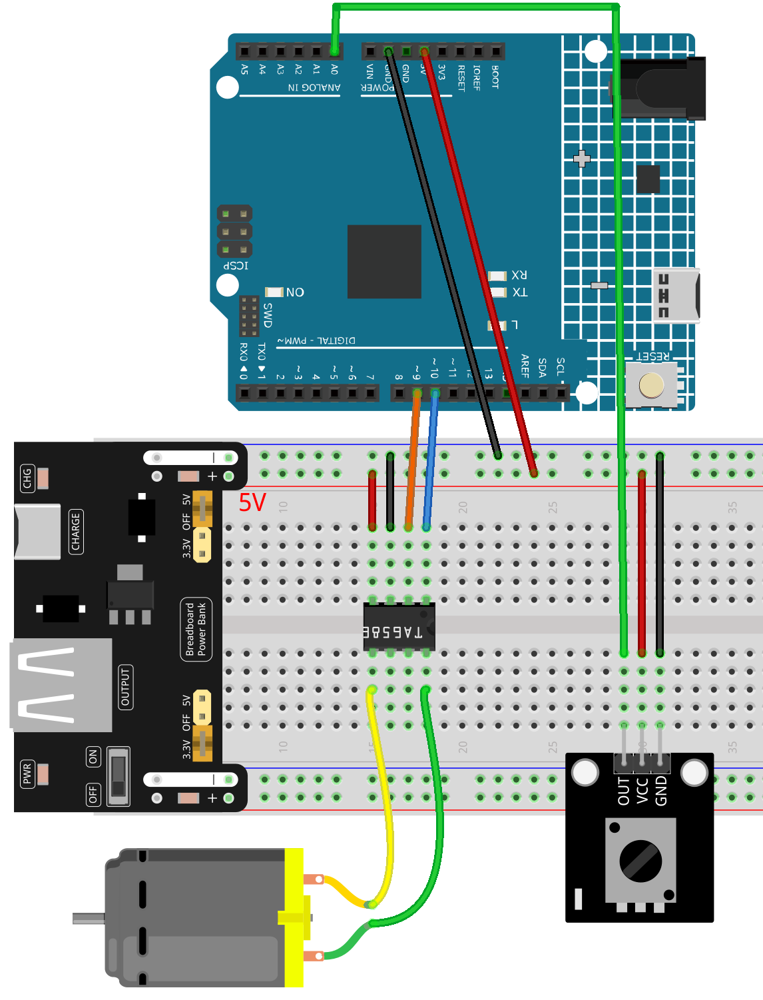

.. _speed_dial:

Speed Dial
==============================================================

.. note::
  
  🌟 Welcome to the SunFounder Facebook Community! Whether you're into Raspberry Pi, Arduino, or ESP32, you'll find inspiration, help ideas here.
   
  - ✅ Be the first to get free learning resources. 
   
  - ✅ Stay updated on new products & exclusive giveaways. 
   
  - ✅ Share your creations and get real feedback.
   
  * 👉 Need faster updates or support? Click [|link_sf_facebook|] join our Facebook community 

  * 👉 Or join our WhatsApp group: Click [|link_sf_whatsapp|]
   
Kit purchase
------------------------

Looking for parts? Check out our all-in-one kits below — packed with components, beginner-friendly guides, and tons of fun.

.. image:: img/ultimate_sensor_kit.png
   :width: 100%
   :align: center
   :target: https://www.sunfounder.com/collections/arduino-kits-bundles/products/sunfounder-ultimate-sensor-kit-with-original-arduino-uno-r4-minima?ref=jbzmncle

.. raw:: html

     

.. list-table::
   :widths: 20 20 20
   :header-rows: 1

   * - Name
     - Includes Arduino board
     - PURCHASE LINK
   * - Elite Explorer Kit
     - Arduino Uno R4 WiFi
     - |link_elite_buy|
   * - 3 in 1 Ultimate Starter Kit
     - Arduino Uno R4 Minima
     - |link_arduinor4_buy|

Course Introduction
------------------------

In this lesson, you'll use a potentiometer and a DC motor with the Arduino R4 UNO to create a simple motor speed control system.

By rotating the potentiometer, you can adjust the motor speed from stop to full speed. The Arduino reads the potentiometer value, maps it to PWM output, and drives the motor in one direction with variable speed.

.. raw:: html

  <iframe width="700" height="394" src="https://www.youtube.com/embed/dJjgRm4Qjh0?si=7lZ-xXccWiOGLNSJ" title="YouTube video player" frameborder="0" allow="accelerometer; autoplay; clipboard-write; encrypted-media; gyroscope; picture-in-picture; web-share" referrerpolicy="strict-origin-when-cross-origin" allowfullscreen></iframe>

.. note::

  If this is your first time working with an Arduino project, we recommend downloading and reviewing the basic materials first.
  
  * :ref:`install_arduino`
  * :ref:`introduce_arduino`

**Required Components**

In this project, we need the following components:

.. list-table::
    :widths: 5 20 5 20
    :header-rows: 1

    *   - SN
        - COMPONENT INTRODUCTION	
        - QUANTITY
        - PURCHASE LINK

    *   - 1
        - Arduino UNO R4 Minima/Arduino UNO R4 WIFI
        - 1
        - |link_arduinor4_buy|
    *   - 2
        - USB Cable
        - 1
        - 
    *   - 3
        - Breadboard
        - 1
        - |link_breadboard_buy|
    *   - 4
        - Wires
        - Several
        - |link_wires_buy|
    *   - 5
        - TA6586 - Motor Driver Chip
        - 1
        - 
    *   - 6
        - Potentiometer Sensor Module
        - 1
        - |link_potentiometer_module_buy|
    *   - 7
        - TT Motor
        - 1
        - 
    *   - 8
        - Power Supply
        - 1
        - |link_power_buy|

**Wiring**

**Common Connections:**

* **Potentiometer Sensor Module**

  - **OUT:** Connect to **A0** on the Arduino.
  - **GND:** Connect to breadboard’s negative power bus.
  - **VCC:** Connect to breadboard’s red power bus.

* **TA6586 - Motor Driver Chip**

  - **BI:** Connect to **10** on the Arduino.
  - **FI:** Connect to **9** on the Arduino.
  - **GND:** Connect to breadboard’s negative power bus.
  - **VCC:** Connect to breadboard’s red power bus.

* **TT Motor**

  -  Connect to **B0**, **F0** on the **TA6586 - Motor Driver Chip**.

**Writing the Code**

.. note::

    * You can copy this code into **Arduino IDE**. 
    * Don't forget to select the board(Arduino UNO R3) and the correct port before clicking the **Upload** button.

.. code-block:: arduino

      const int potPin = A0;     // Potentiometer signal pin
      const int motorPin1 = 9;   // Motor IN1 pin (PWM)
      const int motorPin2 = 10;  // Motor IN2 pin (LOW for direction control)

      void setup() {
        pinMode(motorPin1, OUTPUT);  // Set motorPin1 as output
        pinMode(motorPin2, OUTPUT);  // Set motorPin2 as output
      }

      void loop() {
        int val = analogRead(potPin);           // Read analog value from potentiometer (0–1023)
        int speed = map(val, 0, 1023, 0, 255);  // Map value to PWM range (0–255)

        analogWrite(motorPin1, speed);  // Drive motor with mapped speed (one direction)
        analogWrite(motorPin2, 0);      // Keep the other pin LOW to set rotation direction
      }
