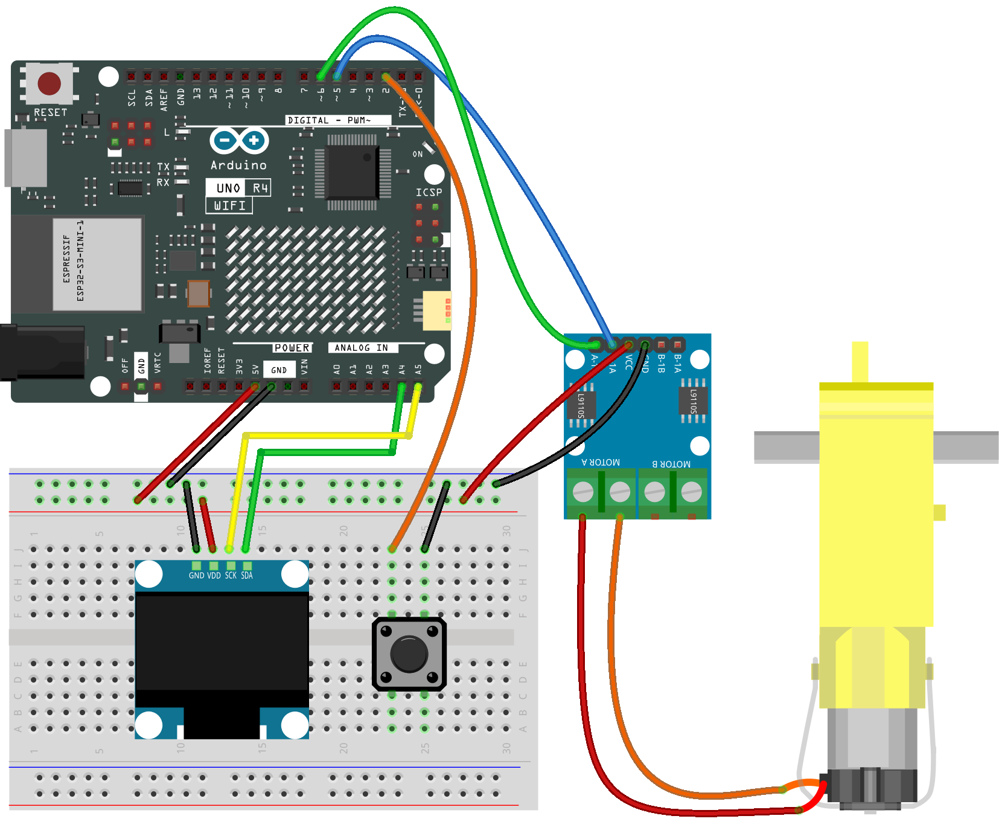

.. _speed_meter:

Speed Meter
==============================================================

.. note::
  
  🌟 Welcome to the SunFounder Facebook Community! Whether you're into Raspberry Pi, Arduino, or ESP32, you'll find inspiration, help ideas here.
   
  - ✅ Be the first to get free learning resources. 
   
  - ✅ Stay updated on new products & exclusive giveaways. 
   
  - ✅ Share your creations and get real feedback.
   
  * 👉 Need faster updates or support? Click [|link_sf_facebook|] join our Facebook community 

  * 👉 Or join our WhatsApp group: Click [|link_sf_whatsapp|]
   
  * 🎁 Looking for parts?Check out our all-in-one kits below — packed with components, beginner-friendly guides, and tons of fun.
  
  .. list-table::
    :widths: 20 20 20
    :header-rows: 1

    *   - Name	
        - Includes Arduino board
        - PURCHASE LINK
    *   - Elite Explorer Kit
        - Arduino Uno R4 WiFi
        - |link_elite_buy|
    *   - Universal Maker Sensor Kit
        - ×
        - |link_umsk_buy|
    *   - 3 in 1 Ultimate Starter Kit	
        - Arduino Uno R3
        - |link_arduinor3_buy|

Course Introduction
------------------------

In this lesson, you’ll learn how to use an L9110 Motor Driver Module, a TT motor, and an OLED display with the Arduino to build a simple Motor Speed Control system.

A button press cycles through multiple speed levels, and the motor speed is displayed on the OLED as both a numeric RPM value and a bar graph.

.. .. raw:: html

..    <iframe width="700" height="394" src="https://www.youtube.com/embed/ULGXiwr5h58?si=2j6lcoW5o2k6OTwm" title="YouTube video player" frameborder="0" allow="accelerometer; autoplay; clipboard-write; encrypted-media; gyroscope; picture-in-picture; web-share" referrerpolicy="strict-origin-when-cross-origin" allowfullscreen></iframe>

.. note::

  If this is your first time working with an Arduino project, we recommend downloading and reviewing the basic materials first.
  
  * :ref:`install_arduino`
  * :ref:`introduce_arduino`

**Required Components**

In this project, we need the following components:

.. list-table::
    :widths: 5 20 5 20
    :header-rows: 1

    *   - SN
        - COMPONENT INTRODUCTION	
        - QUANTITY
        - PURCHASE LINK

    *   - 1
        - Arduino UNO R4 Minima/Arduino UNO R4 WIFI
        - 1
        - |link_arduinor4_buy|
    *   - 2
        - USB Cable
        - 1
        - 
    *   - 3
        - Breadboard
        - 1
        - |link_breadboard_buy|
    *   - 4
        - Wires
        - Several
        - |link_wires_buy|
    *   - 5
        - L9110 Motor Driver Module
        - 1
        - 
    *   - 6
        - OLED Display Module
        - 1
        - |link_oled_buy|
    *   - 7
        - TT Motor
        - 1
        - 
    *   - 8
        - Button
        - 1
        - |link_button_buy|

**Wiring**

**Common Connections:**

* **OLED Display Module**

  - **SDA:** Connect to **A4** on the Arduino.
  - **SCK:** Connect to **A5** on the Arduino.
  - **GND:** Connect to breadboard’s negative power bus.
  - **VCC:** Connect to breadboard’s red power bus.

* **Button**

  - Connect to breadboard’s negative power bus.
  - Connect to **2** on the Arduino.

* **TT Motor**

  -  Connect to **MOTOR A** on the L9110 Motor Driver Module.

* **L9110 Motor Driver Module**

  - **GND:** Connect to breadboard’s negative power bus.
  - **VCC:** Connect to breadboard’s red power bus.
  - **B-1B:** Connect to **6** on the Arduino.
  - **B-1A:** Connect to **5** on the Arduino.

**Writing the Code**

.. note::

    * You can copy this code into **Arduino IDE**. 
    * To install the library, use the Arduino Library Manager and search for **Adafruit SSD1306** and **Adafruit GFX** and install it.
    * Don't forget to select the board(Arduino UNO R3) and the correct port before clicking the **Upload** button.

.. code-block:: arduino

      #include <Wire.h>
      #include <Adafruit_GFX.h>
      #include <Adafruit_SSD1306.h>

      #define SCREEN_WIDTH 128
      #define SCREEN_HEIGHT 64
      #define OLED_RESET    -1
      Adafruit_SSD1306 display(SCREEN_WIDTH, SCREEN_HEIGHT, &Wire, OLED_RESET);

      // Motor pins (L9110)
      #define MOTOR_PIN1 5
      #define MOTOR_PIN2 6

      // Button pin
      #define BUTTON_PIN 2

      // Motor speed levels (PWM values)
      int speedLevels[5] = {0, 100, 150, 200, 255};
      int currentLevel = 0;

      // Button debounce
      bool lastButtonState = HIGH;
      unsigned long lastDebounceTime = 0;
      const unsigned long debounceDelay = 200;

      void setup() {
        pinMode(MOTOR_PIN1, OUTPUT);
        pinMode(MOTOR_PIN2, OUTPUT);
        pinMode(BUTTON_PIN, INPUT_PULLUP);

        // Initialize OLED
        if (!display.begin(SSD1306_SWITCHCAPVCC, 0x3C)) {
          for (;;) ; // Stop if OLED not found
        }
        display.clearDisplay();
        display.display();
      }

      void loop() {
        handleButton();
        updateMotor();
        drawSpeed();
        delay(50);
      }

      void handleButton() {
        bool buttonState = digitalRead(BUTTON_PIN);
        if (buttonState == LOW && lastButtonState == HIGH && (millis() - lastDebounceTime) > debounceDelay) {
          currentLevel++;
          if (currentLevel > 4) currentLevel = 0; // Loop back to stop
          lastDebounceTime = millis();
        }
        lastButtonState = buttonState;
      }

      void updateMotor() {
        int speed = speedLevels[currentLevel];
        if (speed == 0) {
          analogWrite(MOTOR_PIN1, 0);
          analogWrite(MOTOR_PIN2, 0);
        } else {
          analogWrite(MOTOR_PIN1, speed);
          analogWrite(MOTOR_PIN2, 0);
        }
      }

      void drawSpeed() {
        int pwm = speedLevels[currentLevel];
        float rpm = (pwm / 255.0) * 200.0;  // Approximate RPM (TT motor max ~200RPM)

        // Calculate bar length (max 100px)
        int barLength = map(pwm, 0, 255, 0, 100);

        display.clearDisplay();

        // --- Display numeric speed (big font) ---
        display.setTextSize(2);        // Large font
        display.setTextColor(SSD1306_WHITE);
        display.setCursor(0, 0);       // Position at top-left
        display.print("RPM");
        display.setCursor(0, 20);      // Second line
        display.print((int)rpm);

        // --- Draw bar graph ---
        display.drawRect(10, 50, 100, 10, SSD1306_WHITE);       // Outline
        display.fillRect(10, 50, barLength, 10, SSD1306_WHITE); // Filled part

        display.display();
      }
