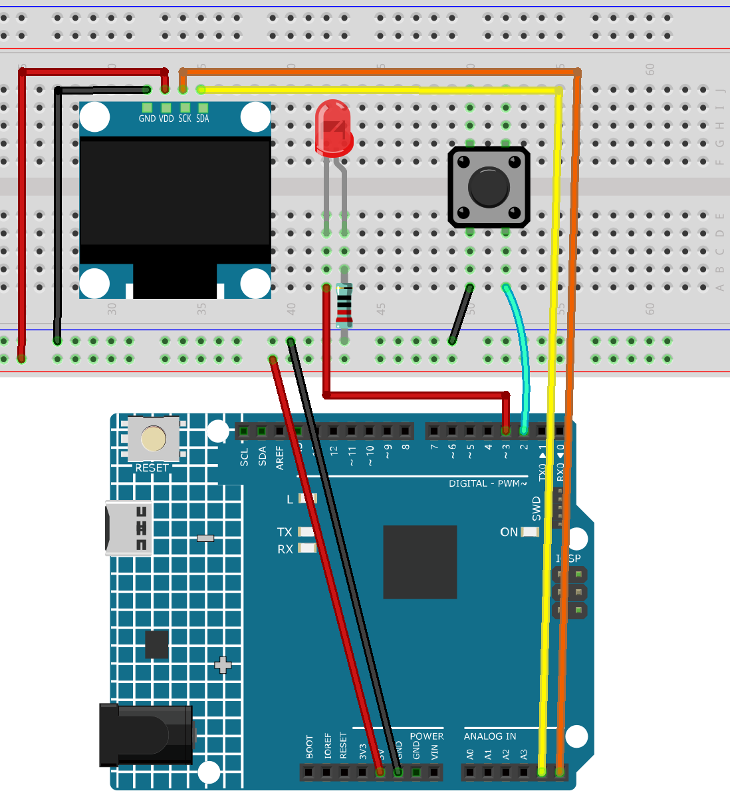

.. _speed_test:

Speed Test
==============================================================

.. note::
  
  🌟 Welcome to the SunFounder Facebook Community! Whether you're into Raspberry Pi, Arduino, or ESP32, you'll find inspiration, help ideas here.
   
  - ✅ Be the first to get free learning resources. 
   
  - ✅ Stay updated on new products & exclusive giveaways. 
   
  - ✅ Share your creations and get real feedback.
   
  * 👉 Need faster updates or support? Click [|link_sf_facebook|] join our Facebook community 

  * 👉 Or join our WhatsApp group: Click [|link_sf_whatsapp|]
   
  * 🎁 Looking for parts?Check out our all-in-one kits below — packed with components, beginner-friendly guides, and tons of fun.
  
  .. list-table::
    :widths: 20 20 20
    :header-rows: 1

    *   - Name	
        - Includes Arduino board
        - PURCHASE LINK
    *   - Elite Explorer Kit	
        - Arduino Uno R4 WiFi
        - |link_elite_buy|
    *   - Ultimate Sensor Kit	
        - Arduino Uno R4 Minima
        - |link_arduinor4_buy|
    *   - Universal Maker Sensor Kit
        - ×
        - |link_umsk_buy|

Course Introduction
------------------------

In this lesson, you'll use an OLED display, an LED, and a button with the Arduino R4 UNO to build a reaction time game.

When the LED lights up, players must press the button as quickly as possible. The OLED screen displays the reaction time, and pressing the button again starts a new round.

.. .. raw:: html

..  <iframe width="700" height="394" src="https://www.youtube.com/embed/KkPsawETYfg?si=4nMpy4ZNZjKVSooc" title="YouTube video player" frameborder="0" allow="accelerometer; autoplay; clipboard-write; encrypted-media; gyroscope; picture-in-picture; web-share" referrerpolicy="strict-origin-when-cross-origin" allowfullscreen></iframe>

.. note::

  If this is your first time working with an Arduino project, we recommend downloading and reviewing the basic materials first.

  * :ref:`install_arduino`
  * :ref:`introduce_arduino`

**Required Components**

In this project, we need the following components:

.. list-table::
    :widths: 5 20 5 20
    :header-rows: 1

    *   - SN
        - COMPONENT INTRODUCTION	
        - QUANTITY
        - PURCHASE LINK

    *   - 1
        - Arduino UNO R4 Minima
        - 1
        - |link_unor4_buy|
    *   - 2
        - USB Type-C cable
        - 1
        - 
    *   - 3
        - Breadboard
        - 1
        - |link_breadboard_buy|
    *   - 4
        - Wires
        - Several
        - |link_wires_buy|
    *   - 5
        - Button
        - 1
        - |link_button_buy|
    *   - 6
        - OLED Display Module
        - 1
        - |link_oled_buy|
    *   - 7
        - LED
        - 1
        - |link_led_buy|
    *   - 8
        - 220Ω resistor
        - 1
        - |link_resistor_buy|

**Wiring**

**Common Connections:**

* **OLED Display Module**

  - **SDA:** Connect to **A4** on the Arduino.
  - **SCK:** Connect to **A5** on the Arduino.
  - **GND:** Connect to breadboard’s negative power bus.
  - **VCC:** Connect to breadboard’s red power bus.

* **Button**

  - Connect to the breadboard’s negative power bus, and the other end to **2** on the Arduino board.

* **LED**

  - Connect the LED **cathode** to  the to a **220Ω resistor**, then to negative power bus on the breadboard, **anode** to **3** on the Arduino.

**Writing the Code**

.. note::

    * You can copy this code into **Arduino IDE**. 
    * To install the library, use the Arduino Library Manager and search for **Adafruit SSD1306** and **Adafruit GFX** and install it.
    * Don't forget to select the board(Arduino UNO R4 Minima) and the correct port before clicking the **Upload** button.

.. code-block:: arduino

      #include <Wire.h>
      #include <Adafruit_GFX.h>
      #include <Adafruit_SSD1306.h>

      #define SCREEN_WIDTH 128
      #define SCREEN_HEIGHT 64
      #define OLED_RESET    -1
      Adafruit_SSD1306 display(SCREEN_WIDTH, SCREEN_HEIGHT, &Wire, OLED_RESET);

      const int LED_PIN = 3;    // LED positive to D3, negative -> resistor -> GND
      const int BUTTON_PIN = 2; // Button one end to D2, the other to GND

      bool waitingReaction = false;
      bool roundFinished = false;
      unsigned long ledOnTime = 0;
      unsigned long reactionTime = 0;

      void setup() {
        pinMode(LED_PIN, OUTPUT);
        pinMode(BUTTON_PIN, INPUT_PULLUP); // Internal pull-up, button pressed = LOW

        if (!display.begin(SSD1306_SWITCHCAPVCC, 0x3C)) {
          for (;;) ; // Stop if OLED initialization fails
        }

        display.clearDisplay();
        display.setTextColor(SSD1306_WHITE);
        display.setTextSize(1);
        display.setCursor(10, 20);
        display.println("Reaction Game");
        display.setCursor(10, 40);
        display.println("Press to start");
        display.display();

        // Wait until button is pressed to start
        while (digitalRead(BUTTON_PIN) == HIGH);
        delay(200);
      }

      void loop() {
        if (!roundFinished) {
          // --- Show waiting message ---
          digitalWrite(LED_PIN, LOW);
          display.clearDisplay();
          display.setCursor(0, 20);
          display.println("Wait for LED...");
          display.display();

          delay(random(1000, 5000)); // Random delay 1~5 seconds

          // --- Turn on LED and record time ---
          digitalWrite(LED_PIN, HIGH);
          ledOnTime = millis();
          waitingReaction = true;
          roundFinished = true;
        }

        // --- Wait for player to press the button after LED on ---
        if (waitingReaction && digitalRead(BUTTON_PIN) == LOW) {
          reactionTime = millis() - ledOnTime;
          waitingReaction = false;
          showResult();
          delay(200); // debounce
        }

        // --- After result, wait for button press to start next round ---
        if (!waitingReaction && roundFinished && digitalRead(BUTTON_PIN) == LOW) {
          delay(200); // debounce
          roundFinished = false;  // Start new round
        }
      }

      void showResult() {
        digitalWrite(LED_PIN, LOW); // Turn off LED
        display.clearDisplay();
        display.setTextSize(2);
        display.setCursor(0, 20);
        display.print("Time:");
        display.print(reactionTime);
        display.println("ms");
        display.setTextSize(1);
        display.setCursor(0, 50);
        display.println("Press button again");
        display.display();
      }
