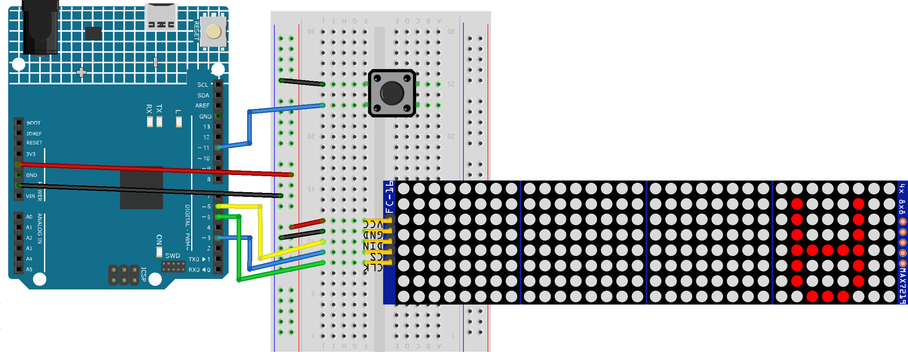

.. _stacker_blocks:

Stacker Blocks
==============================================================
.. note::
  
  Hello, welcome to the SunFounder Raspberry Pi & Arduino & ESP32 Enthusiasts Community on Facebook! Dive deeper into Raspberry Pi, Arduino, and ESP32 with fellow enthusiasts.

  👉 Ready to explore and create with us? Click [|link_sf_facebook|] and join today!

  Here are some related kits for this project. If you're interested, you can try other projects from these kits.

  .. list-table::
    :widths: 20 20 20
    :header-rows: 1

    *   - Name	
        - Includes Arduino board
        - PURCHASE LINK
    *   - Elite Explorer Kit	
        - ×
        - |link_elite_buy|
    *   - Ultimate Sensor Kit	
        - √
        - |link_arduinor4_buy|
    *   - Electronic Kit	
        - ×
        - |link_electronic_buy|
    *   - Universal Maker Sensor Kit
        - ×
        - |link_umsk_buy|

Course Introduction
------------------------

In this lesson, you’ll learn how to use a MAX7219 Dot Matrix Module, a button with the Arduino R4 UNO to create a stacker blocks game. 

The MAX7219 Dot Matrix Module will display the game, and players can use the button to control the gameplay in the stacker blocks game.

.. raw:: html

    <iframe width="700" height="394" src="https://www.youtube.com/embed/zlKPKK3Qink" frameborder="0" allow="accelerometer; autoplay; clipboard-write; encrypted-media; gyroscope; picture-in-picture" allowfullscreen></iframe>

.. note::

  If this is your first time working with an Arduino project, we recommend downloading and reviewing the basic materials first.

  * :ref:`install_arduino`
  * :ref:`introduce_arduino`

**Required Components**

In this project, we need the following components:

.. list-table::
    :widths: 5 20 5 20
    :header-rows: 1

    *   - SN
        - COMPONENT INTRODUCTION	
        - QUANTITY
        - PURCHASE LINK

    *   - 1
        - Arduino UNO R4 Minima
        - 1
        - |link_unor4_buy|
    *   - 2
        - USB Type-C cable
        - 1
        - 
    *   - 3
        - Breadboard
        - 1
        - |link_breadboard_buy|
    *   - 4
        - Wires
        - Several
        - |link_wires_buy|
    *   - 5
        - MAX7219 Dot Matrix Module
        - 1
        - |link_martix_buy|
    *   - 6
        - Button
        - 1
        - |link_button_buy|

**Wiring**

**Common Connections:**

* **MAX7219 Dot Matrix Module**

  - **CLK:** Connect to **5** on the Arduino.
  - **CS:** Connect to PWM **3** on the Arduino.
  - **DIN:** Connect to PWM **6** on the Arduino.
  - **GND:** Connect to breadboard’s negative power bus.
  - **VCC:** Connect to breadboard’s red power bus.

* **Button**

  - Connect to breadboard’s negative power bus.
  - Connect to Digital PWM **11** on the Arduino.

**Writing the Code**

.. note::

    * You can copy this code into **Arduino IDE**. 
    * To install the library, use the Arduino Library Manager and search for **Adafruit SSD1306** and **Adafruit GFX** and install it.
    * Don't forget to select the board(Arduino UNO R4 Minima) and the correct port before clicking the **Upload** button.

.. code-block:: arduino

      #include <Wire.h>
      #include <Adafruit_GFX.h>
      #include <Adafruit_SSD1306.h>

      #define SCREEN_WIDTH 128  // OLED screen width
      #define SCREEN_HEIGHT 64  // OLED screen height

      #define OLED_RESET -1  // Reset pin for OLED (not used)
      #define SCREEN_ADDRESS 0x3C  // OLED screen I2C address
      Adafruit_SSD1306 display(SCREEN_WIDTH, SCREEN_HEIGHT, &Wire, OLED_RESET);

      // Pins for joystick and button
      const int yPin = A1;  // Y-axis for joystick (up and down movement)
      const int swPin = 8;   // Button for reset

      // Paddle properties
      int paddleX;  // Paddle X position
      const int paddleWidth = 30, paddleHeight = 3;  // Paddle size
      const int brickRows = 3, brickCols = 6;  // Number of rows and columns of bricks
      const int brickWidth = SCREEN_WIDTH / brickCols;  // Brick width
      const int brickHeight = 5;  // Brick height
      bool bricks[brickRows][brickCols];  // 2D array to track brick status

      // Game settings
      const int deadZone = 100;  // Joystick dead zone
      const int speed = 8;  // Paddle speed
      float ballSpeed = 3.0;  // Initial ball speed
      bool gameOver = false;  // Game over flag
      bool gameWin = false;  // Game win flag

      // Ball properties
      float ballX, ballY;  // Ball position
      float ballDX, ballDY;  // Ball movement speed in X and Y
      int hitCount = 0;  // Hit count (how many times the ball hits the paddle)

      void setup() {
        pinMode(swPin, INPUT_PULLUP);  // Set button pin as input with pull-up resistor
        Serial.begin(9600);  // Start serial communication for debugging
        randomSeed(analogRead(A2));  // Initialize random seed using unconnected analog pin

        // Initialize OLED display
        if (!display.begin(SSD1306_SWITCHCAPVCC, SCREEN_ADDRESS)) {
          Serial.println(F("SSD1306 allocation failed"));
          for (;;);  // Stay here if the display initialization fails
        }

        resetGame();  // Reset game state when setup is done
      }

      void loop() {
        if (gameOver || gameWin) {  // Show game over or win screen if the game is over
          showGameOverScreen();
          return;
        }

        int yValue = analogRead(yPin);  // Read joystick Y-axis value
        
        // Move paddle based on joystick value
        if (abs(yValue - 512) > deadZone) {  
          if (yValue < 400) paddleX -= speed;  // Move paddle left
          else if (yValue > 600) paddleX += speed;  // Move paddle right
        }
        
        paddleX = constrain(paddleX, 0, SCREEN_WIDTH - paddleWidth);  // Prevent paddle from going off-screen

        // Update ball position
        int oldBallX = ballX;
        int oldBallY = ballY;
        ballX += ballDX;
        ballY += ballDY;

        // Ball boundary checks
        if (ballX <= 0 || ballX >= SCREEN_WIDTH - 2) ballDX = -ballDX;  // Reflect ball if it hits left or right
        if (ballY <= 0) ballDY = -ballDY;  // Reflect ball if it hits top

        // Paddle collision check
        if (ballY >= SCREEN_HEIGHT - paddleHeight - 1 && ballX >= paddleX && ballX <= paddleX + paddleWidth) {
          ballDY = -ballDY;  // Reflect ball vertically
          hitCount++;  // Increment hit count
          
          // Increase ball speed based on hit count
          if (hitCount == 2) ballSpeed = 4.0;
          if (hitCount == 4) ballSpeed = 5.0;
          if (hitCount == 6) ballSpeed = 6.0;  // Max speed at hit 6

          ballSpeed = min(ballSpeed, 6.0);  // Ensure ball speed doesn't exceed max value
          normalizeBallSpeed();  // Normalize ball speed
        }

        // Check for brick collision
        int remainingBricks = 0;
        for (int i = 0; i < brickRows; i++) {
          for (int j = 0; j < brickCols; j++) {
            if (bricks[i][j]) {
              remainingBricks++;
              int brickX = j * brickWidth;
              int brickY = i * brickHeight;

              // Check if ball hits the brick
              bool hitX = (ballX + 2 >= brickX && ballX - 2 <= brickX + brickWidth);
              bool hitY = (ballY + 2 >= brickY && ballY - 2 <= brickY + brickHeight);

              if (hitX && hitY) {
                bricks[i][j] = false;  // Remove brick if hit
                
                // Reflect ball direction based on collision side
                if (oldBallX < brickX || oldBallX > brickX + brickWidth) {
                  ballDX = -ballDX;  // Reflect ball horizontally
                }
                if (oldBallY < brickY || oldBallY > brickY + brickHeight) {
                  ballDY = -ballDY;  // Reflect ball vertically
                }

                normalizeBallSpeed();  // Normalize ball speed after collision
                break;
              }
            }
          }
        }

        if (remainingBricks == 0) {  // If all bricks are cleared, the player wins
          gameWin = true;
        }

        if (ballY > SCREEN_HEIGHT) {  // If ball falls below screen, the game is over
          gameOver = true;
        }

        drawGame();  // Draw updated game state on screen
        delay(10);  // Delay to control game speed
      }

      // Reset game state
      void resetGame() {
        gameOver = false;
        gameWin = false;
        
        // Reset paddle position
        paddleX = SCREEN_WIDTH / 2 - paddleWidth / 2;

        // Reset ball position
        ballX = SCREEN_WIDTH / 2;
        ballY = SCREEN_HEIGHT / 2;

        // Reset speed and hit count
        ballSpeed = 3.0;
        hitCount = 0;

        // Random ball direction
        float angle;
        if (random(0, 2) == 0) {
          angle = random(30, 60);  // Angle between 30° and 60°
        } else {
          angle = random(120, 150); // Angle between 120° and 150°
        }

        // Calculate ball velocity based on random angle
        ballDX = ballSpeed * cos(radians(angle));
        ballDY = -ballSpeed * sin(radians(angle));  // Ball moves upwards initially

        // Initialize all bricks as present
        for (int i = 0; i < brickRows; i++) {
          for (int j = 0; j < brickCols; j++) {
            bricks[i][j] = true;
          }
        }
        drawGame();  // Draw initial game state
      }

      // Normalize ball speed to maintain consistent speed after reflections
      void normalizeBallSpeed() {
        float magnitude = sqrt(ballDX * ballDX + ballDY * ballDY);  // Calculate the ball's current speed
        ballDX = (ballDX / magnitude) * ballSpeed;  // Adjust X speed
        ballDY = (ballDY / magnitude) * ballSpeed;  // Adjust Y speed
      }

      // Draw the current game state to the OLED screen
      void drawGame() {
        display.clearDisplay();  // Clear previous frame
        display.fillRect(paddleX, SCREEN_HEIGHT - paddleHeight, paddleWidth, paddleHeight, WHITE);  // Draw paddle
        display.fillCircle(ballX, ballY, 2, WHITE);  // Draw ball

        // Draw remaining bricks
        for (int i = 0; i < brickRows; i++) {
          for (int j = 0; j < brickCols; j++) {
            if (bricks[i][j]) {
              display.fillRect(j * brickWidth, i * brickHeight, brickWidth - 1, brickHeight - 1, WHITE);
            }
          }
        }

        display.display();  // Update display
      }

      // Display game over or win screen
      void showGameOverScreen() {
        display.clearDisplay();
        display.setTextSize(2);  // Larger text for game over message
        display.setTextColor(WHITE);
        display.setCursor(20, 30);  // Position message on screen
        if (gameWin) {
          display.println("You Win!");  // Display "You Win!" if player won
        } else {
          display.println("Game Over");  // Display "Game Over" if player lost
        }
        display.display();

        while (digitalRead(swPin) == HIGH);  // Wait for button press to reset game
        delay(500);  // Debounce delay
        resetGame();  // Reset game
      }

