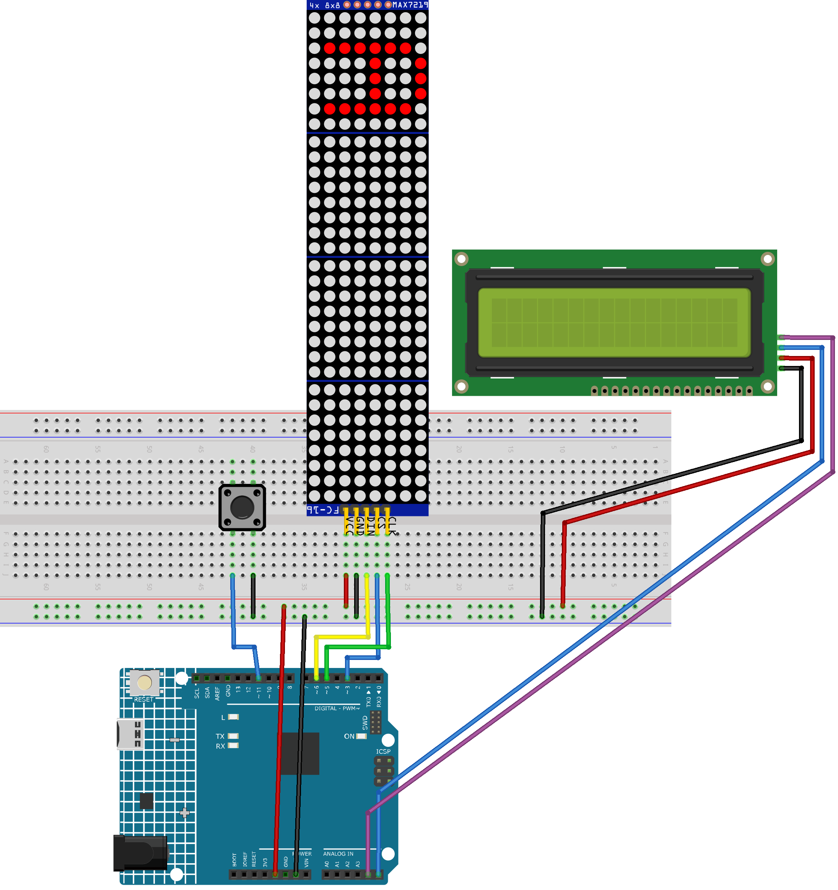

.. _stacker_blocks2.0:

Stacker Blocks 2.0
==============================================================

.. note::
  
  🌟 Welcome to the SunFounder Facebook Community! Whether you're into Raspberry Pi, Arduino, or ESP32, you'll find inspiration, help ideas here.
   
  - ✅ Be the first to get free learning resources. 
   
  - ✅ Stay updated on new products & exclusive giveaways. 
   
  - ✅ Share your creations and get real feedback.
   
  * 👉 Need faster updates or support? Click [|link_sf_facebook|] join our Facebook community 

  * 👉 Or join our WhatsApp group: Click [|link_sf_whatsapp|]
   
  * 🎁 Looking for parts?Check out our all-in-one kits below — packed with components, beginner-friendly guides, and tons of fun.
  
  .. list-table::
    :widths: 20 20 20
    :header-rows: 1

    *   - Name	
        - Includes Arduino board
        - PURCHASE LINK
    *   - Elite Explorer Kit	
        - Arduino Uno R4 WiFi
        - |link_elite_buy|
    *   - Ultimate Sensor Kit	
        - Arduino Uno R4 Minima
        - |link_arduinor4_buy|
    *   - Electronic Kit	
        - ×
        - |link_electronic_buy|
    *   - Universal Maker Sensor Kit
        - ×
        - |link_umsk_buy|

Course Introduction
------------------------

In this lesson, you’ll learn how to use a MAX7219 Dot Matrix Module, a button with the Arduino R4 UNO to create a stacker blocks game. 

The MAX7219 Dot Matrix Module will display the game, and players can use the button to control the gameplay in the stacker blocks game.

.. raw:: html

  <iframe width="700" height="394" src="https://www.youtube.com/embed/8FZq__fSBZ4" title="YouTube video player" frameborder="0" allow="accelerometer; autoplay; clipboard-write; encrypted-media; gyroscope; picture-in-picture; web-share" referrerpolicy="strict-origin-when-cross-origin" allowfullscreen></iframe>

.. note::

  If this is your first time working with an Arduino project, we recommend downloading and reviewing the basic materials first.

  * :ref:`install_arduino`
  * :ref:`introduce_arduino`

**Required Components**

In this project, we need the following components:

.. list-table::
    :widths: 5 20 5 20
    :header-rows: 1

    *   - SN
        - COMPONENT INTRODUCTION	
        - QUANTITY
        - PURCHASE LINK

    *   - 1
        - Arduino UNO R4 Minima
        - 1
        - |link_unor4_buy|
    *   - 2
        - USB Type-C cable
        - 1
        - 
    *   - 3
        - Breadboard
        - 1
        - |link_breadboard_buy|
    *   - 4
        - Wires
        - Several
        - |link_wires_buy|
    *   - 5
        - MAX7219 Dot Matrix Module
        - 1
        - |link_martix_buy|
    *   - 6
        - Button
        - 1
        - |link_button_buy|
    *   - 7
        - I2C LCD 1602
        - 1
        - |link_i2clcd1602_buy|

**Wiring**

**Common Connections:**

* **MAX7219 Dot Matrix Module**

  - **CLK:** Connect to **5** on the Arduino.
  - **CS:** Connect to **3** on the Arduino.
  - **DIN:** Connect to **6** on the Arduino.
  - **GND:** Connect to breadboard’s negative power bus.
  - **VCC:** Connect to breadboard’s red power bus.

* **Button**

  - Connect to breadboard’s negative power bus.
  - Connect to **11** on the Arduino.

* **I2C LCD 1602**

  - **SDA:** Connect to **A5** on the Arduino.
  - **SCL:** Connect to **A4** on the Arduino.
  - **GND:** Connect to breadboard’s negative power bus.
  - **VCC:** Connect to breadboard’s red power bus.

**Writing the Code**

.. note::

    * You can copy this code into **Arduino IDE**. 
    * To install the library, use the Arduino Library Manager and search for **LiquidCrystal_I2C** and **LedControl** and install it.
    * Don't forget to select the board(Arduino UNO R4 Minima) and the correct port before clicking the **Upload** button.

.. code-block:: arduino

      #include "LedControl.h"
      #include <Wire.h>
      #include <LiquidCrystal_I2C.h>

      // ==== LED matrices (4 modules) ====
      LedControl lc = LedControl(6, 5, 3, 4); // DIN=6, CLK=5, CS=3, 4 modules

      // ==== LCD (I2C 16x2) ====
      // Change 0x27 to 0x3F if your LCD uses that address
      LiquidCrystal_I2C lcd(0x27, 16, 2);

      // ==== Function prototypes ====
      void updateDisplay();
      void updatePlacedBlockDisplay(int layerIndex);
      bool checkButton();
      void clearMovingBlock();
      void displayMovingBlock();
      void playSuccessSound();
      void playGameOverSound();
      void updateMaxPosition();
      void placeBlock();
      void displayLayer(int level);
      void updateLCD();

      // ==== Constants ====
      const int buttonPin = 11;    // Button input (active LOW)
      const int buzzerPin = 9;     // Buzzer (optional)
      const int blockColumns = 2;  // Each layer uses 2 columns

      // ==== Game state ====
      int currentWidth = 4;        // Vertical height of moving block
      int currentPos = -4;         // Top row index (can be negative to allow off-screen)
      int direction = 1;           // 1=down, -1=up
      int moveDelay = 150;         // Movement speed (ms)
      bool gameOver = false;
      bool gameWon = false;
      unsigned long lastMoveTime = 0;
      int maxPosition = 0;         // 7 + currentWidth
      int buttonPressCount = 0;
      int currentLayerCount = 0;   // Placed layers count

      struct BlockLayer {
        int position;   // top row
        int width;      // height in rows
        int startCol;   // start column (0..31)
        int colWidth;   // always 2
      };

      BlockLayer layers[32];

      // ==== Helpers ====
      void lcdPrintCentered(uint8_t row, const char* msg) {
        int len = 0;
        while (msg[len] != '\0') len++;       // simple strlen
        int col = (16 - len) / 2;
        if (col < 0) col = 0;                 // clamp left
        lcd.setCursor(col, row);
        lcd.print(msg);
      }

      // ==== Rendering (full refresh) ====
      void updateDisplay() {
        for (int i = 0; i < 4; i++) lc.clearDisplay(i);

        // Draw placed layers
        for (int i = 0; i < currentLayerCount; i++) {
          int startCol = layers[i].startCol;
          int colWidth = layers[i].colWidth;
          for (int colOffset = 0; colOffset < colWidth; colOffset++) {
            int currentCol = startCol + colOffset;
            int module = currentCol / 8;
            int col = 7 - (currentCol % 8);
            if (module >= 4) continue;
            for (int j = 0; j < layers[i].width; j++) {
              int row = layers[i].position + j;
              if (row >= 0 && row < 8) lc.setLed(module, row, col, true);
            }
          }
        }

        // Draw moving block if playing
        if (!gameOver) {
          int startCol = currentLayerCount * blockColumns;
          for (int colOffset = 0; colOffset < blockColumns; colOffset++) {
            int currentCol = startCol + colOffset;
            int module = currentCol / 8;
            int col = 7 - (currentCol % 8);
            if (module >= 4) continue;
            for (int j = 0; j < currentWidth; j++) {
              int row = currentPos + j;
              if (row >= 0 && row < 8) lc.setLed(module, row, col, true);
            }
          }
        }
      }

      // ==== Rendering (placed layer, local) ====
      void updatePlacedBlockDisplay(int layerIndex) {
        int startCol = layers[layerIndex].startCol;
        int colWidth = layers[layerIndex].colWidth;
        for (int colOffset = 0; colOffset < colWidth; colOffset++) {
          int currentCol = startCol + colOffset;
          int module = currentCol / 8;
          int col = 7 - (currentCol % 8);
          if (module >= 4) continue;

          // clear that column
          for (int row = 0; row < 8; row++) lc.setLed(module, row, col, false);
          // redraw the layer pixels
          for (int j = 0; j < layers[layerIndex].width; j++) {
            int row = layers[layerIndex].position + j;
            if (row >= 0 && row < 8) lc.setLed(module, row, col, true);
          }
        }
      }

      // ==== Button (active LOW, simple debounce) ====
      bool checkButton() {
        if (digitalRead(buttonPin) == LOW) {
          delay(20);
          if (digitalRead(buttonPin) == LOW) {
            while (digitalRead(buttonPin) == LOW) {} // wait release
            return true;
          }
        }
        return false;
      }

      // (unused helper, kept for completeness)
      void displayLayer(int level) {
        int startCol = layers[level].startCol;
        int colWidth = layers[level].colWidth;
        for (int colOffset = 0; colOffset < colWidth; colOffset++) {
          int currentCol = startCol + colOffset;
          int module = currentCol / 8;
          int col = 7 - (currentCol % 8);
          if (module >= 4) continue;
          for (int j = 0; j < layers[level].width; j++) {
            int row = layers[level].position + j;
            if (row >= 0 && row < 8) lc.setLed(module, row, col, true);
          }
        }
      }

      // ==== Moving block draw/clear ====
      void displayMovingBlock() {
        int startCol = currentLayerCount * blockColumns;
        for (int colOffset = 0; colOffset < blockColumns; colOffset++) {
          int currentCol = startCol + colOffset;
          int module = currentCol / 8;
          int col = 7 - (currentCol % 8);
          if (module >= 4) continue;
          for (int j = 0; j < currentWidth; j++) {
            int row = currentPos + j;
            if (row >= 0 && row < 8) lc.setLed(module, row, col, true);
          }
        }
      }

      void clearMovingBlock() {
        int startCol = currentLayerCount * blockColumns;
        for (int colOffset = 0; colOffset < blockColumns; colOffset++) {
          int currentCol = startCol + colOffset;
          int module = currentCol / 8;
          int col = 7 - (currentCol % 8);
          if (module >= 4) continue;
          for (int j = 0; j < currentWidth; j++) {
            int row = currentPos + j;
            if (row >= 0 && row < 8) lc.setLed(module, row, col, false);
          }
        }
      }

      // ==== Sounds ====
      void playSuccessSound() {
        tone(buzzerPin, 523, 100);
      }

      void playGameOverSound() {
        tone(buzzerPin, 392, 200);
        delay(200);
        tone(buzzerPin, 349, 400);
        delay(400);
      }

      // ==== Motion bounds ====
      void updateMaxPosition() {
        maxPosition = 7 + currentWidth;
      }

      // ==== LCD update ====
      void updateLCD() {
        lcd.clear();
        if (gameOver) {
          // Centered end-state messages
          if (gameWon) {
            lcdPrintCentered(0, "You Win!");
          } else {
            lcdPrintCentered(0, "Game Over");
          }
          // Second line tip (exactly 16 chars, auto-centered to col 0)
          lcdPrintCentered(1, "Press to Restart");
          return;
        }

        // In-game info (Layers starts from 0 as requested)
        lcd.setCursor(0, 0); lcd.print("Blocks: "); lcd.print(currentWidth);
        lcd.setCursor(0, 1); lcd.print("Layers: "); lcd.print(currentLayerCount);
      }

      // ==== Place logic ====
      void placeBlock() {
        buttonPressCount++;
        if (buttonPressCount == 4)  moveDelay = 120;
        else if (buttonPressCount == 8)  moveDelay = 90;
        else if (buttonPressCount == 12) moveDelay = 60;

        // First layer: no previous to compare
        if (currentLayerCount == 0) {
          layers[0].position = currentPos;
          layers[0].width = currentWidth;
          layers[0].startCol = 0;
          layers[0].colWidth = blockColumns;
          currentLayerCount = 1;

          updateMaxPosition();
          currentPos = random(-currentWidth, maxPosition + 1);

          playSuccessSound();
          updatePlacedBlockDisplay(0);
          updateLCD();
          return;
        }

        // Overlap with previous layer
        int prevPos = layers[currentLayerCount - 1].position;
        int prevWidth = layers[currentLayerCount - 1].width;
        int overlapTop = max(prevPos, currentPos);
        int overlapBottom = min(prevPos + prevWidth - 1, currentPos + currentWidth - 1);

        // No overlap -> game over
        if (overlapBottom < overlapTop) {
          clearMovingBlock();
          gameOver = true;
          gameWon = false;
          playGameOverSound();
          updateLCD();
          return;
        }

        // Save overlap as new layer
        layers[currentLayerCount].position = overlapTop;
        layers[currentLayerCount].width = overlapBottom - overlapTop + 1;
        layers[currentLayerCount].startCol = currentLayerCount * blockColumns;
        layers[currentLayerCount].colWidth = blockColumns;

        // Update moving block height and count
        currentWidth = overlapBottom - overlapTop + 1;
        currentLayerCount++;

        playSuccessSound();

        // Win condition: 16 layers (32 columns)
        int totalUsedCols = currentLayerCount * blockColumns;
        if (totalUsedCols >= 32) {
          updatePlacedBlockDisplay(currentLayerCount - 1);
          gameOver = true;
          gameWon = true;
          updateLCD();
          return;
        }

        updateMaxPosition();
        currentPos = random(-currentWidth, maxPosition + 1);

        updateLCD();
        updatePlacedBlockDisplay(currentLayerCount - 1);
      }

      // ==== Setup ====
      void setup() {
        pinMode(buttonPin, INPUT_PULLUP);
        pinMode(buzzerPin, OUTPUT);

        // LCD init
        Wire.begin();
        lcd.init();
        lcd.backlight();

        // Matrices init
        for (int i = 0; i < 4; i++) {
          lc.shutdown(i, false);
          lc.setIntensity(i, 8);
          lc.clearDisplay(i);
        }

        currentLayerCount = 0;
        currentPos = -currentWidth;
        randomSeed(analogRead(0));
        updateMaxPosition();
        updateDisplay();
        updateLCD();
      }

      // ==== Loop ====
      void loop() {
        // Game over: blink matrices; LCD shows final text
        if (gameOver) {
          static bool blinkState = false;
          static unsigned long lastBlinkTime = 0;
          if (millis() - lastBlinkTime > 500) {
            lastBlinkTime = millis();
            blinkState = !blinkState;
            if (blinkState) updateDisplay();
            else for (int i = 0; i < 4; i++) lc.clearDisplay(i);
          }

          // Reset on button
          if (checkButton()) {
            gameOver = false;
            gameWon = false;
            currentLayerCount = 0;
            currentWidth = 4;
            currentPos = -currentWidth;
            moveDelay = 150;
            direction = 1;
            buttonPressCount = 0;
            updateMaxPosition();
            updateDisplay();
            updateLCD();
          }
          return;
        }

        // Movement
        unsigned long currentTime = millis();
        if (currentTime - lastMoveTime > moveDelay) {
          lastMoveTime = currentTime;
          clearMovingBlock();
          currentPos += direction;

          // Reflect at bounds
          if (currentPos < -currentWidth) {
            int overshoot = (-currentWidth) - currentPos;
            currentPos = -currentWidth + overshoot;
            direction = -direction;
          } else if (currentPos > maxPosition) {
            int overshoot = currentPos - maxPosition;
            currentPos = maxPosition - overshoot - (currentWidth - 1);
            direction = -direction;
          }
          displayMovingBlock();
        }

        // Place on button
        if (checkButton()) {
          placeBlock();
        }
      }
