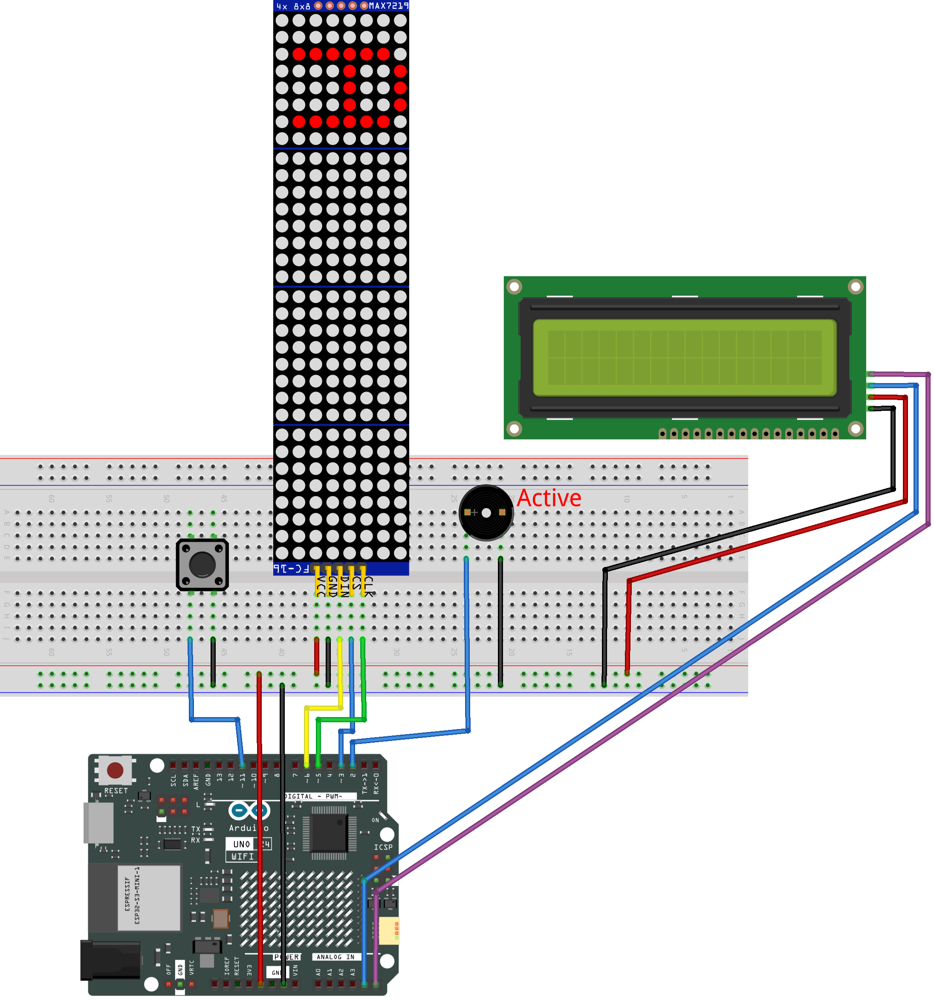

.. _stacker_blocks3.0:

Stacker Blocks 3.0
==============================================================

.. note::
  
  🌟 Welcome to the SunFounder Facebook Community! Whether you're into Raspberry Pi, Arduino, or ESP32, you'll find inspiration, help ideas here.
   
  - ✅ Be the first to get free learning resources. 
   
  - ✅ Stay updated on new products & exclusive giveaways. 
   
  - ✅ Share your creations and get real feedback.
   
  * 👉 Need faster updates or support? Click [|link_sf_facebook|] join our Facebook community 

  * 👉 Or join our WhatsApp group: Click [|link_sf_whatsapp|]
   
  * 🎁 Looking for parts?Check out our all-in-one kits below — packed with components, beginner-friendly guides, and tons of fun.
  
  .. list-table::
    :widths: 20 20 20
    :header-rows: 1

    *   - Name	
        - Includes Arduino board
        - PURCHASE LINK
    *   - Elite Explorer Kit	
        - Arduino Uno R4 WiFi
        - |link_elite_buy|
    *   - Ultimate Sensor Kit	
        - Arduino Uno R4 Minima
        - |link_arduinor4_buy|
    *   - Electronic Kit	
        - ×
        - |link_electronic_buy|
    *   - Universal Maker Sensor Kit
        - ×
        - |link_umsk_buy|

Course Introduction
------------------------

In this lesson, you’ll learn how to use a MAX7219 Dot Matrix Module, a button, an active buzzer, I2C LCD with the Arduino R4 UNO to create a stacker blocks game. 

The MAX7219 Dot Matrix Module will display the game, and players can use the button to control the gameplay in the stacker blocks game.

.. .. raw:: html

..  <iframe width="700" height="394" src="https://www.youtube.com/embed/8FZq__fSBZ4" title="YouTube video player" frameborder="0" allow="accelerometer; autoplay; clipboard-write; encrypted-media; gyroscope; picture-in-picture; web-share" referrerpolicy="strict-origin-when-cross-origin" allowfullscreen></iframe>

.. note::

  If this is your first time working with an Arduino project, we recommend downloading and reviewing the basic materials first.

  * :ref:`install_arduino`
  * :ref:`introduce_arduino`

**Required Components**

In this project, we need the following components:

.. list-table::
    :widths: 5 20 5 20
    :header-rows: 1

    *   - SN
        - COMPONENT INTRODUCTION	
        - QUANTITY
        - PURCHASE LINK

    *   - 1
        - Arduino UNO R4 Minima
        - 1
        - |link_unor4_buy|
    *   - 2
        - USB Type-C cable
        - 1
        - 
    *   - 3
        - Breadboard
        - 1
        - |link_breadboard_buy|
    *   - 4
        - Wires
        - Several
        - |link_wires_buy|
    *   - 5
        - MAX7219 Dot Matrix Module
        - 1
        - |link_martix_buy|
    *   - 6
        - Button
        - 1
        - |link_button_buy|
    *   - 7
        - I2C LCD 1602
        - 1
        - |link_i2clcd1602_buy|
    *   - 8
        - Active Buzzer
        - 1
        - 

**Wiring**

**Common Connections:**

* **MAX7219 Dot Matrix Module**

  - **CLK:** Connect to **5** on the Arduino.
  - **CS:** Connect to **3** on the Arduino.
  - **DIN:** Connect to **6** on the Arduino.
  - **GND:** Connect to breadboard’s negative power bus.
  - **VCC:** Connect to breadboard’s red power bus.

* **Button**

  - Connect to breadboard’s negative power bus.
  - Connect to **11** on the Arduino.

* **I2C LCD 1602**

  - **SDA:** Connect to **A5** on the Arduino.
  - **SCL:** Connect to **A4** on the Arduino.
  - **GND:** Connect to breadboard’s negative power bus.
  - **VCC:** Connect to breadboard’s red power bus.

* **Active Buzzer**

  - Connect to breadboard’s negative power bus.
  - Connect to **2** on the Arduino.

**Writing the Code**

.. note::

    * You can copy this code into **Arduino IDE**. 
    * To install the library, use the Arduino Library Manager and search for **LiquidCrystal_I2C** and **LedControl** and install it.
    * Don't forget to select the board(Arduino UNO R4 Minima) and the correct port before clicking the **Upload** button.

.. code-block:: arduino

      #include "LedControl.h"
      #include <Wire.h>
      #include <LiquidCrystal_I2C.h>

      // ==== LED matrices ====
      // DIN=6, CLK=5, CS=3, using 4 MAX7219 modules
      LedControl lc = LedControl(6, 5, 3, 4);

      // ==== LCD ====
      // I2C LCD, address may be 0x27 or 0x3F
      LiquidCrystal_I2C lcd(0x27, 16, 2);

      // ==== Pins ====
      const int buttonPin = 11;   // Button (INPUT_PULLUP, active LOW)
      const int buzzerPin = 2;    // Active buzzer
      const int blockColumns = 2; // Each layer uses 2 columns

      // ==== Game state ====
      int currentWidth = 4;        // Height of moving block
      int currentPos = -4;         // Current top position (can be off-screen)
      int direction = 1;           // Moving direction: 1=down, -1=up
      int moveDelay = 150;         // Speed of movement
      bool gameOver = false;
      bool gameWon = false;
      unsigned long lastMoveTime = 0;
      int maxPosition = 0;         // Movement limit
      int buttonPressCount = 0;
      int currentLayerCount = 0;

      bool systemReady = false;

      // ==== Block structure ====
      // Stores each placed layer
      struct BlockLayer {
        int position;   // top row
        int width;      // height
        int startCol;   // column position
        int colWidth;   // width in columns
      };

      BlockLayer layers[32];

      // ==== LCD helper ====
      // Print text centered on LCD
      void lcdPrintCentered(uint8_t row, const char* msg) {
        int len = 0;
        while (msg[len] != '\0') len++;
        int col = (16 - len) / 2;
        if (col < 0) col = 0;
        lcd.setCursor(col, row);
        lcd.print(msg);
      }

      // =======================
      // 🔊 Sound system
      // =======================

      // Short beep for successful placement
      void playSuccessSound() {
        digitalWrite(buzzerPin, HIGH);
        delay(60);
        digitalWrite(buzzerPin, LOW);
      }

      // Two-step sound for game over
      void playGameOverSound() {
        digitalWrite(buzzerPin, HIGH);
        delay(250);
        digitalWrite(buzzerPin, LOW);

        delay(100);

        digitalWrite(buzzerPin, HIGH);
        delay(300);
        digitalWrite(buzzerPin, LOW);
      }

      // Three short beeps for winning
      void playWinSound() {
        for (int i = 0; i < 3; i++) {
          digitalWrite(buzzerPin, HIGH);
          delay(80);
          digitalWrite(buzzerPin, LOW);
          delay(60);
        }
      }

      // Flash LED display when player wins
      void playWinAnimation() {
        for (int i = 0; i < 3; i++) {
          for (int j = 0; j < 4; j++) lc.clearDisplay(j);
          delay(120);

          updateDisplay();
          delay(120);
        }
      }

      // ==== Display ====
      void updateDisplay() {
        // Clear all modules first
        for (int i = 0; i < 4; i++) lc.clearDisplay(i);

        // Draw placed blocks
        for (int i = 0; i < currentLayerCount; i++) {
          int startCol = layers[i].startCol;

          for (int colOffset = 0; colOffset < blockColumns; colOffset++) {
            int currentCol = startCol + colOffset;
            int module = currentCol / 8;
            int col = 7 - (currentCol % 8);
            if (module >= 4) continue;

            for (int j = 0; j < layers[i].width; j++) {
              int row = layers[i].position + j;
              if (row >= 0 && row < 8)
                lc.setLed(module, row, col, true);
            }
          }
        }

        // Draw moving block
        if (!gameOver) {
          int startCol = currentLayerCount * blockColumns;

          for (int colOffset = 0; colOffset < blockColumns; colOffset++) {
            int currentCol = startCol + colOffset;
            int module = currentCol / 8;
            int col = 7 - (currentCol % 8);
            if (module >= 4) continue;

            for (int j = 0; j < currentWidth; j++) {
              int row = currentPos + j;
              if (row >= 0 && row < 8)
                lc.setLed(module, row, col, true);
            }
          }
        }
      }

      // ==== Button ====
      // Detect single press (no repeat while holding)
      bool checkButton() {
        static bool buttonPressed = false;

        if (!systemReady) return false;

        // Button pressed
        if (digitalRead(buttonPin) == LOW && !buttonPressed) {
          delay(20);  // debounce
          if (digitalRead(buttonPin) == LOW) {
            buttonPressed = true;
            return true;
          }
        }

        // Button released
        if (digitalRead(buttonPin) == HIGH) {
          buttonPressed = false;
        }

        return false;
      }

      // ==== Movement ====
      void updateMaxPosition() {
        maxPosition = 7 + currentWidth;
      }

      // ==== LCD ====
      void updateLCD() {
        lcd.clear();

        if (gameOver) {
          if (gameWon) {
            lcdPrintCentered(0, "YOU WIN!");
            lcdPrintCentered(1, "Perfect Stack!");
          } else {
            lcdPrintCentered(0, "GAME OVER");
            lcdPrintCentered(1, "Try Again!");
          }
          return;
        }

        lcd.setCursor(0, 0);
        lcd.print("Stack: ");
        lcd.print(currentLayerCount);

        lcd.setCursor(0, 1);
        lcd.print("Size: ");
        lcd.print(currentWidth);
      }

      // ==== Place block logic ====
      void placeBlock() {

        buttonPressCount++;

        // Increase speed gradually
        if (buttonPressCount == 4) moveDelay = 120;
        else if (buttonPressCount == 8) moveDelay = 90;
        else if (buttonPressCount == 12) moveDelay = 60;

        // First block (no overlap needed)
        if (currentLayerCount == 0) {
          layers[0] = {currentPos, currentWidth, 0, blockColumns};
          currentLayerCount = 1;

          updateMaxPosition();
          currentPos = random(-currentWidth, maxPosition + 1);

          playSuccessSound();
          updateLCD();
          return;
        }

        // Calculate overlap with previous block
        int prevPos = layers[currentLayerCount - 1].position;
        int prevWidth = layers[currentLayerCount - 1].width;

        int overlapTop = max(prevPos, currentPos);
        int overlapBottom = min(prevPos + prevWidth - 1,
                                currentPos + currentWidth - 1);

        // No overlap → game over
        if (overlapBottom < overlapTop) {
          gameOver = true;
          gameWon = false;
          playGameOverSound();
          updateLCD();
          return;
        }

        // Save new trimmed block
        layers[currentLayerCount] = {
          overlapTop,
          overlapBottom - overlapTop + 1,
          currentLayerCount * blockColumns,
          blockColumns
        };

        currentWidth = overlapBottom - overlapTop + 1;
        currentLayerCount++;

        // Win condition
        if (currentLayerCount * blockColumns >= 32) {
          gameOver = true;
          gameWon = true;

          playWinSound();
          playWinAnimation();

          updateLCD();
          return;
        }

        playSuccessSound();

        updateMaxPosition();
        currentPos = random(-currentWidth, maxPosition + 1);

        updateLCD();
      }

      // ==== Setup ====
      void setup() {
        delay(300);

        pinMode(buttonPin, INPUT_PULLUP);
        pinMode(buzzerPin, OUTPUT);
        digitalWrite(buzzerPin, LOW);

        Wire.begin();
        lcd.init();
        lcd.backlight();

        // Initialize LED modules
        for (int i = 0; i < 4; i++) {
          lc.shutdown(i, false);
          lc.setIntensity(i, 8);
          lc.clearDisplay(i);
        }

        randomSeed(analogRead(0));

        updateMaxPosition();
        updateDisplay();
        updateLCD();

        systemReady = true;
      }

      // ==== Loop ====
      void loop() {

        // Game over blinking effect
        if (gameOver) {
          static bool blink = false;
          static unsigned long lastBlink = 0;

          if (millis() - lastBlink > 500) {
            lastBlink = millis();
            blink = !blink;
            if (blink) updateDisplay();
            else for (int i = 0; i < 4; i++) lc.clearDisplay(i);
          }

          // Restart game
          if (checkButton()) {
            gameOver = false;
            gameWon = false;
            currentLayerCount = 0;
            currentWidth = 4;
            currentPos = -currentWidth;
            moveDelay = 150;
            direction = 1;
            buttonPressCount = 0;

            updateMaxPosition();
            updateDisplay();
            updateLCD();
          }
          return;
        }

        // Block movement
        unsigned long currentTime = millis();
        if (currentTime - lastMoveTime > moveDelay) {
          lastMoveTime = currentTime;

          currentPos += direction;

          // Reflect at boundaries
          if (currentPos < -currentWidth) {
            currentPos = -currentWidth;
            direction = -direction;
          }

          if (currentPos > maxPosition) {
            currentPos = maxPosition;
            direction = -direction;
          }

          updateDisplay();
        }

        // Place block
        if (checkButton()) {
          placeBlock();
        }
      }

