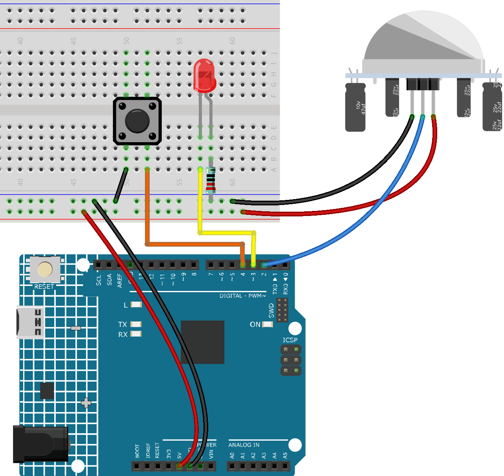

.. _stair_light:

Stair Light
==============================================================

.. note::
  
  🌟 Welcome to the SunFounder Facebook Community! Whether you're into Raspberry Pi, Arduino, or ESP32, you'll find inspiration, help ideas here.
   
  - ✅ Be the first to get free learning resources. 
   
  - ✅ Stay updated on new products & exclusive giveaways. 
   
  - ✅ Share your creations and get real feedback.
   
  * 👉 Need faster updates or support? Click [|link_sf_facebook|] join our Facebook community 

  * 👉 Or join our WhatsApp group: Click [|link_sf_whatsapp|]
   
  * 🎁 Looking for parts? Check out our all-in-one kits below — packed with components, beginner-friendly guides, and tons of fun.
  
  .. list-table::
    :widths: 20 20 20
    :header-rows: 1

    *   - Name	
        - Includes Arduino board
        - PURCHASE LINK
    *   - Electronic Kit	
        - ×
        - |link_electronic_buy|
    *   - Elite Explorer Kit	
        - Arduino Uno R4 WiFi
        - |link_elite_buy|
    *   - 3 in 1 Ultimate Starter Kit	
        - Arduino Uno R4 Minima
        - |link_arduinor4_buy|

Course Introduction
------------------------

In this lesson, you'll use a PIR motion sensor, an LED, and a button with the Arduino R4 UNO to build a smart lighting system with three operating modes.

The system can automatically turn on the LED when motion is detected, keep it always on, or keep it always off. A single button toggles between these modes, and the LED behavior updates accordingly.
.. .. raw:: html

.. <iframe width="700" height="394" src="https://www.youtube.com/embed/frHJHmXgnK4?si=iCaX_KMK4dy8d3KH" title="YouTube video player" frameborder="0" allow="accelerometer; autoplay; clipboard-write; encrypted-media; gyroscope; picture-in-picture; web-share" referrerpolicy="strict-origin-when-cross-origin" allowfullscreen></iframe>

.. note::

  If this is your first time working with an Arduino project, we recommend downloading and reviewing the basic materials first.
  
  * :ref:`install_arduino`
  * :ref:`introduce_arduino`

**Required Components**

In this project, we need the following components:

.. list-table::
    :widths: 5 20 5 20
    :header-rows: 1

    *   - SN
        - COMPONENT INTRODUCTION	
        - QUANTITY
        - PURCHASE LINK

    *   - 1
        - Arduino UNO R4 Minima
        - 1
        - |link_unor4_buy|
    *   - 2
        - USB Type-C cable
        - 1
        - 
    *   - 3
        - Breadboard
        - 1
        - |link_breadboard_buy|
    *   - 4
        - Wires
        - Several
        - |link_wires_buy|
    *   - 5
        - PIR Motion Sensor
        - 1
        - |link_pir_buy|
    *   - 6
        - Button
        - 1
        - |link_button_buy|
    *   - 7
        - LED
        - 1
        - |link_led_buy|
    *   - 8
        - 1kΩ resistor
        - 1
        - |link_resistor_buy|

**Wiring**

**Common Connections:**

* **LED**

  - Connect the LED **cathode** to  the to a **220Ω resistor**, then to negative power bus on the breadboard, **anode** to **3** on the Arduino.

* **PIR**

  - **＋:** Connect to **2** on the Arduino.
  - **－:** Connect to breadboard’s negative power bus.

* **Button**

  - Connect to the breadboard’s negative power bus, and the other end to **4** on the Arduino board.

**Writing the Code**

.. note::

    * You can copy this code into **Arduino IDE**. 
    * Don't forget to select the board(Arduino UNO R4 Minima) and the correct port before clicking the **Upload** button.

.. code-block:: arduino

    const int PIR_PIN = 2;    // PIR motion sensor signal pin
    const int LED_PIN = 3;    // LED pin
    const int BUTTON_PIN = 4; // Button pin

    int mode = 0;  // 0 = Auto, 1 = Always ON, 2 = Always OFF
    bool lastButtonState = HIGH;
    unsigned long lastMotionTime = 0;
    const unsigned long LIGHT_DELAY = 3000; // 3s delay

    void setup() {
      pinMode(PIR_PIN, INPUT);
      pinMode(LED_PIN, OUTPUT);
      pinMode(BUTTON_PIN, INPUT_PULLUP); // Internal pull-up

      digitalWrite(LED_PIN, LOW);
      Serial.begin(9600);
      Serial.println("Mode 0: Auto, Mode 1: Always ON, Mode 2: Always OFF");
    }

    void loop() {
      // ---- Button detection (toggle between modes) ----
      bool buttonState = digitalRead(BUTTON_PIN);
      if (buttonState == LOW && lastButtonState == HIGH) {
        mode = (mode + 1) % 3;  // Cycle through 0->1->2->0
        Serial.print("Mode: ");
        if (mode == 0) Serial.println("Auto");
        else if (mode == 1) Serial.println("Always ON");
        else Serial.println("Always OFF");
        delay(200); // Debounce
      }
      lastButtonState = buttonState;

      // ---- Mode control ----
      if (mode == 1) {
        // Always ON
        digitalWrite(LED_PIN, HIGH);
      } else if (mode == 2) {
        // Always OFF
        digitalWrite(LED_PIN, LOW);
      } else {
        // Auto mode (PIR control)
        int motion = digitalRead(PIR_PIN);
        if (motion == HIGH) {
          digitalWrite(LED_PIN, HIGH);
          lastMotionTime = millis(); // Record time when motion detected
        } else if (millis() - lastMotionTime > LIGHT_DELAY) {
          digitalWrite(LED_PIN, LOW);
        }
      }
    }
