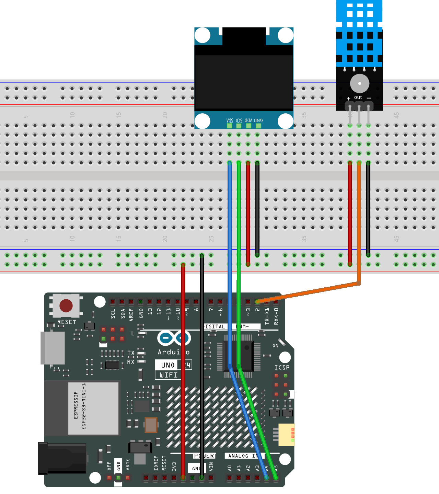

.. _temphumid_monitor:

TempHumid Monitor
==============================================================

.. note::
  
  🌟 Welcome to the SunFounder Facebook Community! Whether you're into Raspberry Pi, Arduino, or ESP32, you'll find inspiration, help ideas here.
   
  - ✅ Be the first to get free learning resources. 
   
  - ✅ Stay updated on new products & exclusive giveaways. 
   
  - ✅ Share your creations and get real feedback.
   
  * 👉 Need faster updates or support? Click [|link_sf_facebook|] join our Facebook community 

  * 👉 Or join our WhatsApp group: Click [|link_sf_whatsapp|]
   
Kit purchase
------------------------

Looking for parts? Check out our all-in-one kits below — packed with components, beginner-friendly guides, and tons of fun.

.. image:: img/ultimate_sensor_kit.png
   :width: 100%
   :align: center
   :target: https://www.sunfounder.com/collections/arduino-kits-bundles/products/sunfounder-ultimate-sensor-kit-with-original-arduino-uno-r4-minima?ref=jbzmncle

.. raw:: html

     

.. list-table::
   :widths: 20 20 20
   :header-rows: 1

   * - Name
     - Includes Arduino board
     - PURCHASE LINK
   * - Elite Explorer Kit
     - Arduino Uno R4 WiFi
     - |link_elite_buy|
   * - 3 in 1 Ultimate Starter Kit
     - Arduino Uno R4 Minima
     - |link_arduinor4_buy|

Course Introduction
------------------------

This Arduino project uses a DHT11 sensor and an OLED display to monitor and display real-time temperature and humidity. 

The data is updated every 0.5 seconds and shown clearly on a 128x64 I2C OLED screen. If sensor readings fail, an error message is displayed. 

This setup is ideal for simple environmental monitoring applications.

.. raw:: html

  <iframe width="700" height="394" src="https://www.youtube.com/embed/Mb_rX31svUU" title="YouTube video player" frameborder="0" allow="accelerometer; autoplay; clipboard-write; encrypted-media; gyroscope; picture-in-picture; web-share" referrerpolicy="strict-origin-when-cross-origin" allowfullscreen></iframe>

.. note::

  If this is your first time working with an Arduino project, we recommend downloading and reviewing the basic materials first.

  * :ref:`install_arduino`
  * :ref:`introduce_arduino`

**Required Components**

In this project, we need the following components:

.. list-table::
    :widths: 5 20 5 20
    :header-rows: 1

    *   - SN
        - COMPONENT INTRODUCTION	
        - QUANTITY
        - PURCHASE LINK

    *   - 1
        - Arduino UNO R4 WIFI
        - 1
        - |link_unor4_wifi_buy|
    *   - 2
        - USB Type-C cable
        - 1
        - 
    *   - 3
        - Breadboard
        - 1
        - |link_breadboard_buy|
    *   - 4
        - Wires
        - Several
        - |link_wires_buy|
    *   - 5
        - DHT-11 Module
        - 1
        - |link_dht11m_buy|
    *   - 6
        - OLED Display Module
        - 1
        - |link_oled_buy|

**Wiring**

**Common Connections:**

* **DHT-11 Module**

  - **OUT:** Connect to **2** on the Arduino.
  - **-:** Connect to breadboard’s negative power bus.
  - **+:** Connect to breadboard’s red power bus.

* **OLED Display Module**

  - **SDA:** Connect to **SDA** on the Arduino.
  - **SCK:** Connect to **SCL** on the Arduino.
  - **GND:** Connect to breadboard’s negative power bus.
  - **VCC:** Connect to breadboard’s red power bus.

**Writing the Code**

.. note::

    * You can copy this code into **Arduino IDE**. 
    * To install the library, use the Arduino Library Manager and search for **DHT** , **Adafruit SSD1306** and **Adafruit GFX** and install it.
    * Don't forget to select the board(Arduino UNO R4 Minima) and the correct port before clicking the **Upload** button.

.. code-block:: arduino

      #include <DHT.h>
      #include <SPI.h>
      #include <Wire.h>
      #include <Adafruit_GFX.h>
      #include <Adafruit_SSD1306.h>

      #define SCREEN_WIDTH 128  // OLED display width, in pixels
      #define SCREEN_HEIGHT 64  // OLED display height, in pixels

      // Declaration for SSD1306 display connected using I2C
      #define OLED_RESET -1  // Reset pin # (or -1 if sharing Arduino reset pin)
      #define SCREEN_ADDRESS 0x3C
      Adafruit_SSD1306 display(SCREEN_WIDTH, SCREEN_HEIGHT, &Wire, OLED_RESET);

      // DHT sensor settings
      #define DHTPIN 2      // Define the pin used to connect the sensor
      #define DHTTYPE DHT11  // Define the sensor type
      DHT dht(DHTPIN, DHTTYPE);  // Create a DHT object

      void setup() {
        // Initialize the serial communication
        Serial.begin(9600);
        Serial.println(F("DHT11 with OLED test!"));

        // Initialize the DHT sensor
        dht.begin();

        // Initialize the OLED object
        if (!display.begin(SSD1306_SWITCHCAPVCC, SCREEN_ADDRESS)) {
          Serial.println(F("SSD1306 allocation failed"));
          for (;;)
            ;
        }

        // Clear the buffer.
        display.clearDisplay();
      }

      void loop() {
        // Wait a shorter time between measurements to increase the update speed
        delay(500);  // 500 milliseconds delay for faster updates

        // Reading temperature or humidity takes about 250 milliseconds!
        float h = dht.readHumidity();
        // Read temperature as Celsius (the default)
        float t = dht.readTemperature();

        // Check if any reads failed and exit early (to try again).
        if (isnan(h) || isnan(t)) {
          Serial.println(F("Failed to read from DHT sensor!"));
          display.clearDisplay();
          display.setCursor(0, 0);
          display.setTextSize(1);
          display.setTextColor(WHITE);
          display.println("Sensor error");
          display.display();
          return;
        }

        // Clear the display before showing new data
        display.clearDisplay();

        // Display humidity label on the first line
        display.setTextSize(1);  // Smaller text size for label
        display.setTextColor(WHITE);  // Set text color
        display.setCursor(0, 0);  // Set cursor position for humidity label
        display.println("Humidity:");

        // Display humidity value on the second line
        display.setTextSize(2);  // Larger text size for value
        display.setCursor(0, 10);  // Move to next line for humidity value
        display.print(h);
        display.println("%");

        // Display temperature label on the third line
        display.setTextSize(1);  // Smaller text size for label
        display.setCursor(0, 35);  // Set cursor position for temperature label
        display.println("Temperature:");

        // Display temperature value on the fourth line
        display.setTextSize(2);  // Larger text size for value
        display.setCursor(0, 45);  // Move to next line for temperature value
        display.print(t);
        display.println("C");

        // Update the display with new information
        display.display();

        // Also print to serial monitor (for debugging)
        Serial.print(F("Humidity: "));
        Serial.print(h);
        Serial.print(F("%  Temperature: "));
        Serial.print(t);
        Serial.println(F("°C"));
      }
