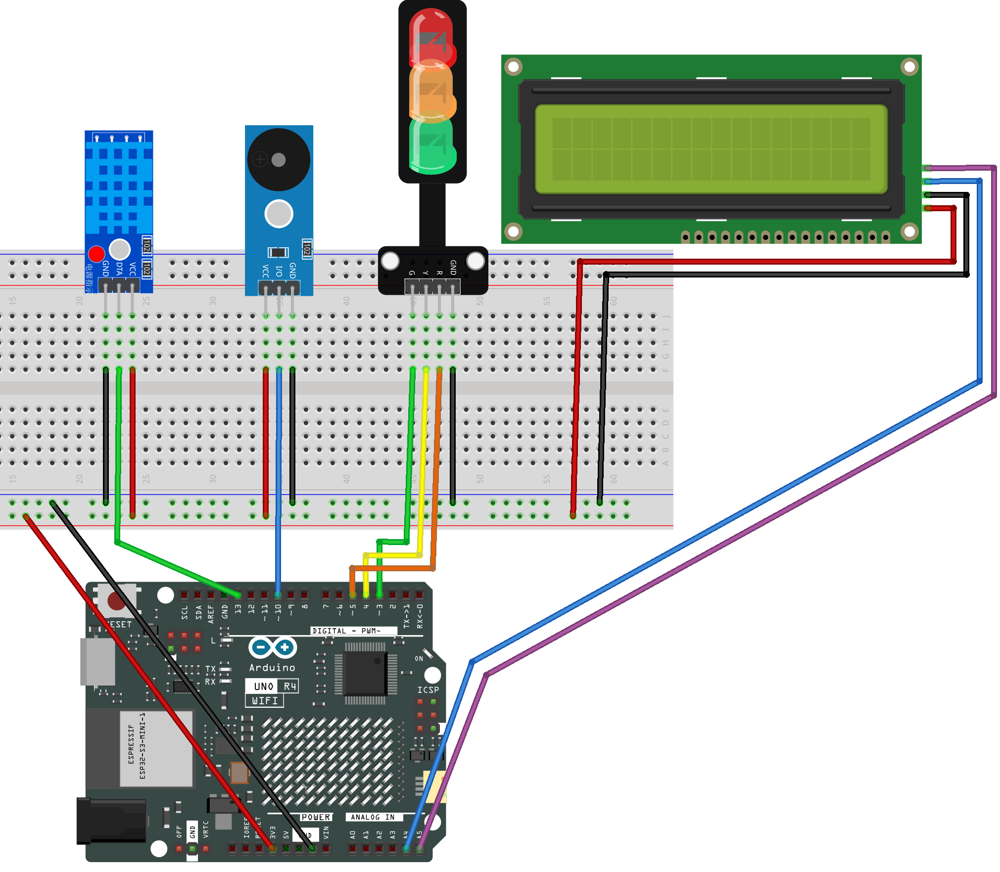

.. _temphumid_monitor2.0:

TempHumid Monitor 2.0
==============================================================

.. note::
  
  🌟 Welcome to the SunFounder Facebook Community! Whether you're into Raspberry Pi, Arduino, or ESP32, you'll find inspiration, help ideas here.
   
  - ✅ Be the first to get free learning resources. 
   
  - ✅ Stay updated on new products & exclusive giveaways. 
   
  - ✅ Share your creations and get real feedback.
   
  * 👉 Need faster updates or support? Click [|link_sf_facebook|] join our Facebook community 

  * 👉 Or join our WhatsApp group: Click [|link_sf_whatsapp|]
   
  * 🎁 Looking for parts?Check out our all-in-one kits below — packed with components, beginner-friendly guides, and tons of fun.

  .. list-table::
    :widths: 20 20 20
    :header-rows: 1

    *   - Name	
        - Includes Arduino board
        - PURCHASE LINK
    *   - Ultimate Sensor Kit	
        - Arduino Uno R4 Minima
        - |link_arduinor4_buy|
    *   - Universal Maker Sensor Kit
        - ×
        - |link_umsk_buy|

Course Introduction
------------------------

This Arduino project uses a DHT11 sensor, a 16×2 I2C LCD, LEDs, and a buzzer to monitor temperature and humidity in real time. 
It indicates comfort levels with different LED colors and buzzer patterns, switching between green, yellow, and red as temperature changes, while continuously updating readings on the display.

.. raw:: html

  <iframe width="700" height="394" src="https://www.youtube.com/embed/Uh_S9jFbujk?si=7OBC96l48jnO2fxZ" title="YouTube video player" frameborder="0" allow="accelerometer; autoplay; clipboard-write; encrypted-media; gyroscope; picture-in-picture; web-share" referrerpolicy="strict-origin-when-cross-origin" allowfullscreen></iframe>

.. note::

  If this is your first time working with an Arduino project, we recommend downloading and reviewing the basic materials first.

  * :ref:`install_arduino`
  * :ref:`introduce_arduino`

**Required Components**

In this project, we need the following components:

.. list-table::
    :widths: 5 20 5 20
    :header-rows: 1

    *   - SN
        - COMPONENT INTRODUCTION	
        - QUANTITY
        - PURCHASE LINK

    *   - 1
        - Arduino UNO R4 WIFI
        - 1
        - |link_unor4_wifi_buy|
    *   - 2
        - USB Type-C cable
        - 1
        - 
    *   - 3
        - Breadboard
        - 1
        - |link_breadboard_buy|
    *   - 4
        - Wires
        - Several
        - |link_wires_buy|
    *   - 5
        - DHT-11 Module
        - 1
        - |link_dht11m_buy|
    *   - 6
        - I2C LCD 1602
        - 1
        - |link_i2clcd1602_buy|
    *   - 7
        - Traffic Light LED
        - 1
        - |link_trafficlinght_buy|
    *   - 8
        - Buzzer Modudle
        - 1
        - |link_buzzer_module_buy|

**Wiring**

**Common Connections:**

* **DHT-11 Module**

  - **OUT:** Connect to **13** on the Arduino.
  - **-**: Connect to breadboard’s negative power bus.
  - **+:** Connect to breadboard’s red power bus.

* **I2C LCD 1602**

  - **SDA:** Connect to **A4** on the Arduino.
  - **SCL:** Connect to **A5** on the Arduino.
  - **GND:** Connect to breadboard’s negative power bus.
  - **VCC:** Connect to breadboard’s red power bus.

* **Buzzer Modudle**

  - **I/O:** Connect to **10** on the Arduino.
  - **GND:** Connect to breadboard’s negative power bus.
  - **VCC:** Connect to breadboard’s red power bus.

* **Traffic light LED**

  - **R:** Connect to **4** on the Arduino.
  - **Y:** Connect to **3** on the Arduino.
  - **G:** Connect to **2** on the Arduino.
  - **GND:** Connect to breadboard’s negative power bus.

**Writing the Code**

.. note::

    * Before you begin, you need to upload the **pitches.h** library to your Arduino. Copy the contents of the library into the Arduino IDE, save it as **pitches.h** and then upload it to your Arduino.

.. code-block:: arduino

      /*************************************************
      * Public Constants
      *************************************************/

      #define NOTE_B0  31
      #define NOTE_C1  33
      #define NOTE_CS1 35
      #define NOTE_D1  37
      #define NOTE_DS1 39
      #define NOTE_E1  41
      #define NOTE_F1  44
      #define NOTE_FS1 46
      #define NOTE_G1  49
      #define NOTE_GS1 52
      #define NOTE_A1  55
      #define NOTE_AS1 58
      #define NOTE_B1  62
      #define NOTE_C2  65
      #define NOTE_CS2 69
      #define NOTE_D2  73
      #define NOTE_DS2 78
      #define NOTE_E2  82
      #define NOTE_F2  87
      #define NOTE_FS2 93
      #define NOTE_G2  98
      #define NOTE_GS2 104
      #define NOTE_A2  110
      #define NOTE_AS2 117
      #define NOTE_B2  123
      #define NOTE_C3  131
      #define NOTE_CS3 139
      #define NOTE_D3  147
      #define NOTE_DS3 156
      #define NOTE_E3  165
      #define NOTE_F3  175
      #define NOTE_FS3 185
      #define NOTE_G3  196
      #define NOTE_GS3 208
      #define NOTE_A3  220
      #define NOTE_AS3 233
      #define NOTE_B3  247
      #define NOTE_C4  262
      #define NOTE_CS4 277
      #define NOTE_D4  294
      #define NOTE_DS4 311
      #define NOTE_E4  330
      #define NOTE_F4  349
      #define NOTE_FS4 370
      #define NOTE_G4  392
      #define NOTE_GS4 415
      #define NOTE_A4  440
      #define NOTE_AS4 466
      #define NOTE_B4  494
      #define NOTE_C5  523
      #define NOTE_CS5 554
      #define NOTE_D5  587
      #define NOTE_DS5 622
      #define NOTE_E5  659
      #define NOTE_F5  698
      #define NOTE_FS5 740
      #define NOTE_G5  784
      #define NOTE_GS5 831
      #define NOTE_A5  880
      #define NOTE_AS5 932
      #define NOTE_B5  988
      #define NOTE_C6  1047
      #define NOTE_CS6 1109
      #define NOTE_D6  1175
      #define NOTE_DS6 1245
      #define NOTE_E6  1319
      #define NOTE_F6  1397
      #define NOTE_FS6 1480
      #define NOTE_G6  1568
      #define NOTE_GS6 1661
      #define NOTE_A6  1760
      #define NOTE_AS6 1865
      #define NOTE_B6  1976
      #define NOTE_C7  2093
      #define NOTE_CS7 2217
      #define NOTE_D7  2349
      #define NOTE_DS7 2489
      #define NOTE_E7  2637
      #define NOTE_F7  2794
      #define NOTE_FS7 2960
      #define NOTE_G7  3136
      #define NOTE_GS7 3322
      #define NOTE_A7  3520
      #define NOTE_AS7 3729
      #define NOTE_B7  3951
      #define NOTE_C8  4186
      #define NOTE_CS8 4435
      #define NOTE_D8  4699
      #define NOTE_DS8 4978

.. note::

    * You can copy this code into **Arduino IDE**. 
    * To install the library, use the Arduino Library Manager and search for **DHT** , **LiquidCrystal_I2C** and **Adafruit GFX** and install it.
    * Don't forget to select the board(Arduino UNO R4 Minima) and the correct port before clicking the **Upload** button.

.. code-block:: arduino

      #include <Wire.h>
      #include <DHT.h>
      #include <LiquidCrystal_I2C.h>
      #include "pitches.h" // uses NOTE_E5 / NOTE_A5; you can replace with raw Hz if preferred

      // -------- Pins --------
      #define DHTPIN   12
      #define DHTTYPE  DHT11
      const int PIN_G   = 3;   // green LED
      const int PIN_Y   = 4;   // yellow LED
      const int PIN_R   = 5;   // red LED
      const int PIN_BUZ = 10;  // passive buzzer

      // -------- Objects (global, before setup/loop) --------
      DHT dht(DHTPIN, DHTTYPE);
      #define LCD_ADDR 0x27         // change to 0x3F if your LCD uses that address
      LiquidCrystal_I2C lcd(LCD_ADDR, 16, 2);

      // -------- Thresholds (by Temperature, Celsius) --------
      const float TEMP_GREEN_MAX = 30.0; // <30  -> GREEN
      const float TEMP_RED_MIN   = 35.0; // >=35 -> RED (else YELLOW)
      const float HYST           = 0.5;  // hysteresis band

      // -------- Timing (ms) --------
      const unsigned long READ_INTERVAL = 2000; // DHT sample
      const unsigned long LCD_INTERVAL  = 1000; // LCD refresh

      // Yellow: 1 Hz blink (0.5 s on / 0.5 s off), buzzer sync with ON phase
      const unsigned long Y_ON_MS  = 500;
      const unsigned long Y_OFF_MS = 500;

      // Red: fast blink (~4 Hz), buzzer sync with ON phase
      const unsigned long R_ON_MS  = 120;
      const unsigned long R_OFF_MS = 120;

      // -------- Tones --------
      const int NOTE_YELLOW = NOTE_E5;  // gentle hint
      const int NOTE_RED    = NOTE_A5;  // urgent

      // -------- State --------
      enum State { GREEN, YELLOW, RED };
      State stateNow = GREEN;

      unsigned long tLastRead = 0;
      unsigned long tLastLCD  = 0;

      // Yellow blink phase
      bool yOn = false;
      unsigned long yPhaseStart = 0;

      // Red blink phase
      bool rOn = false;
      unsigned long rPhaseStart = 0;

      // Latest readings
      float lastT = NAN, lastH = NAN;

      // LCD diff buffers (to avoid flicker)
      char line0_prev[17] = {0};
      char line1_prev[17] = {0};

      // ---------------- Helpers ----------------
      void setLights(bool g, bool y, bool r) {
        digitalWrite(PIN_G, g ? HIGH : LOW);
        digitalWrite(PIN_Y, y ? HIGH : LOW);
        digitalWrite(PIN_R, r ? HIGH : LOW);
      }

      void stopBuzzer() { noTone(PIN_BUZ); }

      // Decide state using temperature only (with hysteresis)
      State decideStateByTemp(float tC) {
        if (isnan(tC)) return stateNow;
        switch (stateNow) {
          case GREEN:
            if (tC >= TEMP_GREEN_MAX + HYST) return (tC >= TEMP_RED_MIN) ? RED : YELLOW;
            return GREEN;
          case YELLOW:
            if (tC >= TEMP_RED_MIN + HYST)   return RED;
            if (tC <  TEMP_GREEN_MAX - HYST) return GREEN;
            return YELLOW;
          case RED:
            if (tC <  TEMP_RED_MIN - HYST)   return (tC < TEMP_GREEN_MAX - HYST) ? GREEN : YELLOW;
            return RED;
        }
        return GREEN;
      }

      // Safe write to LCD only when content changed
      void lcdWriteIfChanged(const char* l0, const char* l1) {
        if (strncmp(l0, line0_prev, 16) != 0) {
          lcd.setCursor(0, 0); lcd.print("                ");
          lcd.setCursor(0, 0); lcd.print(l0);
          strncpy(line0_prev, l0, 16);
        }
        if (strncmp(l1, line1_prev, 16) != 0) {
          lcd.setCursor(0, 1); lcd.print("                ");
          lcd.setCursor(0, 1); lcd.print(l1);
          strncpy(line1_prev, l1, 16);
        }
      }

      void setup() {
        pinMode(PIN_G, OUTPUT);
        pinMode(PIN_Y, OUTPUT);
        pinMode(PIN_R, OUTPUT);
        pinMode(PIN_BUZ, OUTPUT);

        Serial.begin(9600);
        dht.begin();

        lcd.init(); lcd.backlight(); lcd.clear();
        lcd.setCursor(0,0); lcd.print("Comfort Monitor");
        lcd.setCursor(0,1); lcd.print("Init...");

        setLights(true, false, false); // start GREEN
        yOn = false; yPhaseStart = millis();
        rOn = false; rPhaseStart = millis();
      }

      void loop() {
        unsigned long now = millis();

        // ---- DHT periodic read ----
        if (now - tLastRead >= READ_INTERVAL) {
          tLastRead = now;
          float h  = dht.readHumidity();
          float tC = dht.readTemperature(); // Celsius

          if (!isnan(h) && !isnan(tC)) {
            lastH = h;
            lastT = tC;

            State next = decideStateByTemp(lastT);
            if (next != stateNow) {
              stateNow = next;
              // reset blink phases on state change
              yOn = false; yPhaseStart = now;
              rOn = false; rPhaseStart = now;
              stopBuzzer();
            }

            // Debug to Serial
            Serial.print(F("T=")); Serial.print(lastT,1); Serial.print(F("C  "));
            Serial.print(F("H=")); Serial.print(lastH,0); Serial.print(F("%  -> "));
            if (stateNow==GREEN) Serial.println(F("GREEN"));
            else if (stateNow==YELLOW) Serial.println(F("YELLOW"));
            else Serial.println(F("RED"));
          } else {
            Serial.println(F("DHT read failed"));
          }
        }

        // ---- Drive LEDs & buzzer (non-blocking, in sync) ----
        if (stateNow == GREEN) {
          setLights(true, false, false);
          stopBuzzer();
        }
        else if (stateNow == YELLOW) {
          // 0.5s ON / 0.5s OFF; buzzer ON during ON phase
          unsigned long phaseDur = yOn ? Y_ON_MS : Y_OFF_MS;
          if (now - yPhaseStart >= phaseDur) {
            yOn = !yOn;
            yPhaseStart = now;
            if (yOn) tone(PIN_BUZ, NOTE_YELLOW, Y_ON_MS);
            else     stopBuzzer();
          }
          setLights(false, yOn, false);
        }
        else { // RED
          // fast blink; buzzer ON during ON phase
          unsigned long phaseDur = rOn ? R_ON_MS : R_OFF_MS;
          if (now - rPhaseStart >= phaseDur) {
            rOn = !rOn;
            rPhaseStart = now;
            if (rOn) tone(PIN_BUZ, NOTE_RED, R_ON_MS);
            else     stopBuzzer();
          }
          setLights(false, false, rOn);
        }

        // ---- LCD: Row0=Humidity, Row1=Temperature (no degree symbol) ----
        if (now - tLastLCD >= LCD_INTERVAL) {
          tLastLCD = now;

          // Build "Hum: 56%" without float printf (AVR friendly)
          char l0[17]; l0[0] = 0;
          if (!isnan(lastH)) {
            int hInt = (int)(lastH + 0.5f);
            // "Hum: " + 2-3 digits + "%"
            snprintf(l0, sizeof(l0), "Hum: %d%%", hInt);
          } else {
            snprintf(l0, sizeof(l0), "Hum: --%%");
          }

          // Build "Temp: 25.4C" using dtostrf for float to string (AVR friendly)
          char tbuf[8]; // width=4, precision=1 -> e.g. "25.4"
          char l1[17]; l1[0] = 0;
          if (!isnan(lastT)) {
            dtostrf(lastT, 4, 1, tbuf); // (val, width, precision, buf)
            // ensure no leading spaces in narrow displays
            // Compose: "Temp: " + tbuf + "C"
            snprintf(l1, sizeof(l1), "Temp: %sC", tbuf);
          } else {
            snprintf(l1, sizeof(l1), "Temp: --.-C");
          }

          l0[16] = '\0'; l1[16] = '\0';
          lcdWriteIfChanged(l0, l1);
        }
      }
