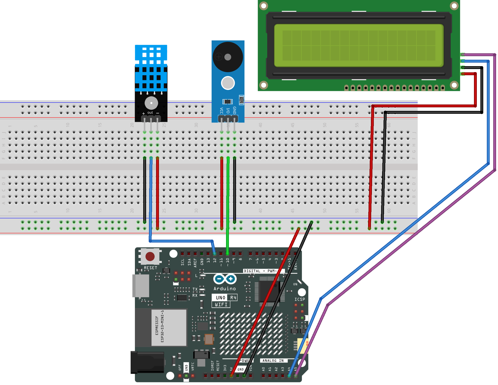

.. _temphumid_monitor3.0:

TempHumid Monitor 3.0
==============================================================

.. note::
  
  🌟 Welcome to the SunFounder Facebook Community! Whether you're into Raspberry Pi, Arduino, or ESP32, you'll find inspiration, help ideas here.
   
  - ✅ Be the first to get free learning resources. 
   
  - ✅ Stay updated on new products & exclusive giveaways. 
   
  - ✅ Share your creations and get real feedback.
   
  * 👉 Need faster updates or support? Click [|link_sf_facebook|] join our Facebook community 

  * 👉 Or join our WhatsApp group: Click [|link_sf_whatsapp|]
   
Kit purchase
------------------------

Looking for parts? Check out our all-in-one kits below — packed with components, beginner-friendly guides, and tons of fun.

.. image:: img/ultimate_sensor_kit.png
   :width: 100%
   :align: center
   :target: https://www.sunfounder.com/collections/arduino-kits-bundles/products/sunfounder-ultimate-sensor-kit-with-original-arduino-uno-r4-minima?ref=jbzmncle

.. raw:: html

     

.. list-table::
   :widths: 20 20 20
   :header-rows: 1

   * - Name
     - Includes Arduino board
     - PURCHASE LINK
   * - Elite Explorer Kit
     - Arduino Uno R4 WiFi
     - |link_elite_buy|
   * - 3 in 1 Ultimate Starter Kit
     - Arduino Uno R4 Minima
     - |link_arduinor4_buy|

Course Introduction
------------------------

This Arduino project uses a DHT11 sensor, a 16×2 I2C LCD, LEDs, and a buzzer to monitor temperature and humidity in real time. 
It indicates comfort levels with different buzzer patterns, while continuously updating readings on the display.

.. .. raw:: html

..  <iframe width="700" height="394" src="https://www.youtube.com/embed/Uh_S9jFbujk?si=7OBC96l48jnO2fxZ" title="YouTube video player" frameborder="0" allow="accelerometer; autoplay; clipboard-write; encrypted-media; gyroscope; picture-in-picture; web-share" referrerpolicy="strict-origin-when-cross-origin" allowfullscreen></iframe>

.. note::

  If this is your first time working with an Arduino project, we recommend downloading and reviewing the basic materials first.

  * :ref:`install_arduino`
  * :ref:`introduce_arduino`

**Required Components**

In this project, we need the following components:

.. list-table::
    :widths: 5 20 5 20
    :header-rows: 1

    *   - SN
        - COMPONENT INTRODUCTION	
        - QUANTITY
        - PURCHASE LINK

    *   - 1
        - Arduino UNO R4 WIFI
        - 1
        - |link_unor4_wifi_buy|
    *   - 2
        - USB Type-C cable
        - 1
        - 
    *   - 3
        - Breadboard
        - 1
        - |link_breadboard_buy|
    *   - 4
        - Wires
        - Several
        - |link_wires_buy|
    *   - 5
        - DHT-11 Module
        - 1
        - |link_dht11m_buy|
    *   - 6
        - I2C LCD 1602
        - 1
        - |link_i2clcd1602_buy|
    *   - 7
        - Buzzer Modudle
        - 1
        - |link_buzzer_module_buy|

**Wiring**

**Common Connections:**

* **DHT-11 Module**

  - **OUT:** Connect to **12** on the Arduino.
  - **-**: Connect to breadboard’s negative power bus.
  - **+:** Connect to breadboard’s red power bus.

* **I2C LCD 1602**

  - **SDA:** Connect to **A4** on the Arduino.
  - **SCL:** Connect to **A5** on the Arduino.
  - **GND:** Connect to breadboard’s negative power bus.
  - **VCC:** Connect to breadboard’s red power bus.

* **Buzzer Modudle**

  - **I/O:** Connect to **10** on the Arduino.
  - **GND:** Connect to breadboard’s negative power bus.
  - **VCC:** Connect to breadboard’s red power bus.

**Writing the Code**

.. note::

    * Before you begin, you need to upload the **pitches.h** library to your Arduino. Copy the contents of the library into the Arduino IDE, save it as **pitches.h** and then upload it to your Arduino.

.. code-block:: arduino

      /*************************************************
      * Public Constants
      *************************************************/

      #define NOTE_B0  31
      #define NOTE_C1  33
      #define NOTE_CS1 35
      #define NOTE_D1  37
      #define NOTE_DS1 39
      #define NOTE_E1  41
      #define NOTE_F1  44
      #define NOTE_FS1 46
      #define NOTE_G1  49
      #define NOTE_GS1 52
      #define NOTE_A1  55
      #define NOTE_AS1 58
      #define NOTE_B1  62
      #define NOTE_C2  65
      #define NOTE_CS2 69
      #define NOTE_D2  73
      #define NOTE_DS2 78
      #define NOTE_E2  82
      #define NOTE_F2  87
      #define NOTE_FS2 93
      #define NOTE_G2  98
      #define NOTE_GS2 104
      #define NOTE_A2  110
      #define NOTE_AS2 117
      #define NOTE_B2  123
      #define NOTE_C3  131
      #define NOTE_CS3 139
      #define NOTE_D3  147
      #define NOTE_DS3 156
      #define NOTE_E3  165
      #define NOTE_F3  175
      #define NOTE_FS3 185
      #define NOTE_G3  196
      #define NOTE_GS3 208
      #define NOTE_A3  220
      #define NOTE_AS3 233
      #define NOTE_B3  247
      #define NOTE_C4  262
      #define NOTE_CS4 277
      #define NOTE_D4  294
      #define NOTE_DS4 311
      #define NOTE_E4  330
      #define NOTE_F4  349
      #define NOTE_FS4 370
      #define NOTE_G4  392
      #define NOTE_GS4 415
      #define NOTE_A4  440
      #define NOTE_AS4 466
      #define NOTE_B4  494
      #define NOTE_C5  523
      #define NOTE_CS5 554
      #define NOTE_D5  587
      #define NOTE_DS5 622
      #define NOTE_E5  659
      #define NOTE_F5  698
      #define NOTE_FS5 740
      #define NOTE_G5  784
      #define NOTE_GS5 831
      #define NOTE_A5  880
      #define NOTE_AS5 932
      #define NOTE_B5  988
      #define NOTE_C6  1047
      #define NOTE_CS6 1109
      #define NOTE_D6  1175
      #define NOTE_DS6 1245
      #define NOTE_E6  1319
      #define NOTE_F6  1397
      #define NOTE_FS6 1480
      #define NOTE_G6  1568
      #define NOTE_GS6 1661
      #define NOTE_A6  1760
      #define NOTE_AS6 1865
      #define NOTE_B6  1976
      #define NOTE_C7  2093
      #define NOTE_CS7 2217
      #define NOTE_D7  2349
      #define NOTE_DS7 2489
      #define NOTE_E7  2637
      #define NOTE_F7  2794
      #define NOTE_FS7 2960
      #define NOTE_G7  3136
      #define NOTE_GS7 3322
      #define NOTE_A7  3520
      #define NOTE_AS7 3729
      #define NOTE_B7  3951
      #define NOTE_C8  4186
      #define NOTE_CS8 4435
      #define NOTE_D8  4699
      #define NOTE_DS8 4978

.. note::

    * You can copy this code into **Arduino IDE**. 
    * To install the library, use the Arduino Library Manager and search for **DHT** , **LiquidCrystal_I2C** and install it.
    * Don't forget to select the board(Arduino UNO R4 Minima) and the correct port before clicking the **Upload** button.

.. code-block:: arduino

      #include <Wire.h>
      #include <DHT.h>
      #include <LiquidCrystal_I2C.h>

      // DHT11 data pin and sensor type
      #define DHTPIN   12
      #define DHTTYPE  DHT11

      // Passive buzzer pin
      const int PIN_BUZ = 10;

      // Create sensor and LCD objects
      DHT dht(DHTPIN, DHTTYPE);
      #define LCD_ADDR 0x27   // Change to 0x3F if your LCD uses a different address
      LiquidCrystal_I2C lcd(LCD_ADDR, 16, 2);

      // Temperature thresholds in Celsius
      const float TEMP_WARNING_MIN = 27.0; // 27.0°C or above enters WARNING
      const float TEMP_ALERT_MIN   = 28.0; // 28.0°C or above enters ALERT

      // Update intervals
      const unsigned long READ_INTERVAL = 1000; // Read DHT every 1 second
      const unsigned long LCD_INTERVAL  = 1000; // Refresh LCD every 1 second

      // WARNING beep timing
      const unsigned long WARN_ON_MS  = 500;
      const unsigned long WARN_OFF_MS = 500;

      // ALERT beep timing
      const unsigned long ALERT_ON_MS  = 120;
      const unsigned long ALERT_OFF_MS = 120;

      // Buzzer frequencies
      const int BUZZ_WARN  = 659; // Warning sound
      const int BUZZ_ALERT = 880; // Alert sound

      // System states
      enum State { NORMAL, WARNING, ALERT };
      State stateNow = NORMAL;

      // Time markers for periodic tasks
      unsigned long tLastRead = 0;
      unsigned long tLastLCD  = 0;

      // WARNING sound control
      bool warnOn = false;
      unsigned long warnPhaseStart = 0;

      // ALERT sound control
      bool alertOn = false;
      unsigned long alertPhaseStart = 0;

      // Store the latest valid sensor readings
      float lastT = NAN, lastH = NAN;

      // Save previous LCD text to reduce unnecessary updates
      char line0_prev[17] = {0};
      char line1_prev[17] = {0};

      // Stop the buzzer
      void stopBuzzer() {
        noTone(PIN_BUZ);
      }

      // Start the correct sound as soon as the state changes
      void startBuzzerForState(unsigned long now) {
        if (stateNow == WARNING) {
          warnOn = true;
          warnPhaseStart = now;
          alertOn = false;
          tone(PIN_BUZ, BUZZ_WARN);
        }
        else if (stateNow == ALERT) {
          alertOn = true;
          alertPhaseStart = now;
          warnOn = false;
          tone(PIN_BUZ, BUZZ_ALERT);
        }
        else {
          warnOn = false;
          alertOn = false;
          stopBuzzer();
        }
      }

      // Decide the state by temperature only
      State decideStateByTemp(float tC) {
        if (isnan(tC)) return stateNow;

        if (tC >= TEMP_ALERT_MIN) {
          return ALERT;
        }
        else if (tC >= TEMP_WARNING_MIN) {
          return WARNING;
        }
        else {
          return NORMAL;
        }
      }

      // Update LCD only when the text changes
      void lcdWriteIfChanged(const char* l0, const char* l1) {
        if (strncmp(l0, line0_prev, 16) != 0) {
          lcd.setCursor(0, 0);
          lcd.print("                ");
          lcd.setCursor(0, 0);
          lcd.print(l0);
          strncpy(line0_prev, l0, 16);
          line0_prev[16] = '\0';
        }

        if (strncmp(l1, line1_prev, 16) != 0) {
          lcd.setCursor(0, 1);
          lcd.print("                ");
          lcd.setCursor(0, 1);
          lcd.print(l1);
          strncpy(line1_prev, l1, 16);
          line1_prev[16] = '\0';
        }
      }

      void setup() {
        pinMode(PIN_BUZ, OUTPUT);

        Serial.begin(9600);
        dht.begin();

        lcd.init();
        lcd.backlight();
        lcd.clear();

        lcd.setCursor(0, 0);
        lcd.print("Temp&Humidity");
        lcd.setCursor(0, 1);
        lcd.print("Starting...");

        warnOn = false;
        warnPhaseStart = millis();

        alertOn = false;
        alertPhaseStart = millis();

        stopBuzzer();
      }

      void loop() {
        unsigned long now = millis();

        // Read temperature and humidity at a fixed interval
        if (now - tLastRead >= READ_INTERVAL) {
          tLastRead = now;

          float h  = dht.readHumidity();
          float tC = dht.readTemperature();

          // Save new data only if the reading is valid
          if (!isnan(h) && !isnan(tC)) {
            lastH = h;
            lastT = tC;

            State next = decideStateByTemp(lastT);

            // If the state changes, switch to the new sound pattern
            if (next != stateNow) {
              stateNow = next;
              startBuzzerForState(now);
            }

            Serial.print(F("T="));
            Serial.print(lastT, 1);
            Serial.print(F("C  H="));
            Serial.print(lastH, 0);
            Serial.print(F("%  -> "));

            if (stateNow == NORMAL) Serial.println(F("NORMAL"));
            else if (stateNow == WARNING) Serial.println(F("WARNING"));
            else Serial.println(F("ALERT"));
          } 
          else {
            Serial.println(F("DHT read failed"));
          }
        }

        // Control buzzer timing without using delay()
        if (stateNow == NORMAL) {
          stopBuzzer();
        }
        else if (stateNow == WARNING) {
          unsigned long phaseDur = warnOn ? WARN_ON_MS : WARN_OFF_MS;

          if (now - warnPhaseStart >= phaseDur) {
            warnOn = !warnOn;
            warnPhaseStart = now;

            if (warnOn) tone(PIN_BUZ, BUZZ_WARN);
            else stopBuzzer();
          }
        }
        else {
          unsigned long phaseDur = alertOn ? ALERT_ON_MS : ALERT_OFF_MS;

          if (now - alertPhaseStart >= phaseDur) {
            alertOn = !alertOn;
            alertPhaseStart = now;

            if (alertOn) tone(PIN_BUZ, BUZZ_ALERT);
            else stopBuzzer();
          }
        }

        // Refresh the LCD at a fixed interval
        if (now - tLastLCD >= LCD_INTERVAL) {
          tLastLCD = now;

          char l0[17];
          char l1[17];
          l0[0] = '\0';
          l1[0] = '\0';

          // Show humidity on the first line
          if (!isnan(lastH)) {
            int hInt = (int)(lastH + 0.5f);
            snprintf(l0, sizeof(l0), "Hum: %d%%", hInt);
          } 
          else {
            snprintf(l0, sizeof(l0), "Hum: --%%");
          }

          // Show temperature on the second line
          if (!isnan(lastT)) {
            char tbuf[8];
            dtostrf(lastT, 4, 1, tbuf);
            snprintf(l1, sizeof(l1), "Temp: %sC", tbuf);
          } 
          else {
            snprintf(l1, sizeof(l1), "Temp: --.-C");
          }

          l0[16] = '\0';
          l1[16] = '\0';

          lcdWriteIfChanged(l0, l1);
        }
      }

