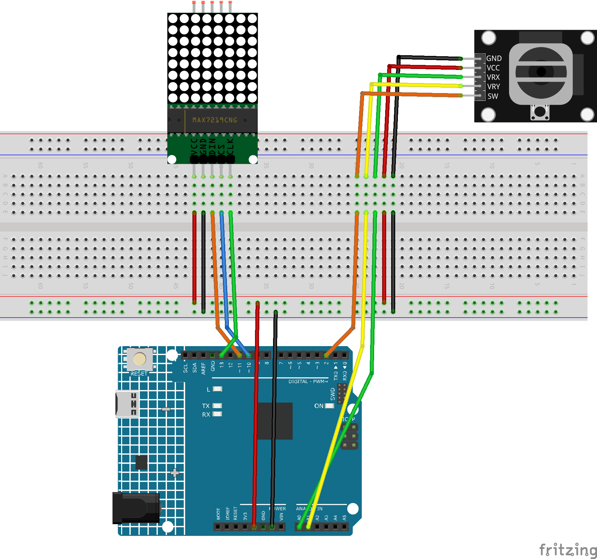

.. _Tetris1.0:

Tetris 1.0
==============================================================

.. note::
  
  🌟 Welcome to the SunFounder Facebook Community! Whether you're into Raspberry Pi, Arduino, or ESP32, you'll find inspiration, help ideas here.
   
  - ✅ Be the first to get free learning resources. 
   
  - ✅ Stay updated on new products & exclusive giveaways. 
   
  - ✅ Share your creations and get real feedback.
   
  * 👉 Need faster updates or support? Click [|link_sf_facebook|] join our Facebook community 

  * 👉 Or join our WhatsApp group: Click [|link_sf_whatsapp|]
  
  * 🎁 Looking for parts?Check out our all-in-one kits below — packed with components, beginner-friendly guides, and tons of fun.
  
  .. list-table::
    :widths: 20 20 20
    :header-rows: 1

    *   - Name	
        - Includes Arduino board
        - PURCHASE LINK
    *   - Elite Explorer Kit	
        - Arduino Uno R4 WiFi
        - |link_elite_buy|
    *   - 3 in 1 Ultimate Starter Kit
        - Arduino Uno R4 Minima
        - |link_arduinor4_buy|

Course Introduction
------------------------

In this project, we use a MAX7219 8x8 Dot Matrix module, a joystick, and an Arduino board to play a classic Tetris game.

The falling blocks are controlled using the joystick for left, right, down, and rotation.

.. raw:: html
 
 <iframe width="700" height="394" src="https://www.youtube.com/embed/_zZuwgufLBg?si=f7chyOB_esjepr0y" title="YouTube video player" frameborder="0" allow="accelerometer; autoplay; clipboard-write; encrypted-media; gyroscope; picture-in-picture; web-share" referrerpolicy="strict-origin-when-cross-origin" allowfullscreen></iframe>

.. note::

  If this is your first time working with an Arduino project, we recommend downloading and reviewing the basic materials first.
  
  * :ref:`install_arduino`
  * :ref:`introduce_arduino`

**Required Components**

In this project, we need the following components:

.. list-table::
    :widths: 5 20 5 20
    :header-rows: 1

    *   - SN
        - COMPONENT INTRODUCTION	
        - QUANTITY
        - PURCHASE LINK

    *   - 1
        - Arduino UNO R4 Minima
        - 1
        - |link_unor4_buy|
    *   - 2
        - USB Type-C cable
        - 1
        - 
    *   - 3
        - Breadboard
        - 1
        - |link_breadboard_buy|
    *   - 4
        - Wires
        - Several
        - |link_wires_buy|
    *   - 5
        - Joystick Module
        - 1
        - |link_joystick_buy|
    *   - 6
        - MAX7219 Dot Matrix Module
        - 1
        - |link_martix1_buy|

**Wiring**

**Common Connections:**

* **MAX7219 Dot Matrix Module**

  - **CLK:** Connect to **13** on the Arduino.
  - **CS:** Connect to **10** on the Arduino.
  - **DIN:** Connect to **11** on the Arduino.
  - **GND:** Connect to breadboard’s negative power bus.
  - **VCC:** Connect to breadboard’s red power bus.

* **Joystick Module**

  - **SW:** Connect to **2** on the Arduino.
  - **VRY:** Connect to **A1** on the Arduino.
  - **VRX:** Connect to **A0** on the Arduino.
  - **GND:** Connect to breadboard’s negative power bus.
  - **VCC:** Connect to breadboard’s red power bus.

**Writing the Code**

.. note::

    * You can copy this code into **Arduino IDE**. 
    * To install the library, use the Arduino Library Manager and search for **LedControl** and install it.
    * Don't forget to select the board(Arduino UNO R4 WIFI) and the correct port before clicking the **Upload** button.

.. code-block:: arduino

      // Arduino Tetris Game for 8x8 MAX7219 + Joystick
      #include <LedControl.h>

      #define DIN 11
      #define CS 10
      #define CLK 13
      LedControl lc = LedControl(DIN, CLK, CS, 1);

      #define VRx A0
      #define VRy A1
      #define SW  2

      byte field[8];  // 8 rows (height), 8 columns (width)
      int score = 0;

      struct Block {
        const int (*shape)[2];
        int len;
        int x, y;
        int rotation;
        char type;
      };

      // Block definitions with all rotations
      const int I[2][4][2] = {{{0,0},{0,1},{0,2},{0,3}}, {{-1,1},{0,1},{1,1},{2,1}}};
      const int O[1][4][2] = {{{0,0},{1,0},{0,1},{1,1}}};
      const int T[4][4][2] = {{{1,0},{0,1},{1,1},{2,1}}, {{1,0},{1,1},{1,2},{0,1}}, {{0,1},{1,1},{2,1},{1,2}}, {{1,0},{1,1},{1,2},{2,1}}};
      const int L[4][4][2] = {{{0,0},{0,1},{0,2},{1,2}}, {{0,0},{1,0},{2,0},{0,1}}, {{0,0},{1,0},{1,1},{1,2}}, {{2,0},{0,1},{1,1},{2,1}}};
      const int J[4][4][2] = {{{1,0},{1,1},{1,2},{0,2}}, {{0,0},{0,1},{1,1},{2,1}}, {{0,0},{1,0},{0,1},{0,2}}, {{0,0},{1,0},{2,0},{2,1}}};
      const int S[2][4][2] = {{{1,0},{2,0},{0,1},{1,1}}, {{1,0},{1,1},{2,1},{2,2}}};
      const int Z[2][4][2] = {{{0,0},{1,0},{1,1},{2,1}}, {{2,0},{1,1},{2,1},{1,2}}};

      Block current;
      unsigned long lastDrop = 0;
      unsigned long dropInterval = 500;
      bool gameRunning = false;

      void setup() {
        lc.shutdown(0, false);
        lc.setIntensity(0, 8);
        lc.clearDisplay(0);
        pinMode(SW, INPUT_PULLUP);
        randomSeed(analogRead(0));
      }

      void loop() {
        if (!gameRunning && digitalRead(SW) == LOW) {
          resetGame();
          spawnBlock();
          gameRunning = true;
        }

        if (gameRunning) {
          handleInput();
          if (millis() - lastDrop > dropInterval) {
            if (!moveBlock(0, 1)) {
              placeBlock();
              clearLines();
              spawnBlock();
            }
            lastDrop = millis();
          }
          draw();
        }
      }

      void resetGame() {
        for (int i = 0; i < 8; i++) field[i] = 0;
        score = 0;
      }

      void spawnBlock() {
        int r = random(7);
        switch (r) {
          case 0: current = {I[0], 4, 3, 0, 0, 'I'}; break;
          case 1: current = {O[0], 4, 3, 0, 0, 'O'}; break;
          case 2: current = {T[0], 4, 3, 0, 0, 'T'}; break;
          case 3: current = {L[0], 4, 3, 0, 0, 'L'}; break;
          case 4: current = {J[0], 4, 3, 0, 0, 'J'}; break;
          case 5: current = {S[0], 4, 3, 0, 0, 'S'}; break;
          case 6: current = {Z[0], 4, 3, 0, 0, 'Z'}; break;
        }
        if (checkCollision(current.x, current.y)) gameOver();
      }

      void handleInput() {
        int x = analogRead(VRx);
        int y = analogRead(VRy);

        if (x < 400) { 
          moveBlock(1, 0);   
          delay(150);
        }
        else if (x > 600) {
          moveBlock(-1, 0);  
          delay(150);
        }

        dropInterval = 700 - constrain(map(y, 512, 1023, 0, 600), 0, 600);

        if (digitalRead(SW) == LOW) {
          rotateBlock();
          delay(200);
        }
      }

      bool moveBlock(int dx, int dy) {
        if (!checkCollision(current.x + dx, current.y + dy)) {
          current.x += dx;
          current.y += dy;
          return true;
        }
        return false;
      }

      bool checkCollision(int x, int y) {
        for (int i = 0; i < current.len; i++) {
          int px = x + current.shape[i][0];
          int py = y + current.shape[i][1];
          if (px < 0 || px >= 8 || py < 0 || py >= 8) return true;
          if (field[py] & (1 << px)) return true;
        }
        return false;
      }

      void placeBlock() {
        for (int i = 0; i < current.len; i++) {
          int px = current.x + current.shape[i][0];
          int py = current.y + current.shape[i][1];
          if (px >= 0 && px < 8 && py >= 0 && py < 8)
            field[py] |= (1 << px);
        }
      }

      void clearLines() {
        for (int y = 0; y < 8; y++) {
          if (field[y] == 0xFF) {
            for (int j = y; j > 0; j--) field[j] = field[j - 1];
            field[0] = 0;
            score += 10;
          }
        }
      }

      void gameOver() {
        for (int i = 0; i < 6; i++) {
          for (int y = 0; y < 8; y++) {
            for (int x = 0; x < 8; x++) {
              bool ledOn = (i % 2 == 0) && (field[y] & (1 << x));
              lc.setLed(0, y, x, ledOn);
            }
          }
          delay(300);
        }
        gameRunning = false;
      }

      void draw() {
        for (int y = 0; y < 8; y++) {
          byte row = field[y];
          for (int i = 0; i < current.len; i++) {
            int px = current.x + current.shape[i][0];
            int py = current.y + current.shape[i][1];
            if (py == y && px >= 0 && px < 8)
              row |= (1 << px);
          }
          lc.setRow(0, y, row);
        }
      }

      void rotateBlock() {
        int nextRot = current.rotation + 1;
        int maxRot = 1;
        const int (*nextShape)[2];

        switch (current.type) {
          case 'I': maxRot = 2; nextShape = I[nextRot % maxRot]; break;
          case 'O': return;
          case 'T': maxRot = 4; nextShape = T[nextRot % maxRot]; break;
          case 'L': maxRot = 4; nextShape = L[nextRot % maxRot]; break;
          case 'J': maxRot = 4; nextShape = J[nextRot % maxRot]; break;
          case 'S': maxRot = 2; nextShape = S[nextRot % maxRot]; break;
          case 'Z': maxRot = 2; nextShape = Z[nextRot % maxRot]; break;
          default: return;
        }

        const int (*oldShape)[2] = current.shape;
        int oldRot = current.rotation;
        current.shape = nextShape;
        current.rotation = nextRot % maxRot;

        if (checkCollision(current.x, current.y)) {
          current.shape = oldShape;
          current.rotation = oldRot;
        }
      }
