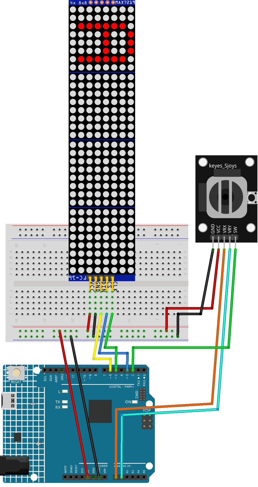

.. _Tetris2.0:

Tetris 2.0
==============================================================

.. note::
  
  🌟 Welcome to the SunFounder Facebook Community! Whether you're into Raspberry Pi, Arduino, or ESP32, you'll find inspiration, help ideas here.
   
  - ✅ Be the first to get free learning resources. 
   
  - ✅ Stay updated on new products & exclusive giveaways. 
   
  - ✅ Share your creations and get real feedback.
   
  * 👉 Need faster updates or support? Click [|link_sf_facebook|] join our Facebook community 

  * 👉 Or join our WhatsApp group: Click [|link_sf_whatsapp|]
  
  * 🎁 Looking for parts?Check out our all-in-one kits below — packed with components, beginner-friendly guides, and tons of fun.
  
  .. list-table::
    :widths: 20 20 20
    :header-rows: 1

    *   - Name	
        - Includes Arduino board
        - PURCHASE LINK
    *   - Elite Explorer Kit	
        - Arduino Uno R4 WiFi
        - |link_elite_buy|
    *   - 3 in 1 Ultimate Starter Kit
        - Arduino Uno R4 Minima
        - |link_arduinor4_buy|

Course Introduction
------------------------

In this project, we use a MAX7219 32x8 Dot Matrix module, a joystick, and an Arduino board to play a classic Tetris game.

The falling blocks are controlled using the joystick for left, right, down, and rotation.

.. .. raw:: html
 
.. <iframe width="700" height="394" src="https://www.youtube.com/embed/_zZuwgufLBg?si=f7chyOB_esjepr0y" title="YouTube video player" frameborder="0" allow="accelerometer; autoplay; clipboard-write; encrypted-media; gyroscope; picture-in-picture; web-share" referrerpolicy="strict-origin-when-cross-origin" allowfullscreen></iframe>

.. note::

  If this is your first time working with an Arduino project, we recommend downloading and reviewing the basic materials first.
  
  * :ref:`install_arduino`
  * :ref:`introduce_arduino`

**Required Components**

In this project, we need the following components:

.. list-table::
    :widths: 5 20 5 20
    :header-rows: 1

    *   - SN
        - COMPONENT INTRODUCTION	
        - QUANTITY
        - PURCHASE LINK

    *   - 1
        - Arduino UNO R4 Minima
        - 1
        - |link_unor4_buy|
    *   - 2
        - USB Type-C cable
        - 1
        - 
    *   - 3
        - Breadboard
        - 1
        - |link_breadboard_buy|
    *   - 4
        - Wires
        - Several
        - |link_wires_buy|
    *   - 5
        - Joystick Module
        - 1
        - |link_joystick_buy|
    *   - 6
        - MAX7219 Dot Matrix Module
        - 1
        - |link_martix1_buy|

**Wiring**

**Common Connections:**

* **MAX7219 Dot Matrix Module**

  - **CLK:** Connect to **5** on the Arduino.
  - **CS:** Connect to **3** on the Arduino.
  - **DIN:** Connect to **6** on the Arduino.
  - **GND:** Connect to breadboard’s negative power bus.
  - **VCC:** Connect to breadboard’s red power bus.

* **Joystick Module**

  - **SW:** Connect to **2** on the Arduino.
  - **VRY:** Connect to **A1** on the Arduino.
  - **VRX:** Connect to **A0** on the Arduino.
  - **GND:** Connect to breadboard’s negative power bus.
  - **VCC:** Connect to breadboard’s red power bus.

**Writing the Code**

.. note::

    * You can copy this code into **Arduino IDE**. 
    * To install the library, use the Arduino Library Manager and search for **LedControl** and install it.
    * Don't forget to select the board(Arduino UNO R4 WIFI) and the correct port before clicking the **Upload** button.

.. code-block:: arduino

      #include <LedControl.h>  // Library for driving MAX7219 LED matrices

      // MAX7219 wiring pins
      #define DIN_PIN     6    // Data input
      #define CLK_PIN     5    // Clock pin
      #define CS_PIN      3    // Chip select
      #define NUM_MODULES 4    // Number of 8×8 modules in cascade

      LedControl lc(DIN_PIN, CLK_PIN, CS_PIN, NUM_MODULES);

      // Joystick and button pins
      #define VRx A0  // Joystick X-axis (left/right)
      #define VRy A1  // Joystick Y-axis (up/down)
      #define SW  2   // Push-button switch for rotation

      // Display dimensions
      const int SCREEN_W = 8;                     // Width of one module
      const int SCREEN_H = SCREEN_W * NUM_MODULES; // Total height (32 rows)

      // Playfield buffer: each byte is one row of 8 bits
      uint8_t field[SCREEN_H];

      // Timing control
      unsigned long lastDrop     = 0;    // Time of last automatic drop
      unsigned long dropInterval = 500;  // Drop interval in ms (adjusted by joystick)
      unsigned long lastMove     = 0;    // Time of last horizontal move
      const unsigned long moveInterval    = 200; // Min ms between moves
      const unsigned long refreshInterval = 33;  // ~30 FPS
      unsigned long lastRefresh  = 0;    // Time of last screen refresh

      // Buffer to track previous frame for diff updates
      uint8_t prevBuf[NUM_MODULES][SCREEN_W];

      // Structure for current falling block
      struct Block {
        const int (*shape)[2];  // Pointer to array of {x,y} offsets
        int len;                // Number of cells (always 4)
        int x, y;               // Top-left origin position
        int rotation;           // Rotation index
        char type;              // Block type identifier
      } current;

      // Definitions of the seven Tetris shapes and their rotations
      const int I_SHAPE[2][4][2] = {
        {{0,0},{0,1},{0,2},{0,3}},   // Vertical
        {{-1,1},{0,1},{1,1},{2,1}}   // Horizontal
      };
      const int O_SHAPE[1][4][2] = {
        {{0,0},{1,0},{0,1},{1,1}}    // Square (no rotation)
      };
      const int T_SHAPE[4][4][2] = {
        {{1,0},{0,1},{1,1},{2,1}},
        {{1,0},{1,1},{1,2},{0,1}},
        {{0,1},{1,1},{2,1},{1,2}},
        {{1,0},{1,1},{1,2},{2,1}}
      };
      const int L_SHAPE[4][4][2] = {
        {{0,0},{0,1},{0,2},{1,2}},
        {{0,0},{1,0},{2,0},{0,1}},
        {{0,0},{1,0},{1,1},{1,2}},
        {{2,0},{0,1},{1,1},{2,1}}
      };
      const int J_SHAPE[4][4][2] = {
        {{1,0},{1,1},{1,2},{0,2}},
        {{0,0},{0,1},{1,1},{2,1}},
        {{0,0},{1,0},{0,1},{0,2}},
        {{0,0},{1,0},{2,0},{2,1}}
      };
      const int S_SHAPE[2][4][2] = {
        {{1,0},{2,0},{0,1},{1,1}},
        {{1,0},{1,1},{2,1},{2,2}}
      };
      const int Z_SHAPE[2][4][2] = {
        {{0,0},{1,0},{1,1},{2,1}},
        {{2,0},{1,1},{2,1},{1,2}}
      };

      // 8×8 bitmaps for letters in the Game Over screen
      static const uint8_t PAT_G[8] = {0x3C,0x42,0x40,0x4E,0x42,0x42,0x3C,0x00};
      static const uint8_t PAT_A[8] = {0x18,0x24,0x42,0x7E,0x42,0x42,0x42,0x00};
      static const uint8_t PAT_M[8] = {0x42,0x66,0x5A,0x5A,0x42,0x42,0x42,0x00};
      static const uint8_t PAT_E[8] = {0x7E,0x40,0x5C,0x40,0x40,0x40,0x7E,0x00};
      static const uint8_t PAT_O[8] = {0x3C,0x42,0x42,0x42,0x42,0x42,0x3C,0x00};
      static const uint8_t PAT_V[8] = {0x42,0x42,0x42,0x42,0x42,0x24,0x18,0x00};
      static const uint8_t PAT_R[8] = {0x7C,0x42,0x42,0x7C,0x48,0x44,0x42,0x00};

      // Clear all LEDs on every module
      void clearAll() {
        for (int m = 0; m < NUM_MODULES; m++) {
          lc.clearDisplay(m);
        }
      }

      // Read and debounce the push-button switch
      bool readButton() {
        if (digitalRead(SW) == LOW) {
          delay(20);
          if (digitalRead(SW) == LOW) {
            while (digitalRead(SW) == LOW); // Wait for release
            return true;
          }
        }
        return false;
      }

      // Return the bitmap for a given character
      const uint8_t* letterPattern(char c) {
        switch (c) {
          case 'G': return PAT_G;
          case 'A': return PAT_A;
          case 'M': return PAT_M;
          case 'E': return PAT_E;
          case 'O': return PAT_O;
          case 'V': return PAT_V;
          case 'R': return PAT_R;
          default:  return PAT_E;
        }
      }

      // Game Over animation: flash, display "GAME", wait 1s, then display "OVER"
      void gameOverSequence() {
        // 1) Flash all LEDs three times
        for (int i = 0; i < 3; i++) {
          clearAll();
          delay(500);
          for (int m = 0; m < NUM_MODULES; m++)
            for (int r = 0; r < SCREEN_W; r++)
              lc.setRow(m, r, 0xFF);
          delay(500);
        }

        // 2) Display "GAME" rotated 90° CW
        const char* w1 = "GAME";
        for (int seg = 0; seg < 4; seg++) {
          const uint8_t* pat = letterPattern(w1[seg]);
          uint8_t rot[8] = {};
          // Rotate 90° CW: (x,y) → (7-y, x)
          for (int y = 0; y < 8; y++) {
            for (int x = 0; x < 8; x++) {
              if (pat[y] & (1 << x)) {
                int nx = 7 - y;  
                int ny = x;      
                rot[ny] |= (1 << nx);
              }
            }
          }
          int module = NUM_MODULES - 1 - seg;
          for (int row = 0; row < 8; row++) {
            lc.setRow(module, row, rot[row]);
          }
        }
        delay(1000);  // Wait 1 second before showing OVER

        // 3) Display "OVER" rotated 90° CW
        const char* w2 = "OVER";
        for (int seg = 0; seg < 4; seg++) {
          const uint8_t* pat = letterPattern(w2[seg]);
          uint8_t rot[8] = {};
          for (int y = 0; y < 8; y++) {
            for (int x = 0; x < 8; x++) {
              if (pat[y] & (1 << x)) {
                int nx = 7 - y;
                int ny = x;
                rot[ny] |= (1 << nx);
              }
            }
          }
          int module = NUM_MODULES - 1 - seg;
          for (int row = 0; row < 8; row++) {
            lc.setRow(module, row, rot[row]);
          }
        }
        delay(1000);  // Hold OVER for 1 second

        // 4) Wait for button press to restart
        while (digitalRead(SW) != LOW) delay(10);
        while (digitalRead(SW) == LOW) delay(10);
      }

      // Spawn a new random Tetris block at the top center
      void spawnBlock() {
        int r = random(7);
        int sx = SCREEN_W / 2 - 2;  // Center X
        current.rotation = 0;
        switch (r) {
          case 0: current = {I_SHAPE[0],4,sx,0,0,'I'}; break;
          case 1: current = {O_SHAPE[0],4,sx,0,0,'O'}; break;
          case 2: current = {T_SHAPE[0],4,sx,0,0,'T'}; break;
          case 3: current = {L_SHAPE[0],4,sx,0,0,'L'}; break;
          case 4: current = {J_SHAPE[0],4,sx,0,0,'J'}; break;
          case 5: current = {S_SHAPE[0],4,sx,0,0,'S'}; break;
          case 6: current = {Z_SHAPE[0],4,sx,0,0,'Z'}; break;
        }
      }

      // Reset game state: clear playfield and display
      void resetGame() {
        memset(field, 0, sizeof(field));
        clearAll();
        for (int m = 0; m < NUM_MODULES; m++)
          for (int r = 0; r < SCREEN_W; r++)
            prevBuf[m][r] = 0;
        spawnBlock();
        lastDrop    = millis();
        lastRefresh = millis();
      }

      // Draw playfield and current block with diff updates
      void writeBuffer() {
        uint8_t buf[NUM_MODULES][SCREEN_W] = {};

        // Draw fixed blocks
        for (int y = 0; y < SCREEN_H; y++) {
          uint8_t row = field[y];
          if (!row) continue;
          int mod = NUM_MODULES - 1 - (y / SCREEN_W);
          int bit = 1 << (7 - (y % SCREEN_W));
          for (int x = 0; x < SCREEN_W; x++) {
            if (row & (1 << x)) buf[mod][x] |= bit;
          }
        }

        // Draw current falling block
        for (int i = 0; i < current.len; i++) {
          int xx = current.x + current.shape[i][0];
          int yy = current.y + current.shape[i][1];
          if (xx < 0 || xx >= SCREEN_W || yy < 0 || yy >= SCREEN_H) continue;
          int mod = NUM_MODULES - 1 - (yy / SCREEN_W);
          int bit = 1 << (7 - (yy % SCREEN_W));
          buf[mod][xx] |= bit;
        }

        // Update only changed rows
        for (int m = 0; m < NUM_MODULES; m++) {
          for (int r = 0; r < SCREEN_W; r++) {
            if (buf[m][r] != prevBuf[m][r]) {
              lc.setRow(m, r, buf[m][r]);
              prevBuf[m][r] = buf[m][r];
            }
          }
        }
      }

      // Check for collision at position (nx, ny)
      bool checkCollision(int nx, int ny) {
        for (int i = 0; i < current.len; i++) {
          int xx = nx + current.shape[i][0];
          int yy = ny + current.shape[i][1];
          if (xx < 0 || xx >= SCREEN_W || yy >= SCREEN_H) return true;
          if (yy >= 0 && (field[yy] & (1 << xx))) return true;
        }
        return false;
      }

      // Fix current block into field and clear full lines
      void placeBlock() {
        for (int i = 0; i < current.len; i++) {
          int xx = current.x + current.shape[i][0];
          int yy = current.y + current.shape[i][1];
          if (yy >= 0 && yy < SCREEN_H) field[yy] |= (1 << xx);
        }
        // Clear any full rows
        for (int y = 0; y < SCREEN_H; y++) {
          if (field[y] == 0xFF) {
            for (int j = y; j > 0; j--) field[j] = field[j - 1];
            field[0] = 0;
          }
        }
      }

      // Rotate block with rollback on collision
      void rotateBlock() {
        int limit = (current.type=='I'||current.type=='S'||current.type=='Z') ? 2
                  : (current.type=='O' ? 1 : 4);
        int nr = (current.rotation + 1) % limit;
        const int (*ns)[2] = nullptr;
        if      (current.type=='I') ns = I_SHAPE[nr];
        else if (current.type=='O') ns = O_SHAPE[0];
        else if (current.type=='T') ns = T_SHAPE[nr];
        else if (current.type=='L') ns = L_SHAPE[nr];
        else if (current.type=='J') ns = J_SHAPE[nr];
        else if (current.type=='S') ns = S_SHAPE[nr];
        else if (current.type=='Z') ns = Z_SHAPE[nr];

        Block bak = current;
        current.shape    = ns;
        current.rotation = nr;
        if (checkCollision(current.x, current.y)) current = bak;
      }

      void setup() {
        pinMode(SW, INPUT_PULLUP);     // Button input with pull-up
        randomSeed(analogRead(0));     // Seed RNG
        for (int m = 0; m < NUM_MODULES; m++) {
          lc.shutdown(m, false);
          lc.setIntensity(m, 8);
          lc.clearDisplay(m);
          for (int r = 0; r < SCREEN_W; r++) prevBuf[m][r] = 0;
        }
        resetGame();  // Start the game
      }

      void loop() {
        unsigned long now = millis();

        // Horizontal movement via joystick X-axis
        int ax = analogRead(VRx);
        if (now - lastMove > moveInterval) {
          if (ax < 400 && !checkCollision(current.x + 1, current.y)) {
            current.x++; lastMove = now;
          } else if (ax > 600 && !checkCollision(current.x - 1, current.y)) {
            current.x--; lastMove = now;
          }
        }

        // Rotate on button press
        if (readButton()) rotateBlock();

        // Adjust drop speed via joystick Y-axis (down = faster)
        int ay = analogRead(VRy);
        dropInterval = 700 - constrain(map(ay,512,1023,0,690),0,690);

        // Automatic drop & top-hit detection
        if (now - lastDrop > dropInterval) {
          lastDrop = now;
          if (!checkCollision(current.x, current.y + 1)) {
            current.y++;
          } else {
            // Check for game over (block at top)
            bool hitTop = false;
            for (int i = 0; i < current.len; i++) {
              if (current.y + current.shape[i][1] == 0) {
                hitTop = true; break;
              }
            }
            if (hitTop) {
              gameOverSequence();
              resetGame();
              return;
            } else {
              placeBlock();
              spawnBlock();
            }
          }
        }

        // Refresh display at ~30 FPS
        if (now - lastRefresh >= refreshInterval) {
          writeBuffer();
          lastRefresh = now;
        }
      }
