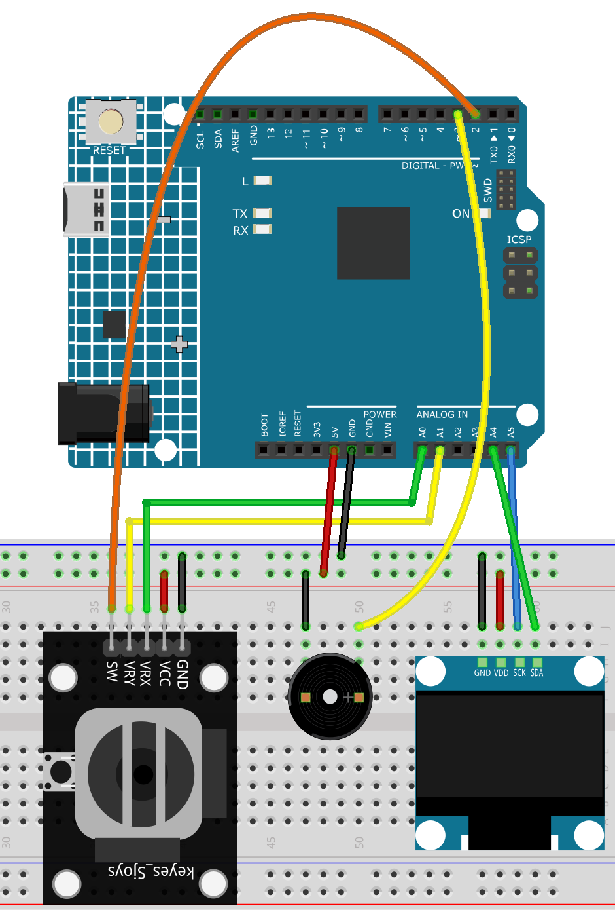

.. _tetris3.0:

Tetris3.0
==============================================================

.. note::
  
  🌟 Welcome to the SunFounder Facebook Community! Whether you're into Raspberry Pi, Arduino, or ESP32, you'll find inspiration, help ideas here.
   
  - ✅ Be the first to get free learning resources. 
   
  - ✅ Stay updated on new products & exclusive giveaways. 
   
  - ✅ Share your creations and get real feedback.
   
  * 👉 Need faster updates or support? Click [|link_sf_facebook|] join our Facebook community 

  * 👉 Or join our WhatsApp group: Click [|link_sf_whatsapp|]
   
  * 🎁 Looking for parts?Check out our all-in-one kits below — packed with components, beginner-friendly guides, and tons of fun.
  
  .. list-table::
    :widths: 20 20 20
    :header-rows: 1

    *   - Name	
        - Includes Arduino board
        - PURCHASE LINK
    *   - Elite Explorer Kit	
        - Arduino Uno R4 WiFi
        - |link_elite_buy|
    *   - Ultimate Sensor Kit	
        - Arduino Uno R4 Minima
        - |link_arduinor4_buy|
    *   - Universal Maker Sensor Kit
        - ×
        - |link_umsk_buy|

Course Introduction
------------------------

This Arduino project uses an OLED display, joystick, and buzzer to play a classic Tetris game with sound effects and joystick-controlled moves.

.. raw:: html

  <iframe width="700" height="394" src="https://www.youtube.com/embed/QOI2zGu3rg0" title="YouTube video player" frameborder="0" allow="accelerometer; autoplay; clipboard-write; encrypted-media; gyroscope; picture-in-picture; web-share" referrerpolicy="strict-origin-when-cross-origin" allowfullscreen></iframe>

.. note::

  If this is your first time working with an Arduino project, we recommend downloading and reviewing the basic materials first.

  * :ref:`install_arduino`
  * :ref:`introduce_arduino`

**Required Components**

In this project, we need the following components:

.. list-table::
    :widths: 5 20 5 20
    :header-rows: 1

    *   - SN
        - COMPONENT INTRODUCTION	
        - QUANTITY
        - PURCHASE LINK

    *   - 1
        - Arduino UNO R4 WIFI
        - 1
        - |link_unor4_wifi_buy|
    *   - 2
        - USB Type-C cable
        - 1
        - 
    *   - 3
        - Breadboard
        - 1
        - |link_breadboard_buy|
    *   - 4
        - Wires
        - Several
        - |link_wires_buy|
    *   - 5
        - Joystick Module
        - 1
        - |link_joystick_buy|
    *   - 6
        - OLED Display Module
        - 1
        - |link_oled_buy|
    *   - 7
        - Passive Buzzer
        - 1
        - |link_passive_buzzer_buy|

**Wiring**

**Common Connections:**

* **OLED Display Module**

  - **SDA:** Connect to **A4** on the Arduino.
  - **SCK:** Connect to **A5** on the Arduino.
  - **GND:** Connect to breadboard’s negative power bus.
  - **VCC:** Connect to breadboard’s red power bus.

* **Joystick Module**

  - **VRY:** Connect to **A1** on the Arduino.
  - **VRX:** Connect to **A0** on the Arduino.
  - **SW:** Connect to **2** on the Arduino.
  - **GND:** Connect to breadboard’s negative power bus.
  - **VCC:** Connect to breadboard’s red power bus.

* **Passive Buzzer**

  - **＋:** Connect to **3** on the Arduino.
  - **－:** Connect to breadboard’s negative power bus.

**Writing the Code**

.. note::

    * You can copy this code into **Arduino IDE**. 
    * To install the library, use the Arduino Library Manager and search for **Adafruit_GFX** and **Adafruit SSD1306** and install it.
    * Don't forget to select the board(Arduino UNO R4 Minima) and the correct port before clicking the **Upload** button.

.. code-block:: arduino

      #include <Wire.h>
      #include <Adafruit_GFX.h>
      #include <Adafruit_SSD1306.h>

      #define SCREEN_WIDTH 128
      #define SCREEN_HEIGHT 64
      #define SPEAKER_PIN 3
      #define JOY_X A0
      #define JOY_Y A1
      #define JOY_SW 2

      Adafruit_SSD1306 display(SCREEN_WIDTH, SCREEN_HEIGHT, &Wire, -1);

      // ==== Game parameters ====
      const int SIZE = 8;          
      const int WIDTH = SCREEN_WIDTH / SIZE;   
      const int HEIGHT = SCREEN_HEIGHT / SIZE; 
      const int OFFSET_X = 0;
      const int OFFSET_Y = 0;
      const int TYPES = 7;

      bool grid[WIDTH][HEIGHT];
      short piece[2][4];
      short pieceX, pieceY;
      int currentType, nextType;
      int rotation = 0;
      unsigned long timer;
      int interval = 1200;      
      long score = 0;

      bool gameRunning = false;
      bool gameOver = false;

      // Joystick center calibration and dead zone
      int centerX = 512;
      int centerY = 512;
      const int DEADZONE = 100;

      // Seven Tetris shapes
      const short pieces[7][4][2][4] = {
        {{{0,1,2,3},{0,0,0,0}},{{0,0,0,0},{0,1,2,3}},{{0,1,2,3},{1,1,1,1}},{{1,1,1,1},{0,1,2,3}}},
        {{{0,0,1,2},{0,1,1,1}},{{1,2,1,1},{0,0,1,2}},{{0,1,2,2},{1,1,1,0}},{{1,1,0,1},{0,1,2,0}}},
        {{{2,0,1,2},{0,1,1,1}},{{0,1,1,1},{0,0,1,2}},{{0,1,2,0},{1,1,1,2}},{{1,1,1,2},{0,1,2,2}}},
        {{{0,1,0,1},{0,0,1,1}},{{0,1,0,1},{0,0,1,1}},{{0,1,0,1},{0,0,1,1}},{{0,1,0,1},{0,0,1,1}}},
        {{{1,2,0,1},{0,0,1,1}},{{0,0,1,1},{0,1,1,2}},{{1,2,0,1},{1,1,2,2}},{{1,1,0,0},{0,1,1,2}}},
        {{{1,0,1,2},{0,1,1,1}},{{0,1,1,1},{0,0,1,2}},{{0,1,2,1},{1,1,1,2}},{{1,1,1,0},{0,1,2,1}}},
        {{{0,1,1,2},{0,0,1,1}},{{1,1,0,0},{0,1,1,2}},{{0,1,1,2},{1,1,2,2}},{{2,2,1,1},{0,1,1,2}}}
      };

      void setup() {
        pinMode(SPEAKER_PIN, OUTPUT);
        pinMode(JOY_SW, INPUT_PULLUP);
        Serial.begin(9600);

        if (!display.begin(SSD1306_SWITCHCAPVCC, 0x3C)) for (;;);

        display.clearDisplay();
        display.setTextSize(1);
        display.setTextColor(SSD1306_WHITE);
        display.setCursor(30, 30);
        display.println("Tetris 3.0");
        display.display();

        delay(500);
        centerX = analogRead(JOY_X);
        centerY = analogRead(JOY_Y);
      }

      void loop() {
        bool buttonPressed = !digitalRead(JOY_SW);

        if (!gameRunning) {
          if (buttonPressed) {
            delay(200);
            startGame();
          }
          return;
        }

        if (millis() - timer > interval) {
          if (nextCollision()) {
            lockPiece();
            checkLines();
            generate();
            if (nextCollision()) {
              gameOver = true;
              gameRunning = false;
              showGameOver();
              return;
            }
          } else {
            pieceY++;
          }
          timer = millis();
        }

        joystickControl();
        refresh();
      }

      void startGame() {
        for (int x = 0; x < WIDTH; x++)
          for (int y = 0; y < HEIGHT; y++)
            grid[x][y] = false;
        score = 0;
        interval = 1200;
        gameOver = false;
        nextType = random(TYPES);
        generate();
        timer = millis();
        gameRunning = true;
      }

      void showGameOver() {
        display.clearDisplay();
        display.setTextSize(1);
        display.setCursor(20, 20);
        display.println("GAME OVER");
        display.setCursor(20, 40);
        display.print("Score: ");
        display.print(score);
        display.display();
        tone(SPEAKER_PIN, 500, 300);
      }

      void joystickControl() {
        int xVal = analogRead(JOY_X);
        int yVal = analogRead(JOY_Y);
        bool swPressed = !digitalRead(JOY_SW);

        static bool swLast = false;
        static unsigned long lastMove = 0;

        if (millis() - lastMove > 150) {
          if (xVal < centerX - DEADZONE && !nextHorizontalCollision(-1)) {
            pieceX--;
            tone(SPEAKER_PIN, 800, 30);
            lastMove = millis();
          } else if (xVal > centerX + DEADZONE && !nextHorizontalCollision(1)) {
            pieceX++;
            tone(SPEAKER_PIN, 1000, 30);
            lastMove = millis();
          }

          // Accelerate downward when joystick moves down
          if (yVal > centerY + DEADZONE) {
            interval = 200;  // fast drop when joystick down
          } else {
            interval = 1200; // normal speed
          }
        }

        if (swPressed && !swLast) {
          rotatePiece();
          tone(SPEAKER_PIN, 1200, 50);
        }
        swLast = swPressed;
      }

      void generate() {
        currentType = nextType;
        nextType = random(TYPES);
        rotation = 0;
        pieceX = WIDTH / 2 - 2;
        pieceY = 0;
        copyPiece(rotation);
      }

      void copyPiece(int rot) {
        for (int i = 0; i < 4; i++) {
          piece[0][i] = pieces[currentType][rot][0][i];
          piece[1][i] = pieces[currentType][rot][1][i];
        }
      }

      bool nextCollision() {
        for (int i = 0; i < 4; i++) {
          int x = pieceX + piece[0][i];
          int y = pieceY + piece[1][i] + 1;
          if (y >= HEIGHT || grid[x][y]) return true;
        }
        return false;
      }

      bool nextHorizontalCollision(int dir) {
        for (int i = 0; i < 4; i++) {
          int x = pieceX + piece[0][i] + dir;
          int y = pieceY + piece[1][i];
          if (x < 0 || x >= WIDTH || grid[x][y]) return true;
        }
        return false;
      }

      void rotatePiece() {
        int newRotation = (rotation + 1) % 4;
        short temp[2][4];
        for (int i = 0; i < 4; i++) {
          temp[0][i] = pieces[currentType][newRotation][0][i];
          temp[1][i] = pieces[currentType][newRotation][1][i];
        }
        for (int i = 0; i < 4; i++) {
          int x = pieceX + temp[0][i];
          int y = pieceY + temp[1][i];
          if (x < 0 || x >= WIDTH || y < 0 || y >= HEIGHT || grid[x][y]) return;
        }
        rotation = newRotation;
        copyPiece(rotation);
      }

      void lockPiece() {
        for (int i = 0; i < 4; i++) {
          int x = pieceX + piece[0][i];
          int y = pieceY + piece[1][i];
          if (x >= 0 && x < WIDTH && y >= 0 && y < HEIGHT) {
            grid[x][y] = true;
          }
        }
      }

      void checkLines() {
        for (int y = HEIGHT - 1; y >= 0; y--) {
          bool full = true;
          for (int x = 0; x < WIDTH; x++) {
            if (!grid[x][y]) { full = false; break; }
          }
          if (full) {
            for (int yy = y; yy > 0; yy--)
              for (int x = 0; x < WIDTH; x++)
                grid[x][yy] = grid[x][yy - 1];
            for (int x = 0; x < WIDTH; x++) grid[x][0] = false;
            score += 10;
            tone(SPEAKER_PIN, 1500, 80);
            y++;
          }
        }
      }

      void refresh() {
        display.clearDisplay();
        drawGrid();
        drawPiece();
        display.setCursor(80, 0);
        display.print("Score:");
        display.print(score);
        display.display();
      }

      void drawGrid() {
        for (int x = 0; x < WIDTH; x++) {
          for (int y = 0; y < HEIGHT; y++) {
            if (grid[x][y]) {
              display.fillRect(OFFSET_X + x * SIZE, OFFSET_Y + y * SIZE, SIZE, SIZE, SSD1306_WHITE);
            }
          }
        }
      }

      void drawPiece() {
        for (int i = 0; i < 4; i++) {
          int x = pieceX + piece[0][i];
          int y = pieceY + piece[1][i];
          display.fillRect(OFFSET_X + x * SIZE, OFFSET_Y + y * SIZE, SIZE, SIZE, SSD1306_WHITE);
        }
      }
