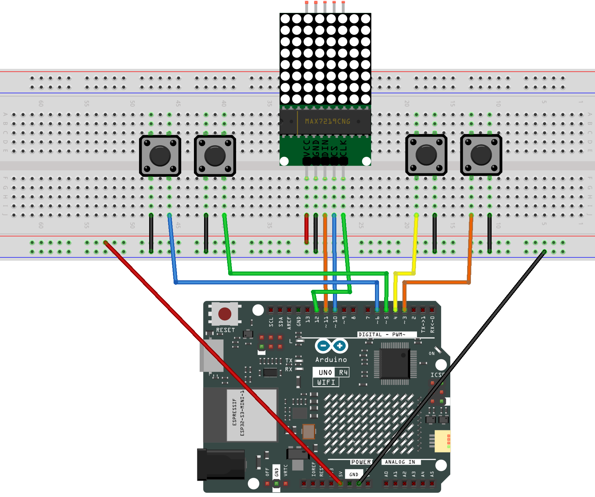

.. _tetris4.0:

Tetris4.0
==============================================================

.. note::
  
  🌟 Welcome to the SunFounder Facebook Community! Whether you're into Raspberry Pi, Arduino, or ESP32, you'll find inspiration, help ideas here.
   
  - ✅ Be the first to get free learning resources. 
   
  - ✅ Stay updated on new products & exclusive giveaways. 
   
  - ✅ Share your creations and get real feedback.
   
  * 👉 Need faster updates or support? Click [|link_sf_facebook|] join our Facebook community 

  * 👉 Or join our WhatsApp group: Click [|link_sf_whatsapp|]
   
Kit purchase
------------------------

Looking for parts? Check out our all-in-one kits below — packed with components, beginner-friendly guides, and tons of fun.

.. image:: img/ultimate_sensor_kit.png
   :width: 100%
   :align: center
   :target: https://www.sunfounder.com/collections/arduino-kits-bundles/products/sunfounder-ultimate-sensor-kit-with-original-arduino-uno-r4-minima?ref=jbzmncle

.. raw:: html

     

.. list-table::
   :widths: 20 20 20
   :header-rows: 1

   * - Name
     - Includes Arduino board
     - PURCHASE LINK
   * - Elite Explorer Kit
     - Arduino Uno R4 WiFi
     - |link_elite_buy|
   * - 3 in 1 Ultimate Starter Kit
     - Arduino Uno R4 Minima
     - |link_arduinor4_buy|

Course Introduction
------------------------

This Arduino project uses MAX7219 8x8 Dot Matrix module, four buttons to play a classic Tetris game.

.. raw:: html

  <iframe width="700" height="394" src="https://www.youtube.com/embed/zEsyH-ikmgw" title="YouTube video player" frameborder="0" allow="accelerometer; autoplay; clipboard-write; encrypted-media; gyroscope; picture-in-picture; web-share" referrerpolicy="strict-origin-when-cross-origin" allowfullscreen></iframe>

.. note::

  If this is your first time working with an Arduino project, we recommend downloading and reviewing the basic materials first.

  * :ref:`install_arduino`
  * :ref:`introduce_arduino`

**Required Components**

In this project, we need the following components:

.. list-table::
    :widths: 5 20 5 20
    :header-rows: 1

    *   - SN
        - COMPONENT INTRODUCTION	
        - QUANTITY
        - PURCHASE LINK

    *   - 1
        - Arduino UNO R4 WIFI
        - 1
        - |link_unor4_wifi_buy|
    *   - 2
        - USB Type-C cable
        - 1
        - 
    *   - 3
        - Breadboard
        - 1
        - |link_breadboard_buy|
    *   - 4
        - Wires
        - Several
        - |link_wires_buy|
    *   - 5
        - Button
        - 4
        - |link_joystick_buy|
    *   - 6
        - MAX7219 Dot Matrix Module
        - 1
        - |link_martix1_buy|

**Wiring**

**Common Connections:**

* **MAX7219 Dot Matrix Module**

  - **CLK:** Connect to **12** on the Arduino.
  - **CS:** Connect to **10** on the Arduino.
  - **DIN:** Connect to **11** on the Arduino.
  - **GND:** Connect to breadboard’s negative power bus.
  - **VCC:** Connect to breadboard’s red power bus.

* **Button 1**

  - Connect to the breadboard’s negative power bus, and the other end to **3** on the Arduino board.

* **Button 2**

  - Connect to the breadboard’s negative power bus, and the other end to **4** on the Arduino board.

* **Button 3**

  - Connect to the breadboard’s negative power bus, and the other end to **5** on the Arduino board.

* **Button 4**

  - Connect to the breadboard’s negative power bus, and the other end to **6** on the Arduino board.

**Writing the Code**

.. note::

    * You can copy this code into **Arduino IDE**. 
    * To install the library, use the Arduino Library Manager and search for **LedControl** and install it.
    * Don't forget to select the board(Arduino UNO R4 Minima) and the correct port before clicking the **Upload** button.

.. code-block:: arduino

      #include <LedControl.h>

      // MAX7219 wiring (DIN -> D11, CLK -> D12, CS -> D10)
      const uint8_t PIN_DIN = 11;
      const uint8_t PIN_CLK = 12;
      const uint8_t PIN_CS  = 10;

      // Create a MAX7219 controller (1 device)
      LedControl lc = LedControl(PIN_DIN, PIN_CLK, PIN_CS, 1);

      // Button pins (INPUT_PULLUP: pressed = LOW)
      const uint8_t PIN_LEFT   = 5;
      const uint8_t PIN_RIGHT  = 6;
      const uint8_t PIN_DOWN   = 3;   // Hold to fall faster
      const uint8_t PIN_ROTATE = 4;   // Press to rotate / start game

      // Playfield data: 8 rows, each row uses 8 bits (1 = occupied)
      // field[y] corresponds to row y (0 = top, 7 = bottom)
      byte field[8];

      // Falling timing (gravity)
      unsigned long lastDrop = 0;
      unsigned long baseDropInterval = 500;   // Normal falling speed (ms)
      unsigned long fastDropInterval = 120;   // Faster falling speed when holding DOWN
      unsigned long currentDropInterval = 500;

      // Key repeat and debounce timing
      unsigned long lastMoveTime = 0;
      const unsigned long moveRepeatInterval = 120;  // Repeat speed for LEFT/RIGHT when held

      bool lastRotateState = HIGH;
      unsigned long lastRotateTime = 0;
      const unsigned long rotateDebounce = 150;      // Prevent rotating too fast

      // Game state flags
      bool gameRunning = false;
      bool gameOver = false;

      // A single point (x, y) used to describe block shapes
      struct Point { int8_t x; int8_t y; };

      // One shape can have up to 4 rotations
      struct ShapeDef {
        const Point* rots[4];
        uint8_t rotCount;
      };

      // Current falling block (x, y is the block origin)
      // y can be negative so the block can spawn above the screen
      struct Block {
        uint8_t shapeId;   // 0..6
        uint8_t rot;       // 0..rotCount-1
        int8_t x;          // x position
        int8_t y;          // y position (can be negative for off-screen spawn)
      };

      // I block (2 rotations)
      const Point I0[4] = {{-1,0},{0,0},{1,0},{2,0}};
      const Point I1[4] = {{0,-1},{0,0},{0,1},{0,2}};

      // O block (1 rotation)
      const Point O0[4] = {{0,0},{1,0},{0,1},{1,1}};

      // T block (4 rotations)
      const Point T0[4] = {{-1,0},{0,0},{1,0},{0,1}};
      const Point T1[4] = {{0,-1},{0,0},{0,1},{1,0}};
      const Point T2[4] = {{-1,0},{0,0},{1,0},{0,-1}};
      const Point T3[4] = {{0,-1},{0,0},{0,1},{-1,0}};

      // L block (4 rotations)
      const Point L0[4] = {{-1,0},{0,0},{1,0},{1,1}};
      const Point L1[4] = {{0,-1},{0,0},{0,1},{1,-1}};
      const Point L2[4] = {{-1,-1},{-1,0},{0,0},{1,0}};
      const Point L3[4] = {{-1,1},{0,-1},{0,0},{0,1}};

      // J block (4 rotations)
      const Point J0[4] = {{-1,0},{0,0},{1,0},{-1,1}};
      const Point J1[4] = {{0,-1},{0,0},{0,1},{1,1}};
      const Point J2[4] = {{1,-1},{-1,0},{0,0},{1,0}};
      const Point J3[4] = {{-1,-1},{0,-1},{0,0},{0,1}};

      // S block (2 rotations)
      const Point S0[4] = {{0,0},{1,0},{-1,1},{0,1}};
      const Point S1[4] = {{0,-1},{0,0},{1,0},{1,1}};

      // Z block (2 rotations)
      const Point Z0[4] = {{-1,0},{0,0},{0,1},{1,1}};
      const Point Z1[4] = {{1,-1},{0,0},{1,0},{0,1}};

      // All 7 block types
      const ShapeDef shapes[7] = {
        { {I0, I1, nullptr, nullptr}, 2 },      // I
        { {O0, nullptr, nullptr, nullptr}, 1 }, // O
        { {T0, T1, T2, T3}, 4 },                // T
        { {L0, L1, L2, L3}, 4 },                // L
        { {J0, J1, J2, J3}, 4 },                // J
        { {S0, S1, nullptr, nullptr}, 2 },      // S
        { {Z0, Z1, nullptr, nullptr}, 2 }       // Z
      };

      Block cur;

      // Check if a specific bit (x) is set in a row byte
      inline bool rowHas(byte row, int8_t x) {
        return (row & (1 << x)) != 0;
      }

      // Reverse bit order in a byte (used to match your LED module orientation)
      byte reverse8(byte b) {
        b = (b & 0xF0) >> 4 | (b & 0x0F) << 4;
        b = (b & 0xCC) >> 2 | (b & 0x33) << 2;
        b = (b & 0xAA) >> 1 | (b & 0x55) << 1;
        return b;
      }

      // Collision test for a block at (nx, ny) with a given rotation
      // Notes:
      // - Left/right boundaries are always checked
      // - Bottom boundary is checked
      // - py < 0 is allowed (block above the visible screen)
      // - Overlap with field[] is checked only when py >= 0
      bool checkCollision(int8_t nx, int8_t ny, uint8_t shapeId, uint8_t rot) {
        const ShapeDef& sd = shapes[shapeId];
        const Point* pts = sd.rots[rot];

        for (uint8_t i = 0; i < 4; i++) {
          int8_t px = nx + pts[i].x;
          int8_t py = ny + pts[i].y;

          if (px < 0 || px > 7) return true;
          if (py > 7) return true;

          if (py >= 0) {
            if (rowHas(field[py], px)) return true;
          }
        }
        return false;
      }

      // Try moving the current block; return false if blocked
      bool moveBlock(int8_t dx, int8_t dy) {
        int8_t nx = cur.x + dx;
        int8_t ny = cur.y + dy;
        if (checkCollision(nx, ny, cur.shapeId, cur.rot)) return false;
        cur.x = nx;
        cur.y = ny;
        return true;
      }

      // Rotate the block (with a small "wall-kick" so rotation feels smoother)
      void rotateBlock() {
        const ShapeDef& sd = shapes[cur.shapeId];
        if (sd.rotCount <= 1) return;

        uint8_t oldRot = cur.rot;
        uint8_t nextRot = (cur.rot + 1) % sd.rotCount;

        if (!checkCollision(cur.x, cur.y, cur.shapeId, nextRot)) {
          cur.rot = nextRot;
          return;
        }

        // Wall-kick: try shifting left or right by 1 if rotation is blocked
        if (!checkCollision(cur.x - 1, cur.y, cur.shapeId, nextRot)) {
          cur.x -= 1;
          cur.rot = nextRot;
          return;
        }
        if (!checkCollision(cur.x + 1, cur.y, cur.shapeId, nextRot)) {
          cur.x += 1;
          cur.rot = nextRot;
          return;
        }

        // Rotation failed, restore previous state
        cur.rot = oldRot;
      }

      // Lock the current block into the field[] (only visible pixels are stored)
      void placeBlock() {
        const ShapeDef& sd = shapes[cur.shapeId];
        const Point* pts = sd.rots[cur.rot];

        for (uint8_t i = 0; i < 4; i++) {
          int8_t px = cur.x + pts[i].x;
          int8_t py = cur.y + pts[i].y;

          if (px >= 0 && px <= 7 && py >= 0 && py <= 7) {
            field[py] |= (1 << px);
          }
        }
      }

      // Remove full lines (0xFF) and shift everything above down
      void clearLines() {
        for (int8_t y = 7; y >= 0; y--) {
          if (field[y] == 0xFF) {
            for (int8_t yy = y; yy > 0; yy--) {
              field[yy] = field[yy - 1];
            }
            field[0] = 0;
            y++; // Re-check the same row after shifting
          }
        }
      }

      // Reset field and timers for a new game
      void resetGame() {
        for (uint8_t i = 0; i < 8; i++) field[i] = 0;
        gameOver = false;
        lastDrop = millis();
      }

      // Create a new block above the visible top so it "slides in"
      void spawnBlock() {
        cur.shapeId = (uint8_t)random(0, 7);
        cur.rot = 0;

        cur.x = 3;
        cur.y = -1;

        // I block is 4-wide in horizontal state, so shift left to avoid edge issues
        if (cur.shapeId == 0) {
          cur.x = 2;
          cur.y = -1;
        }

        // If the new block already hits existing blocks, the game ends
        if (checkCollision(cur.x, cur.y, cur.shapeId, cur.rot)) {
          gameOver = true;
          gameRunning = false;
        }
      }

      // Convert your logical 8x8 frame into the correct LED orientation
      // This mapping is based on your module: rotate 90° clockwise + reverse bits
      void drawMapped(const byte src[8]) {
        byte rotated[8] = {0};

        for (int y = 0; y < 8; y++) {
          for (int x = 0; x < 8; x++) {
            if (src[y] & (1 << x)) {
              rotated[x] |= (1 << (7 - y));
            }
          }
        }

        for (int row = 0; row < 8; row++) {
          rotated[row] = reverse8(rotated[row]);
        }

        for (int row = 0; row < 8; row++) {
          lc.setRow(0, row, rotated[row]);
        }
      }

      // Build a frame = field + current block, then display it
      void drawFrame() {
        byte frame[8];
        for (uint8_t y = 0; y < 8; y++) frame[y] = field[y];

        if (gameRunning && !gameOver) {
          const ShapeDef& sd = shapes[cur.shapeId];
          const Point* pts = sd.rots[cur.rot];
          for (uint8_t i = 0; i < 4; i++) {
            int8_t px = cur.x + pts[i].x;
            int8_t py = cur.y + pts[i].y;
            if (px >= 0 && px <= 7 && py >= 0 && py <= 7) {
              frame[py] |= (1 << px);
            }
          }
        }

        drawMapped(frame);
      }

      // Simple blinking animation when game is over
      void showGameOverAnim() {
        static unsigned long lastBlink = 0;
        static bool on = false;

        unsigned long now = millis();
        if (now - lastBlink > 300) {
          lastBlink = now;
          on = !on;
        }

        byte full[8];
        for (int i = 0; i < 8; i++) full[i] = on ? 0xFF : 0x00;
        drawMapped(full);
      }

      // Read buttons and apply control (move/rotate/speed)
      void handleInput() {
        bool leftPressed   = (digitalRead(PIN_LEFT)   == LOW);
        bool rightPressed  = (digitalRead(PIN_RIGHT)  == LOW);
        bool downPressed   = (digitalRead(PIN_DOWN)   == LOW);
        bool rotatePressed = (digitalRead(PIN_ROTATE) == LOW);

        // DOWN changes falling speed (soft drop)
        currentDropInterval = downPressed ? fastDropInterval : baseDropInterval;

        unsigned long now = millis();

        // LEFT/RIGHT: allow holding the button (repeat movement)
        if (now - lastMoveTime >= moveRepeatInterval) {
          if (leftPressed && !rightPressed) {
            moveBlock(-1, 0);
            lastMoveTime = now;
          } else if (rightPressed && !leftPressed) {
            moveBlock(1, 0);
            lastMoveTime = now;
          }
        }

        // ROTATE: only rotate once per press (debounced)
        if (rotatePressed != lastRotateState) {
          if (now - lastRotateTime > rotateDebounce) {
            lastRotateTime = now;
            if (rotatePressed) {
              rotateBlock();
            }
          }
          lastRotateState = rotatePressed;
        }
      }

      // Helper used for "press to start/restart"
      bool rotatePressedNow() {
        return digitalRead(PIN_ROTATE) == LOW;
      }

      void setup() {
        // Use A0 noise as a simple random seed (A0 is unused here)
        randomSeed(analogRead(A0));

        pinMode(PIN_LEFT, INPUT_PULLUP);
        pinMode(PIN_RIGHT, INPUT_PULLUP);
        pinMode(PIN_DOWN, INPUT_PULLUP);
        pinMode(PIN_ROTATE, INPUT_PULLUP);

        lc.shutdown(0, false);
        lc.setIntensity(0, 8);
        lc.clearDisplay(0);

        resetGame();
        drawFrame();
      }

      void loop() {
        // Not running: show idle/game over screen, press ROTATE to start
        if (!gameRunning) {
          if (gameOver) showGameOverAnim();
          else drawFrame();

          if (rotatePressedNow()) {
            delay(30);
            if (rotatePressedNow()) {
              resetGame();
              spawnBlock();
              gameRunning = !gameOver;

              // Wait for release to avoid an instant rotate
              while (rotatePressedNow()) { delay(10); }
            }
          }
          return;
        }

        // Running: read input and apply gravity
        handleInput();

        unsigned long now = millis();
        if (now - lastDrop >= currentDropInterval) {
          lastDrop = now;

          // If the block can't move down, lock it and spawn a new one
          if (!moveBlock(0, 1)) {
            placeBlock();
            clearLines();
            spawnBlock();
            if (gameOver) {
              gameRunning = false;
            }
          }
        }

        drawFrame();
      }
