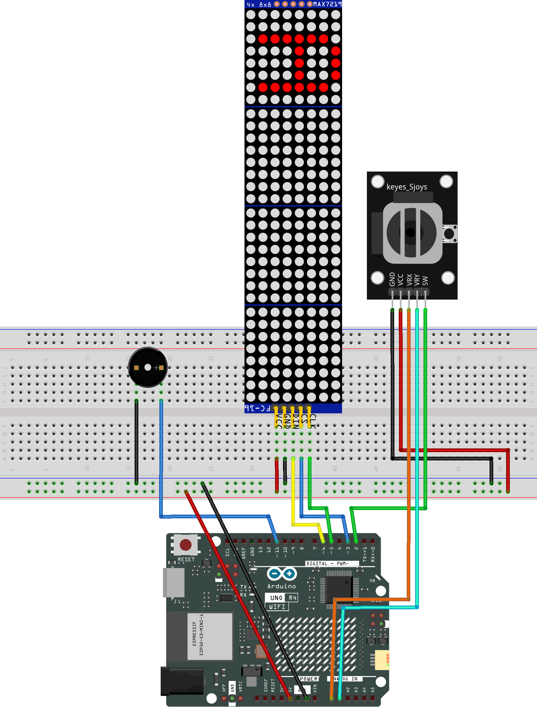

.. _tetris5.0:

Tetris5.0
==============================================================

.. note::
  
  🌟 Welcome to the SunFounder Facebook Community! Whether you're into Raspberry Pi, Arduino, or ESP32, you'll find inspiration, help ideas here.
   
  - ✅ Be the first to get free learning resources. 
   
  - ✅ Stay updated on new products & exclusive giveaways. 
   
  - ✅ Share your creations and get real feedback.
   
  * 👉 Need faster updates or support? Click [|link_sf_facebook|] join our Facebook community 

  * 👉 Or join our WhatsApp group: Click [|link_sf_whatsapp|]
   
Kit purchase
------------------------

Looking for parts? Check out our all-in-one kits below — packed with components, beginner-friendly guides, and tons of fun.

.. image:: img/elite_explore_kit.png
   :width: 100%
   :align: center
   :target: https://www.sunfounder.com/collections/arduino-kits-bundles/products/sunfounder-ultimate-sensor-kit-with-original-arduino-uno-r4-minima?ref=jbzmncle

.. raw:: html

     

.. list-table::
   :widths: 20 20 20
   :header-rows: 1

   * - Name
     - Includes Arduino board
     - PURCHASE LINK
   * - Elite Explorer Kit
     - Arduino Uno R4 WiFi
     - |link_elite_buy|
   * - 3 in 1 Ultimate Starter Kit
     - Arduino Uno R4 Minima
     - |link_arduinor4_buy|

Course Introduction
------------------------

This Arduino project uses MAX7219 8x8 Dot Matrix module, Joystick Module, buzzer to play a classic Tetris game.

.. .. raw:: html

..  <iframe width="700" height="394" src="https://www.youtube.com/embed/zEsyH-ikmgw" title="YouTube video player" frameborder="0" allow="accelerometer; autoplay; clipboard-write; encrypted-media; gyroscope; picture-in-picture; web-share" referrerpolicy="strict-origin-when-cross-origin" allowfullscreen></iframe>

.. note::

  If this is your first time working with an Arduino project, we recommend downloading and reviewing the basic materials first.

  * :ref:`install_arduino`
  * :ref:`introduce_arduino`

**Required Components**

In this project, we need the following components:

.. list-table::
    :widths: 5 20 5 20
    :header-rows: 1

    *   - SN
        - COMPONENT INTRODUCTION	
        - QUANTITY
        - PURCHASE LINK

    *   - 1
        - Arduino UNO R4 WIFI
        - 1
        - |link_unor4_wifi_buy|
    *   - 2
        - USB Type-C cable
        - 1
        - 
    *   - 3
        - Breadboard
        - 1
        - |link_breadboard_buy|
    *   - 4
        - Wires
        - Several
        - |link_wires_buy|
    *   - 5
        - Joystick Module
        - 1
        - |link_joystick_buy|
    *   - 6
        - MAX7219 Dot Matrix Module
        - 1
        - |link_martix1_buy|

**Wiring**

**Common Connections:**

* **MAX7219 Dot Matrix Module**

  - **CLK:** Connect to **5** on the Arduino.
  - **CS:** Connect to **3** on the Arduino.
  - **DIN:** Connect to **6** on the Arduino.
  - **GND:** Connect to breadboard’s negative power bus.
  - **VCC:** Connect to breadboard’s red power bus.

* **Buzzer**

  - **＋:** Connect to **11** on the Arduino.
  - **－:** Connect to breadboard’s negative power bus.

* **Joystick Module**

  - **VRY:** Connect to **A1** on the Arduino.
  - **VRX:** Connect to **A0** on the Arduino.
  - **SW:** Connect to **2** on the Arduino.
  - **GND:** Connect to breadboard’s negative power bus.
  - **VCC:** Connect to breadboard’s red power bus.

**Writing the Code**

.. note::

    * You can copy this code into **Arduino IDE**. 
    * To install the library, use the Arduino Library Manager and search for **LedControl** and install it.
    * Don't forget to select the board(Arduino UNO R4 WIFI) and the correct port before clicking the **Upload** button.

.. code-block:: arduino

      #include <LedControl.h>

      // MAX7219 LED matrix pins
      #define DIN_PIN     6
      #define CLK_PIN     5
      #define CS_PIN      3
      #define NUM_MODULES 4

      LedControl lc(DIN_PIN, CLK_PIN, CS_PIN, NUM_MODULES);

      // Joystick and buzzer pins
      #define VRx A0
      #define VRy A1
      #define SW  2
      #define BUZZER_PIN 11

      // Game screen size
      const int SCREEN_W = 8;
      const int PREVIEW_MODULE = 3;
      const int GAME_MODULES = NUM_MODULES - 1;
      const int SCREEN_H = SCREEN_W * GAME_MODULES;

      // Stores the locked blocks on the game field
      uint8_t field[SCREEN_H];

      // Timing for movement and display refresh
      unsigned long lastDrop = 0;
      unsigned long dropInterval = 500;
      unsigned long lastMove = 0;
      const unsigned long moveInterval = 200;
      const unsigned long refreshInterval = 33;
      unsigned long lastRefresh = 0;

      // Button debounce settings
      unsigned long lastButtonCheck = 0;
      const unsigned long debounceDelay = 30;
      bool lastButtonState = HIGH;
      bool buttonPressedEvent = false;

      // Non-blocking buzzer state
      bool buzzerOn = false;
      unsigned long buzzerOffTime = 0;

      // Short delay before locking a landed block
      bool pendingLock = false;
      unsigned long lockTime = 0;
      const unsigned long lockDelay = 30;

      // Short delay before spawning the next block
      bool waitingForNextBlock = false;
      unsigned long nextBlockTime = 0;
      const unsigned long nextBlockDelay = 120;

      // Saves the last LED state to reduce flicker
      uint8_t prevBuf[NUM_MODULES][SCREEN_W];

      // Stores the current falling block
      struct Block {
        const int (*shape)[2];  // Points to the current block shape
        int len;                // Number of small squares in the block
        int x, y;               // Block position on the game field
        int rotation;           // Current rotation state
        char type;              // Block type: I, O, T, L, J, S, or Z
      } current;

      char nextType;

      // I block rotations
      const int I_SHAPE[2][4][2] = {
        {{0,0},{0,1},{0,2},{0,3}},
        {{-1,1},{0,1},{1,1},{2,1}}
      };

      // O block rotation
      const int O_SHAPE[1][4][2] = {
        {{0,0},{1,0},{0,1},{1,1}}
      };

      // T block rotations
      const int T_SHAPE[4][4][2] = {
        {{1,0},{0,1},{1,1},{2,1}},
        {{1,0},{1,1},{1,2},{0,1}},
        {{0,1},{1,1},{2,1},{1,2}},
        {{1,0},{1,1},{1,2},{2,1}}
      };

      // L block rotations
      const int L_SHAPE[4][4][2] = {
        {{0,0},{0,1},{0,2},{1,2}},
        {{0,0},{1,0},{2,0},{0,1}},
        {{0,0},{1,0},{1,1},{1,2}},
        {{2,0},{0,1},{1,1},{2,1}}
      };

      // J block rotations
      const int J_SHAPE[4][4][2] = {
        {{1,0},{1,1},{1,2},{0,2}},
        {{0,0},{0,1},{1,1},{2,1}},
        {{0,0},{1,0},{0,1},{0,2}},
        {{0,0},{1,0},{2,0},{2,1}}
      };

      // S block rotations
      const int S_SHAPE[2][4][2] = {
        {{1,0},{2,0},{0,1},{1,1}},
        {{1,0},{1,1},{2,1},{2,2}}
      };

      // Z block rotations
      const int Z_SHAPE[2][4][2] = {
        {{0,0},{1,0},{1,1},{2,1}},
        {{2,0},{1,1},{2,1},{1,2}}
      };

      // Letter patterns for the GAME OVER screen
      static const uint8_t PAT_G[8] = {0x3C,0x42,0x40,0x4E,0x42,0x42,0x3C,0x00};
      static const uint8_t PAT_A[8] = {0x18,0x24,0x42,0x7E,0x42,0x42,0x42,0x00};
      static const uint8_t PAT_M[8] = {0x42,0x66,0x5A,0x5A,0x42,0x42,0x42,0x00};
      static const uint8_t PAT_E[8] = {0x7E,0x40,0x5C,0x40,0x40,0x40,0x7E,0x00};
      static const uint8_t PAT_O[8] = {0x3C,0x42,0x42,0x42,0x42,0x42,0x3C,0x00};
      static const uint8_t PAT_V[8] = {0x42,0x42,0x42,0x42,0x42,0x24,0x18,0x00};
      static const uint8_t PAT_R[8] = {0x7C,0x42,0x42,0x7C,0x48,0x44,0x42,0x00};

      // Play a blocking beep for simple startup sounds
      void beep(int duration) {
        digitalWrite(BUZZER_PIN, HIGH);
        delay(duration);
        digitalWrite(BUZZER_PIN, LOW);
      }

      // Start a beep without stopping the game
      void startBeep(unsigned long duration) {
        digitalWrite(BUZZER_PIN, HIGH);
        buzzerOn = true;
        buzzerOffTime = millis() + duration;
      }

      // Turn off the buzzer when its time is up
      void updateBuzzer() {
        if (buzzerOn && millis() >= buzzerOffTime) {
          digitalWrite(BUZZER_PIN, LOW);
          buzzerOn = false;
        }
      }

      // Play the startup sound
      void soundStart() {
        beep(60);
        delay(80);
        beep(60);
        delay(80);
        beep(120);
      }

      // Play the rotate sound
      void soundRotate() {
        startBeep(40);
      }

      // Play the landing sound
      void soundLand() {
        startBeep(70);
      }

      // Play the game over sound
      void soundGameOver() {
        beep(120);
        delay(80);
        beep(120);
        delay(80);
        beep(250);
      }

      // Clear all LED matrix modules
      void clearAll() {
        for (int m = 0; m < NUM_MODULES; m++) {
          lc.clearDisplay(m);
        }
      }

      // Read the joystick button without freezing the game
      bool readButton() {
        bool currentState = digitalRead(SW);
        unsigned long now = millis();

        if (currentState != lastButtonState) {
          lastButtonCheck = now;
          lastButtonState = currentState;
        }

        if ((now - lastButtonCheck) > debounceDelay) {
          if (currentState == LOW && !buttonPressedEvent) {
            buttonPressedEvent = true;
            return true;
          }

          if (currentState == HIGH) {
            buttonPressedEvent = false;
          }
        }

        return false;
      }

      // Get the LED pattern for a letter
      const uint8_t* letterPattern(char c) {
        switch (c) {
          case 'G': return PAT_G;
          case 'A': return PAT_A;
          case 'M': return PAT_M;
          case 'E': return PAT_E;
          case 'O': return PAT_O;
          case 'V': return PAT_V;
          case 'R': return PAT_R;
          default:  return PAT_E;
        }
      }

      // Pick a random block type
      char randomBlockType() {
        const char types[] = {'I', 'O', 'T', 'L', 'J', 'S', 'Z'};
        return types[random(7)];
      }

      // Get the default shape for the preview window
      const int (*getShapeByType(char type))[2] {
        if      (type == 'I') return I_SHAPE[0];
        else if (type == 'O') return O_SHAPE[0];
        else if (type == 'T') return T_SHAPE[0];
        else if (type == 'L') return L_SHAPE[0];
        else if (type == 'J') return J_SHAPE[0];
        else if (type == 'S') return S_SHAPE[0];
        else if (type == 'Z') return Z_SHAPE[0];

        return O_SHAPE[0];
      }

      // Set the current block type and position
      void setBlockByType(char type, int sx, int sy) {
        current.rotation = 0;
        current.type = type;
        current.len = 4;
        current.x = sx;
        current.y = sy;

        if      (type == 'I') current.shape = I_SHAPE[0];
        else if (type == 'O') current.shape = O_SHAPE[0];
        else if (type == 'T') current.shape = T_SHAPE[0];
        else if (type == 'L') current.shape = L_SHAPE[0];
        else if (type == 'J') current.shape = J_SHAPE[0];
        else if (type == 'S') current.shape = S_SHAPE[0];
        else if (type == 'Z') current.shape = Z_SHAPE[0];
      }

      // Draw the upcoming block on the preview matrix
      void drawNextBlock() {
        uint8_t preview[8] = {};
        const int (*shape)[2] = getShapeByType(nextType);

        int offsetX = 3;
        int offsetY = 3;

        if (nextType == 'I') {
          offsetX = 4;
          offsetY = 3;
        } else if (nextType == 'O') {
          offsetX = 4;
          offsetY = 4;
        }

        for (int i = 0; i < 4; i++) {
          int x = offsetX + shape[i][0];
          int y = offsetY + shape[i][1];

          if (x >= 0 && x < 8 && y >= 0 && y < 8) {
            preview[y] |= (1 << x);
          }
        }

        // Add a simple border line for the preview area
        for (int row = 0; row < 8; row++) {
          preview[row] |= (1 << 0);
        }

        for (int row = 0; row < 8; row++) {
          lc.setRow(PREVIEW_MODULE, row, preview[row]);
          prevBuf[PREVIEW_MODULE][row] = preview[row];
        }
      }

      // Create a new falling block
      void spawnBlock() {
        int sx = SCREEN_W / 2 - 2;
        setBlockByType(nextType, sx, 0);
        nextType = randomBlockType();
      }

      // Show the game over animation
      void gameOverSequence() {
        soundGameOver();

        for (int i = 0; i < 3; i++) {
          clearAll();
          delay(300);

          for (int m = 0; m < NUM_MODULES; m++) {
            for (int r = 0; r < SCREEN_W; r++) {
              lc.setRow(m, r, 0xFF);
            }
          }

          delay(300);
        }

        const char* w1 = "GAME";

        for (int seg = 0; seg < 4; seg++) {
          const uint8_t* pat = letterPattern(w1[seg]);
          uint8_t rot[8] = {};

          for (int y = 0; y < 8; y++) {
            for (int x = 0; x < 8; x++) {
              if (pat[y] & (1 << x)) {
                int nx = 7 - y;
                int ny = x;
                rot[ny] |= (1 << nx);
              }
            }
          }

          int module = NUM_MODULES - 1 - seg;

          for (int row = 0; row < 8; row++) {
            lc.setRow(module, row, rot[row]);
          }
        }

        delay(1000);

        const char* w2 = "OVER";

        for (int seg = 0; seg < 4; seg++) {
          const uint8_t* pat = letterPattern(w2[seg]);
          uint8_t rot[8] = {};

          for (int y = 0; y < 8; y++) {
            for (int x = 0; x < 8; x++) {
              if (pat[y] & (1 << x)) {
                int nx = 7 - y;
                int ny = x;
                rot[ny] |= (1 << nx);
              }
            }
          }

          int module = NUM_MODULES - 1 - seg;

          for (int row = 0; row < 8; row++) {
            lc.setRow(module, row, rot[row]);
          }
        }

        delay(1200);

        // Wait for the player to press and release the button
        while (digitalRead(SW) != LOW) {
          delay(10);
        }

        while (digitalRead(SW) == LOW) {
          delay(10);
        }
      }

      // Start a new game
      void resetGame() {
        memset(field, 0, sizeof(field));
        clearAll();

        for (int m = 0; m < NUM_MODULES; m++) {
          for (int r = 0; r < SCREEN_W; r++) {
            prevBuf[m][r] = 0;
          }
        }

        pendingLock = false;
        waitingForNextBlock = false;
        buzzerOn = false;
        digitalWrite(BUZZER_PIN, LOW);

        nextType = randomBlockType();
        spawnBlock();
        drawNextBlock();

        writeBuffer();
        soundStart();

        lastDrop = millis();
        lastRefresh = millis();
      }

      // Build and send the LED display buffer
      void writeBuffer() {
        uint8_t buf[NUM_MODULES][SCREEN_W] = {};

        for (int y = 0; y < SCREEN_H; y++) {
          uint8_t row = field[y];

          if (!row) continue;

          int mod = 2 - (y / SCREEN_W);
          int bit = 1 << (7 - (y % SCREEN_W));

          for (int x = 0; x < SCREEN_W; x++) {
            if (row & (1 << x)) {
              buf[mod][x] |= bit;
            }
          }
        }

        // Draw the falling block unless the game is between blocks
        if (!waitingForNextBlock) {
          for (int i = 0; i < current.len; i++) {
            int xx = current.x + current.shape[i][0];
            int yy = current.y + current.shape[i][1];

            if (xx < 0 || xx >= SCREEN_W || yy < 0 || yy >= SCREEN_H) {
              continue;
            }

            int mod = 2 - (yy / SCREEN_W);
            int bit = 1 << (7 - (yy % SCREEN_W));

            buf[mod][xx] |= bit;
          }
        }

        // Update only changed rows
        for (int m = 0; m < 3; m++) {
          for (int r = 0; r < SCREEN_W; r++) {
            if (buf[m][r] != prevBuf[m][r]) {
              lc.setRow(m, r, buf[m][r]);
              prevBuf[m][r] = buf[m][r];
            }
          }
        }
      }

      // Check if the block would hit a wall, floor, or placed block
      bool checkCollision(int nx, int ny) {
        for (int i = 0; i < current.len; i++) {
          int xx = nx + current.shape[i][0];
          int yy = ny + current.shape[i][1];

          if (xx < 0 || xx >= SCREEN_W || yy >= SCREEN_H) {
            return true;
          }

          if (yy >= 0 && (field[yy] & (1 << xx))) {
            return true;
          }
        }

        return false;
      }

      // Check if the block locks at the top of the field
      bool isAtTop() {
        for (int i = 0; i < current.len; i++) {
          if (current.y + current.shape[i][1] == 0) {
            return true;
          }
        }

        return false;
      }

      // Add the current block to the field
      void placeBlock() {
        for (int i = 0; i < current.len; i++) {
          int xx = current.x + current.shape[i][0];
          int yy = current.y + current.shape[i][1];

          if (yy >= 0 && yy < SCREEN_H) {
            field[yy] |= (1 << xx);
          }
        }

        // Clear full rows
        for (int y = 0; y < SCREEN_H; y++) {
          if (field[y] == 0xFF) {
            for (int j = y; j > 0; j--) {
              field[j] = field[j - 1];
            }

            field[0] = 0;
          }
        }
      }

      // Lock the current block after it lands
      void lockCurrentBlock(unsigned long now) {
        if (isAtTop()) {
          gameOverSequence();
          resetGame();
          return;
        }

        placeBlock();

        waitingForNextBlock = true;
        pendingLock = false;

        soundLand();
        writeBuffer();

        nextBlockTime = now + nextBlockDelay;
      }

      // Rotate the current block
      void rotateBlock() {
        int limit =
          (current.type == 'I' ||
          current.type == 'S' ||
          current.type == 'Z') ? 2 :
          (current.type == 'O' ? 1 : 4);

        int nr = (current.rotation + 1) % limit;

        const int (*ns)[2] = nullptr;

        if      (current.type == 'I') ns = I_SHAPE[nr];
        else if (current.type == 'O') ns = O_SHAPE[0];
        else if (current.type == 'T') ns = T_SHAPE[nr];
        else if (current.type == 'L') ns = L_SHAPE[nr];
        else if (current.type == 'J') ns = J_SHAPE[nr];
        else if (current.type == 'S') ns = S_SHAPE[nr];
        else if (current.type == 'Z') ns = Z_SHAPE[nr];

        Block bak = current;
        current.shape = ns;
        current.rotation = nr;

        // Undo the rotation if it does not fit
        if (checkCollision(current.x, current.y)) {
          current = bak;
        } else {
          soundRotate();
        }
      }

      void setup() {
        pinMode(SW, INPUT_PULLUP);
        pinMode(BUZZER_PIN, OUTPUT);
        digitalWrite(BUZZER_PIN, LOW);

        randomSeed(analogRead(A2));

        // Turn on and clear each LED matrix
        for (int m = 0; m < NUM_MODULES; m++) {
          lc.shutdown(m, false);
          lc.setIntensity(m, 8);
          lc.clearDisplay(m);

          for (int r = 0; r < SCREEN_W; r++) {
            prevBuf[m][r] = 0;
          }
        }

        resetGame();
      }

      void loop() {
        unsigned long now = millis();

        // Keep buzzer timing updated
        updateBuzzer();

        // Finish locking the block after the landing delay
        if (pendingLock) {
          if (now >= lockTime) {
            lockCurrentBlock(now);
          }

          if (now - lastRefresh >= refreshInterval) {
            writeBuffer();
            lastRefresh = now;
          }

          return;
        }

        // Spawn the next block after a short pause
        if (waitingForNextBlock) {
          if (now >= nextBlockTime) {
            spawnBlock();
            drawNextBlock();

            waitingForNextBlock = false;
            lastDrop = now;
            lastRefresh = now;
          }

          if (now - lastRefresh >= refreshInterval) {
            writeBuffer();
            lastRefresh = now;
          }

          return;
        }

        // Read joystick left/right movement
        int ax = analogRead(VRx);

        // Move left or right at a controlled speed
        if (now - lastMove > moveInterval) {
          if (ax < 400 && !checkCollision(current.x + 1, current.y)) {
            current.x++;
            lastMove = now;
          } else if (ax > 600 && !checkCollision(current.x - 1, current.y)) {
            current.x--;
            lastMove = now;
          }
        }

        // Rotate when the joystick button is pressed
        if (readButton()) {
          rotateBlock();
        }

        // Read joystick up/down movement
        int ay = analogRead(VRy);

        // Push down to make the block fall faster
        dropInterval = 700 - constrain(map(ay, 512, 1023, 0, 690), 0, 690);

        // Move the block down automatically
        if (now - lastDrop > dropInterval) {
          lastDrop = now;

          if (!checkCollision(current.x, current.y + 1)) {
            current.y++;
            writeBuffer();

            // Start the lock delay when the block reaches the bottom
            if (checkCollision(current.x, current.y + 1)) {
              pendingLock = true;
              lockTime = now + lockDelay;
            }
          } else {
            pendingLock = true;
            lockTime = now;
          }
        }

        // Refresh the display regularly
        if (now - lastRefresh >= refreshInterval) {
          writeBuffer();
          lastRefresh = now;
        }
      }