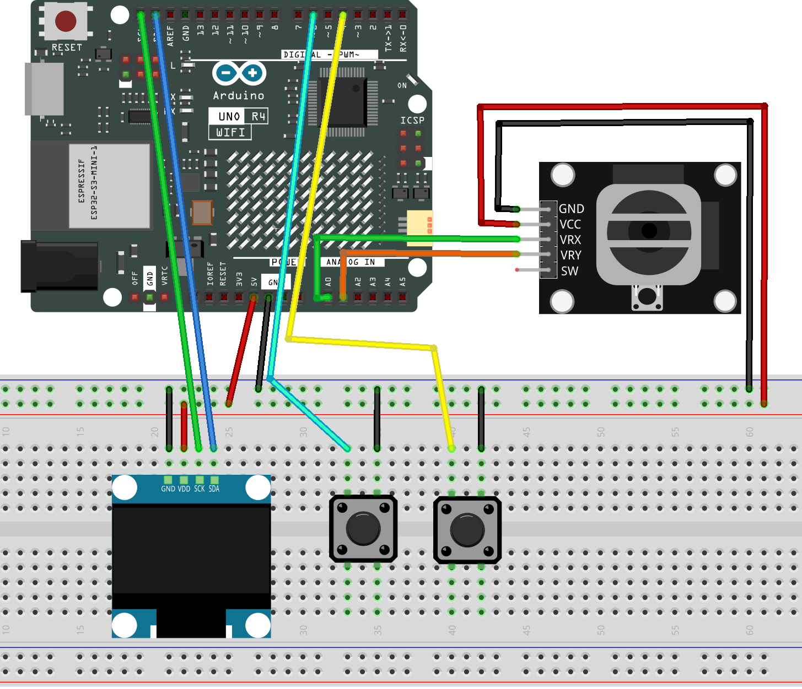

.. _tetris6.0:

Tetris6.0
==============================================================

.. note::
  
  🌟 Welcome to the SunFounder Facebook Community! Whether you're into Raspberry Pi, Arduino, or ESP32, you'll find inspiration, help ideas here.
   
  - ✅ Be the first to get free learning resources. 
   
  - ✅ Stay updated on new products & exclusive giveaways. 
   
  - ✅ Share your creations and get real feedback.
   
  * 👉 Need faster updates or support? Click [|link_sf_facebook|] join our Facebook community 

  * 👉 Or join our WhatsApp group: Click [|link_sf_whatsapp|]

Kit purchase
------------------------

Looking for parts? Check out our all-in-one kits below — packed with components, beginner-friendly guides, and tons of fun.

.. image:: img/elite_explore_kit.png
   :width: 100%
   :align: center
   :target: https://www.sunfounder.com/collections/arduino-kits-bundles/products/sunfounder-elite-explorer-kit-with-official-arduino-uno-r4-wifi?ref=jbzmncle

.. raw:: html

     

.. list-table::
   :widths: 20 20 20
   :header-rows: 1

   * - Name
     - Includes Arduino board
     - PURCHASE LINK
   * - Elite Explorer Kit
     - Arduino Uno R4 WiFi
     - |link_elite_buy|
   * - 3 in 1 Ultimate Starter Kit
     - Arduino Uno R4 Minima
     - |link_arduinor4_buy|

Course Introduction
------------------------

This Arduino project uses an OLED display, two buttons, joystick, and buzzer to play a classic Tetris game with sound effects and joystick-controlled moves.

.. .. raw:: html

..  <iframe width="700" height="394" src="https://www.youtube.com/embed/QOI2zGu3rg0" title="YouTube video player" frameborder="0" allow="accelerometer; autoplay; clipboard-write; encrypted-media; gyroscope; picture-in-picture; web-share" referrerpolicy="strict-origin-when-cross-origin" allowfullscreen></iframe>

.. note::

  If this is your first time working with an Arduino project, we recommend downloading and reviewing the basic materials first.

  * :ref:`install_arduino`
  * :ref:`introduce_arduino`

**Required Components**

In this project, we need the following components:

.. list-table::
    :widths: 5 20 5 20
    :header-rows: 1

    *   - SN
        - COMPONENT INTRODUCTION	
        - QUANTITY
        - PURCHASE LINK

    *   - 1
        - Arduino UNO R4 WIFI
        - 1
        - |link_unor4_wifi_buy|
    *   - 2
        - USB Type-C cable
        - 1
        - 
    *   - 3
        - Breadboard
        - 1
        - |link_breadboard_buy|
    *   - 4
        - Wires
        - Several
        - |link_wires_buy|
    *   - 5
        - Joystick Module
        - 1
        - |link_joystick_buy|
    *   - 6
        - OLED Display Module
        - 1
        - |link_oled_buy|
    *   - 7
        - Button
        - 1
        - |link_button_buy|

**Wiring**

**Common Connections:**

* **OLED Display Module**

  - **SDA:** Connect to **SDA** on the Arduino.
  - **SCK:** Connect to **SCL** on the Arduino.
  - **GND:** Connect to breadboard’s negative power bus.
  - **VCC:** Connect to breadboard’s red power bus.

* **Joystick Module**

  - **VRY:** Connect to **A1** on the Arduino.
  - **VRX:** Connect to **A0** on the Arduino.
  - **GND:** Connect to breadboard’s negative power bus.
  - **VCC:** Connect to breadboard’s red power bus.

* **Rotate Button**

  - Connect to the breadboard’s negative power bus, and the other end to **6** on the Arduino board.

* **Reset Button**

  - Connect to the breadboard’s negative power bus, and the other end to **4** on the Arduino board.

**Writing the Code**

.. note::

    * You can copy this code into **Arduino IDE**. 
    * To install the library, use the Arduino Library Manager and search for **Adafruit_GFX** and **Adafruit SSD1306** and install it.
    * Don't forget to select the board(Arduino UNO R4 Minima) and the correct port before clicking the **Upload** button.

.. code-block:: arduino

      /*
        Mini Tetris for Arduino UNO R4

        Compatible boards:
        - Arduino UNO R4 Minima
        - Arduino UNO R4 WiFi

        Hardware:
        - 128x64 SSD1306 I2C OLED
        - Analog joystick
        - Rotate button
        - Reset button

        Controls:
        - Joystick left/right: move
        - Joystick down: soft drop
        - D4 button: rotate
        - D7 button: restart
      */

      #include <Arduino.h>
      #include <Wire.h>
      #include <Adafruit_GFX.h>
      #include <Adafruit_SSD1306.h>

      // ==================================================
      // Pin configuration
      // ==================================================

      const uint8_t JOYSTICK_X_PIN = A0;
      const uint8_t JOYSTICK_Y_PIN = A1;

      const uint8_t ROTATE_BUTTON_PIN = 4;
      const uint8_t RESET_BUTTON_PIN = 6;

      // ==================================================
      // OLED configuration
      // ==================================================

      const uint8_t OLED_ADDRESS = 0x3C;

      const int SCREEN_WIDTH = 128;
      const int SCREEN_HEIGHT = 64;

      const int OLED_RESET = -1;

      Adafruit_SSD1306 display(
        SCREEN_WIDTH,
        SCREEN_HEIGHT,
        &Wire,
        OLED_RESET
      );

      // Change to 0 or 2 if the screen orientation is reversed.
      const uint8_t DISPLAY_ROTATION = 0;

      // ==================================================
      // Tetris board configuration
      // ==================================================

      const int BOARD_COLS = 10;
      const int BOARD_ROWS = 13;

      // Each game cell is 6 x 4 pixels.
      const int CELL_WIDTH = 6;
      const int CELL_HEIGHT = 4;

      // Board position on the OLED.
      const int BOARD_X = 5;
      const int BOARD_Y = 5;

      // Sidebar position.
      const int SIDEBAR_X = 68;

      // ==================================================
      // Input configuration
      // ==================================================

      const int ADC_CENTER = 512;
      const int JOYSTICK_DEADZONE = 120;

      // Set to true if pushing joystick down gives lower ADC values.
      const bool INVERT_JOYSTICK_Y = false;

      const unsigned long MOVE_REPEAT_TIME = 150;
      const unsigned long DROP_REPEAT_TIME = 80;
      const unsigned long BUTTON_DEBOUNCE_TIME = 35;

      // ==================================================
      // Game timing
      // ==================================================

      const unsigned long BASE_DROP_TIME = 600;
      const unsigned long MIN_DROP_TIME = 80;

      const int LINES_PER_LEVEL = 10;

      // ==================================================
      // Tetromino definitions
      // ==================================================

      const int8_t SHAPES[7][4][4] = {
        // I
        {
          {0, 0, 0, 0},
          {1, 1, 1, 1},
          {0, 0, 0, 0},
          {0, 0, 0, 0}
        },

        // O
        {
          {1, 1, 0, 0},
          {1, 1, 0, 0},
          {0, 0, 0, 0},
          {0, 0, 0, 0}
        },

        // T
        {
          {0, 1, 0, 0},
          {1, 1, 1, 0},
          {0, 0, 0, 0},
          {0, 0, 0, 0}
        },

        // S
        {
          {0, 1, 1, 0},
          {1, 1, 0, 0},
          {0, 0, 0, 0},
          {0, 0, 0, 0}
        },

        // Z
        {
          {1, 1, 0, 0},
          {0, 1, 1, 0},
          {0, 0, 0, 0},
          {0, 0, 0, 0}
        },

        // J
        {
          {1, 0, 0, 0},
          {1, 1, 1, 0},
          {0, 0, 0, 0},
          {0, 0, 0, 0}
        },

        // L
        {
          {0, 0, 1, 0},
          {1, 1, 1, 0},
          {0, 0, 0, 0},
          {0, 0, 0, 0}
        }
      };

      const int8_t SHAPE_SIZES[7] = {
        4, 2, 3, 3, 3, 3, 3
      };

      // ==================================================
      // Game structures
      // ==================================================

      struct Piece {
        int8_t shape[4][4];
        int8_t size;
        int8_t x;
        int8_t y;
      };

      struct DebouncedButton {
        uint8_t pin;

        bool lastRawState;
        bool stableState;

        unsigned long lastChangeTime;

        void begin(uint8_t buttonPin) {
          pin = buttonPin;

          pinMode(pin, INPUT_PULLUP);

          lastRawState = digitalRead(pin);
          stableState = lastRawState;
          lastChangeTime = millis();
        }

        bool pressed() {
          bool rawState = digitalRead(pin);

          if (rawState != lastRawState) {
            lastRawState = rawState;
            lastChangeTime = millis();
          }

          if (
            millis() - lastChangeTime >= BUTTON_DEBOUNCE_TIME
          ) {
            if (rawState != stableState) {
              stableState = rawState;

              if (stableState == LOW) {
                return true;
              }
            }
          }

          return false;
        }
      };

      // ==================================================
      // Game state
      // ==================================================

      uint8_t board[BOARD_ROWS][BOARD_COLS];

      Piece currentPiece;
      Piece nextPiece;

      int score = 0;
      int clearedLines = 0;
      int level = 1;

      bool gameOver = false;

      unsigned long dropInterval = BASE_DROP_TIME;
      unsigned long lastGravityTime = 0;

      unsigned long lastHorizontalMove = 0;
      unsigned long lastSoftDrop = 0;

      DebouncedButton rotateButton;
      DebouncedButton resetButton;

      // ==================================================
      // Piece generation
      // ==================================================

      void createRandomPiece(Piece &piece) {
        int type = random(0, 7);

        memcpy(
          piece.shape,
          SHAPES[type],
          sizeof(piece.shape)
        );

        piece.size = SHAPE_SIZES[type];

        piece.x = (BOARD_COLS - 4) / 2;
        piece.y = 0;
      }

      // ==================================================
      // Collision detection
      // ==================================================

      bool pieceCollides(
        const Piece &piece,
        int offsetX = 0,
        int offsetY = 0,
        const int8_t rotatedShape[][4] = nullptr
      ) {
        for (int row = 0; row < 4; row++) {
          for (int column = 0; column < 4; column++) {
            int8_t occupied;

            if (rotatedShape != nullptr) {
              occupied = rotatedShape[row][column];
            } else {
              occupied = piece.shape[row][column];
            }

            if (!occupied) {
              continue;
            }

            int boardX =
              piece.x + column + offsetX;

            int boardY =
              piece.y + row + offsetY;

            if (
              boardX < 0 ||
              boardX >= BOARD_COLS ||
              boardY >= BOARD_ROWS
            ) {
              return true;
            }

            if (
              boardY >= 0 &&
              board[boardY][boardX]
            ) {
              return true;
            }
          }
        }

        return false;
      }

      // ==================================================
      // Rotation
      // ==================================================

      void rotateCurrentPiece() {
        int8_t rotated[4][4];

        memset(rotated, 0, sizeof(rotated));

        for (int row = 0; row < currentPiece.size; row++) {
          for (
            int column = 0;
            column < currentPiece.size;
            column++
          ) {
            rotated[column]
                  [currentPiece.size - 1 - row] =
              currentPiece.shape[row][column];
          }
        }

        const int kickOffsets[] = {
          0, 1, -1, 2, -2
        };

        for (int offset : kickOffsets) {
          if (
            !pieceCollides(
              currentPiece,
              offset,
              0,
              rotated
            )
          ) {
            currentPiece.x += offset;

            memcpy(
              currentPiece.shape,
              rotated,
              sizeof(currentPiece.shape)
            );

            return;
          }
        }
      }

      // ==================================================
      // Line clearing
      // ==================================================

      int clearCompletedLines() {
        int lineCount = 0;

        for (
          int row = BOARD_ROWS - 1;
          row >= 0;
          row--
        ) {
          bool complete = true;

          for (
            int column = 0;
            column < BOARD_COLS;
            column++
          ) {
            if (!board[row][column]) {
              complete = false;
              break;
            }
          }

          if (!complete) {
            continue;
          }

          for (
            int moveRow = row;
            moveRow > 0;
            moveRow--
          ) {
            memcpy(
              board[moveRow],
              board[moveRow - 1],
              sizeof(board[moveRow])
            );
          }

          memset(
            board[0],
            0,
            sizeof(board[0])
          );

          lineCount++;
          row++;
        }

        return lineCount;
      }

      // ==================================================
      // Lock and spawn
      // ==================================================

      void lockCurrentPiece() {
        for (int row = 0; row < 4; row++) {
          for (int column = 0; column < 4; column++) {
            if (!currentPiece.shape[row][column]) {
              continue;
            }

            int boardX =
              currentPiece.x + column;

            int boardY =
              currentPiece.y + row;

            if (
              boardY >= 0 &&
              boardY < BOARD_ROWS &&
              boardX >= 0 &&
              boardX < BOARD_COLS
            ) {
              board[boardY][boardX] = 1;
            }
          }
        }

        int linesNow = clearCompletedLines();

        const int scoreTable[] = {
          0, 100, 300, 500, 800
        };

        score += scoreTable[linesNow] * level;
        clearedLines += linesNow;

        level =
          clearedLines / LINES_PER_LEVEL + 1;

        long newDropTime =
          (long)BASE_DROP_TIME -
          (long)(level - 1) * 50L;

        if (newDropTime < MIN_DROP_TIME) {
          newDropTime = MIN_DROP_TIME;
        }

        dropInterval =
          (unsigned long)newDropTime;

        currentPiece = nextPiece;
        createRandomPiece(nextPiece);

        if (pieceCollides(currentPiece)) {
          gameOver = true;
        }
      }

      // ==================================================
      // Game initialization
      // ==================================================

      void startNewGame() {
        memset(board, 0, sizeof(board));

        score = 0;
        clearedLines = 0;
        level = 1;

        gameOver = false;

        dropInterval = BASE_DROP_TIME;

        lastGravityTime = millis();
        lastHorizontalMove = 0;
        lastSoftDrop = 0;

        randomSeed(
          analogRead(A2) ^
          micros()
        );

        createRandomPiece(nextPiece);
        createRandomPiece(currentPiece);
      }

      // ==================================================
      // Input processing
      // ==================================================

      void processJoystick() {
        if (gameOver) {
          return;
        }

        unsigned long currentTime = millis();

        int joystickX =
          analogRead(JOYSTICK_X_PIN);

        int joystickY =
          analogRead(JOYSTICK_Y_PIN);

        int horizontalOffset =
          joystickX - ADC_CENTER;

        int verticalOffset =
          joystickY - ADC_CENTER;

        if (INVERT_JOYSTICK_Y) {
          verticalOffset = -verticalOffset;
        }

        // Horizontal movement
        int moveDirection = 0;

        if (
          horizontalOffset <
          -JOYSTICK_DEADZONE
        ) {
          moveDirection = -1;
        } else if (
          horizontalOffset >
          JOYSTICK_DEADZONE
        ) {
          moveDirection = 1;
        }

        if (moveDirection != 0) {
          if (
            lastHorizontalMove == 0 ||
            currentTime - lastHorizontalMove >=
              MOVE_REPEAT_TIME
          ) {
            if (
              !pieceCollides(
                currentPiece,
                moveDirection,
                0
              )
            ) {
              currentPiece.x += moveDirection;
            }

            lastHorizontalMove = currentTime;
          }
        } else {
          lastHorizontalMove = 0;
        }

        // Soft drop
        if (
          verticalOffset >
          JOYSTICK_DEADZONE
        ) {
          if (
            lastSoftDrop == 0 ||
            currentTime - lastSoftDrop >=
              DROP_REPEAT_TIME
          ) {
            if (
              !pieceCollides(
                currentPiece,
                0,
                1
              )
            ) {
              currentPiece.y++;
              score++;
            } else {
              lockCurrentPiece();
            }

            lastSoftDrop = currentTime;
            lastGravityTime = currentTime;
          }
        } else {
          lastSoftDrop = 0;
        }
      }

      void processButtons() {
        if (rotateButton.pressed()) {
          if (!gameOver) {
            rotateCurrentPiece();
          }
        }

        if (resetButton.pressed()) {
          startNewGame();
        }
      }

      // ==================================================
      // Gravity
      // ==================================================

      void updateGravity() {
        if (gameOver) {
          return;
        }

        unsigned long currentTime = millis();

        if (
          currentTime - lastGravityTime <
          dropInterval
        ) {
          return;
        }

        lastGravityTime = currentTime;

        if (
          !pieceCollides(
            currentPiece,
            0,
            1
          )
        ) {
          currentPiece.y++;
        } else {
          lockCurrentPiece();
        }
      }

      // ==================================================
      // OLED drawing
      // ==================================================

      void drawBoardBorder() {
        display.drawRect(
          0,
          0,
          SCREEN_WIDTH,
          SCREEN_HEIGHT,
          SSD1306_WHITE
        );

        display.drawRect(
          BOARD_X - 1,
          BOARD_Y - 1,
          CELL_WIDTH * BOARD_COLS + 2,
          CELL_HEIGHT * BOARD_ROWS + 2,
          SSD1306_WHITE
        );
      }

      void drawFixedBlocks() {
        for (int row = 0; row < BOARD_ROWS; row++) {
          for (
            int column = 0;
            column < BOARD_COLS;
            column++
          ) {
            if (!board[row][column]) {
              continue;
            }

            display.fillRect(
              BOARD_X +
                column * CELL_WIDTH,
              BOARD_Y +
                row * CELL_HEIGHT,
              CELL_WIDTH - 1,
              CELL_HEIGHT - 1,
              SSD1306_WHITE
            );
          }
        }
      }

      void drawCurrentPiece() {
        for (int row = 0; row < 4; row++) {
          for (int column = 0; column < 4; column++) {
            if (!currentPiece.shape[row][column]) {
              continue;
            }

            int drawY =
              currentPiece.y + row;

            if (drawY < 0) {
              continue;
            }

            display.fillRect(
              BOARD_X +
                (currentPiece.x + column) *
                CELL_WIDTH,
              BOARD_Y +
                drawY * CELL_HEIGHT,
              CELL_WIDTH - 1,
              CELL_HEIGHT - 1,
              SSD1306_WHITE
            );
          }
        }
      }

      void drawNextPiece() {
        const int previewCellSize = 4;

        int previewX =
          SIDEBAR_X + 4;

        int previewY = 13;

        for (
          int row = 0;
          row < nextPiece.size;
          row++
        ) {
          for (
            int column = 0;
            column < nextPiece.size;
            column++
          ) {
            if (!nextPiece.shape[row][column]) {
              continue;
            }

            display.fillRect(
              previewX +
                column * previewCellSize,
              previewY +
                row * previewCellSize,
              previewCellSize - 1,
              previewCellSize - 1,
              SSD1306_WHITE
            );
          }
        }
      }

      void drawSidebar() {
        display.setTextSize(1);
        display.setTextColor(SSD1306_WHITE);

        display.setCursor(
          SIDEBAR_X,
          5
        );
        display.print("NEXT");

        display.drawRect(
          SIDEBAR_X - 2,
          3,
          28,
          25,
          SSD1306_WHITE
        );

        drawNextPiece();

        display.setCursor(
          SIDEBAR_X,
          32
        );
        display.print("SCORE");

        display.setCursor(
          SIDEBAR_X,
          41
        );
        display.print(score);

        display.setCursor(
          SIDEBAR_X,
          51
        );
        display.print("LV:");
        display.print(level);
      }

      void drawGameScreen() {
        display.clearDisplay();

        drawBoardBorder();
        drawFixedBlocks();
        drawCurrentPiece();
        drawSidebar();

        display.display();
      }

      // ==================================================
      // Game over screen
      // ==================================================

      void drawGameOverScreen() {
        display.clearDisplay();

        display.drawRect(
          0,
          0,
          SCREEN_WIDTH,
          SCREEN_HEIGHT,
          SSD1306_WHITE
        );

        display.setTextColor(
          SSD1306_WHITE
        );

        display.setTextSize(1);

        display.setCursor(
          35,
          10
        );
        display.print("GAME OVER");

        display.drawLine(
          8,
          22,
          119,
          22,
          SSD1306_WHITE
        );

        display.setCursor(
          28,
          29
        );
        display.print("SCORE: ");
        display.print(score);

        display.setCursor(
          20,
          43
        );
        display.print("PRESS RESET");

        display.setCursor(
          30,
          53
        );
        display.print("TO RESTART");

        display.display();
      }

      // ==================================================
      // Setup
      // ==================================================

      void setup() {
        Serial.begin(115200);

        rotateButton.begin(
          ROTATE_BUTTON_PIN
        );

        resetButton.begin(
          RESET_BUTTON_PIN
        );

        analogReadResolution(10);

        Wire.begin();
        Wire.setClock(100000);

        delay(300);

        if (
          !display.begin(
            SSD1306_SWITCHCAPVCC,
            OLED_ADDRESS
          )
        ) {
          Serial.println(
            "SSD1306 OLED initialization failed."
          );

          while (true) {
            delay(100);
          }
        }

        display.setRotation(
          DISPLAY_ROTATION
        );

        display.clearDisplay();

        display.setTextColor(
          SSD1306_WHITE
        );

        display.setTextSize(1);

        display.setCursor(
          25,
          20
        );
        display.print("MINI TETRIS");

        display.setCursor(
          20,
          36
        );
        display.print("ARDUINO UNO R4");

        display.display();

        delay(1200);

        startNewGame();
      }

      // ==================================================
      // Main loop
      // ==================================================

      void loop() {
        processButtons();
        processJoystick();
        updateGravity();

        if (gameOver) {
          drawGameOverScreen();
        } else {
          drawGameScreen();
        }

        delay(10);
      }