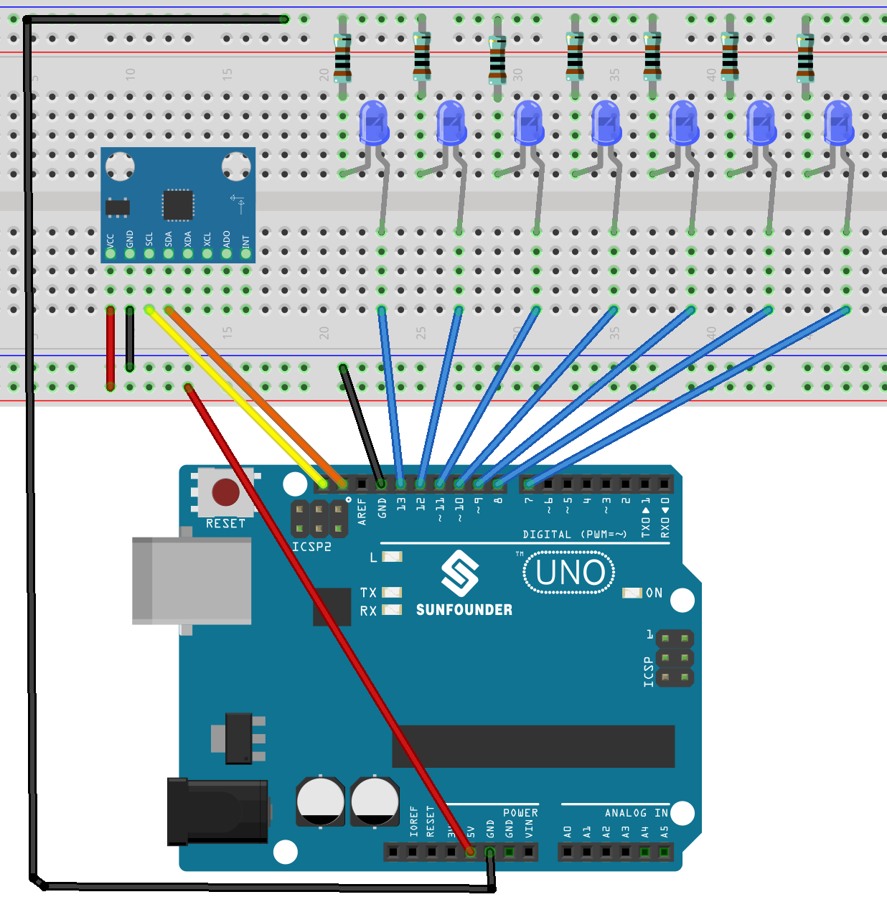

.. _tilt_led1.0:

Tilt LED 1.0
==============================================================

.. note::
  
  🌟 Welcome to the SunFounder Facebook Community! Whether you're into Raspberry Pi, Arduino, or ESP32, you'll find inspiration, help ideas here.
   
  - ✅ Be the first to get free learning resources. 
   
  - ✅ Stay updated on new products & exclusive giveaways. 
   
  - ✅ Share your creations and get real feedback.
   
  * 👉 Need faster updates or support? Click [|link_sf_facebook|] join our Facebook community 

  * 👉 Or join our WhatsApp group: Click [|link_sf_whatsapp|]
   
  * 🎁 Looking for parts?Check out our all-in-one kits below — packed with components, beginner-friendly guides, and tons of fun.
  
  .. list-table::
    :widths: 20 20 20
    :header-rows: 1

    *   - Name	
        - Includes Arduino board
        - PURCHASE LINK
    *   - Universal Maker Sensor Kit
        - ×
        - |link_umsk_buy|

Course Introduction
------------------------

In this lesson, you’ll learn how to use MPU6050 Module with the Arduino R3 to control the LED show. 

In this setup, the number of lit LEDs will increase as the tilt angle of the MPU6050 increases.

.. raw:: html

  <iframe width="700" height="394" src="https://www.youtube.com/embed/begRxqybzGA?si=fvQztEa8NYXPeAe0" title="YouTube video player" frameborder="0" allow="accelerometer; autoplay; clipboard-write; encrypted-media; gyroscope; picture-in-picture; web-share" referrerpolicy="strict-origin-when-cross-origin" allowfullscreen></iframe>

.. note::

  If this is your first time working with an Arduino project, we recommend downloading and reviewing the basic materials first.

  * :ref:`install_arduino`
  * :ref:`introduce_arduino`

**Required Components**

In this project, we need the following components:

.. list-table::
    :widths: 5 20 5 20
    :header-rows: 1

    *   - SN
        - COMPONENT INTRODUCTION	
        - QUANTITY
        - PURCHASE LINK

    *   - 1
        - Arduino UNO R3
        - 1
        - |link_arduinor3_buy|
    *   - 2
        - USB Type-C cable
        - 1
        - 
    *   - 3
        - Breadboard
        - 1
        - |link_breadboard_buy|
    *   - 4
        - Wires
        - Several
        - |link_wires_buy|
    *   - 5
        - 1kΩ resistor
        - Several
        - |link_resistor_buy|
    *   - 6
        - LED
        - Several
        - |link_led_buy|
    *   - 7
        - MPU6050 Module
        - 1
        - |link_mpu6050_buy|

**Wiring**

**Common Connections:**

* **LED**

  - Connect the LEDs **anode** to a **1kΩ resistor** then to the negative power bus on the breadboard, and the LEDs **cathode** to **8** to **13** on the Arduino.

* **MPU6050**

  - **SDA:** Connect to **SDA** on the Arduino.
  - **SCL:** Connect to **SCL** on the Arduino.
  - **GND:** Connect to breadboard’s negative power bus.
  - **VCC:** Connect to breadboard’s red power bus.

**Writing the Code**

.. note::

    * You can copy this code into **Arduino IDE**. 
    * To install the library, use the Arduino Library Manager and search for **MPU6050** and install it.
    * Don't forget to select the board(Arduino UNO R3) and the correct port before clicking the **Upload** button.

.. code-block:: arduino

      #include <Wire.h>
      #include <MPU6050.h>

      MPU6050 mpu;

      // LED pins 7-13 on Arduino
      const int ledPins[] = {13, 12, 11, 10, 9, 8, 7}; 
      int ledCount = sizeof(ledPins) / sizeof(ledPins[0]); // LED count

      void setup() {
        Wire.begin(); // Init I2C
        Serial.begin(9600); // Init serial
        
        // Init MPU6050
        mpu.initialize(); 
        if (!mpu.testConnection()) {
          Serial.println("MPU6050 connection failed");
          while (1); // Stop if MPU6050 fails
        }
        
        // Set LED pins as output
        for (int i = 0; i < ledCount; i++) {
          pinMode(ledPins[i], OUTPUT);
        }
      }

      void loop() {
        int16_t ax, ay, az; // Acceleration data
        
        // Get MPU6050 acceleration
        mpu.getAcceleration(&ax, &ay, &az);
        
        // Calculate tilt angle (X-axis)
        float angleX = atan2(ay, az) * 180 / PI;
        
        // Update LEDs based on angle
        updateLEDs(angleX);
        
        delay(100); // Stabilize output
      }

      // Update LEDs based on angle
      void updateLEDs(float angleX) {
        // Turn off all LEDs by default
        for (int i = 0; i < ledCount; i++) {
          digitalWrite(ledPins[i], LOW);
        }
        
        // Determine how many LEDs to turn on based on tilt angle
        int ledIndex = mapAngleToLEDs(angleX);
        
        // Turn on the appropriate number of LEDs
        for (int i = 0; i <= ledIndex; i++) {
          digitalWrite(ledPins[i], HIGH);
        }
      }

      // Map tilt angle to the number of LEDs to light up
      int mapAngleToLEDs(float angleX) {
        // Limit the angle to [-90, 90] range
        angleX = constrain(angleX, -90, 90);
        
        // Calculate how many LEDs to light based on the angle
        // When angle is close to vertical (90° or -90°), more LEDs light up
        // When angle is close to horizontal (0°), fewer LEDs light up
        // At exactly 0° (horizontal), no LED lights up
        
        int ledIndex = map(abs(angleX), 0, 90, 0, ledCount - 1);
        
        // If the angle is exactly horizontal, no LEDs should be lit
        if (angleX == 0) {
          ledIndex = -1;
        }
        
        return ledIndex;
      }
