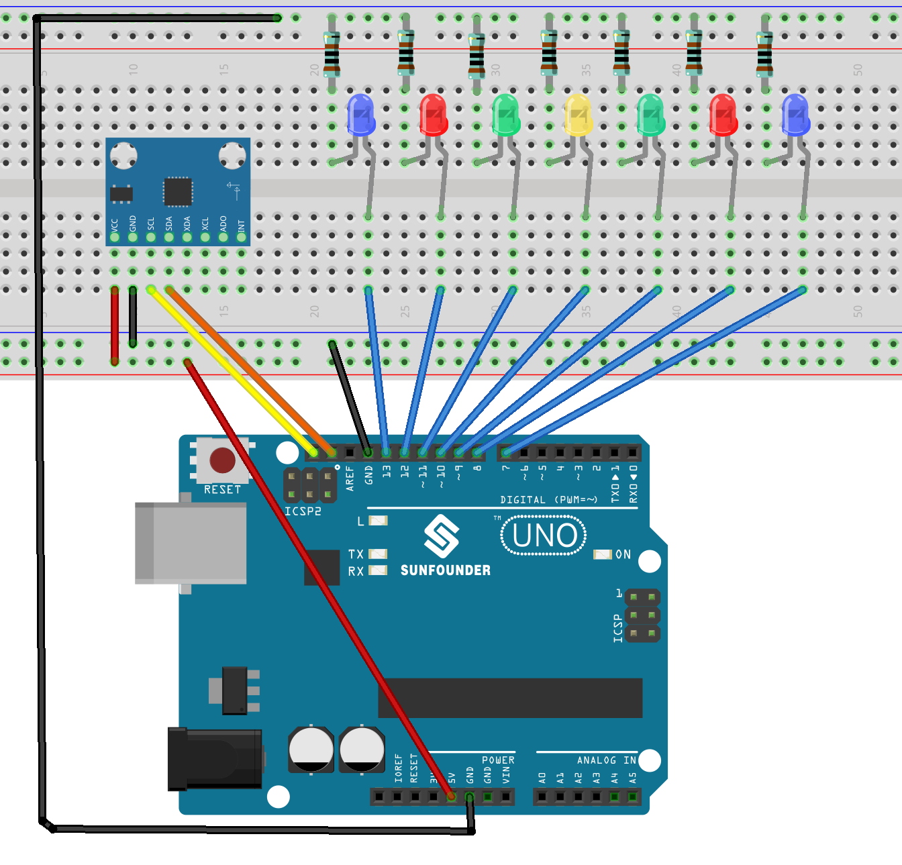

.. _tilt_led2.0:

Tilt LED 2.0
==============================================================

.. note::
  
  🌟 Welcome to the SunFounder Facebook Community! Whether you're into Raspberry Pi, Arduino, or ESP32, you'll find inspiration, help ideas here.
   
  - ✅ Be the first to get free learning resources. 
   
  - ✅ Stay updated on new products & exclusive giveaways. 
   
  - ✅ Share your creations and get real feedback
   
  * 👉 Need faster updates or support? Click [|link_sf_facebook|] join our Facebook community 

  * 👉 Or join our WhatsApp group: Click [|link_sf_whatsapp|]
   
  * 🎁 Looking for parts?Check out our all-in-one kits below — packed with components, beginner-friendly guides, and tons of fun.
  
  .. list-table::
    :widths: 20 20 20
    :header-rows: 1

    *   - Name	
        - Includes Arduino board
        - PURCHASE LINK
    *   - Universal Maker Sensor Kit
        - ×
        - |link_umsk_buy|

Course Introduction
------------------------

This project controls an array of LEDs based on the tilt angle detected by an MPU6050 sensor. 

The LEDs illuminate in response to X-axis tilt, visually indicating the board's orientation. 

Tilt angles are continuously calculated from acceleration data provided by the MPU6050, and corresponding LEDs activate according to predefined angle thresholds.

.. .. raw:: html

..  <iframe width="700" height="394" src="https://www.youtube.com/embed/yu5bHYTUZGM?si=vAyT6zkDEDQUF-wg" title="YouTube video player" frameborder="0" allow="accelerometer; autoplay; clipboard-write; encrypted-media; gyroscope; picture-in-picture; web-share" referrerpolicy="strict-origin-when-cross-origin" allowfullscreen></iframe>

.. note::

  If this is your first time working with an Arduino project, we recommend downloading and reviewing the basic materials first.

  * :ref:`install_arduino`
  * :ref:`introduce_arduino`

**Required Components**

In this project, we need the following components:

.. list-table::
    :widths: 5 20 5 20
    :header-rows: 1

    *   - SN
        - COMPONENT INTRODUCTION
        - QUANTITY
        - PURCHASE LINK

    *   - 1
        - Arduino UNO R3
        - 1
        - |link_arduinor3_buy|
    *   - 2
        - USB Type-C cable
        - 1
        - 
    *   - 3
        - Breadboard
        - 1
        - |link_breadboard_buy|
    *   - 4
        - Wires
        - Several
        - |link_wires_buy|
    *   - 5
        - 1kΩ resistor
        - Several
        - |link_resistor_buy|
    *   - 6
        - LED
        - Several
        - |link_led_buy|
    *   - 7
        - MPU6050 Module
        - 1
        - |link_mpu6050_buy|

**Wiring**

**Common Connections:**

* **LED**

  - Connect the LEDs **anode** to a **1kΩ resistor** then to the negative power bus on the breadboard, and the LEDs **cathode** to **8** to **13** on the Arduino.

* **MPU6050**

  - **SDA:** Connect to **SDA** on the Arduino.
  - **SCL:** Connect to **SCL** on the Arduino.
  - **GND:** Connect to breadboard’s negative power bus.
  - **VCC:** Connect to breadboard’s red power bus.

**Writing the Code**

.. note::

    * You can copy this code into **Arduino IDE**. 
    * To install the library, use the Arduino Library Manager and search for **MPU6050** and install it.
    * Don't forget to select the board(Arduino UNO R4 Minima) and the correct port before clicking the **Upload** button.

.. code-block:: arduino

      #include <Wire.h>
      #include <MPU6050.h>

      MPU6050 mpu;

      // LED pins 7-13 on Arduino
      const int ledPins[] = {13, 12, 11, 10, 9, 8, 7}; 
      int ledCount = sizeof(ledPins) / sizeof(ledPins[0]); // LED count

      // Tilt angle thresholds for LEDs
      const float thresholds[] = {-30, -15, -5, 5, 15, 30};

      void setup() {
        Wire.begin(); // Init I2C
        Serial.begin(9600); // Init serial
        
        // Init MPU6050
        mpu.initialize(); 
        if (!mpu.testConnection()) {
          Serial.println("MPU6050 connection failed");
          while (1); // Stop if MPU6050 fails
        }
        
        // Set LED pins as output
        for (int i = 0; i < ledCount; i++) {
          pinMode(ledPins[i], OUTPUT);
        }
      }

      void loop() {
        int16_t ax, ay, az; // Acceleration data
        
        // Get MPU6050 acceleration
        mpu.getAcceleration(&ax, &ay, &az);
        
        // Calculate tilt angle (X-axis)
        float angleX = atan2(ay, az) * 180 / PI;
        
        // Update LEDs based on angle
        updateLEDs(angleX);
        
        delay(100); // Stabilize output
      }

      // Update LEDs based on angle
      void updateLEDs(float angleX) {
        // Turn off all LEDs
        for (int i = 0; i < ledCount; i++) {
          digitalWrite(ledPins[i], LOW);
        }

        // Get the LED index for the angle
        int ledIndex = getLEDIndex(angleX);

        // Turn on the correct LED
        if (ledIndex >= 0 && ledIndex < ledCount) {
          digitalWrite(ledPins[ledIndex], HIGH);
        }
      }

      // Determine the LED index for the angle
      int getLEDIndex(float angleX) {
        // Find the matching LED
        for (int i = 0; i < ledCount - 1; i++) {
          if (angleX < thresholds[i]) {
            return i; // Return matching LED index
          }
        }
        return ledCount - 1; // Return last LED if angle exceeds thresholds
      }