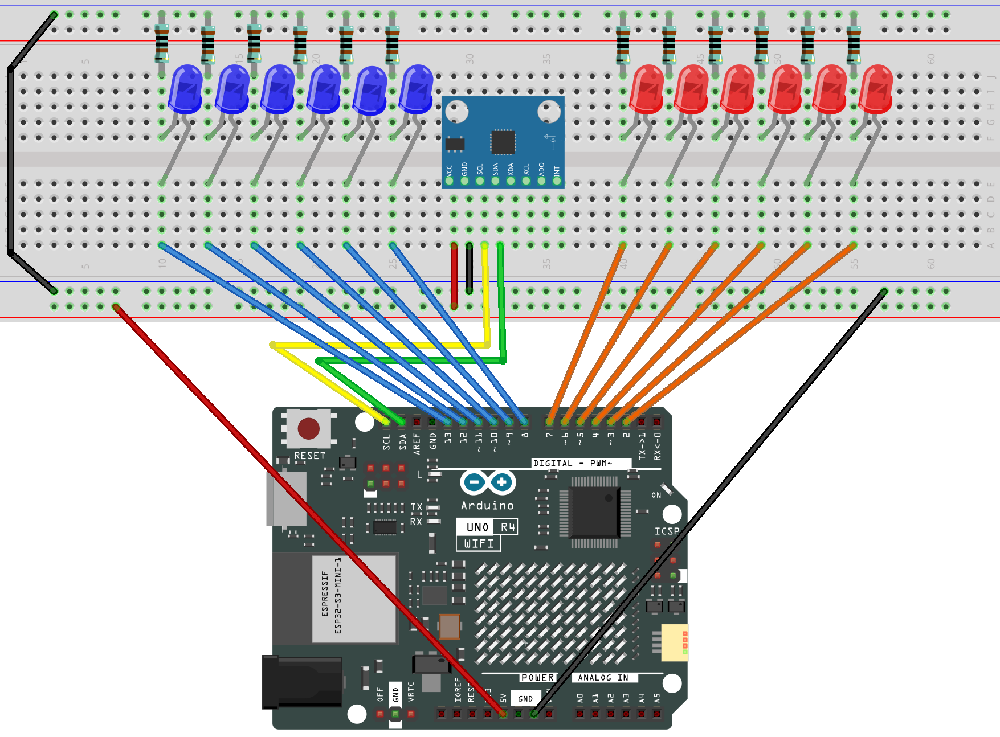

.. _tilt_led3.0:

Tilt LED 3.0
==============================================================

.. note::
  
  🌟 Welcome to the SunFounder Facebook Community! Whether you're into Raspberry Pi, Arduino, or ESP32, you'll find inspiration, help ideas here.
   
  - ✅ Be the first to get free learning resources. 
   
  - ✅ Stay updated on new products & exclusive giveaways. 
   
  - ✅ Share your creations and get real feedback.
   
  * 👉 Need faster updates or support? Click [|link_sf_facebook|] join our Facebook community 

  * 👉 Or join our WhatsApp group: Click [|link_sf_whatsapp|]
   
Kit purchase
------------------------

Looking for parts? Check out our all-in-one kits below — packed with components, beginner-friendly guides, and tons of fun.

.. image:: img/ultimate_sensor_kit.png
   :width: 100%
   :align: center
   :target: https://www.sunfounder.com/collections/arduino-kits-bundles/products/sunfounder-ultimate-sensor-kit-with-original-arduino-uno-r4-minima?ref=jbzmncle

.. raw:: html

     

.. list-table::
   :widths: 20 20 20
   :header-rows: 1

   * - Name
     - Includes Arduino board
     - PURCHASE LINK
   * - Elite Explorer Kit
     - Arduino Uno R4 WiFi
     - |link_elite_buy|
   * - 3 in 1 Ultimate Starter Kit
     - Arduino Uno R4 Minima
     - |link_arduinor4_buy|

Course Introduction
------------------------

This Arduino project uses an MPU6050 sensor to control two arrays of LEDs, showing the board’s tilt direction and angle in real time.

Red LEDs light up as the board tilts left, while blue LEDs light up as it tilts right. The tilt angle is calculated from accelerometer data, and LEDs activate step by step for every ~7° beyond a small dead zone near 0°.

This creates a clear visual indicator of orientation, with live angle values also printed to the serial monitor.

.. raw:: html

  <iframe width="700" height="394" src="https://www.youtube.com/embed/JGH49NYUBis?si=ckGvbNd14p3jd2uO" title="YouTube video player" frameborder="0" allow="accelerometer; autoplay; clipboard-write; encrypted-media; gyroscope; picture-in-picture; web-share" referrerpolicy="strict-origin-when-cross-origin" allowfullscreen></iframe>

.. note::

  If this is your first time working with an Arduino project, we recommend downloading and reviewing the basic materials first.

  * :ref:`install_arduino`
  * :ref:`introduce_arduino`

**Required Components**

In this project, we need the following components:

.. list-table::
    :widths: 5 20 5 20
    :header-rows: 1

    *   - SN
        - COMPONENT INTRODUCTION
        - QUANTITY
        - PURCHASE LINK

    *   - 1
        - Arduino UNO R4
        - 1
        - |link_unor4_buy|
    *   - 2
        - USB Type-C cable
        - 1
        - 
    *   - 3
        - Breadboard
        - 1
        - |link_breadboard_buy|
    *   - 4
        - Wires
        - Several
        - |link_wires_buy|
    *   - 5
        - 1kΩ resistor
        - Several
        - |link_resistor_buy|
    *   - 12
        - LED
        - Several
        - |link_led_buy|
    *   - 7
        - MPU6050 Module
        - 1
        - |link_mpu6050_buy|

**Wiring**

**Common Connections:**

* **BLUE LED**

  - Connect the LEDs **cathode** to a **1kΩ resistor** then to the negative power bus on the breadboard, and the LEDs **anode** to **2** to **7** on the Arduino.

* **RED LED**

  - Connect the LEDs **cathode** to a **1kΩ resistor** then to the negative power bus on the breadboard, and the LEDs **anode** to **8** to **13** on the Arduino.

* **MPU6050**

  - **SDA:** Connect to **SDA** on the Arduino.
  - **SCL:** Connect to **SCL** on the Arduino.
  - **GND:** Connect to breadboard’s negative power bus.
  - **VCC:** Connect to breadboard’s red power bus.

**Writing the Code**

.. note::

    * You can copy this code into **Arduino IDE**. 
    * To install the library, use the Arduino Library Manager and search for **MPU6050** and install it.
    * Don't forget to select the board(Arduino UNO R3) and the correct port before clicking the **Upload** button.

.. code-block:: arduino

      #include <Wire.h>
      #include <MPU6050.h>

      MPU6050 mpu;

      // Red LEDs on pins 7-2 (reverse order, from center to left edge)
      const int redPins[] = {7, 6, 5, 4, 3, 2};
      const int redCount = sizeof(redPins) / sizeof(redPins[0]);

      // Blue LEDs on pins 8-13 (from center to right edge)
      const int bluePins[] = {8, 9, 10, 11, 12, 13};
      const int blueCount = sizeof(bluePins) / sizeof(bluePins[0]);

      // Dead zone around 0° (avoid flicker when board is almost flat)
      const float deadZone = 5.0;

      // Angle step per LED (each LED lights up per 7° tilt)
      const float anglePerLED = 7.0;

      void setup() {
        Serial.begin(9600); // Start serial monitor for debugging

        Wire.begin();            // Start I2C communication
        Wire.setClock(100000);   // Set I2C speed to 100kHz (more stable)

        // Initialize MPU6050 sensor
        mpu.initialize();
        if (!mpu.testConnection()) {
          Serial.println("MPU6050 connection failed at startup!");
          while (1); // Stop here if MPU6050 not connected
        }

        // Initialize red LEDs as outputs
        for (int i = 0; i < redCount; i++) {
          pinMode(redPins[i], OUTPUT);
          digitalWrite(redPins[i], LOW);
        }

        // Initialize blue LEDs as outputs
        for (int i = 0; i < blueCount; i++) {
          pinMode(bluePins[i], OUTPUT);
          digitalWrite(bluePins[i], LOW);
        }

        Serial.println("MPU6050 ready. Tilt the board left/right.");
      }

      void loop() {
        int16_t ax, ay, az; // Variables to store raw acceleration data

        if (mpu.testConnection()) {
          // Read acceleration data from MPU6050
          mpu.getAcceleration(&ax, &ay, &az);

          // Calculate tilt angle around X-axis
          float angleX = atan2((float)ay, (float)az) * 180.0 / PI;

          // Update LEDs based on the tilt angle
          updateLEDs(angleX);

          // Print angle for debugging
          Serial.print("AngleX: ");
          Serial.println(angleX);
        } else {
          // If connection is lost, try to reinitialize the sensor
          Serial.println("Lost connection to MPU6050! Reinitializing...");
          mpu.initialize();
          delay(100);

          if (mpu.testConnection()) {
            Serial.println("Reinitialized MPU6050 successfully.");
          } else {
            Serial.println("Reinit failed, will retry...");
          }
        }

        delay(100); // Delay for ~10Hz refresh rate
      }

      // Function to update LEDs depending on the tilt angle
      void updateLEDs(float angleX) {
        // First, turn all LEDs off
        for (int i = 0; i < redCount; i++) digitalWrite(redPins[i], LOW);
        for (int i = 0; i < blueCount; i++) digitalWrite(bluePins[i], LOW);

        // If tilted left, light up red LEDs (starting from pin 7 down to 2)
        if (angleX < -deadZone) {
          int num = min(redCount, (int)(abs(angleX) / anglePerLED) + 1);
          for (int i = 0; i < num; i++) digitalWrite(redPins[i], HIGH);
        }
        // If tilted right, light up blue LEDs (starting from pin 8 up to 13)
        else if (angleX > deadZone) {
          int num = min(blueCount, (int)(abs(angleX) / anglePerLED) + 1);
          for (int i = 0; i < num; i++) digitalWrite(bluePins[i], HIGH);
        }
        // If within dead zone (flat), keep all LEDs off
      }
