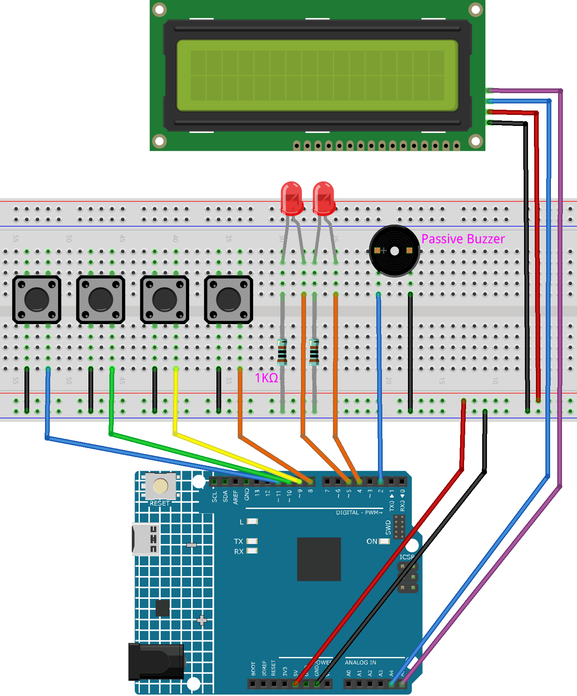

.. _timer:

Timer
==============================================================
.. note::
  
  Hello, welcome to the SunFounder Raspberry Pi & Arduino & ESP32 Enthusiasts Community on Facebook! Dive deeper into Raspberry Pi, Arduino, and ESP32 with fellow enthusiasts.

  👉 Ready to explore and create with us? Click [|link_sf_facebook|] and join today!

  To get all the components for this project, consider one of the kits below. 

  Each includes the required parts, extra components for other projects, and beginner-friendly tutorials.

  .. list-table::
    :widths: 20 20 20
    :header-rows: 1

    *   - Name	
        - Includes Arduino board
        - PURCHASE LINK
    *   - Electronic Kit	
        - ×
        - |link_electronic_buy|
    *   - Elite Explorer Kit	
        - Arduino Uno R4 WiFi
        - |link_elite_buy|
    *   - 3 in 1 Ultimate Starter Kit	
        - Arduino Uno R4 Minima
        - |link_arduinor4_buy|

Course Introduction
------------------------

In this lesson, you'll learn how to create a timer using LED, button, passive buzzer, and I2C LCD 1602 with Arduino. 

After setting the countdown by pressing the button, the LED will blink every second, and when the countdown ends, the buzzer will sound, and the LED will keep flashing.

.. raw:: html

  <iframe width="700" height="394" src="https://www.youtube.com/embed/lCq9ZTEv72s?si=8sEZNWgKiy5no3nR" title="YouTube video player" frameborder="0" allow="accelerometer; autoplay; clipboard-write; encrypted-media; gyroscope; picture-in-picture; web-share" referrerpolicy="strict-origin-when-cross-origin" allowfullscreen></iframe>

.. note::

  If this is your first time working with an Arduino project, we recommend downloading and reviewing the basic materials first.
  
  * :ref:`install_arduino`
  * :ref:`introduce_arduino`

**Required Components**

In this project, we need the following components:

.. list-table::
    :widths: 5 20 5 20
    :header-rows: 1

    *   - SN
        - COMPONENT INTRODUCTION	
        - QUANTITY
        - PURCHASE LINK

    *   - 1
        - Arduino UNO R4 Minima
        - 1
        - |link_unor4_buy|
    *   - 2
        - USB Type-C cable
        - 1
        - 
    *   - 3
        - Breadboard
        - 1
        - |link_breadboard_buy|
    *   - 4
        - Wires
        - Several
        - |link_wires_buy|
    *   - 5
        - 1kΩ resistor
        - 2
        - |link_resistor_buy|
    *   - 6
        - Button
        - 4
        - |link_button_buy|
    *   - 7
        - LED
        - 2
        - |link_led_buy|
    *   - 8
        - I2C LCD 1602
        - 1
        - |link_i2clcd1602_buy|
    *   - 9
        - Passive Buzzer
        - 1
        - |link_passive_buzzer_buy|

**Wiring**

**Common Connections:**

* **LED**

  - Connect the LEDs **anode** to a **1kΩ resistor** then to the negative power bus on the breadboard, and the LEDs **cathode** to **4**, **5** on the Arduino.

* **Button**

  - Connect to breadboard’s negative power bus.
  - Connect to Digital **8** to **11** on the Arduino.

* **Passive Buzzer**

  - **＋:** Connect to Digital **2** on the Arduino.
  - **－:** Connect to breadboard’s negative power bus.

* **I2C LCD 1602**

  - **SDA:** Connect to **A4** on the Arduino.
  - **SCL:** Connect to **A5** on the Arduino.
  - **GND:** Connect to breadboard’s negative power bus.
  - **VCC:** Connect to breadboard’s red power bus.

**Writing the Code**

.. note::

    * You can copy this code into **Arduino IDE**. 
    * To install the library, use the Arduino Library Manager and search for **LiquidCrystal I2C** and install it.
    * Don't forget to select the board(Arduino UNO R4 Minima) and the correct port before clicking the **Upload** button.

.. code-block:: arduino

      #include <Wire.h>
      #include <LiquidCrystal_I2C.h>

      LiquidCrystal_I2C lcd(0x27, 16, 2);

      // Pin definitions
      const int buzzerPin = 2;
      const int led1Pin = 4;
      const int led2Pin = 5;
      const int buttonRed = 8;
      const int buttonYellow = 9;
      const int buttonGreen = 10;
      const int buttonBlue = 11;

      // Timer states
      enum TimerState { IDLE, SET_SS, SET_MM, SET_HH, READY, RUNNING, PAUSED, FINISHED };
      TimerState state = IDLE;

      // Time variables
      int seconds = 0, minutes = 0, hours = 0;
      unsigned long previousMillis = 0;
      unsigned long ledBlinkMillis = 0;
      bool ledState = false;

      // Setting process control
      int settingStage = 0;
      unsigned long totalSeconds = 0;

      // Button state tracking
      bool lastYellowState = HIGH;
      bool lastGreenState = HIGH;
      bool lastBlueState = HIGH;

      // Variables for enhanced red button handling
      unsigned long redLastTriggered = 0;
      bool redHandled = false;

      void setup() {
        Serial.begin(9600);
        lcd.init();
        lcd.backlight();
        showTitle("Timer");

        pinMode(buzzerPin, OUTPUT);
        pinMode(led1Pin, OUTPUT);
        pinMode(led2Pin, OUTPUT);

        // Use internal pull-up resistor for buttons
        pinMode(buttonRed, INPUT_PULLUP);
        pinMode(buttonYellow, INPUT_PULLUP);
        pinMode(buttonGreen, INPUT_PULLUP);
        pinMode(buttonBlue, INPUT_PULLUP);

        updateDisplay();
      }

      void loop() {
        handleButtons();

        if (state == RUNNING) {
          // Update timer every second
          if (millis() - previousMillis >= 1000) {
            previousMillis = millis();
            Serial.print("Tick: ");
            Serial.println(totalSeconds);
            if (totalSeconds > 0) {
              totalSeconds--;
              convertTotalSeconds();
              updateDisplay();
            } else {
              state = FINISHED;
              showTitle("Time's up!");
              tone(buzzerPin, 1000);
              previousMillis = millis();
              Serial.println("Countdown finished. Entered FINISHED state.");
            }
          }
          handleLEDBlink(500);
        } else if (state == FINISHED) {
          handleLEDBlink(200);
          // After 3 seconds, stop alarm and reset
          if (millis() - previousMillis >= 3000) {
            noTone(buzzerPin);
            state = IDLE;
            resetTimer();
            updateDisplay();
            Serial.println("Finished alert done. Returning to IDLE.");
          }
        }
      }

      void handleButtons() {
        // Enhanced red button with debouncing
        bool currentRed = digitalRead(buttonRed);
        if (!redHandled && currentRed == LOW && millis() - redLastTriggered > 200) {
          redHandled = true;              // Mark this press as handled
          redLastTriggered = millis();    // Update last trigger time
          Serial.println("Red button triggered.");
          Serial.print("Current state: "); Serial.println(state);

          if (state == READY || state == PAUSED) {
            // Calculate total time in seconds from hours, minutes, and seconds
            totalSeconds = seconds + minutes * 60 + hours * 3600;
            Serial.print("Computed totalSeconds: "); Serial.println(totalSeconds);
            if (totalSeconds > 0) {
              state = RUNNING;            // Start countdown
              previousMillis = millis();
              Serial.println("Switched to RUNNING.");
            } else {
              showTitle("Time = 0!");
              Serial.println("Time is 0. Cannot start.");
              for (int i = 0; i < 4; i++) {
                tone(buzzerPin, 2000);
                digitalWrite(led1Pin, HIGH);
                digitalWrite(led2Pin, HIGH);
                delay(100);
                noTone(buzzerPin);
                digitalWrite(led1Pin, LOW);
                digitalWrite(led2Pin, LOW);
                delay(100);
              }
            }
          } else if (state == RUNNING) {
            state = PAUSED;              // Pause the countdown if running
            Serial.println("Switched to PAUSED.");
          }
        }
        if (currentRed == HIGH) redHandled = false;

        // Blue button: step through time setting stages
        bool currentBlue = digitalRead(buttonBlue);
        if (lastBlueState == LOW && currentBlue == HIGH) {
          Serial.println("Blue button released.");
          if (state == IDLE || state == SET_SS || state == SET_MM || state == SET_HH || state == READY) {
            settingStage++;
            Serial.print("Setting stage: "); Serial.println(settingStage);
            if (settingStage == 1) state = SET_SS;
            else if (settingStage == 2) state = SET_MM;
            else if (settingStage == 3) state = SET_HH;
            else {
              totalSeconds = seconds + minutes * 60 + hours * 3600;
              state = READY;
              settingStage = 0;
              Serial.print("Time set to: "); Serial.println(totalSeconds);
              Serial.println("Entered READY state.");
            }
            updateDisplay();
          }
        }
        lastBlueState = currentBlue;

        // Green button: increase time value
        bool currentGreen = digitalRead(buttonGreen);
        if (lastGreenState == LOW && currentGreen == HIGH) {
          Serial.println("Green button released.");
          if (state == SET_SS) {
            seconds = (seconds + 1) % 60;
            Serial.print("Seconds set to: "); Serial.println(seconds);
          } else if (state == SET_MM) {
            minutes = (minutes + 1) % 60;
            Serial.print("Minutes set to: "); Serial.println(minutes);
          } else if (state == SET_HH) {
            hours = (hours + 1) % 100;
            Serial.print("Hours set to: "); Serial.println(hours);
          }
          updateDisplay();
        }
        lastGreenState = currentGreen;

        // Yellow button: reset timer
        bool currentYellow = digitalRead(buttonYellow);
        if (lastYellowState == LOW && currentYellow == HIGH) {
          Serial.println("Yellow button released. Resetting timer.");
          state = IDLE;
          resetTimer();
          updateDisplay();
        }
        lastYellowState = currentYellow;
      }

      void updateDisplay() {
        // Format and center the time string on the LCD
        String timeStr = formatTime(hours) + " : " + formatTime(minutes) + " : " + formatTime(seconds);
        int padding = (16 - timeStr.length()) / 2;
        lcd.setCursor(0, 1);
        lcd.print("                "); // Clear second line
        lcd.setCursor(padding, 1);
        lcd.print(timeStr);

        // Set title text based on current state
        if (state == SET_SS) showTitle("Set Timer SS");
        else if (state == SET_MM) showTitle("Set Timer MM");
        else if (state == SET_HH) showTitle("Set Timer HH");
        else if (state == READY || state == PAUSED || state == RUNNING) showTitle("Timer");
        else if (state == IDLE) showTitle("Timer");
      }

      String formatTime(int val) {
        // Convert time value to two-digit string
        return (val < 10) ? "0" + String(val) : String(val);
      }

      void convertTotalSeconds() {
        // Convert totalSeconds into hours, minutes, and seconds
        hours = totalSeconds / 3600;
        minutes = (totalSeconds % 3600) / 60;
        seconds = totalSeconds % 60;
      }

      void resetTimer() {
        // Reset all time values and outputs
        hours = minutes = seconds = totalSeconds = 0;
        digitalWrite(led1Pin, LOW);
        digitalWrite(led2Pin, LOW);
        noTone(buzzerPin);
        settingStage = 0;
        Serial.println("Timer reset.");
      }

      void handleLEDBlink(int interval) {
        // Blink LEDs at the given interval
        if (millis() - ledBlinkMillis >= interval) {
          ledBlinkMillis = millis();
          ledState = !ledState;
          digitalWrite(led1Pin, ledState);
          digitalWrite(led2Pin, ledState);
        }
      }

      void showTitle(String text) {
        // Clear the title line and display centered text
        lcd.setCursor(0, 0);
        lcd.print("                "); // Clear first line
        int spaces = (16 - text.length()) / 2;
        lcd.setCursor(spaces, 0);
        lcd.print(text);
      }
