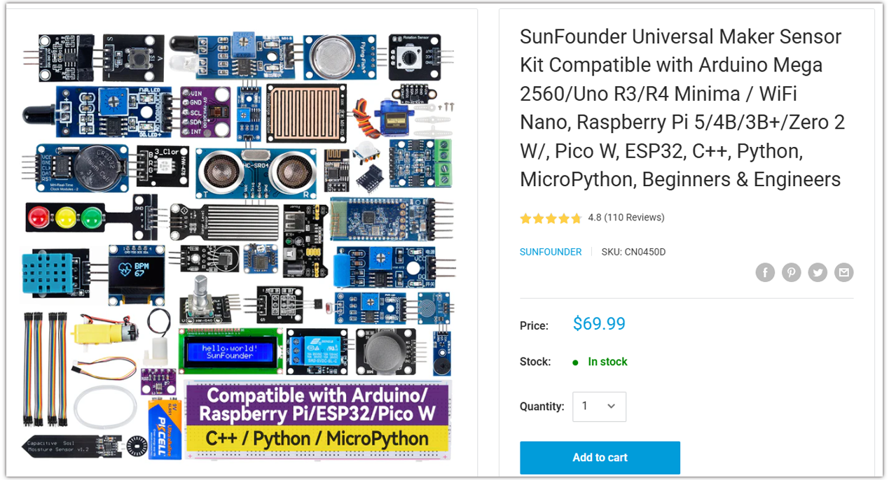
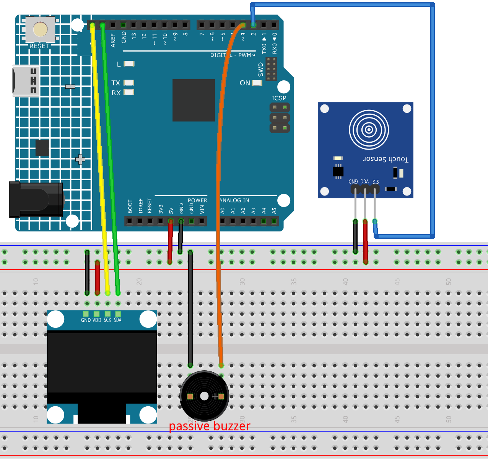

.. _touch_pet:

Touch Pet
==============================================================

.. note::
  
  🌟 Welcome to the SunFounder Facebook Community! Whether you're into Raspberry Pi, Arduino, or ESP32, you'll find inspiration, help ideas here.
   
  - ✅ Be the first to get free learning resources. 
   
  - ✅ Stay updated on new products & exclusive giveaways. 
   
  - ✅ Share your creations and get real feedback.
   
  * 👉 Need faster updates or support? Click [|link_sf_facebook|] join our Facebook community 

  * 👉 Or join our WhatsApp group: Click [|link_sf_whatsapp|]
   
Kit purchase
------------------------

Looking for parts? Check out our all-in-one kits below — packed with components, beginner-friendly guides, and tons of fun.

.. raw:: html

     

.. list-table::
   :widths: 20 20 20
   :header-rows: 1

   * - Name
     - Includes Arduino board
     - PURCHASE LINK
   * - Elite Explorer Kit
     - Arduino Uno R4 WiFi
     - |link_elite_buy|
   * - Inventor Lab Kit
     - Arduino Uno R3
     - |link_inventorkit_buy|

Course Introduction
------------------------

In this lesson, you’ll learn how to use an OLED display, a touch sensor, and a passive buzzer with the Arduino R4 UNO to create a touch-interactive digital pet.

The OLED shows a cute pet face in its normal state. When the touch sensor is triggered, the pet randomly changes to different emotions, such as love, happy, relaxed, or excited, while the buzzer plays a short sound effect.

.. raw:: html

  <iframe width="700" height="394" src="https://www.youtube.com/embed/rzD6jAEEYLs" title="YouTube video player" frameborder="0" allow="accelerometer; autoplay; clipboard-write; encrypted-media; gyroscope; picture-in-picture; web-share" referrerpolicy="strict-origin-when-cross-origin" allowfullscreen></iframe>

.. note::

  If this is your first time working with an Arduino project, we recommend downloading and reviewing the basic materials first.

  * :ref:`install_arduino`
  * :ref:`introduce_arduino`

**Required Components**

In this project, we need the following components:

.. list-table::
    :widths: 5 20 5 20
    :header-rows: 1

    *   - SN
        - COMPONENT INTRODUCTION	
        - QUANTITY
        - PURCHASE LINK

    *   - 1
        - Arduino UNO R4 Minima
        - 1
        - |link_unor4_buy|
    *   - 2
        - USB Type-C cable
        - 1
        - 
    *   - 3
        - Breadboard
        - 1
        - |link_breadboard_buy|
    *   - 4
        - Wires
        - Several
        - |link_wires_buy|
    *   - 5
        - Button
        - 3
        - |link_button_buy|
    *   - 6
        - OLED Display Module
        - 1
        - |link_oled_buy|
    *   - 7
        - Passive Buzzer
        - 1
        - |link_passive_buzzer_buy|
    *   - 8
        - Touch Sensor Module
        - 1
        - |link_touch_buy|

**Wiring**

**Common Connections:**

* **OLED Display Module**

  - **SDA:** Connect to **SDA** on the Arduino.
  - **SCK:** Connect to **SCL** on the Arduino.
  - **GND:** Connect to breadboard’s negative power bus.
  - **VCC:** Connect to breadboard’s red power bus.

* **Passive Buzzer**

  - **＋:** Connect to **3** on the Arduino.
  - **－:** Connect to breadboard’s negative power bus.

* **Touch Sensor Module**

  - **SIG:** Connect to **2** on the Arduino.
  - **GND:** Connect to breadboard’s negative power bus.
  - **VCC:** Connect to breadboard’s red power bus.

**Writing the Code**

.. note::

    * You can copy this code into **Arduino IDE**. 
    * To install the library, use the Arduino Library Manager and search for **Adafruit SSD1306** and **Adafruit GFX** and install it.
    * Don't forget to select the board(Arduino UNO R4) and the correct port before clicking the **Upload** button.

.. code-block:: arduino

      #include <Wire.h>
      #include <Adafruit_GFX.h>
      #include <Adafruit_SSD1306.h>

      // OLED settings
      #define SCREEN_WIDTH 128
      #define SCREEN_HEIGHT 64
      #define OLED_RESET -1
      #define OLED_ADDR 0x3C

      Adafruit_SSD1306 display(SCREEN_WIDTH, SCREEN_HEIGHT, &Wire, OLED_RESET);

      // Pins
      const int TOUCH_PIN = 2;
      const int BUZZER_PIN = 3;

      // Touch logic
      // Most touch modules output HIGH when touched.
      // If your module works the opposite way, change HIGH to LOW.
      const int TOUCH_ACTIVE_STATE = HIGH;

      // Timing
      unsigned long lastBlinkTime = 0;
      unsigned long lastTouchTime = 0;
      unsigned long emotionStartTime = 0;

      const unsigned long blinkInterval = 3000;
      const unsigned long emotionDuration = 2500;
      const unsigned long debounceDelay = 300;

      bool isTouched = false;
      bool showingEmotion = false;
      bool eyeClosed = false;

      int currentEmotion = 0;

      // Emotion types
      // 0 = normal
      // 1 = love
      // 2 = happy
      // 3 = enjoy
      // 4 = excited

      void setup() {
        pinMode(TOUCH_PIN, INPUT);
        pinMode(BUZZER_PIN, OUTPUT);

        randomSeed(analogRead(A0));

        if (!display.begin(SSD1306_SWITCHCAPVCC, OLED_ADDR)) {
          while (true);
        }

        display.clearDisplay();
        display.display();

        drawNormalFace(false);
      }

      void loop() {
        handleTouch();

        if (showingEmotion) {
          if (millis() - emotionStartTime >= emotionDuration) {
            showingEmotion = false;
            currentEmotion = 0;
            drawNormalFace(false);
          }
        } else {
          handleBlink();
        }
      }

      void handleTouch() {
        bool touchState = digitalRead(TOUCH_PIN);

        if (touchState == TOUCH_ACTIVE_STATE && !isTouched) {
          if (millis() - lastTouchTime > debounceDelay) {
            isTouched = true;
            lastTouchTime = millis();

            currentEmotion = random(1, 5);
            showingEmotion = true;
            emotionStartTime = millis();

            playHappySound();
            drawEmotion(currentEmotion);
          }
        }

        if (touchState != TOUCH_ACTIVE_STATE) {
          isTouched = false;
        }
      }

      void handleBlink() {
        if (millis() - lastBlinkTime >= blinkInterval) {
          lastBlinkTime = millis();

          drawNormalFace(true);
          delay(90);
          drawNormalFace(false);
        }
      }

      void playHappySound() {
        tone(BUZZER_PIN, 523, 100);
        delay(120);
        tone(BUZZER_PIN, 659, 100);
        delay(120);
        tone(BUZZER_PIN, 784, 150);
        delay(180);
        noTone(BUZZER_PIN);
      }

      void drawEmotion(int emotion) {
        display.clearDisplay();

        if (emotion == 1) {
          drawLoveFace();
        } else if (emotion == 2) {
          drawHappyFace();
        } else if (emotion == 3) {
          drawEnjoyFace();
        } else if (emotion == 4) {
          drawExcitedFace();
        }

        display.display();
      }

      void drawNormalFace(bool closedEyes) {
        display.clearDisplay();

        drawPetBody();

        if (closedEyes) {
          display.drawLine(40, 26, 54, 26, SSD1306_WHITE);
          display.drawLine(74, 26, 88, 26, SSD1306_WHITE);
        } else {
          display.fillCircle(47, 26, 6, SSD1306_WHITE);
          display.fillCircle(81, 26, 6, SSD1306_WHITE);
          display.fillCircle(49, 24, 2, SSD1306_BLACK);
          display.fillCircle(83, 24, 2, SSD1306_BLACK);
        }

        // Mouth
        display.drawLine(58, 42, 64, 46, SSD1306_WHITE);
        display.drawLine(64, 46, 70, 42, SSD1306_WHITE);

        display.setTextSize(1);
        display.setTextColor(SSD1306_WHITE);
        display.setCursor(44, 55);
        display.print("Touch me");

        display.display();
      }

      void drawPetBody() {
        // Head outline
        display.drawRoundRect(24, 8, 80, 46, 12, SSD1306_WHITE);

        // Ears
        display.drawTriangle(32, 10, 42, 0, 50, 10, SSD1306_WHITE);
        display.drawTriangle(78, 10, 88, 0, 96, 10, SSD1306_WHITE);

        // Cheeks
        display.drawCircle(35, 38, 3, SSD1306_WHITE);
        display.drawCircle(93, 38, 3, SSD1306_WHITE);
      }

      void drawLoveFace() {
        drawPetBody();

        // Heart eyes
        drawHeart(43, 25);
        drawHeart(79, 25);

        // Smile
        display.drawLine(55, 42, 60, 47, SSD1306_WHITE);
        display.drawLine(60, 47, 68, 47, SSD1306_WHITE);
        display.drawLine(68, 47, 73, 42, SSD1306_WHITE);

        display.setTextSize(1);
        display.setCursor(42, 55);
        display.print("Love you!");
      }

      void drawHappyFace() {
        drawPetBody();

        // Happy eyes
        display.drawLine(38, 27, 45, 21, SSD1306_WHITE);
        display.drawLine(45, 21, 52, 27, SSD1306_WHITE);

        display.drawLine(76, 27, 83, 21, SSD1306_WHITE);
        display.drawLine(83, 21, 90, 27, SSD1306_WHITE);

        // Big smile
        display.drawLine(52, 41, 58, 48, SSD1306_WHITE);
        display.drawLine(58, 48, 70, 48, SSD1306_WHITE);
        display.drawLine(70, 48, 76, 41, SSD1306_WHITE);

        display.setTextSize(1);
        display.setCursor(48, 55);
        display.print("Happy!");
      }

      void drawEnjoyFace() {
        drawPetBody();

        // Closed relaxed eyes
        display.drawLine(38, 25, 52, 25, SSD1306_WHITE);
        display.drawLine(76, 25, 90, 25, SSD1306_WHITE);

        // Small mouth
        display.drawCircle(64, 42, 4, SSD1306_WHITE);

        display.setTextSize(1);
        display.setCursor(48, 55);
        display.print("So nice");
      }

      void drawExcitedFace() {
        drawPetBody();

        // Star-like eyes
        drawStar(47, 26);
        drawStar(81, 26);

        // Excited mouth
        display.drawRoundRect(56, 39, 16, 10, 4, SSD1306_WHITE);

        display.setTextSize(1);
        display.setCursor(45, 55);
        display.print("Again!");
      }

      void drawHeart(int x, int y) {
        display.fillCircle(x - 3, y - 2, 3, SSD1306_WHITE);
        display.fillCircle(x + 3, y - 2, 3, SSD1306_WHITE);
        display.fillTriangle(x - 7, y, x + 7, y, x, y + 8, SSD1306_WHITE);
      }

      void drawStar(int x, int y) {
        display.drawLine(x, y - 7, x, y + 7, SSD1306_WHITE);
        display.drawLine(x - 7, y, x + 7, y, SSD1306_WHITE);
        display.drawLine(x - 5, y - 5, x + 5, y + 5, SSD1306_WHITE);
        display.drawLine(x + 5, y - 5, x - 5, y + 5, SSD1306_WHITE);
      }