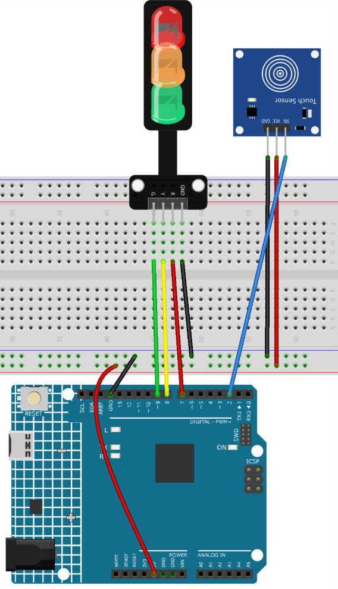

.. _touch_toggle:

Touch Toggle 
==============================================================

.. note::
  
  🌟 Welcome to the SunFounder Facebook Community! Whether you're into Raspberry Pi, Arduino, or ESP32, you'll find inspiration, help ideas here.
   
  - ✅ Be the first to get free learning resources. 
   
  - ✅ Stay updated on new products & exclusive giveaways. 
   
  - ✅ Share your creations and get real feedback.
   
  * 👉 Need faster updates or support? Click [|link_sf_facebook|] join our Facebook community 

  * 👉 Or join our WhatsApp group: Click [|link_sf_whatsapp|]
   
Kit purchase
------------------------

Looking for parts? Check out our all-in-one kits below — packed with components, beginner-friendly guides, and tons of fun.

.. image:: img/ultimate_sensor_kit.png
   :width: 100%
   :align: center
   :target: https://www.sunfounder.com/collections/arduino-kits-bundles/products/sunfounder-ultimate-sensor-kit-with-original-arduino-uno-r4-minima?ref=jbzmncle

.. raw:: html

     

.. list-table::
   :widths: 20 20 20
   :header-rows: 1

   * - Name
     - Includes Arduino board
     - PURCHASE LINK
   * - Ultimate Sensor Kit
     - Arduino Uno R4 Minima
     - |link_ultimate_sensor_buy|
   * - Elite Explorer Kit
     - Arduino Uno R4 WiFi
     - |link_elite_buy|
   * - 3 in 1 Ultimate Starter Kit
     - Arduino Uno R4 Minima
     - |link_arduinor4_buy|
   * - Universal Maker Sensor Kit
     - ×
     - |link_umsk_buy|

Course Introduction
------------------------

This Arduino project uses a touch sensor and a traffic light LED module to simulate a simple traffic light system. Each time the touch sensor is pressed, the LEDs switch in sequence from red to yellow to green. This example demonstrates how to use a touch sensor as an input trigger to control multiple LEDs in a sequence.

.. .. raw:: html

..  <iframe width="700" height="394" src="https://www.youtube.com/embed/URUrUUSfsKs" title="YouTube video player" frameborder="0" allow="accelerometer; autoplay; clipboard-write; encrypted-media; gyroscope; picture-in-picture; web-share" referrerpolicy="strict-origin-when-cross-origin" allowfullscreen></iframe>

.. note::

  If this is your first time working with an Arduino project, we recommend downloading and reviewing the basic materials first.
  
  * :ref:`install_arduino`
  * :ref:`introduce_arduino`

**Required Components**

In this project, we need the following components:

.. list-table::
    :widths: 5 20 5 20
    :header-rows: 1

    *   - SN
        - COMPONENT INTRODUCTION	
        - QUANTITY
        - PURCHASE LINK

    *   - 1
        - Arduino UNO R4 Minima
        - 1
        - |link_unor4_buy|
    *   - 2
        - USB Type-C cable
        - 1
        - 
    *   - 3
        - Breadboard
        - 1
        - |link_breadboard_buy|
    *   - 4
        - Wires
        - Several
        - |link_wires_buy|
    *   - 5
        - Touch Sensor Module
        - 1
        - |link_touch_buy|
    *   - 6
        - Traffic Light LED
        - 1
        - |link_trafficlinght_buy|

**Wiring**

**Common Connections:**

* **Traffic light LED**

  - **R:** Connect to **7** on the Arduino.
  - **Y:** Connect to **8** on the Arduino.
  - **G:** Connect to **9** on the Arduino.
  - **GND:** Connect to **GND** on the Arduino.

* **Touch Sensor Module**

  - **SIG:** Connect to **2** on the Arduino.
  - **GND:** Connect to breadboard’s negative power bus.
  - **VCC:** Connect to breadboard’s red power bus.

**Writing the Code**

.. note::

    * You can copy this code into **Arduino IDE**. 
    * Don't forget to select the board(Arduino UNO R4 Minima/WIFI) and the correct port before clicking the **Upload** button.

.. code-block:: arduino

    /*
      The code controls a traffic light LED module with a touch sensor. 
      Once the touch sensor is activated, the LEDs cycle through turning 
      on in sequence: Red -> Yellow -> Green.

      Board: Arduino Uno R4 (or R3)
      Component: Touch Sensor Module and Traffic Light Module
    */

    // Define pins for touch sensor and LEDs
    const int touchSensorPin = 2;  // touch sensor pin
    const int rledPin = 7;         // red LED pin
    const int yledPin = 8;         // yellow LED pin
    const int gledPin = 9;         // green LED pin

    int lastTouchState;     // the previous state of touch sensor
    int currentTouchState;  // the current state of touch sensor
    int currentLED = 0;     // current LED 0->Red, 1->Yellow, 2->Green

    void setup() {
      Serial.begin(9600);              // initialize serial
      pinMode(touchSensorPin, INPUT);  // configure touch sensor pin as input

      // set LED pins as outputs
      pinMode(rledPin, OUTPUT);
      pinMode(yledPin, OUTPUT);
      pinMode(gledPin, OUTPUT);

      currentTouchState = digitalRead(touchSensorPin);
    }

    void loop() {
      lastTouchState = currentTouchState;               // save the last state
      currentTouchState = digitalRead(touchSensorPin);  // read new state

      // check if the touch sensor was just touched
      if (lastTouchState == LOW && currentTouchState == HIGH) {
        Serial.println("The sensor is touched");

        turnAllLEDsOff();  // Turn off all LEDs

        // switch on the next LED in sequence
        switch (currentLED) {
          case 0:
            digitalWrite(rledPin, HIGH);
            currentLED = 1;
            break;
          case 1:
            digitalWrite(yledPin, HIGH);
            currentLED = 2;
            break;
          case 2:
            digitalWrite(gledPin, HIGH);
            currentLED = 0;
            break;
        }
      }
    }

    // function to turn off all LEDs
    void turnAllLEDsOff() {
      digitalWrite(rledPin, LOW);
      digitalWrite(yledPin, LOW);
      digitalWrite(gledPin, LOW);
    }
