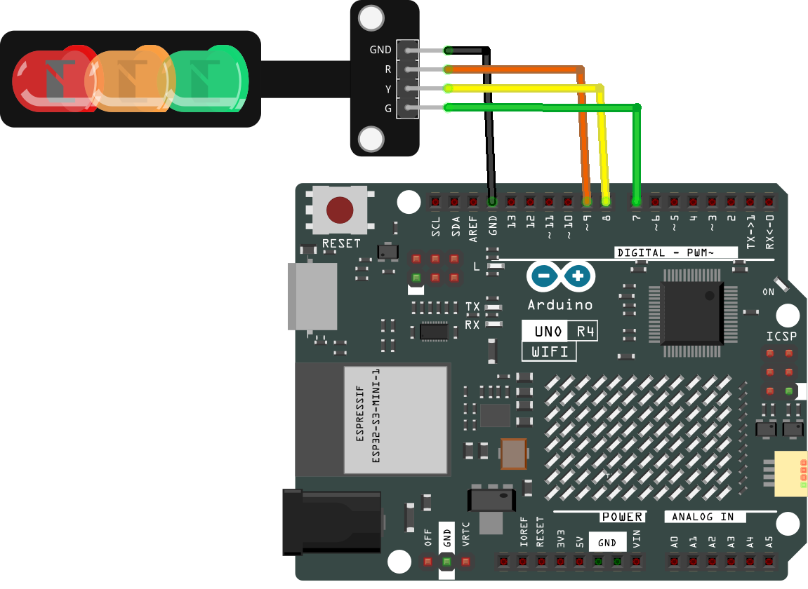

.. _traffic_light:

Traffic light
==============================================================

.. note::
  
  🌟 Welcome to the SunFounder Facebook Community! Whether you're into Raspberry Pi, Arduino, or ESP32, you'll find inspiration, help ideas here.
   
  - ✅ Be the first to get free learning resources. 
   
  - ✅ Stay updated on new products & exclusive giveaways. 
   
  - ✅ Share your creations and get real feedback.
   
  * 👉 Need faster updates or support? Click [|link_sf_facebook|] join our Facebook community 

  * 👉 Or join our WhatsApp group: Click [|link_sf_whatsapp|]
   
  * 🎁 Looking for parts?Check out our all-in-one kits below — packed with components, beginner-friendly guides, and tons of fun.

  .. list-table::
    :widths: 20 20 20
    :header-rows: 1

    *   - Name	
        - Includes Arduino board
        - PURCHASE LINK
    *   - Ultimate Sensor Kit
        - Arduino Uno R4 Minima
        - |link_ultimate_sensor_buy|
    *   - Elite Explorer Kit
        - Arduino Uno R4 WiFi
        - |link_elite_buy|
    *   - 3 in 1 Ultimate Starter Kit
        - Arduino Uno R4 Minima
        - |link_arduinor4_buy|

Course Introduction
------------------------

In this lesson, we will learn how to use the traffic light with Arduino.

.. raw:: html

  <iframe width="700" height="394" src="https://www.youtube.com/embed/vL65E78YngQ?si=TaRb3p4uol6gM2bp" title="YouTube video player" frameborder="0" allow="accelerometer; autoplay; clipboard-write; encrypted-media; gyroscope; picture-in-picture; web-share" referrerpolicy="strict-origin-when-cross-origin" allowfullscreen></iframe>

.. note::

  If this is your first time working with an Arduino project, we recommend downloading and reviewing the basic materials first.
  
  * :ref:`install_arduino`
  * :ref:`introduce_arduino`

**Required Components**

In this project, we need the following components:

.. list-table::
    :widths: 5 20 5 20
    :header-rows: 1

    *   - SN
        - COMPONENT INTRODUCTION	
        - QUANTITY
        - PURCHASE LINK

    *   - 1
        - Arduino UNO R4 Minima/Arduino UNO R4 WIFI
        - 1
        - |link_arduinor4_buy|
    *   - 2
        - USB Type-C cable
        - 1
        - 
    *   - 3
        - Breadboard
        - 1
        - |link_breadboard_buy|
    *   - 4
        - Wires
        - Several
        - |link_wires_buy|
    *   - 5
        - Traffic Light LED
        - 1
        - |link_trafficlinght_buy|

**Wiring**

**Common Connections:**

* **Traffic light LED**

  - **R:** Connect to **9** on the Arduino.
  - **Y:** Connect to **8** on the Arduino.
  - **G:** Connect to **7** on the Arduino.
  - **GND:** Connect to **GND** on the Arduino.

**Writing the Code**

.. note::

    * You can copy this code into **Arduino IDE**. 
    * Don't forget to select the board(Arduino UNO R4 Minima/WIFI) and the correct port before clicking the **Upload** button.

.. code-block:: arduino

      // Pin numbers for each LED
      const int rledPin = 9;  // Pin connected to the red LED
      const int yledPin = 8;  // Pin connected to the yellow LED
      const int gledPin = 7;  // Pin connected to the green LED

      void setup() {
        // Set all LED pins as output
        pinMode(rledPin, OUTPUT);
        pinMode(yledPin, OUTPUT);
        pinMode(gledPin, OUTPUT);
      }

      void loop() {
        // Red LED on for 3 seconds
        digitalWrite(rledPin, HIGH);
        delay(3000);
        digitalWrite(rledPin, LOW);

        // Yellow LED blinks three times
        for (int i = 0; i < 3; i++) {
          digitalWrite(yledPin, HIGH);
          delay(500);
          digitalWrite(yledPin, LOW);
          delay(500);
        }

        // Green LED on for 3 seconds
        digitalWrite(gledPin, HIGH);
        delay(3000);
        digitalWrite(gledPin, LOW);
      }

