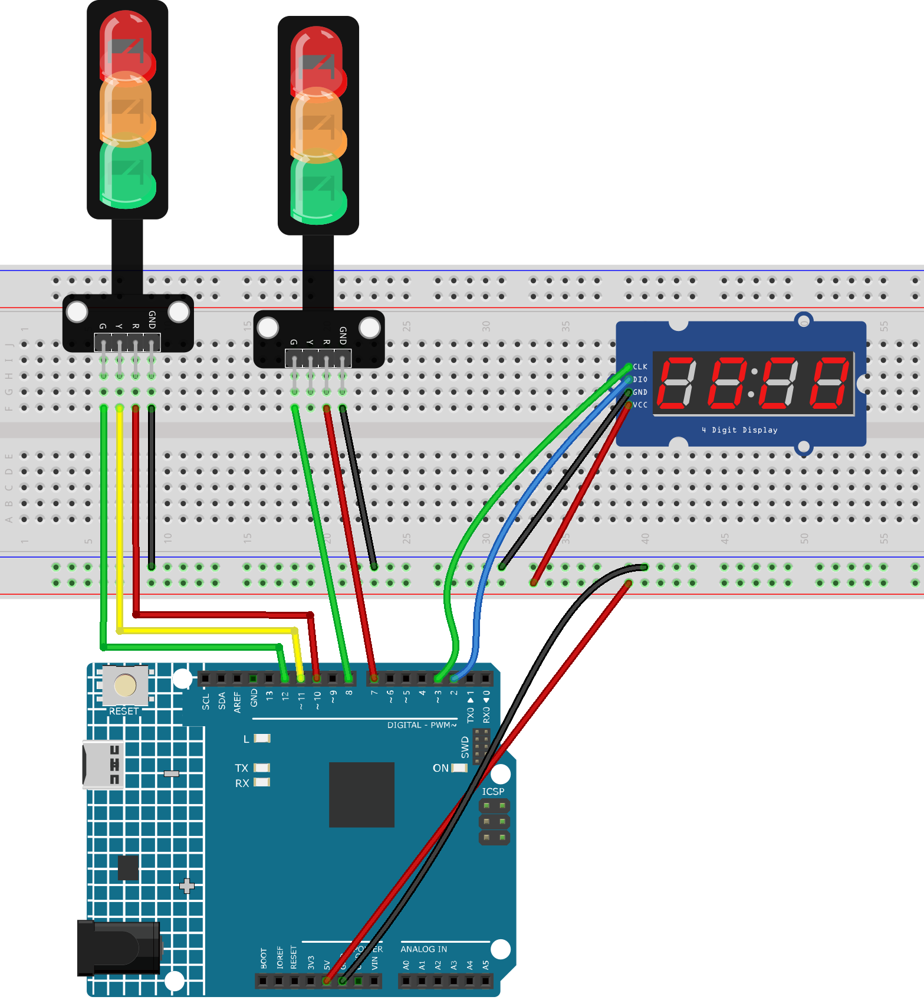

.. _traffic_light2.0:

Traffic light 2.0
==============================================================

.. note::
  
  🌟 Welcome to the SunFounder Facebook Community! Whether you're into Raspberry Pi, Arduino, or ESP32, you'll find inspiration, help ideas here.
   
  - ✅ Be the first to get free learning resources. 
   
  - ✅ Stay updated on new products & exclusive giveaways. 
   
  - ✅ Share your creations and get real feedback.
   
  * 👉 Need faster updates or support? Click [|link_sf_facebook|] join our Facebook community 

  * 👉 Or join our WhatsApp group: Click [|link_sf_whatsapp|]
   
  * 🎁 Looking for parts?Check out our all-in-one kits below — packed with components, beginner-friendly guides, and tons of fun.

  .. list-table::
    :widths: 20 20 20
    :header-rows: 1

    *   - Name	
        - Includes Arduino board
        - PURCHASE LINK
    *   - Ultimate Sensor Kit
        - Arduino Uno R4 Minima
        - |link_ultimate_sensor_buy|
    *   - Elite Explorer Kit
        - Arduino Uno R4 WiFi
        - |link_elite_buy|
    *   - 3 in 1 Ultimate Starter Kit
        - Arduino Uno R4 Minima
        - |link_arduinor4_buy|

Course Introduction
------------------------

In this lesson, you’ll learn how to build a simple traffic light system using the Arduino, a TM1637 4-digit display, and LED Modules. 

This experiment simulates the operation of street traffic lights and pedestrian crossing signals.

.. raw:: html

  <iframe width="700" height="394" src="https://www.youtube.com/embed/HLTCHluRY54?si=Qusb7o6H1rDCThMW" title="YouTube video player" frameborder="0" allow="accelerometer; autoplay; clipboard-write; encrypted-media; gyroscope; picture-in-picture; web-share" referrerpolicy="strict-origin-when-cross-origin" allowfullscreen></iframe>

.. note::

  If this is your first time working with an Arduino project, we recommend downloading and reviewing the basic materials first.
  
  * :ref:`install_arduino`
  * :ref:`introduce_arduino`

**Required Components**

In this project, we need the following components:

.. list-table::
    :widths: 5 20 5 20
    :header-rows: 1

    *   - SN
        - COMPONENT INTRODUCTION	
        - QUANTITY
        - PURCHASE LINK

    *   - 1
        - Arduino UNO R4 Minima/Arduino UNO R4 WIFI
        - 1
        - |link_arduinor4_buy|
    *   - 2
        - USB Type-C cable
        - 1
        - 
    *   - 3
        - Breadboard
        - 1
        - |link_breadboard_buy|
    *   - 4
        - Wires
        - Several
        - |link_wires_buy|
    *   - 5
        - 4-Digit Segment Display Module
        - 1
        - |link_4segment_buy|
    *   - 6
        - Traffic Light LED
        - 2
        - |link_trafficlinght_buy|

**Wiring**

**Common Connections:**

* **Traffic light LED #1**

  - **R:** Connect to **10** on the Arduino.
  - **Y:** Connect to **11** on the Arduino.
  - **G:** Connect to **12** on the Arduino.
  - **GND:** Connect to breadboard’s negative power bus.

* **Traffic light LED #2**

  - **R:** Connect to **7** on the Arduino.
  - **G:** Connect to **8** on the Arduino.
  - **GND:** Connect to breadboard’s negative power bus.

* **4-Digit Segment Display Module**

  - **CLK:** Connect to **3** on the Arduino.
  - **DIO:** Connect to **2** on the Arduino.
  - **GND:** Connect to breadboard’s negative power bus.
  - **VCC:** Connect to breadboard’s red power bus.

**Writing the Code**

.. note::

    * You can copy this code into **Arduino IDE**. 
    * To install the library, use the Arduino Library Manager and search for **TM1637Display** and install it.
    * Don't forget to select the board(Arduino UNO R4 Minima/WIFI) and the correct port before clicking the **Upload** button.

.. code-block:: arduino

    #include <TM1637Display.h>

    // TM1637 display pins
    #define CLK 3
    #define DIO 2

    // Traffic light 1 (vehicle traffic)
    const int carRedPin = 10;
    const int carYellowPin = 11;
    const int carGreenPin = 12;

    // Traffic light 2 (pedestrian traffic)
    const int pedRedPin = 7;
    const int pedGreenPin = 8;

    // Create TM1637 display object
    TM1637Display display(CLK, DIO);

    void setup() {
      // Set all traffic light pins as output
      pinMode(carRedPin, OUTPUT);
      pinMode(carYellowPin, OUTPUT);
      pinMode(carGreenPin, OUTPUT);

      pinMode(pedRedPin, OUTPUT);
      pinMode(pedGreenPin, OUTPUT);

      display.setBrightness(7);  // Brightness range 0-7

      // Initial state: vehicle red light ON, pedestrian green light ON
      digitalWrite(carRedPin, HIGH);
      digitalWrite(pedGreenPin, HIGH);
      digitalWrite(carYellowPin, LOW);
      digitalWrite(carGreenPin, LOW);
      digitalWrite(pedRedPin, LOW);
    }

    void loop() {
      // 1. Vehicle red light 5 seconds, pedestrian green light ON
      setTrafficLights(HIGH, LOW, LOW, LOW, HIGH);
      countdown(5);

      // 2. Vehicle yellow light 3 seconds, pedestrian green light flashing fast
      setTrafficLights(LOW, HIGH, LOW, LOW, LOW);
      flashPedGreen(3);

      // 3. Vehicle green light 5 seconds, pedestrian red light ON
      setTrafficLights(LOW, LOW, HIGH, HIGH, LOW);
      countdown(5);
    }

    // Set traffic light states
    void setTrafficLights(int carRed, int carYellow, int carGreen, int pedRed, int pedGreen) {
      digitalWrite(carRedPin, carRed);
      digitalWrite(carYellowPin, carYellow);
      digitalWrite(carGreenPin, carGreen);
      digitalWrite(pedRedPin, pedRed);
      digitalWrite(pedGreenPin, pedGreen);
    }

    // Countdown on 7-segment display
    void countdown(int seconds) {
      for (int i = seconds; i > 0; i--) {
        display.showNumberDec(i, true, 2, 2);
        delay(1000);
      }
      display.clear();
    }

    // Pedestrian green light flashing (during yellow phase)
    void flashPedGreen(int seconds) {
      for (int i = seconds; i > 0; i--) {
        display.showNumberDec(i, true, 2, 2);
        // Flash 2 times per second
        for (int j = 0; j < 2; j++) {
          digitalWrite(pedGreenPin, HIGH);
          delay(250);
          digitalWrite(pedGreenPin, LOW);
          delay(250);
        }
      }
      display.clear();
    }
