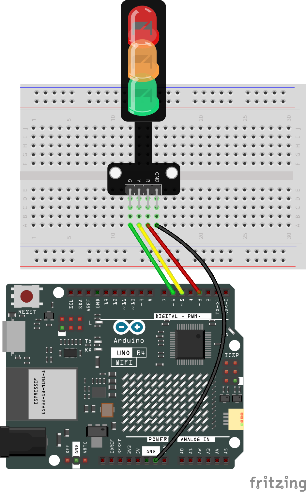

.. _trafficlight_iot:

Traffic Light (IOT)
==============================================================

.. note::
  
  🌟 Welcome to the SunFounder Facebook Community! Whether you're into Raspberry Pi, Arduino, or ESP32, you'll find inspiration, help ideas here.
   
  - ✅ Be the first to get free learning resources. 
   
  - ✅ Stay updated on new products & exclusive giveaways. 
   
  - ✅ Share your creations and get real feedback.
   
  * 👉 Need faster updates or support? Click [|link_sf_facebook|] join our Facebook community 

  * 👉 Or join our WhatsApp group: Click [|link_sf_whatsapp|]
   
  * 🎁 Looking for parts?Check out our all-in-one kits below — packed with components, beginner-friendly guides, and tons of fun.
  
  .. list-table::
    :widths: 20 20 20
    :header-rows: 1

    *   - Name	
        - Includes Arduino board
        - PURCHASE LINK
    *   - Elite Explorer Kit	
        - Arduino Uno R4 WiFi
        - |link_elite_buy|

Course Introduction
------------------------

This Arduino project uses Arduino IoT Remote to control Traffic Light. 

.. raw:: html
 
  <iframe width="700" height="394" src="https://www.youtube.com/embed/62WYd6fp0eI?si=hTmvZTFUyhaFwUPf" title="YouTube video player" frameborder="0" allow="accelerometer; autoplay; clipboard-write; encrypted-media; gyroscope; picture-in-picture; web-share" referrerpolicy="strict-origin-when-cross-origin" allowfullscreen></iframe>

**Required Components**

In this project, we need the following components:

.. list-table::
    :widths: 5 20 5 20
    :header-rows: 1

    *   - SN
        - COMPONENT INTRODUCTION	
        - QUANTITY
        - PURCHASE LINK

    *   - 1
        - Arduino UNO R4 WIFI
        - 1
        - |link_unor4_wifi_buy|
    *   - 2
        - USB Type-C cable
        - 1
        - 
    *   - 3
        - Breadboard
        - 1
        - |link_breadboard_buy|
    *   - 4
        - Wires
        - Several
        - |link_wires_buy|
    *   - 5
        - Traffic Light LED
        - 1
        - |link_trafficlinght_buy|

**Wiring**

**Common Connections:**

* **Traffic light LED**

  - **R:** Connect to **3** on the Arduino.
  - **Y:** Connect to **5** on the Arduino.
  - **G:** Connect to **6** on the Arduino.
  - **GND:** Connect to breadboard’s negative power bus.

.. note::

  If this is your first time working with an Arduino IOT project, we recommend downloading and reviewing the basic materials first.
  
  * :ref:`install_arduino`
  * :ref:`introduce_arduino`

  Please follow the steps in the tutorial below to complete the binding and setup of Arduino Cloud and the Arduino WiFi board.

  * :ref:`iot_arduino_cloud`

**Create a New IoT Project**

  After configuring the Arduino Cloud and the Arduino WiFi board, follow the steps below to complete the Arduino Cloud project setup

  .. image:: img/traffic_light_step1.png

Edit Value (4Variables:cmdGreen,cmdYellow,cmdRed,currentState)

   .. image:: img/edit_value1.png
    :width: 400

   .. image:: img/edit_value_traffic.png
    :width: 400

Follow the steps below to configure the dashboard.

  1. Create New Dashboard

  .. image:: img/dashboard_step.png

  2. Add Widgets

  .. image:: img/dashboard_light.png

  3. Link Variable

  .. image:: img/link_variable_light1.png
  .. image:: img/link_variable_light2.png

  4. Remember to click Done

  .. image:: img/click_done.png

  After completing the above configuration, return to the Things page and open the sketch.
  
  .. image:: img/sketch.png

  When you have completed the configuration of the Things and Dashboard, as well as the connection and network setup of the Arduino WiFi board, the thingProperties.h and Sketch Secrets files will be generated automatically. 
  If Sketch Secrets is not generated, please manually enter the connected SSID and OPTIONAL_PASS

Copy this code into **Arduino Cloud**. 
  
  .. image:: img/light_code.png

Don't forget to select the board(Arduino UNO R4 WIFI) and the correct port before clicking the **Upload** button.

.. code-block:: arduino

      #include "thingProperties.h"

      // ========== Hardware configuration ==========
      const uint8_t PIN_RED    = 3;
      const uint8_t PIN_YELLOW = 5;
      const uint8_t PIN_GREEN  = 6;

      // Common cathode (to GND) → true; Common anode (to 5V) → false
      const bool ACTIVE_HIGH = true;
      // ============================================

      enum LightState : int { RED = 0, YELLOW = 1, GREEN = 2, ALL_OFF = 3 };

      inline void writeLamp(uint8_t pin, bool on) {
        if (ACTIVE_HIGH) digitalWrite(pin, on ? HIGH : LOW);
        else             digitalWrite(pin, on ? LOW  : HIGH);
      }

      void setLights(LightState s) {
        writeLamp(PIN_RED,    s == RED);
        writeLamp(PIN_YELLOW, s == YELLOW);
        writeLamp(PIN_GREEN,  s == GREEN);
        currentState = static_cast<int>(s);  // Report back to cloud
      }

      void setup() {
        Serial.begin(115200);
        pinMode(PIN_RED, OUTPUT);
        pinMode(PIN_YELLOW, OUTPUT);
        pinMode(PIN_GREEN, OUTPUT);

        // Turn all off at startup
        setLights(ALL_OFF);

        // Connect to IoT Cloud
        initProperties();
        ArduinoCloud.begin(ArduinoIoTPreferredConnection);
        setDebugMessageLevel(2);
        ArduinoCloud.printDebugInfo();
      }

      void loop() {
        ArduinoCloud.update();
      }

      // ========== Cloud button callbacks ==========
      void onCmdRedChange() {
        if (cmdRed) {
          setLights(RED);
          // Reset all three buttons to avoid keeping them “on” in the dashboard
          cmdRed = false; cmdYellow = false; cmdGreen = false;
        }
      }

      void onCmdYellowChange() {
        if (cmdYellow) {
          setLights(YELLOW);
          cmdRed = false; cmdYellow = false; cmdGreen = false;
        }
      }

      void onCmdGreenChange() {
        if (cmdGreen) {
          setLights(GREEN);
          cmdRed = false; cmdYellow = false; cmdGreen = false;
        }
      }

      /*
        Since Angle3 is READ_WRITE variable, onAngle3Change() is
        executed every time a new value is received from IoT Cloud.
      */
      void onAngle3Change()  {
        // Add your code here to act upon Angle3 change
      }
      /*
        Since CurrentState is READ_WRITE variable, onCurrentStateChange() is
        executed every time a new value is received from IoT Cloud.
      */
      void onCurrentStateChange()  {
        // Add your code here to act upon CurrentState change
      }
