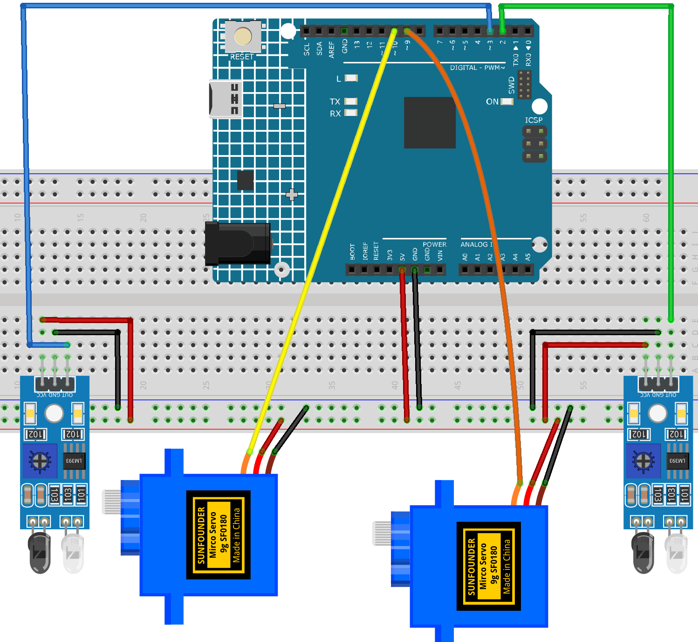

.. _train_ramp:

Train Ramp
==============================================================

.. note::
  
  🌟 Welcome to the SunFounder Facebook Community! Whether you're into Raspberry Pi, Arduino, or ESP32, you'll find inspiration, help ideas here.
   
  - ✅ Be the first to get free learning resources. 
   
  - ✅ Stay updated on new products & exclusive giveaways. 
   
  - ✅ Share your creations and get real feedback.
   
  * 👉 Need faster updates or support? Click [|link_sf_facebook|] join our Facebook community 

  * 👉 Or join our WhatsApp group: Click [|link_sf_whatsapp|]
   
Kit purchase
------------------------

Looking for parts? Check out our all-in-one kits below — packed with components, beginner-friendly guides, and tons of fun.

.. image:: img/ultimate_sensor_kit.png
   :width: 100%
   :align: center
   :target: https://www.sunfounder.com/collections/arduino-kits-bundles/products/sunfounder-ultimate-sensor-kit-with-original-arduino-uno-r4-minima?ref=jbzmncle

.. raw:: html

     

.. list-table::
   :widths: 20 20 20
   :header-rows: 1

   * - Name
     - Includes Arduino board
     - PURCHASE LINK
   * - Elite Explorer Kit
     - Arduino Uno R4 WiFi
     - |link_elite_buy|
   * - 3 in 1 Ultimate Starter Kit
     - Arduino Uno R4 Minima
     - |link_arduinor4_buy|

Course Introduction
------------------------

In this lesson, you'll learn how to build an automatic railway crossing using two IR Sensor Modules and two servo motors.

When a train passes the first sensor, the barriers lower to block the road. After the train reaches the second sensor, the barriers rise again, simulating a real railway crossing system.

.. raw:: html
 
  <iframe width="700" height="394" src="https://www.youtube.com/embed/7wRXKor2dEI" title="YouTube video player" frameborder="0" allow="accelerometer; autoplay; clipboard-write; encrypted-media; gyroscope; picture-in-picture; web-share" referrerpolicy="strict-origin-when-cross-origin" allowfullscreen></iframe>

.. note::

  If this is your first time working with an Arduino project, we recommend downloading and reviewing the basic materials first.
  
  * :ref:`install_arduino`
  * :ref:`introduce_arduino`

**Required Components**

In this project, we need the following components:

.. list-table::
    :widths: 5 20 5 20
    :header-rows: 1

    *   - SN
        - COMPONENT INTRODUCTION	
        - QUANTITY
        - PURCHASE LINK

    *   - 1
        - Arduino UNO R4 Minima
        - 1
        - |link_unor4_buy|
    *   - 2
        - USB Type-C cable
        - 1
        - 
    *   - 3
        - Breadboard
        - 1
        - |link_breadboard_buy|
    *   - 4
        - Wires
        - Several
        - |link_wires_buy|
    *   - 5
        - Digital Servo Motor
        - 2
        - |link_motor_buy|
    *   - 6
        - IR Obstacle Avoidance Sensor Module
        - 2
        - |link_IR_module_buy|

**Wiring**

**Common Connections:**

* **Digital Servo Motor 1**

  - Connect to breadboard’s positive power bus.
  - Connect to breadboard’s negative power bus.
  - Connect to  **9** on the Arduino.

* **Digital Servo Motor 2**

  - Connect to breadboard’s positive power bus.
  - Connect to breadboard’s negative power bus.
  - Connect to  **10** on the Arduino.

* **IR Obstacle Avoidance Sensor Module 1**

  - **OUT:** Connect to **2** on the Arduino.
  - **GND:** Connect to breadboard’s negative power bus.
  - **VCC:** Connect to breadboard’s red power bus.

* **IR Obstacle Avoidance Sensor Module 2**

  - **OUT:** Connect to **3** on the Arduino.
  - **GND:** Connect to breadboard’s negative power bus.
  - **VCC:** Connect to breadboard’s red power bus.

**Writing the Code**

.. note::

    * You can copy this code into **Arduino IDE**. 
    * Don't forget to select the board(Arduino UNO R4 Minima) and the correct port before clicking the **Upload** button.

.. code-block:: arduino

      #include <Servo.h>

      // IR sensor pins
      const int IR_ENTRY_PIN = 2;
      const int IR_EXIT_PIN = 3;

      // Servo pins
      const int SERVO_1_PIN = 9;
      const int SERVO_2_PIN = 10;

      // Servo angles
      const int GATE_DOWN_ANGLE = 0;
      const int GATE_UP_ANGLE = 90;

      // Most IR obstacle sensors output LOW when an object is detected.
      // If your sensor works the opposite way, change LOW to HIGH.
      const int IR_DETECTED_STATE = LOW;

      // Debounce
      const unsigned long debounceDelay = 200;

      Servo gateServo1;
      Servo gateServo2;

      bool gateOpen = false;

      bool lastEntryState = HIGH;
      bool lastExitState = HIGH;

      unsigned long lastEntryTime = 0;
      unsigned long lastExitTime = 0;

      void setup() {
        pinMode(IR_ENTRY_PIN, INPUT);
        pinMode(IR_EXIT_PIN, INPUT);

        gateServo1.attach(SERVO_1_PIN);
        gateServo2.attach(SERVO_2_PIN);

        closeGate();
      }

      void loop() {
        bool currentEntryState = digitalRead(IR_ENTRY_PIN);
        bool currentExitState = digitalRead(IR_EXIT_PIN);

        unsigned long now = millis();

        // IR Sensor 1 detects the train: raise the barriers
        if (lastEntryState != IR_DETECTED_STATE && currentEntryState == IR_DETECTED_STATE) {
          if (now - lastEntryTime > debounceDelay) {
            openGate();
            lastEntryTime = now;
          }
        }

        // IR Sensor 2 detects the train: lower the barriers
        if (lastExitState != IR_DETECTED_STATE && currentExitState == IR_DETECTED_STATE) {
          if (now - lastExitTime > debounceDelay) {
            closeGate();
            lastExitTime = now;
          }
        }

        lastEntryState = currentEntryState;
        lastExitState = currentExitState;
      }

      void openGate() {
        gateOpen = true;
        gateServo1.write(GATE_UP_ANGLE);
        gateServo2.write(GATE_UP_ANGLE);
      }

      void closeGate() {
        gateOpen = false;
        gateServo1.write(GATE_DOWN_ANGLE);
        gateServo2.write(GATE_DOWN_ANGLE);
      }
