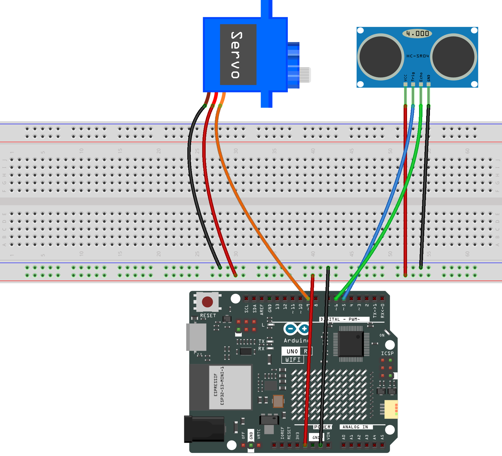

.. _trash_can:

Trash Can
==============================================================
.. note::
  
  Hello, welcome to the SunFounder Raspberry Pi & Arduino & ESP32 Enthusiasts Community on Facebook! Dive deeper into Raspberry Pi, Arduino, and ESP32 with fellow enthusiasts.

  👉 Ready to explore and create with us? Click [|link_sf_facebook|] and join today!

  To get all the components for this project, consider one of the kits below. 

  Each includes the required parts, extra components for other projects, and beginner-friendly tutorials.

  .. list-table::
    :widths: 20 20 20
    :header-rows: 1

    *   - Name	
        - Includes Arduino board
        - PURCHASE LINK
    *   - Ultimate Sensor Kit
        - Arduino Uno R4 Minima
        - |link_ultimate_sensor_buy|
    *   - Elite Explorer Kit
        - Arduino Uno R4 WiFi
        - |link_elite_buy|
    *   - 3 in 1 Ultimate Starter Kit
        - Arduino Uno R4 Minima
        - |link_arduinor4_buy|

Course Introduction
------------------------

In this lesson, you'll learn how to use an ultrasonic sensor module, a digital servo motor, and an Arduino board to build a smart trash can.

When the ultrasonic sensor module detects trash being thrown in, the digital servo motor opens the lid of the trash can.

.. raw:: html

  <iframe width="700" height="394" src="https://www.youtube.com/embed/ca2vRwRQJkk?si=Nzmhr1BEuKKSN9NK" title="YouTube video player" frameborder="0" allow="accelerometer; autoplay; clipboard-write; encrypted-media; gyroscope; picture-in-picture; web-share" referrerpolicy="strict-origin-when-cross-origin" allowfullscreen></iframe>

.. note::

  If this is your first time working with an Arduino project, we recommend downloading and reviewing the basic materials first.
  
  * :ref:`install_arduino`
  * :ref:`introduce_arduino`

**Required Components**

In this project, we need the following components:

.. list-table::
    :widths: 5 20 5 20
    :header-rows: 1

    *   - SN
        - COMPONENT INTRODUCTION	
        - QUANTITY
        - PURCHASE LINK

    *   - 1
        - Arduino UNO R4 Minima/Arduino UNO R4 WIFI
        - 1
        - |link_unor4_buy|
    *   - 2
        - USB Type-C cable
        - 1
        - 
    *   - 3
        - Breadboard
        - 1
        - |link_breadboard_buy|
    *   - 4
        - Wires
        - Several
        - |link_wires_buy|
    *   - 5
        - 1kΩ resistor
        - 2
        - |link_resistor_buy|
    *   - 6
        - Ultrasonic Sensor Module
        - 1
        - |link_ultrasonic_buy|
    *   - 7
        - LED
        - 2
        - |link_led_buy|
    *   - 8
        - Digital Servo Motor
        - 1
        - |link_motor_buy|

**Wiring**

**Common Connections:**

* **Digital Servo Motor**

  - Connect to breadboard’s positive power bus.
  - Connect to breadboard’s negative power bus.
  - Connect to **9** on the Arduino.

* **Ultrasonic Sensor Module**

  - **Trig:** Connect to **6** on the Arduino.
  - **Echo:** Connect to **5** on the Arduino.
  - **GND:** Connect to breadboard’s negative power bus.
  - **VCC:** Connect to breadboard’s red power bus.

**Writing the Code**

.. note::

    * You can copy this code into **Arduino IDE**. 
    * Don't forget to select the board(Arduino UNO R4 Minima) and the correct port before clicking the **Upload** button.

.. code-block:: arduino

      #include <Servo.h>

      // Set up the servo motor parameters
      Servo servo;
      const int servoPin = 9;
      const int openAngle = 0;
      const int closeAngle = 90;

      // Set up the ultrasonic sensor parameters
      const int trigPin = 5;
      const int echoPin = 6;
      long distance, averageDistance;
      long averDist[3];

      // Distance threshold in centimeters
      const int distanceThreshold = 20;

      void setup() {
        // Initialize serial communication with the computer at 9600 baud rate
        Serial.begin(9600);

        // Configure the trigger and echo pins of the ultrasonic sensor
        pinMode(trigPin, OUTPUT);
        pinMode(echoPin, INPUT);

        // Attach the servo to its control pin and set its initial position
        servo.attach(servoPin);
        servo.write(closeAngle);
        delay(100);
        servo.detach();  // Detach the servo to save power when not in use
      }

      void loop() {
        // Measure the distance three times
        for (int i = 0; i <= 2; i++) {
          distance = readDistance();
          averDist[i] = distance;
          delay(10);
        }

        // Calculate the average distance
        averageDistance = (averDist[0] + averDist[1] + averDist[2]) / 3;
        Serial.println(averageDistance);

        // Control the servo based on the averaged distance
        if (averageDistance <= distanceThreshold) {
          servo.attach(servoPin);  // Reattach the servo before sending a command
          delay(1);
          servo.write(openAngle);  // Rotate the servo to the open position
          delay(3500);
        } else {
          servo.write(closeAngle);  // Rotate the servo back to the closed position
          delay(1000);
          servo.detach();  // Detach the servo to save power when not in use
        }
      }

      // Function to read the sensor data and calculate the distance
      float readDistance() {
        // Send a pulse on the trigger pin of the ultrasonic sensor
        digitalWrite(trigPin, LOW);
        delayMicroseconds(2);
        digitalWrite(trigPin, HIGH);
        delayMicroseconds(10);
        digitalWrite(trigPin, LOW);

        // Measure the pulse width of the echo pin and calculate the distance value
        float distance = pulseIn(echoPin, HIGH) / 58.00;  // Formula: (340m/s * 1us) / 2
        return distance;
      }
