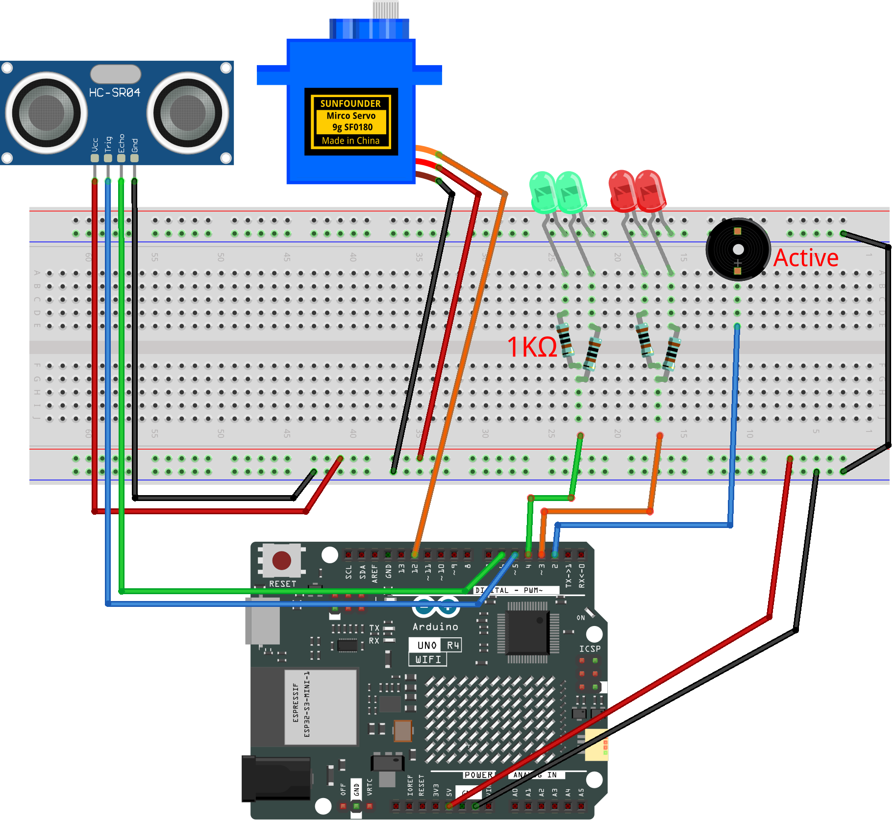

.. _trash_can 2.0:

Trash Can 2.0 
==============================================================

.. note::
  
  🌟 Welcome to the SunFounder Facebook Community! Whether you're into Raspberry Pi, Arduino, or ESP32, you'll find inspiration, help ideas here.
   
  - ✅ Be the first to get free learning resources. 
   
  - ✅ Stay updated on new products & exclusive giveaways. 
   
  - ✅ Share your creations and get real feedback.
   
  * 👉 Need faster updates or support? Click [|link_sf_facebook|] join our Facebook community 

  * 👉 Or join our WhatsApp group: Click [|link_sf_whatsapp|]
   
  * 🎁 Looking for parts?Check out our all-in-one kits below — packed with components, beginner-friendly guides, and tons of fun.
  
  .. list-table::
    :widths: 20 20 20
    :header-rows: 1

    *   - Name	
        - Includes Arduino board
        - PURCHASE LINK
    *   - Ultimate Sensor Kit
        - Arduino Uno R4 Minima
        - |link_ultimate_sensor_buy|
    *   - Elite Explorer Kit
        - Arduino Uno R4 WiFi
        - |link_elite_buy|
    *   - 3 in 1 Ultimate Starter Kit
        - Arduino Uno R4 Minima
        - |link_arduinor4_buy|

Course Introduction
------------------------

In this lesson, you'll learn how to use an ultrasonic sensor module, a digital servo motor, and an Arduino board to build a smart trash can.

When the ultrasonic sensor module detects trash being thrown in, the digital servo motor opens the lid of the trash can.

.. raw:: html

  <iframe width="700" height="394" src="https://www.youtube.com/embed/ENaC1r4fLpw?si=XWeABpzy2SMEBBxL" title="YouTube video player" frameborder="0" allow="accelerometer; autoplay; clipboard-write; encrypted-media; gyroscope; picture-in-picture; web-share" referrerpolicy="strict-origin-when-cross-origin" allowfullscreen></iframe>

.. note::

  If this is your first time working with an Arduino project, we recommend downloading and reviewing the basic materials first.
  
  * :ref:`install_arduino`
  * :ref:`introduce_arduino`

**Required Components**

In this project, we need the following components:

.. list-table::
    :widths: 5 20 5 20
    :header-rows: 1

    *   - SN
        - COMPONENT INTRODUCTION	
        - QUANTITY
        - PURCHASE LINK

    *   - 1
        - Arduino UNO R4 Minima/Arduino UNO R4 WIFI
        - 1
        - |link_unor4_buy|
    *   - 2
        - USB Type-C cable
        - 1
        - 
    *   - 3
        - Breadboard
        - 1
        - |link_breadboard_buy|
    *   - 4
        - Wires
        - Several
        - |link_wires_buy|
    *   - 5
        - 1kΩ resistor
        - 4
        - |link_resistor_buy|
    *   - 6
        - Ultrasonic Sensor Module
        - 1
        - |link_ultrasonic_buy|
    *   - 7
        - LED
        - 4
        - |link_led_buy|
    *   - 8
        - Digital Servo Motor
        - 1
        - |link_motor_buy|
    *   - 9
        - Active Buzzer
        - 1
        - 

**Wiring**

**Common Connections:**

* **Digital Servo Motor**

  - Connect to breadboard’s positive power bus.
  - Connect to breadboard’s negative power bus.
  - Connect to **12** on the Arduino.

* **Ultrasonic Sensor Module**

  - **Trig:** Connect to **5** on the Arduino.
  - **Echo:** Connect to **6** on the Arduino.
  - **GND:** Connect to breadboard’s negative power bus.
  - **VCC:** Connect to breadboard’s red power bus.

* **LED**

  - **Red LED**: Connect the LEDs **anode** to a **1kΩ resistor** then to  the  **3** on Arduino, and the LEDs **cathode**  to negative power bus on the breadboard.
  - **Green LED**: Connect the LEDs **anode** to a **1kΩ resistor** then to the  **4** on Arduino, and the LEDs **cathode** to negative power bus on the breadboard.

* **Active Buzzer**

  - **＋:** Connect to **2** on the Arduino.
  - **－:** Connect to breadboard’s negative power bus.

**Writing the Code**

.. note::

    * You can copy this code into **Arduino IDE**. 
    * Don't forget to select the board(Arduino UNO R4 Minima/WIFI) and the correct port before clicking the **Upload** button.

.. code-block:: arduino

      #include <Servo.h>

      // ---- Servo motor setup ----
      Servo servo;
      const int servoPin = 9;       // Servo control pin
      const int openAngle = 0;      // Angle when the lid is open
      const int closeAngle = 90;    // Angle when the lid is closed

      // ---- Ultrasonic sensor setup ----
      const int trigPin = 5;        // Trigger pin of ultrasonic sensor
      const int echoPin = 6;        // Echo pin of ultrasonic sensor
      float distance, averageDistance;

      // ---- Buzzer and LEDs ----
      const int buzzerPin = 2;      // Buzzer pin
      const int redLedPin = 3;      // Red LED pin
      const int greenLedPin = 4;    // Green LED pin

      // ---- Distance threshold ----
      const int distanceThreshold = 20;  // Distance (cm) to open the lid

      // ---- Lid open time ----
      unsigned long lidOpenTime = 0;
      const unsigned long holdOpenMs = 2000;  // Lid stays open for 2 seconds
      bool isLidOpen = false;

      // ---- Beep/flash timing ----
      const unsigned long beepInterval = 200; // Interval for buzzer and red LED (200 ms = fast beep/blink)
      unsigned long lastBeepTime = 0;
      bool beepState = false;

      void setup() {
        Serial.begin(9600);

        // Set up ultrasonic sensor pins
        pinMode(trigPin, OUTPUT);
        pinMode(echoPin, INPUT);

        // Set up buzzer and LEDs
        pinMode(buzzerPin, OUTPUT);
        pinMode(redLedPin, OUTPUT);
        pinMode(greenLedPin, OUTPUT);

        // Initialize servo to closed position
        servo.attach(servoPin);
        servo.write(closeAngle);
        delay(100);
        servo.detach();

        // Initial LED state: green ON means closed
        digitalWrite(buzzerPin, LOW);
        digitalWrite(redLedPin, LOW);
        digitalWrite(greenLedPin, HIGH);
      }

      void loop() {
        // Measure distance from ultrasonic sensor
        averageDistance = readDistance();

        // If lid is closed and someone is close, open it
        if (!isLidOpen && averageDistance > 0 && averageDistance <= distanceThreshold) {
          servo.attach(servoPin);
          delay(1);
          servo.write(openAngle);   // Move servo to open position
          isLidOpen = true;
          lidOpenTime = millis();

          digitalWrite(greenLedPin, LOW);  // Turn off green LED when open
        }

        // If lid is open, keep it open for a while
        if (isLidOpen) {
          unsigned long now = millis();

          // Make buzzer and red LED blink/beep quickly
          if (now - lastBeepTime >= beepInterval) {
            lastBeepTime = now;
            beepState = !beepState;
            digitalWrite(buzzerPin, beepState ? HIGH : LOW);
            digitalWrite(redLedPin, beepState ? HIGH : LOW);
          }

          // After holdOpenMs, close the lid
          if (millis() - lidOpenTime >= holdOpenMs) {
            servo.write(closeAngle);   // Move servo to closed position
            delay(200);
            servo.detach();
            isLidOpen = false;

            // Reset buzzer and LEDs
            digitalWrite(buzzerPin, LOW);
            digitalWrite(redLedPin, LOW);
            digitalWrite(greenLedPin, HIGH); // Green LED ON means closed
          }
        }

        delay(50); // Small delay to avoid too many sensor reads
      }

      // ---- Function to measure distance with ultrasonic sensor ----
      float readDistance() {
        // Send a short pulse to trigger pin
        digitalWrite(trigPin, LOW);  delayMicroseconds(2);
        digitalWrite(trigPin, HIGH); delayMicroseconds(10);
        digitalWrite(trigPin, LOW);

        // Measure how long echo pin stays HIGH
        unsigned long duration = pulseIn(echoPin, HIGH, 25000UL); // Timeout after ~4 meters
        if (duration == 0) return -1.0; // If no signal, return invalid
        return duration / 58.0;         // Convert to centimeters
      }
