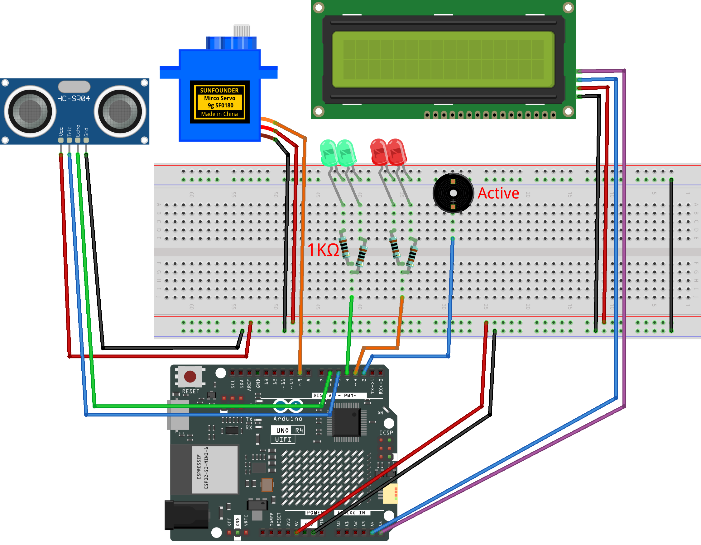

.. _trash_can 4.0:

Trash Can 4.0 
==============================================================

.. note::
  
  🌟 Welcome to the SunFounder Facebook Community! Whether you're into Raspberry Pi, Arduino, or ESP32, you'll find inspiration, help ideas here.
   
  - ✅ Be the first to get free learning resources. 
   
  - ✅ Stay updated on new products & exclusive giveaways. 
   
  - ✅ Share your creations and get real feedback.
   
  * 👉 Need faster updates or support? Click [|link_sf_facebook|] join our Facebook community 

  * 👉 Or join our WhatsApp group: Click [|link_sf_whatsapp|]
   
Kit purchase
------------------------

Looking for parts? Check out our all-in-one kits below — packed with components, beginner-friendly guides, and tons of fun.

.. image:: img/elite_explore_kit.png
   :width: 100%
   :align: center
   :target: https://www.sunfounder.com/collections/arduino-kits-bundles/products/sunfounder-elite-explorer-kit-with-official-arduino-uno-r4-wifi?ref=jbzmncle

.. raw:: html

     

.. list-table::
   :widths: 20 20 20
   :header-rows: 1

   * - Name
     - Includes Arduino board
     - PURCHASE LINK
   * - Ultimate Sensor Kit
     - Arduino Uno R4 Minima
     - |link_ultimate_sensor_buy|
   * - Elite Explorer Kit
     - Arduino Uno R4 WiFi
     - |link_elite_buy|
   * - 3 in 1 Ultimate Starter Kit
     - Arduino Uno R4 Minima
     - |link_arduinor4_buy|
   * - Universal Maker Sensor Kit
     - ×
     - |link_umsk_buy|

Course Introduction
------------------------

In this lesson, you'll learn how to use an ultrasonic sensor module, a digital servo motor, an I2C LCD, led, an active buzzer and an Arduino board to build a smart trash can.

When the ultrasonic sensor module detects trash being thrown in, the digital servo motor opens the lid of the trash can.

.. .. raw:: html

..  <iframe width="700" height="394" src="https://www.youtube.com/embed/ENaC1r4fLpw?si=XWeABpzy2SMEBBxL" title="YouTube video player" frameborder="0" allow="accelerometer; autoplay; clipboard-write; encrypted-media; gyroscope; picture-in-picture; web-share" referrerpolicy="strict-origin-when-cross-origin" allowfullscreen></iframe>

.. note::

  If this is your first time working with an Arduino project, we recommend downloading and reviewing the basic materials first.
  
  * :ref:`install_arduino`
  * :ref:`introduce_arduino`

**Required Components**

In this project, we need the following components:

.. list-table::
    :widths: 5 20 5 20
    :header-rows: 1

    *   - SN
        - COMPONENT INTRODUCTION	
        - QUANTITY
        - PURCHASE LINK

    *   - 1
        - Arduino UNO R4 Minima/Arduino UNO R4 WIFI
        - 1
        - |link_unor4_buy|
    *   - 2
        - USB Type-C cable
        - 1
        - 
    *   - 3
        - Breadboard
        - 1
        - |link_breadboard_buy|
    *   - 4
        - Wires
        - Several
        - |link_wires_buy|
    *   - 5
        - 1kΩ resistor
        - 4
        - |link_resistor_buy|
    *   - 6
        - Ultrasonic Sensor Module
        - 1
        - |link_ultrasonic_buy|
    *   - 7
        - LED
        - 4
        - |link_led_buy|
    *   - 8
        - Digital Servo Motor
        - 1
        - |link_motor_buy|
    *   - 9
        - Active Buzzer
        - 1
        - 
    *   - 10
        - I2C LCD 1602
        - 1
        - |link_i2clcd1602_buy|

**Wiring**

**Common Connections:**

* **Digital Servo Motor**

  - Connect to breadboard’s positive power bus.
  - Connect to breadboard’s negative power bus.
  - Connect to **9** on the Arduino.

* **Ultrasonic Sensor Module**

  - **Trig:** Connect to **5** on the Arduino.
  - **Echo:** Connect to **6** on the Arduino.
  - **GND:** Connect to breadboard’s negative power bus.
  - **VCC:** Connect to breadboard’s red power bus.

* **LED**

  - **Red LED**: Connect the LEDs **anode** to a **1kΩ resistor** then to  the  **3** on Arduino, and the LEDs **cathode**  to negative power bus on the breadboard.
  - **Green LED**: Connect the LEDs **anode** to a **1kΩ resistor** then to the  **4** on Arduino, and the LEDs **cathode** to negative power bus on the breadboard.

* **Active Buzzer**

  - **＋:** Connect to **2** on the Arduino.
  - **－:** Connect to breadboard’s negative power bus.

* **I2C LCD 1602**

  - **SDA:** Connect to **A4** on the Arduino.
  - **SCL:** Connect to **A5** on the Arduino.
  - **GND:** Connect to breadboard’s negative power bus.
  - **VCC:** Connect to breadboard’s red power bus.

**Writing the Code**

.. note::

    * You can copy this code into **Arduino IDE**. 
    * To install the library, use the Arduino Library Manager and search for **LiquidCrystal_I2C** and install it.
    * Don't forget to select the board(Arduino UNO R4 Minima/WIFI) and the correct port before clicking the **Upload** button.

.. code-block:: arduino

      #include <Servo.h>
      #include <Wire.h>
      #include <LiquidCrystal_I2C.h>

      // LCD object: address, columns, rows
      LiquidCrystal_I2C lcd(0x27, 16, 2);

      // Servo setup
      Servo servo;
      const int servoPin = 9;
      const int openAngle = 0;
      const int closeAngle = 90;

      // Ultrasonic sensor pins
      const int trigPin = 5;
      const int echoPin = 6;
      float currentDistance;

      // Buzzer and LED pins
      const int buzzerPin = 2;
      const int redLedPin = 3;
      const int greenLedPin = 4;

      // Distance threshold to trigger the lid
      const int distanceThreshold = 20;

      // Lid timing
      unsigned long lidOpenTime = 0;
      const unsigned long holdOpenMs = 2000;
      bool isLidOpen = false;

      // Buzzer and red LED blinking timing
      const unsigned long beepInterval = 200;
      unsigned long lastBeepTime = 0;
      bool beepState = false;

      // Trash count
      int trashCount = 0;

      void setup() {
        Serial.begin(9600);

        // Set ultrasonic sensor pins
        pinMode(trigPin, OUTPUT);
        pinMode(echoPin, INPUT);

        // Set buzzer and LED pins
        pinMode(buzzerPin, OUTPUT);
        pinMode(redLedPin, OUTPUT);
        pinMode(greenLedPin, OUTPUT);

        // Move the servo to the closed position
        servo.attach(servoPin);
        servo.write(closeAngle);
        delay(100);
        servo.detach();

        // Default status: lid closed
        digitalWrite(buzzerPin, LOW);
        digitalWrite(redLedPin, LOW);
        digitalWrite(greenLedPin, HIGH);

        // Start the LCD
        lcd.init();
        lcd.backlight();

        // Show the first count on the LCD
        updateLCD();
      }

      void loop() {
        // Read the current distance
        currentDistance = readDistance();

        // Open the lid when an object is close enough
        if (!isLidOpen && currentDistance > 0 && currentDistance <= distanceThreshold) {
          servo.attach(servoPin);
          delay(1);
          servo.write(openAngle);

          isLidOpen = true;
          lidOpenTime = millis();

          // Count one trash drop
          trashCount++;
          updateLCD();

          // Reset blink timing
          lastBeepTime = millis();
          beepState = false;

          digitalWrite(greenLedPin, LOW);
        }

        // Run the open-lid effects
        if (isLidOpen) {
          unsigned long now = millis();

          // Blink the red LED and buzzer
          if (now - lastBeepTime >= beepInterval) {
            lastBeepTime = now;
            beepState = !beepState;
            digitalWrite(buzzerPin, beepState ? HIGH : LOW);
            digitalWrite(redLedPin, beepState ? HIGH : LOW);
          }

          // Close the lid after a short time
          if (millis() - lidOpenTime >= holdOpenMs) {
            servo.write(closeAngle);
            delay(200);
            servo.detach();

            isLidOpen = false;

            // Back to the default status
            digitalWrite(buzzerPin, LOW);
            digitalWrite(redLedPin, LOW);
            digitalWrite(greenLedPin, HIGH);
          }
        }

        // Small delay for stable reading
        delay(50);
      }

      // Update the number on the LCD
      void updateLCD() {
        lcd.clear();
        lcd.setCursor(0, 0);
        lcd.print("Trash Count:");
        lcd.setCursor(0, 1);
        lcd.print(trashCount);
      }

      // Measure distance in centimeters
      float readDistance() {
        // Send a short pulse
        digitalWrite(trigPin, LOW);
        delayMicroseconds(2);
        digitalWrite(trigPin, HIGH);
        delayMicroseconds(10);
        digitalWrite(trigPin, LOW);

        // Read the echo time
        unsigned long duration = pulseIn(echoPin, HIGH, 25000UL);

        // Return -1 if no signal is received
        if (duration == 0) return -1.0;

        // Convert the echo time to distance
        return duration / 58.0;
      }