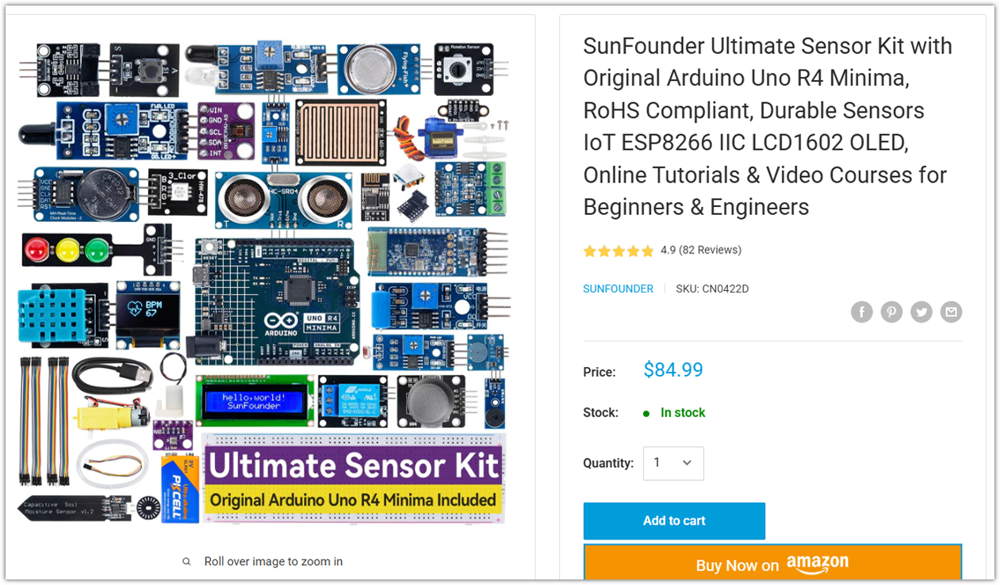
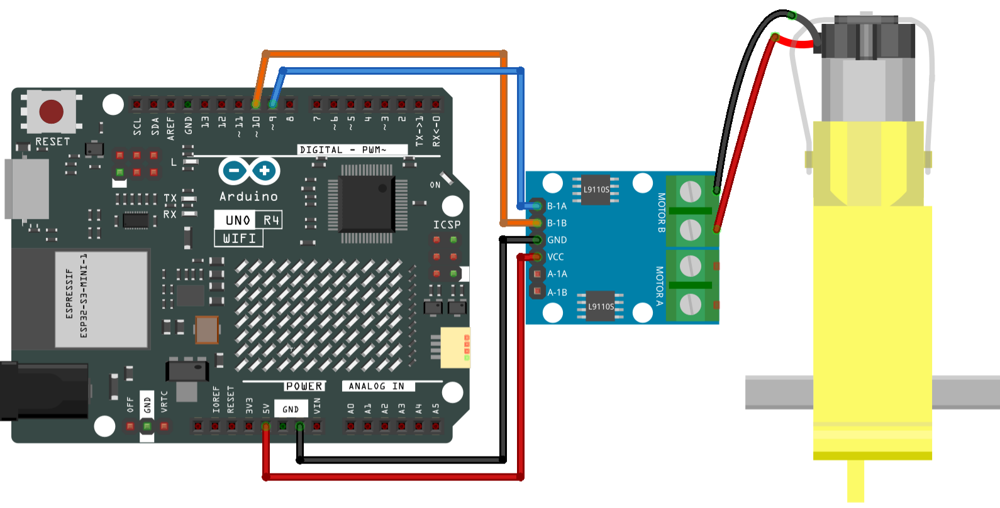

.. _tt:

TT Motor
==============================================================

.. note::
  
  🌟 Welcome to the SunFounder Facebook Community! Whether you're into Raspberry Pi, Arduino, or ESP32, you'll find inspiration, help ideas here.
   
  - ✅ Be the first to get free learning resources. 
   
  - ✅ Stay updated on new products & exclusive giveaways. 
   
  - ✅ Share your creations and get real feedback.
   
  * 👉 Need faster updates or support? Click [|link_sf_facebook|] join our Facebook community 

  * 👉 Or join our WhatsApp group: Click [|link_sf_whatsapp|]
   
Kit purchase
------------------------

Looking for parts? Check out our all-in-one kits below — packed with components, beginner-friendly guides, and tons of fun.

.. raw:: html

     

.. list-table::
   :widths: 20 20 20
   :header-rows: 1

   * - Name
     - Includes Arduino board
     - PURCHASE LINK
   * - Elite Explorer Kit
     - Arduino Uno R4 WiFi
     - |link_elite_buy|
   * - 3 in 1 Ultimate Starter Kit
     - Arduino Uno R4 Minima
     - |link_arduinor4_buy|

Course Introduction
------------------------

In this lesson, we will learn how to use the TT Motor with Arduino.

.. .. raw:: html

.. <iframe width="700" height="394" src="https://www.youtube.com/embed/VTqcDGH7XE4?si=rJeNwznz4D8fJeKM" title="YouTube video player" frameborder="0" allow="accelerometer; autoplay; clipboard-write; encrypted-media; gyroscope; picture-in-picture; web-share" referrerpolicy="strict-origin-when-cross-origin" allowfullscreen></iframe>

.. note::

  If this is your first time working with an Arduino project, we recommend downloading and reviewing the basic materials first.

  * :ref:`install_arduino`
  * :ref:`introduce_arduino`

**Required Components**

In this project, we need the following components:

.. list-table::
    :widths: 5 20 5 20
    :header-rows: 1

    *   - SN
        - COMPONENT INTRODUCTION	
        - QUANTITY
        - PURCHASE LINK

    *   - 1
        - Arduino UNO R4 Minima
        - 1
        - |link_unor4_buy|
    *   - 2
        - USB Type-C cable
        - 1
        - 
    *   - 3
        - Breadboard
        - 1
        - |link_breadboard_buy|
    *   - 4
        - Wires
        - Several
        - |link_wires_buy|
    *   - 5
        - TT Motor
        - 1
        - 

**Wiring**

**Common Connections:**

* **TT Motor**

  -  Connect to **MOTOR B** on the L9110 Motor Driver Module.

* **L9110 Motor Driver Module**

  - **GND:** Connect to **GND** on the Arduino.
  - **VCC:** Connect to **5V** on the Arduino.
  - **B-1B:** Connect to **10** on the Arduino.
  - **B-1A:** Connect to **9** on the Arduino.

**Writing the Code**

.. note::

    * You can copy this code into **Arduino IDE**. 
    * Don't forget to select the board(Arduino UNO R4 Minima) and the correct port before clicking the **Upload** button.

.. code-block:: arduino

      /*
        This code defines and initializes two pins for a motor and sets its speed.

        Board: Arduino Uno R3 (or R4)
        Component: Motor and L9110 motor control board
      */

      // Define the motor pins
      const int motorB_1A = 9;
      const int motorB_2A = 10;

      void setup() {
        pinMode(motorB_1A, OUTPUT);  // set motor pin 1 as output
        pinMode(motorB_2A, OUTPUT);  // set motor pin 2 as output

        analogWrite(motorB_1A, 255);  // set motor speed (0-255)
        analogWrite(motorB_2A, 0);

        delay(3000);
        
        analogWrite(motorB_1A, 0);  
        analogWrite(motorB_2A, 0);
      }

      void loop() {

      }

