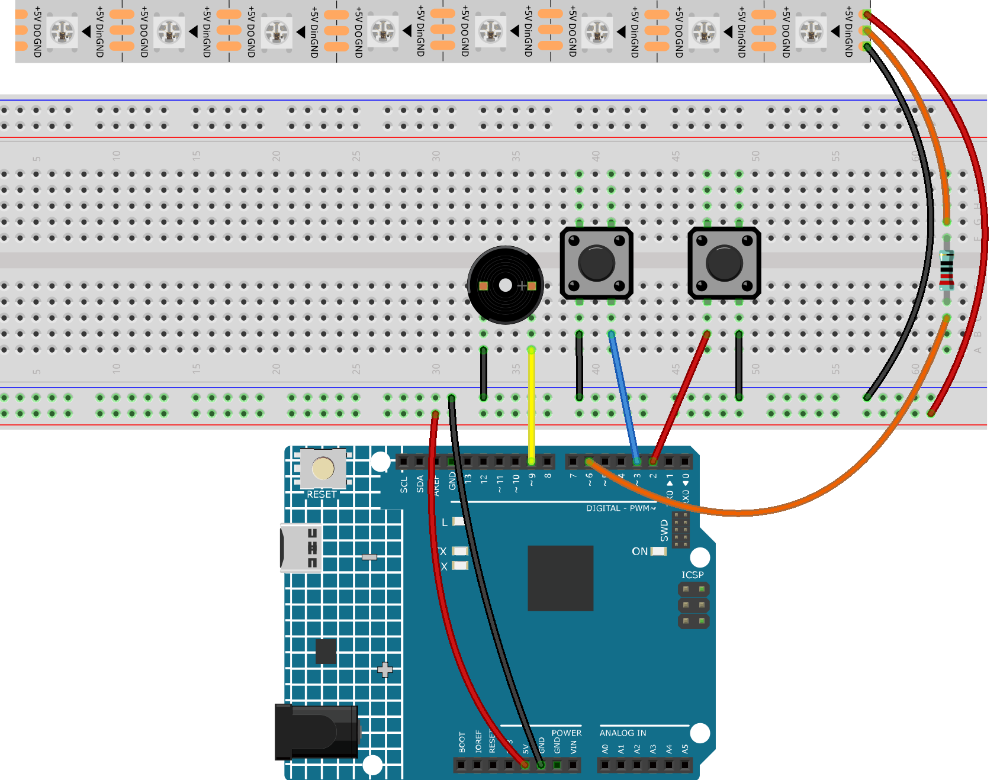

.. _tug_of_war_:

Tug of War
==============================================================

.. note::
  
  🌟 Welcome to the SunFounder Facebook Community! Whether you're into Raspberry Pi, Arduino, or ESP32, you'll find inspiration, help ideas here.
   
  - ✅ Be the first to get free learning resources. 
   
  - ✅ Stay updated on new products & exclusive giveaways. 
   
  - ✅ Share your creations and get real feedback.
   
  * 👉 Need faster updates or support? Click [|link_sf_facebook|] join our Facebook community 

  * 👉 Or join our WhatsApp group: Click [|link_sf_whatsapp|]
   
  * 🎁 Looking for parts?Check out our all-in-one kits below — packed with components, beginner-friendly guides, and tons of fun.
  
  .. list-table::
    :widths: 20 20 20
    :header-rows: 1

    *   - Name
        - Arduino board
        - PURCHASE LINK
    *   - Elite Explorer Kit
        - Arduino Uno R4 WiFi
        - |link_elite_buy|

Course Introduction
------------------------

In this lesson, we’ll create a two-player LED tug-of-war game using an LED strip, two buttons, and a buzzer, where players race to push the light to their side to win.

.. .. raw:: html

..  <iframe width="700" height="394" src="https://www.youtube.com/embed/pw7hejDfDT0?si=bQJpRAnpSjgfgt8K" title="YouTube video player" frameborder="0" allow="accelerometer; autoplay; clipboard-write; encrypted-media; gyroscope; picture-in-picture; web-share" referrerpolicy="strict-origin-when-cross-origin" allowfullscreen></iframe>

.. note::

  If this is your first time working with an Arduino project, we recommend downloading and reviewing the basic materials first.
  
  * :ref:`install_arduino`
  * :ref:`introduce_arduino`

**Required Components**

In this project, we need the following components:

.. list-table::
    :widths: 5 20 5 20
    :header-rows: 1

    *   - SN
        - COMPONENT INTRODUCTION	
        - QUANTITY
        - PURCHASE LINK
    
    *   - 1
        - Arduino UNO R4 Minima/Arduino UNO R4 WIFI
        - 1
        - |link_unor4_wifi_buy|
    *   - 2
        - USB Type-C cable
        - 1
        - 
    *   - 3
        - Breadboard
        - 1
        - |link_breadboard_buy|
    *   - 4
        - Wires
        - Several
        - |link_wires_buy|
    *   - 5
        - Passive Buzzer
        - 1
        - |link_passive_buzzer_buy|
    *   - 6
        - Button
        - 2
        - |link_button_buy|
    *   - 7
        - LED Strip
        - 1
        - |link_ws2812_buy|

**Wiring**

**Common Connections:**

* **Button**

  - **button1:** Connect to the breadboard’s negative power bus, and the other end to **2** on the Arduino board.
  - **button2:** Connect to the breadboard’s negative power bus, and the other end to **3** on the Arduino board.

* **Passive Buzzer**

  - **＋:** Connect to **9** on the Arduino.
  - **－:** Connect to breadboard’s negative power bus.

* **LED Strip**

  - **Din:** Connect a to **220Ω resistor** then to **6** on the Arduino.
  - **GND:** Connect to breadboard’s negative power bus.
  - **+5V:** Connect to breadboard’s passive power bus.

**Writing the Code**

.. note::

    * You can copy this code into **Arduino IDE**. 
    * To install the library, use the Arduino Library Manager and search for **Adafruit_NeoPixel** and install it.
    * Don't forget to select the board(Arduino UNO R4 WIFI) and the correct port before clicking the **Upload** button.

1. Information writing

.. code-block:: arduino

      #include <Adafruit_NeoPixel.h>

      #define LED_PIN    10
      #define LED_COUNT  8    // Number of LEDs
      #define BTN1_PIN   2    // Player 1 button (Red side)
      #define BTN2_PIN   3    // Player 2 button (Blue side)
      #define BUZZER_PIN 9    // Buzzer

      Adafruit_NeoPixel strip(LED_COUNT, LED_PIN, NEO_GRB + NEO_KHZ800);

      int position = LED_COUNT / 2;  // Initial center index (4)
      bool gameRunning = false;

      // Button states for edge detection
      bool lastBtn1State = HIGH;
      bool lastBtn2State = HIGH;

      void setup() {
        pinMode(BTN1_PIN, INPUT_PULLUP);
        pinMode(BTN2_PIN, INPUT_PULLUP);
        pinMode(BUZZER_PIN, OUTPUT);

        strip.begin();
        strip.show();
        drawInitial();  // Initial: left 4 red, right 4 blue
      }

      void loop() {
        bool btn1State = digitalRead(BTN1_PIN);
        bool btn2State = digitalRead(BTN2_PIN);

        if (!gameRunning) {
          // Wait for both buttons pressed to start game
          if (btn1State == LOW && btn2State == LOW) {
            delay(300);  // debounce
            position = LED_COUNT / 2;  // Reset to center
            gameRunning = true;
            drawPosition();
          }
        } else {
          // Player 1 press detected (edge) → push right
          if (lastBtn1State == HIGH && btn1State == LOW) {
            position++;
            tone(BUZZER_PIN, 1200, 50);
          }
          // Player 2 press detected (edge) → push left
          if (lastBtn2State == HIGH && btn2State == LOW) {
            position--;
            tone(BUZZER_PIN, 1000, 50);
          }

          drawPosition();

          // Victory check
          if (position >= LED_COUNT - 1) {
            winAnimation(1);  // Player 1 (Red) wins
            gameRunning = false;
          }
          if (position <= 0) {
            winAnimation(2);  // Player 2 (Blue) wins
            gameRunning = false;
          }
        }

        lastBtn1State = btn1State;
        lastBtn2State = btn2State;
      }

      // Initial symmetric display: left 4 red, right 4 blue
      void drawInitial() {
        strip.clear();
        for (int i = 0; i < 4; i++) {
          strip.setPixelColor(i, strip.Color(255, 0, 0)); // Red
        }
        for (int i = 4; i < 8; i++) {
          strip.setPixelColor(i, strip.Color(0, 0, 255)); // Blue
        }
        strip.show();
      }

      // Game progress display (no green light, just color boundary)
      void drawPosition() {
        strip.clear();
        for (int i = 0; i < LED_COUNT; i++) {
          if (i < position) {
            strip.setPixelColor(i, strip.Color(255, 0, 0)); // Red side (left of boundary)
          } else {
            strip.setPixelColor(i, strip.Color(0, 0, 255)); // Blue side (right of boundary)
          }
        }
        strip.show();
      }

      void winAnimation(int player) {
        uint32_t color = (player == 1) ? strip.Color(255, 0, 0) : strip.Color(0, 0, 255);
        for (int i = 0; i < 5; i++) {
          strip.clear();
          for (int j = 0; j < LED_COUNT; j++) {
            strip.setPixelColor(j, color);
          }
          strip.show();
          tone(BUZZER_PIN, player == 1 ? 1200 : 1000, 200);
          delay(200);
          strip.clear();
          strip.show();
          delay(200);
        }
        // Final solid winner color
        for (int j = 0; j < LED_COUNT; j++) {
          strip.setPixelColor(j, color);
        }
        strip.show();
        noTone(BUZZER_PIN);
      }
