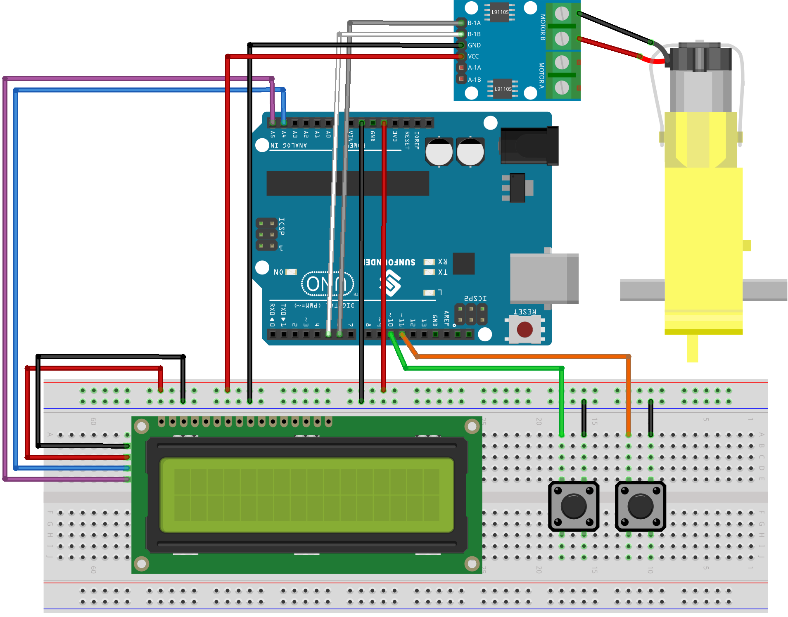

.. _velocity_view:

Velocity View
==============================================================
.. note::
  
  Hello, welcome to the SunFounder Raspberry Pi & Arduino & ESP32 Enthusiasts Community on Facebook! Dive deeper into Raspberry Pi, Arduino, and ESP32 with fellow enthusiasts.

  👉 Ready to explore and create with us? Click [|link_sf_facebook|] and join today!

  To get all the components for this project, consider one of the kits below. 

  Each includes the required parts, extra components for other projects, and beginner-friendly tutorials.

  .. list-table::
    :widths: 20 20 20
    :header-rows: 1

    *   - Name	
        - Includes Arduino board
        - PURCHASE LINK
    *   - Universal Maker Sensor Kit
        - ×
        - |link_umsk_buy|
    *   - 3 in 1 Ultimate Starter Kit	
        - √
        - |link_arduinor3_buy|

Course Introduction
------------------------

In this lesson, you'll learn how to use two buttons and the L9110 motor driver module to control the servo speed and visualize it on the LCD screen.

Pressing the red button starts the servo and increases its speed in the clockwise direction. Pressing the green button slows it down and rotates the servo counterclockwise.

.. raw:: html

    <iframe width="700" height="394" src="https://www.youtube.com/embed/S4FqPvHB2YM" title="YouTube video player" frameborder="0" allow="accelerometer; autoplay; clipboard-write; encrypted-media; gyroscope; picture-in-picture; web-share" referrerpolicy="strict-origin-when-cross-origin" allowfullscreen></iframe>

.. note::

  If this is your first time working with an Arduino project, we recommend downloading and reviewing the basic materials first.
  
  * :ref:`install_arduino`
  * :ref:`introduce_arduino`

**Required Components**

In this project, we need the following components:

.. list-table::
    :widths: 5 20 5 20
    :header-rows: 1

    *   - SN
        - COMPONENT INTRODUCTION	
        - QUANTITY
        - PURCHASE LINK

    *   - 1
        - Arduino UNO R3
        - 1
        - |link_unor3_buy|
    *   - 2
        - USB Cable
        - 1
        - 
    *   - 3
        - Breadboard
        - 1
        - |link_breadboard_buy|
    *   - 4
        - Wires
        - Several
        - |link_wires_buy|
    *   - 5
        - L9110 Motor Driver Module
        - 1
        - 
    *   - 6
        - TT Motor
        - 1
        - 
    *   - 7
        - I2C LCD 1602
        - 1
        - |link_i2clcd1602_buy|
    *   - 8
        - Button
        - 2
        - |link_button_buy|

**Wiring**

**Common Cathode Connections:**

* **I2C LCD 1602**

  - **SDA:** Connect to **A4** on the Arduino.
  - **SCL:** Connect to **A5** on the Arduino.
  - **GND:** Connect to breadboard’s negative power bus.
  - **VCC:** Connect to breadboard’s red power bus.

* **TT Motor**

  -  Connect to **MOTOR B** on the L9110 Motor Driver Module.

* **L9110 Motor Driver Module**

  - **GND:** Connect to breadboard’s negative power bus.
  - **VCC:** Connect to breadboard’s red power bus.
  - **B-1B:** Connect to PWM **5** on the Arduino.
  - **B-1A:** Connect to PWM **6** on the Arduino.

**Writing the Code**

.. note::

    * You can copy this code into **Arduino IDE**. 
    * Don't forget to select the board(Raspberry Pi Pico) and the correct port before clicking the **Upload** button.

.. code-block:: arduino

      #include <Wire.h>
      #include <LiquidCrystal_I2C.h>

      // LCD setup
      LiquidCrystal_I2C lcd(0x27, 16, 2);

      // Button pins
      const int greenButtonPin = 10;
      const int redButtonPin = 11;

      // Motor pins
      const int motorPin1 = 5; // TT Motor pin 1
      const int motorPin2 = 6; // TT Motor pin 2

      // Gear and Speed arrays
      String gears[] = {"Back", "0", "1", "2", "3", "4"};
      int speeds[] = {110, 0, 110, 150, 200, 255};

      // Index to track current gear and speed
      int index = 1;

      void setup() {
        lcd.init();
        lcd.backlight();
        
        // Initialize buttons
        pinMode(greenButtonPin, INPUT_PULLUP);
        pinMode(redButtonPin, INPUT_PULLUP);

        // Initialize motor pins
        pinMode(motorPin1, OUTPUT);
        pinMode(motorPin2, OUTPUT);
        
        // Display initial gear and speed
        updateDisplay();
      }

      void loop() {
        // Increase gear and speed
        if (digitalRead(greenButtonPin) == LOW) {
          if (index < 5) {  // Check to avoid going out of array bounds
            index++;
            controlMotor();
          }
          updateDisplay();
          delay(200); // Debouncing
        }

        // Decrease gear and speed
        if (digitalRead(redButtonPin) == LOW) {
          if (index > 0) {  // Check to avoid going below 0
            index--;
            controlMotor();
          }
          updateDisplay();
          delay(200); // Debouncing
        }
      }

      void updateDisplay() {
        lcd.clear();
        lcd.setCursor(0, 0);
        lcd.print("Gear: " + gears[index]);
        lcd.setCursor(0, 1);
        lcd.print("Speed: " + String(speeds[index]));
      }

      void controlMotor() {
        if (gears[index] == "Back") {
          analogWrite(motorPin1, map(speeds[index], 0, 255, 0, 255));
          digitalWrite(motorPin2, LOW);
        } else {
          digitalWrite(motorPin1, LOW);
          analogWrite(motorPin2, map(speeds[index], 0, 255, 0, 255));
        }
      }
