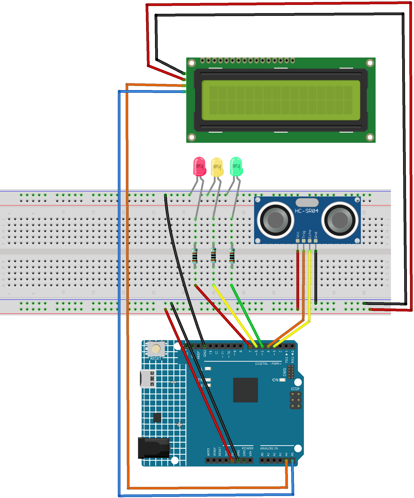

.. _water_level:

Water Level
==============================================================

.. note::
  
  🌟 Welcome to the SunFounder Facebook Community! Whether you're into Raspberry Pi, Arduino, or ESP32, you'll find inspiration, help ideas here.
   
  - ✅ Be the first to get free learning resources. 
   
  - ✅ Stay updated on new products & exclusive giveaways. 
   
  - ✅ Share your creations and get real feedback.
   
  * 👉 Need faster updates or support? Click [|link_sf_facebook|] join our Facebook community 

  * 👉 Or join our WhatsApp group: Click [|link_sf_whatsapp|]
   
Kit purchase
------------------------

Looking for parts? Check out our all-in-one kits below — packed with components, beginner-friendly guides, and tons of fun.

.. image:: img/ultimate_sensor_kit.png
   :width: 100%
   :align: center
   :target: https://www.sunfounder.com/collections/arduino-kits-bundles/products/sunfounder-ultimate-sensor-kit-with-original-arduino-uno-r4-minima?ref=jbzmncle

.. raw:: html

     

.. list-table::
   :widths: 20 20 20
   :header-rows: 1

   * - Name
     - Includes Arduino board
     - PURCHASE LINK
   * - Elite Explorer Kit
     - Arduino Uno R4 WiFi
     - |link_elite_buy|
   * - 3 in 1 Ultimate Starter Kit
     - Arduino Uno R4 Minima
     - |link_arduinor4_buy|

Course Introduction
------------------------

In this lesson, you’ll learn how to use  an Ultrasonic Sensor Module, a 1602 LCD with the Arduino UNO R4 to create a Ultrasonic water level monitor system.

The LED lights red when the water is low, turns yellow as it rises, and switches to green once it reaches the set level.

.. raw:: html

  <iframe width="700" height="394" src="https://www.youtube.com/embed/yXNe92a6Giw?si=44xzXrcJH05ZQBDP" title="YouTube video player" frameborder="0" allow="accelerometer; autoplay; clipboard-write; encrypted-media; gyroscope; picture-in-picture; web-share" referrerpolicy="strict-origin-when-cross-origin" allowfullscreen></iframe>

.. note::

  If this is your first time working with an Arduino project, we recommend downloading and reviewing the basic materials first.
  
  * :ref:`install_arduino`
  * :ref:`introduce_arduino`

**Required Components**

In this project, we need the following components:

.. list-table::
    :widths: 5 20 5 20
    :header-rows: 1

    *   - SN
        - COMPONENT INTRODUCTION	
        - QUANTITY
        - PURCHASE LINK

    *   - 1
        - Arduino UNO R4 Minima/Arduino UNO R4 wifi
        - 1
        - |link_arduinor4_buy|
    *   - 2
        - USB Cable
        - 1
        - 
    *   - 3
        - Breadboard
        - 1
        - |link_breadboard_buy|
    *   - 4
        - Wires
        - Several
        - |link_wires_buy|
    *   - 5
        - Ultrasonic Sensor Module
        - 1
        - |link_ultrasonic_buy|
    *   - 6
        - I2C LCD 1602
        - 1
        - |link_i2clcd1602_buy|
    *   - 7
        - Resistor
        - 1KΩ
        - |link_resistor_buy|
    *   - 8
        - LED
        - 3
        - |link_led_buy|

**Wiring**

**Common Connections:**

* **Ultrasonic Sensor Module**

  - **Trig:** Connect to **4** on the Arduino.
  - **Echo:** Connect to **3** on the Arduino.
  - **GND:** Connect to breadboard’s negative power bus.
  - **VCC:** Connect to breadboard’s red power bus.

* **I2C LCD 1602**

  - **SDA:** Connect to **A4** on the Arduino.
  - **SCL:** Connect to **A5** on the Arduino.
  - **GND:** Connect to breadboard’s negative power bus.
  - **VCC:** Connect to breadboard’s red power bus.

* **LEDS**

  - **Green:** Connect the LED **cathode** to the negative power bus on the breadboard, and the **anode** to a **1KΩ resistor**, then to **5** on the Arduino.
  - **Yellow:** Connect the LED **cathode** to the negative power bus on the breadboard, and the **anode** to a **1kΩ resistor**, then to **6** on the Arduino.
  - **Red:** Connect the LED **cathode** to the negative power bus on the breadboard, and the **anode** to a **1kΩ resistor**, then to **7** on the Arduino.

**Writing the Code**

.. note::

    * You can copy this code into **Arduino IDE**. 
    * To install the library, use the Arduino Library Manager and search for **LiquidCrystal I2C** and install it.
    * Don't forget to select the board(Arduino UNO R4 Minima/WIFI) and the correct port before clicking the **Upload** button.

.. code-block:: arduino

      #include <LiquidCrystal_I2C.h>

      // Initialize the LCD (I2C address 0x27, 16 columns, 2 rows)
      LiquidCrystal_I2C lcd(0x27, 16, 2);

      // Define the pins for the ultrasonic sensor
      const int echoPin = 3;
      const int trigPin = 4;

      // Define the pins for the LEDs
      const int greenLed = 7;   // Green LED connected to pin 7
      const int yellowLed = 6;  // Yellow LED connected to pin 6
      const int redLed = 5;     // Red LED connected to pin 5
      void setup() {
        // Initialize the LCD and clear the lcd
        lcd.init();
        lcd.clear();
        lcd.backlight();
        
        // Initialize ultrasonic sensor pins
        pinMode(echoPin, INPUT);
        pinMode(trigPin, OUTPUT);
        
        // Initialize LED pins
        pinMode(greenLed, OUTPUT);
        pinMode(yellowLed, OUTPUT);
        pinMode(redLed, OUTPUT);
      }

      void loop() {
        // Get the distance to the water level
        float distance = readDistance();
        
        // Display the distance on the LCD
        lcd.setCursor(0, 0);
        lcd.print("Distance:");
        lcd.setCursor(0, 1);
        lcd.print(distance);
        lcd.print(" cm  ");

        // Light up the corresponding LED based on the distance
        if (distance <= 5) {
          // Distance 0-5 cm, turn on the green LED
          digitalWrite(greenLed, HIGH);
          digitalWrite(yellowLed, LOW);
          digitalWrite(redLed, LOW);
        } else if (distance > 5 && distance <= 10) {
          // Distance 5-10 cm, turn on the yellow LED
          digitalWrite(greenLed, LOW);
          digitalWrite(yellowLed, HIGH);
          digitalWrite(redLed, LOW);
        } else if (distance > 10 && distance <= 15) {
          // Distance 10-15 cm, turn on the red LED
          digitalWrite(greenLed, LOW);
          digitalWrite(yellowLed, LOW);
          digitalWrite(redLed, HIGH);
        } else {
          // Distance greater than 15 cm, turn off all LEDs
          digitalWrite(greenLed, LOW);
          digitalWrite(yellowLed, LOW);
          digitalWrite(redLed, LOW);
        }

        delay(500);  // Delay 500 milliseconds
      }

      // Read the distance from the ultrasonic sensor
      float readDistance() {
        digitalWrite(trigPin, LOW);  // Ensure the trigger pin is low
        delayMicroseconds(2);
        digitalWrite(trigPin, HIGH); // Trigger the ultrasonic sensor to send a pulse
        delayMicroseconds(10);
        digitalWrite(trigPin, LOW);  // End the trigger
        
        // Measure the pulse width of the echo pin and convert it to distance
        float distance = pulseIn(echoPin, HIGH) / 58.00;
        return distance;
      }
