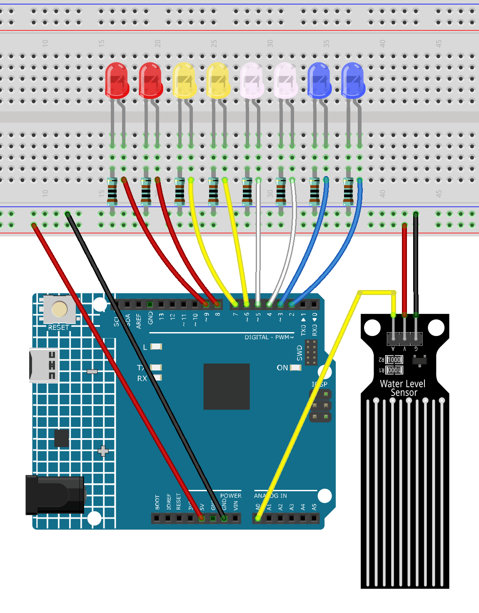

.. _water_level2.0:

Water Level 2.0
==============================================================

.. note::
  
  🌟 Welcome to the SunFounder Facebook Community! Whether you're into Raspberry Pi, Arduino, or ESP32, you'll find inspiration, help ideas here.
   
  - ✅ Be the first to get free learning resources. 
   
  - ✅ Stay updated on new products & exclusive giveaways. 
   
  - ✅ Share your creations and get real feedback.
   
  * 👉 Need faster updates or support? Click [|link_sf_facebook|] join our Facebook community 

  * 👉 Or join our WhatsApp group: Click [|link_sf_whatsapp|]
   
Kit purchase
------------------------

Looking for parts? Check out our all-in-one kits below — packed with components, beginner-friendly guides, and tons of fun.

.. image:: img/ultimate_sensor_kit.png
   :width: 100%
   :align: center
   :target: https://www.sunfounder.com/collections/arduino-kits-bundles/products/sunfounder-ultimate-sensor-kit-with-original-arduino-uno-r4-minima?ref=jbzmncle

.. raw:: html

     

.. list-table::
   :widths: 20 20 20
   :header-rows: 1

   * - Name
     - Includes Arduino board
     - PURCHASE LINK
   * - Elite Explorer Kit
     - Arduino Uno R4 WiFi
     - |link_elite_buy|
   * - 3 in 1 Ultimate Starter Kit
     - Arduino Uno R4 Minima
     - |link_arduinor4_buy|

Course Introduction
------------------------

In this lesson, you’ll learn how to build a simple water level indicator using an analog water level sensor and 8 LEDs with the Arduino UNO R4. 

As the water level rises, more LEDs light up to visually display the current level in real time.

.. raw:: html

  <iframe width="700" height="394" src="https://www.youtube.com/embed/0pQWDoPfSMM?si=UtsKJM_CrX4w-HsD" title="YouTube video player" frameborder="0" allow="accelerometer; autoplay; clipboard-write; encrypted-media; gyroscope; picture-in-picture; web-share" referrerpolicy="strict-origin-when-cross-origin" allowfullscreen></iframe>

.. note::

  If this is your first time working with an Arduino project, we recommend downloading and reviewing the basic materials first.
  
  * :ref:`install_arduino`
  * :ref:`introduce_arduino`

**Required Components**

In this project, we need the following components:

.. list-table::
    :widths: 5 20 5 20
    :header-rows: 1

    *   - SN
        - COMPONENT INTRODUCTION	
        - QUANTITY
        - PURCHASE LINK

    *   - 1
        - Arduino UNO R4 Minima/Arduino UNO R4 wifi
        - 1
        - |link_arduinor4_buy|
    *   - 2
        - USB Cable
        - 1
        - 
    *   - 3
        - Breadboard
        - 1
        - |link_breadboard_buy|
    *   - 4
        - Wires
        - Several
        - |link_wires_buy|
    *   - 5
        - Water Level Detection Module
        - 1
        - 
    *   - 6
        - Resistor
        - 1KΩ
        - |link_resistor_buy|
    *   - 7
        - LED
        - Several
        - |link_led_buy|

**Wiring**

**Common Connections:**

* **Water Level Detection Module**

  - **A:** Connect to **A0** on the Arduino.
  - **G:** Connect to breadboard’s negative power bus.
  - **V:** Connect to breadboard’s red power bus.

* **LEDS**

  - Connect the LED **cathode** to a **1KΩ resistor** then to the negative power bus on the breadboard, and the **anode** to the **2~9** on the Arduino.

**Writing the Code**

.. note::

    * You can copy this code into **Arduino IDE**. 
    * Don't forget to select the board(Arduino UNO R4 Minima/WIFI) and the correct port before clicking the **Upload** button.

.. code-block:: arduino

      // LED pin array
      const int ledPins[] = {2, 3, 4, 5, 6, 7, 8, 9};
      const int numLEDs = 8;

      // Water level sensor analog input pin
      const int sensorPin = A0;

      void setup() {
        Serial.begin(9600);
        // Set all LED pins as output
        for (int i = 0; i < numLEDs; i++) {
          pinMode(ledPins[i], OUTPUT);
        }
      }

      void loop() {
        // Read the water level sensor value (0~1023)
        int sensorValue = analogRead(sensorPin);
        Serial.print("Water level analog value: ");
        Serial.println(sensorValue);

        // Map the analog value to number of LEDs (0~8)
        int level = map(sensorValue, 0, 450, 0, numLEDs);

        // Turn on LEDs according to the water level
        for (int i = 0; i < numLEDs; i++) {
          if (i < level) {
            digitalWrite(ledPins[i], HIGH);
          } else {
            digitalWrite(ledPins[i], LOW);
          }
        }

        delay(500);  // Delay before next update
      }
