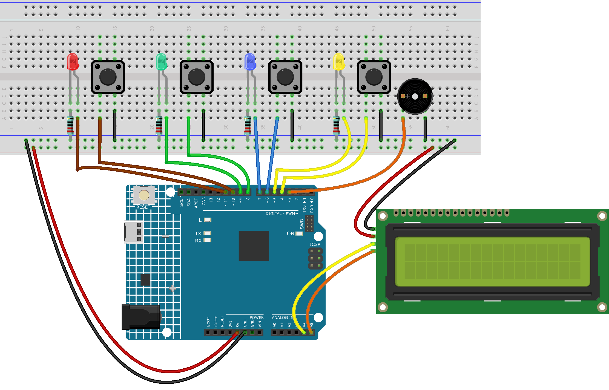

.. _whac_a_mole:

Whac a Mole
==============================================================

.. note::
  
  🌟 Welcome to the SunFounder Facebook Community! Whether you're into Raspberry Pi, Arduino, or ESP32, you'll find inspiration, help ideas here.
   
  - ✅ Be the first to get free learning resources. 
   
  - ✅ Stay updated on new products & exclusive giveaways. 
   
  - ✅ Share your creations and get real feedback.
   
  * 👉 Need faster updates or support? Click [|link_sf_facebook|] join our Facebook community 

  * 👉 Or join our WhatsApp group: Click [|link_sf_whatsapp|]
   
  * 🎁 Looking for parts?Check out our all-in-one kits below — packed with components, beginner-friendly guides, and tons of fun.
  
  .. list-table::
    :widths: 20 20 20
    :header-rows: 1

    *   - Name	
        - Includes Arduino board
        - PURCHASE LINK
    *   - Electronic Kit	
        - ×
        - |link_electronic_buy|
    *   - Elite Explorer Kit	
        - Arduino Uno R4 WiFi
        - |link_elite_buy|
    *   - 3 in 1 Ultimate Starter Kit	
        - Arduino Uno R4 Minima
        - |link_arduinor4_buy|

Course Introduction
------------------------

In this lesson, we’ll build a Whac-A-Mole game using LEDs, buttons, an LCD display, and a buzzer, where players hit lit targets to score points before time runs out.

.. .. raw:: html

.. <iframe width="700" height="394" src="https://www.youtube.com/embed/frHJHmXgnK4?si=iCaX_KMK4dy8d3KH" title="YouTube video player" frameborder="0" allow="accelerometer; autoplay; clipboard-write; encrypted-media; gyroscope; picture-in-picture; web-share" referrerpolicy="strict-origin-when-cross-origin" allowfullscreen></iframe>

.. note::

  If this is your first time working with an Arduino project, we recommend downloading and reviewing the basic materials first.

  * :ref:`install_arduino`
  * :ref:`introduce_arduino`

**Required Components**

In this project, we need the following components:

.. list-table::
    :widths: 5 20 5 20
    :header-rows: 1

    *   - SN
        - COMPONENT INTRODUCTION	
        - QUANTITY
        - PURCHASE LINK

    *   - 1
        - Arduino UNO R4 Minima
        - 1
        - |link_unor4_buy|
    *   - 2
        - USB Type-C cable
        - 1
        - 
    *   - 3
        - Breadboard
        - 1
        - |link_breadboard_buy|
    *   - 4
        - Wires
        - Several
        - |link_wires_buy|
    *   - 5
        - Passive Buzzer
        - 1
        - |link_passive_buzzer_buy|
    *   - 6
        - Button
        - 4
        - |link_button_buy|
    *   - 7
        - LED
        - 4
        - |link_led_buy|
    *   - 8
        - 220Ω resistor
        - 4
        - |link_resistor_buy|
    *   - 9
        - I2C LCD 1602
        - 1
        - |link_i2clcd1602_buy|

**Wiring**

**Common Connections:**

* **I2C LCD 1602**

  - **SDA:** Connect to **A4** on the Arduino.
  - **SCL:** Connect to **A5** on the Arduino.
  - **GND:** Connect to breadboard’s negative power bus.
  - **VCC:** Connect to breadboard’s red power bus.

* **LEDS**

  - **Blue:** Connect the LED **anode** to **7** on the Arduino, and the **cathode** to a **220Ω resistor**, then to the negative power bus on the breadboard.
  - **Green:** Connect the LED **anode** to **9** on the Arduino, and the **cathode** to a **220Ω resistor**, then to the negative power bus on the breadboard.
  - **Yellow:** Connect the LED **anode** to **5** on the Arduino , and the **cathode** to a **220Ω resistor**, then to the negative power bus on the breadboard.
  - **Red:** Connect the LED **anode** to **11** on the Arduino, and the **cathode** to a **220Ω resistor**, then to the negative power bus on the breadboard.

* **Passive Buzzer**

  - **＋:** Connect to **3** on the Arduino.
  - **－:** Connect to breadboard’s negative power bus.

* **Buttons**

  - **Blue Button:** Connect to the negative power bus on the breadboard, and the other end to **6** on the Arduino board.
  - **Green Butto:** Connect to the negative power bus on the breadboard, and the other end to **8** on the Arduino board.
  - **Yellow Butto:** Connect to the negative power bus on the breadboard, and the other end to **4** on the Arduino board.
  - **Red Butto:** Connect to the negative power bus on the breadboard, and the other end to **10** on the Arduino board.

**Writing the Code**

.. note::

    * You can copy this code into **Arduino IDE**. 
    * To install the library, use the Arduino Library Manager and search for **LiquidCrystal I2C** and install it.
    * Don't forget to select the board(Arduino UNO R4 Minima) and the correct port before clicking the **Upload** button.

.. code-block:: arduino

      #include <Wire.h>
      #include <LiquidCrystal_I2C.h>

      #define BUZZER_PIN 3
      #define NUM_HOLES 4
      #define GAME_DURATION 30000  // 30 seconds

      // Updated pin mapping
      const int ledPins[NUM_HOLES] = {5, 7, 9, 11};
      const int btnPins[NUM_HOLES] = {4, 6, 8, 10};

      LiquidCrystal_I2C lcd(0x27, 16, 2);

      bool gameRunning = false;
      int score = 0;
      int hits = 0;

      unsigned long gameStartTime;
      unsigned long lastMoleTime = 0;
      unsigned long lastLcdUpdate = 0;
      unsigned long moleInterval = 1000; // initial spawn interval
      bool activeMoles[NUM_HOLES];

      void setup() {
        for (int i = 0; i < NUM_HOLES; i++) {
          pinMode(ledPins[i], OUTPUT);
          pinMode(btnPins[i], INPUT_PULLUP);
        }
        pinMode(BUZZER_PIN, OUTPUT);

        lcd.init();
        lcd.backlight();
        showStartMessage();
      }

      void loop() {
        if (!gameRunning) {
          if (digitalRead(btnPins[0]) == LOW) { // long press to start
            delay(500);
            if (digitalRead(btnPins[0]) == LOW) startGame();
          }
        } else {
          unsigned long now = millis();
          unsigned long elapsed = now - gameStartTime;

          // spawn moles
          if (now - lastMoleTime > moleInterval) {
            spawnMoles();
          }

          // check hits
          checkHit();

          // difficulty scaling
          if (elapsed > 20000) moleInterval = 400;
          else if (elapsed > 10000) moleInterval = 600;

          // update LCD every 200ms
          if (now - lastLcdUpdate > 200) {
            updateGameLCD(elapsed);
            lastLcdUpdate = now;
          }

          // game end
          if (elapsed > GAME_DURATION) {
            endGame();
          }
        }
      }

      void showStartMessage() {
        lcd.clear();
        lcd.setCursor(0, 0);
        lcd.print("Hold Btn1");
        lcd.setCursor(0, 1);
        lcd.print("to start game");
      }

      void startGame() {
        gameRunning = true;
        score = 0;
        hits = 0;
        gameStartTime = millis();
        moleInterval = 1000;
        clearAllMoles();
        lcd.clear();
        lcd.setCursor(0, 0);
        lcd.print("Game Started!");
        delay(1000);
        lcd.clear();
      }

      void updateGameLCD(unsigned long elapsed) {
        int timeLeft = (GAME_DURATION - elapsed) / 1000;
        lcd.setCursor(0, 0);
        lcd.print("Score:");
        lcd.print(score);
        lcd.print("    ");
        lcd.setCursor(0, 1);
        lcd.print("Time:");
        lcd.print(timeLeft);
        lcd.print("s   ");
      }

      void spawnMoles() {
        clearAllMoles();
        int numMoles = random(1, 3); // 1 or 2 moles
        if (millis() - gameStartTime > 20000) numMoles = random(2, 4); // late game more moles

        for (int i = 0; i < numMoles; i++) {
          int hole;
          do {
            hole = random(NUM_HOLES);
          } while (activeMoles[hole]);
          activeMoles[hole] = true;
          digitalWrite(ledPins[hole], HIGH);
        }
        lastMoleTime = millis();
      }

      void clearAllMoles() {
        for (int i = 0; i < NUM_HOLES; i++) {
          activeMoles[i] = false;
          digitalWrite(ledPins[i], LOW);
        }
      }

      void checkHit() {
        for (int i = 0; i < NUM_HOLES; i++) {
          if (digitalRead(btnPins[i]) == LOW) {
            delay(20); // debounce
            if (activeMoles[i]) {
              score += 10;
              hits++;
              tone(BUZZER_PIN, 1500, 100);
              activeMoles[i] = false;
              digitalWrite(ledPins[i], LOW);
            } else {
              score -= 5;
              tone(BUZZER_PIN, 500, 100);
            }
            delay(150);
          }
        }
      }

      void endGame() {
        gameRunning = false;
        clearAllMoles();

        lcd.clear();
        lcd.setCursor(0, 0);
        lcd.print("Score:");
        lcd.print(score);
        lcd.setCursor(0, 1);
        lcd.print("Hits:");
        lcd.print(hits);

        tone(BUZZER_PIN, 1000, 300);
        delay(300);
        tone(BUZZER_PIN, 1500, 300);
        delay(300);
        noTone(BUZZER_PIN);

        delay(3000);
        showStartMessage();
      }
