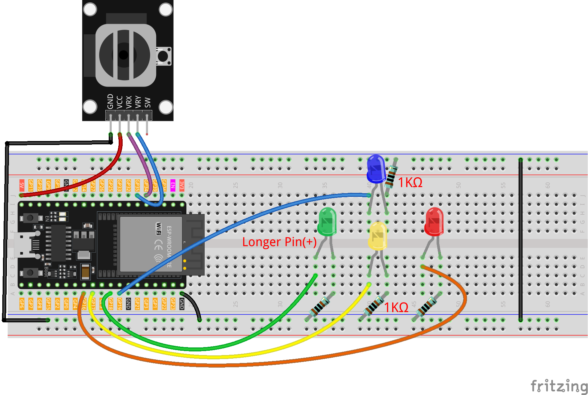

.. _joystick_led:

Joystick LED
==============================================================

.. note::
  
  🌟 Welcome to the SunFounder Facebook Community! Whether you're into Raspberry Pi, Arduino, or ESP32, you'll find inspiration, help ideas here.
   
  - ✅ Be the first to get free learning resources. 
   
  - ✅ Stay updated on new products & exclusive giveaways. 
   
  - ✅ Share your creations and get real feedback.
   
  * 👉 Need faster updates or support? Click [|link_sf_facebook|] join our Facebook community 

  * 👉 Or join our WhatsApp group: Click [|link_sf_whatsapp|]
   
  * 🎁 Looking for parts?Check out our all-in-one kits below — packed with components, beginner-friendly guides, and tons of fun.
  
  .. list-table::
    :widths: 20 20 20
    :header-rows: 1

    *   - Name	
        - Includes ESP32 board
        - PURCHASE LINK
    *   - ESP32 Ultimate Starter Kit	
        - ESP32 WROOM 32E +
        - |link_esp32_kit_buy|
    *   - Universal Maker Sensor Kit
        - 
        - |link_umsk_buy|

Course Introduction
------------------------

In this lesson, you will learn how to use ESP32 along with Joystick Module, LEDs, and resistors to create a light play. 

.. .. raw:: html

.. <iframe width="700" height="394" src="https://www.youtube.com/embed/fUy11dLVjyU?si=hzWrqQk3RCWmN1Xg" title="YouTube video player" frameborder="0" allow="accelerometer; autoplay; clipboard-write; encrypted-media; gyroscope; picture-in-picture; web-share" referrerpolicy="strict-origin-when-cross-origin" allowfullscreen></iframe>

.. note::

  If this is your first time working with an Arduino project, we recommend downloading and reviewing the basic materials first.
  
  * :ref:`install_arduino`
  * :ref:`introduce_arduino`
  * :ref:`install_esp32`

**Required Components**

In this project, we need the following components:

.. list-table::
    :widths: 5 20 5 20
    :header-rows: 1

    *   - SN
        - COMPONENT INTRODUCTION	
        - QUANTITY
        - PURCHASE LINK

    *   - 1
        - ESP-WROOM-32 ESP32 ESP-32S Development Board
        - 1
        - |link_esp32_buy|
    *   - 2
        - USB Type-C cable
        - 1
        - 
    *   - 3
        - Breadboard
        - 1
        - |link_breadboard_buy|
    *   - 4
        - Wires
        - Several
        - |link_wires_buy|
    *   - 5
        - 1kΩ resistor
        - Several
        - |link_resistor_buy|
    *   - 6
        - LED
        - Several
        - |link_led_buy|
    *   - 6
        - Joystick Module
        - 1
        - |link_joystick_buy|

**Wiring**

**Common Connections:**

* **LED**

  - **Blue:** Connect the LED **anode** to **GPIO19** on the ESP32, and the **cathode** to a **1kΩ resistor**, then to the negative power bus on the breadboard.
  - **Green:** Connect the LED **anode** to **GPIO18** on the ESP32, and the **cathode** to a **1kΩ resistor**, then to the negative power bus on the breadboard.
  - **Yellow:** Connect the LED **anode** to **GPIO17**on the ESP32 , and the **cathode** to a **1kΩ resistor**, then to the negative power bus on the breadboard.
  - **Red:** Connect the LED **anode** to **GPIO16** on the ESP32, and the **cathode** to a **1kΩ resistor**, then to the negative power bus on the breadboard.

* **Joystick Module**

  - **VRY:** Connect to **GPIO35** on the ESP32.
  - **VRX:** Connect to **GPIO34** on the ESP32.
  - **GND:** Connect to breadboard’s negative power bus.
  - **VCC:** Connect to breadboard’s red power bus.

**Writing the Code**

.. note::

    * You can copy this code into **Arduino IDE**. 
    * Don't forget to select the board(Arduino UNO R4 Minima) and the correct port before clicking the **Upload** button.

.. code-block:: arduino

      // ===== LED pin definitions (ESP32 safe GPIOs) =====
      // Avoid strapping pins like 0/2/12/15 for reliability.
      // You can change these if they clash with other hardware.
      const int redLED    = 16; // negative X (LEFT)
      const int yellowLED = 17; // negative Y (DOWN)
      const int greenLED  = 18; // positive X (RIGHT)
      const int blueLED   = 19; // positive Y (UP)

      // ===== Joystick analog inputs (ESP32 ADC1, input-only) =====
      // Most joystick modules output 0–3.3V when powered from 3.3V.
      // GPIO34/35 are input-only and support analogRead on ADC1.
      const int xPin = 34;  // VRX -> GPIO34 (ADC1)
      const int yPin = 35;  // VRY -> GPIO35 (ADC1)

      // ===== Analog range and dead zone (ESP32 is 12-bit: 0..4095) =====
      const int MID_VAL   = 2048; // midpoint for 12-bit ADC
      const int DEAD_ZONE = 300;  // adjust as needed

      void setup() {
        pinMode(redLED, OUTPUT);
        pinMode(yellowLED, OUTPUT);
        pinMode(greenLED, OUTPUT);
        pinMode(blueLED, OUTPUT);

        // Initialize all LEDs OFF
        digitalWrite(redLED, LOW);
        digitalWrite(yellowLED, LOW);
        digitalWrite(greenLED, LOW);
        digitalWrite(blueLED, LOW);

        Serial.begin(115200);
      }

      void loop() {
        // Read joystick (ESP32 returns 0..4095 by default)
        int xVal = analogRead(xPin);
        int yVal = analogRead(yPin);

        Serial.print("X: "); Serial.print(xVal);
        Serial.print("  Y: "); Serial.println(yVal);

        // Turn all LEDs OFF before deciding direction
        digitalWrite(redLED, LOW);
        digitalWrite(yellowLED, LOW);
        digitalWrite(greenLED, LOW);
        digitalWrite(blueLED, LOW);

        // Invert both axes: swap sign of offsets
        // (Original: dx = xVal - MID_VAL; dy = yVal - MID_VAL;)
        int dx = MID_VAL - xVal;  // inverted X
        int dy = MID_VAL - yVal;  // inverted Y

        // If inside dead zone, light nothing
        if (abs(dx) < DEAD_ZONE && abs(dy) < DEAD_ZONE) {
          // Do nothing
        } else {
          // Pick the axis with the larger magnitude
          if (abs(dx) > abs(dy)) {
            // X dominates
            if (dx > 0) {
              // +X (after inversion) -> RIGHT
              digitalWrite(greenLED, HIGH);
            } else {
              // -X (after inversion) -> LEFT
              digitalWrite(redLED, HIGH);
            }
          } else {
            // Y dominates
            if (dy > 0) {
              // +Y (after inversion) -> UP
              digitalWrite(blueLED, HIGH);
            } else {
              // -Y (after inversion) -> DOWN
              digitalWrite(yellowLED, HIGH);
            }
          }
        }

        delay(100);
      }
