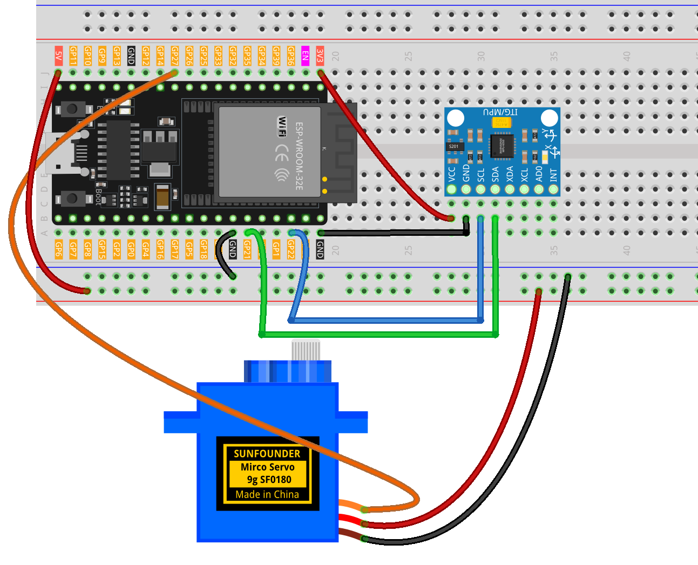

.. _angle_controller:

Angle Controller
==============================================================

.. note::
  
  🌟 Welcome to the SunFounder Facebook Community! Whether you're into Raspberry Pi, Arduino, or ESP32, you'll find inspiration, help ideas here.
   
  - ✅ Be the first to get free learning resources. 
   
  - ✅ Stay updated on new products & exclusive giveaways. 
   
  - ✅ Share your creations and get real feedback.
   
  * 👉 Need faster updates or support? Click [|link_sf_facebook|] join our Facebook community 

  * 👉 Or join our WhatsApp group: Click [|link_sf_whatsapp|]
   
  * 🎁 Looking for parts?Check out our all-in-one kits below — packed with components, beginner-friendly guides, and tons of fun.

  .. list-table::
    :widths: 20 20 20
    :header-rows: 1

    *   - Name	
        - Includes ESP32 board
        - PURCHASE LINK
    *   - ESP32 Ultimate Starter Kit	
        - ESP32 WROOM 32E +
        - |link_esp32_kit_buy|
    *   - Universal Maker Sensor Kit
        - 
        - |link_umsk_buy|

Course Introduction
------------------------

In this lesson, you’ll learn how to use the MPU6050 module with the ESP32 to control a servo motor.

In this setup, the servo’s angle changes according to the tilt of the MPU6050 sensor. As you tilt the module, the Arduino reads the pitch angle and smoothly adjusts the servo position based on the sensor’s orientation.

.. raw:: html

  <iframe width="700" height="394" src="https://www.youtube.com/embed/j97xZ4QkHw0?si=J6AOBfkUOaE_tdey" title="YouTube video player" frameborder="0" allow="accelerometer; autoplay; clipboard-write; encrypted-media; gyroscope; picture-in-picture; web-share" referrerpolicy="strict-origin-when-cross-origin" allowfullscreen></iframe>

.. note::

  If this is your first time working with an ESP32 project, we recommend downloading and reviewing the basic materials first.

  * :ref:`install_arduino`
  * :ref:`introduce_arduino`
  * :ref:`install_esp32`

**Required Components**

In this project, we need the following components:

.. list-table::
    :widths: 5 20 5 20
    :header-rows: 1

    *   - SN
        - COMPONENT INTRODUCTION	
        - QUANTITY
        - PURCHASE LINK

    *   - 1
        - ESP-WROOM-32 ESP32 ESP-32S Development Board
        - 1
        - |link_esp32_buy|
    *   - 2
        - USB Type-C cable
        - 1
        - 
    *   - 3
        - Breadboard
        - 1
        - |link_breadboard_buy|
    *   - 4
        - Wires
        - Several
        - |link_wires_buy|
    *   - 5
        - Digital Servo Motor
        - 1
        - |link_motor_buy|
    *   - 6
        - MPU6050 Module
        - 1
        - |link_mpu6050_buy|

**Wiring**

**Common Connections:**

* **Digital Servo Motor**

  - Connect to breadboard’s positive power bus.
  - Connect to breadboard’s negative power bus.
  - Connect to **GPIO27** on the ESP32.

* **MPU6050**

  - **SDA:** Connect to **GPIO21** on the ESP32.
  - **SCL:** Connect to **GPIO22** on the ESP32.
  - **GND:** Connect to breadboard’s negative power bus.
  - **VCC:** Connect to **3.3V** on the ESP32.

**Writing the Code**

.. note::

    * You can copy this code into **Arduino IDE**. 
    * To install the library, use the Arduino Library Manager and search for **Adafruit_MPU6050** , **Adafruit_Sensor** and install it.
    * Don't forget to select the board(ESP32 Dev module) and the correct port before clicking the **Upload** button.

.. code-block:: arduino

      #include <Wire.h>
      #include <Adafruit_MPU6050.h>
      #include <Adafruit_Sensor.h>
      #include <ESP32Servo.h>
      #include <math.h>

      // ----- Objects -----
      Adafruit_MPU6050 mpu;
      Servo servo;

      // ----- Pins (ESP32) -----
      const int SERVO_PIN = 27;     // Safe PWM-capable GPIO for servo signal
      const int I2C_SDA  = 21;      // ESP32 default SDA
      const int I2C_SCL  = 22;      // ESP32 default SCL

      // ----- Settings -----
      const int samples = 25;       // number of readings to average

      // Map a float from one range to another
      float mapFloat(float x, float in_min, float in_max, float out_min, float out_max) {
        return (x - in_min) * (out_max - out_min) / (in_max - in_min) + out_min;
      }

      // Euclidean distance helper
      float distVal(float a, float b) {
        return sqrtf(a * a + b * b);
      }

      // Pitch (rotation around Y axis), degrees
      float getYRotation(float ax, float ay, float az) {
        float radians = atan2f(ax, distVal(ay, az));
        return -degrees(radians);   // negate to match original orientation
      }

      void setup() {
        Serial.begin(115200);

        // I2C on ESP32
        Wire.begin(I2C_SDA, I2C_SCL);
        Wire.setClock(400000);

        // Init MPU6050
        if (!mpu.begin(0x68, &Wire)) {
          Serial.println("MPU6050 initialization failed");
          while (1) { delay(10); }
        }
        Serial.println("MPU6050 initialized");

        // Sensor ranges & filter
        mpu.setAccelerometerRange(MPU6050_RANGE_8_G);
        mpu.setGyroRange(MPU6050_RANGE_500_DEG);
        mpu.setFilterBandwidth(MPU6050_BAND_21_HZ);

        // Servo on ESP32
        // Typical pulse range 500–2500 µs; adjust if your servo needs different endpoints
        servo.attach(SERVO_PIN, 500, 2500);

        delay(100); // settle
      }

      void loop() {
        float totalAngle = 0.0f;

        // Take multiple readings and average
        for (int i = 0; i < samples; i++) {
          sensors_event_t accel, gyro, temp;
          mpu.getEvent(&accel, &gyro, &temp);
          float angleY = getYRotation(accel.acceleration.x,
                                      accel.acceleration.y,
                                      accel.acceleration.z);
          totalAngle += angleY;
          delay(5); // small spacing for smoother averaging
        }

        float avgAngle = totalAngle / samples;

        // Map from [-90, 90] -> [180, 0] (reversed direction)
        float servoAngle = mapFloat(avgAngle, -90.0f, 90.0f, 180.0f, 0.0f);
        servoAngle = constrain(servoAngle, 0.0f, 180.0f);

        servo.write((int)servoAngle);

        // Debug
        Serial.print("Avg Y Angle: ");
        Serial.print(avgAngle);
        Serial.print("  ->  Servo Angle: ");
        Serial.println(servoAngle);

        delay(100);
      }
