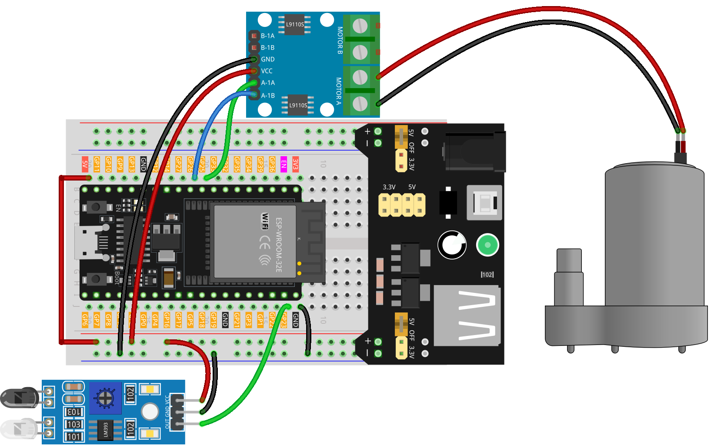

.. _auto_sanitizer:

Auto Sanitizer
==============================================================

.. note::
  
  🌟 Welcome to the SunFounder Facebook Community! Whether you're into Raspberry Pi, Arduino, or ESP32, you'll find inspiration, help ideas here.
   
  - ✅ Be the first to get free learning resources. 
   
  - ✅ Stay updated on new products & exclusive giveaways. 
   
  - ✅ Share your creations and get real feedback.
   
  * 👉 Need faster updates or support? Click [|link_sf_facebook|] join our Facebook community 

  * 👉 Or join our WhatsApp group: Click [|link_sf_whatsapp|]
   
  * 🎁 Looking for parts?Check out our all-in-one kits below — packed with components, beginner-friendly guides, and tons of fun.
  
  .. list-table::
    :widths: 20 20 20
    :header-rows: 1

    *   - Name	
        - Includes ESP32 board
        - PURCHASE LINK
    *   - ESP32 Ultimate Starter Kit	
        - ESP32 WROOM 32E +
        - |link_esp32_kit_buy|
    *   - Universal Maker Sensor Kit
        - 
        - |link_umsk_buy|

Course Introduction
------------------------

This program uses an ESP32 board with an infrared obstacle avoidance sensor and a water pump.

The sensor is used to detect the presence of an object. 

When an object is detected, the water pump is activated to dispense liquid (liquid hand soap).

.. .. raw:: html

..   <iframe width="700" height="394" src="https://www.youtube.com/embed/m6IWfwi86zo?si=vTmoHKBtbDE7Vwzw" title="YouTube video player" frameborder="0" allow="accelerometer; autoplay; clipboard-write; encrypted-media; gyroscope; picture-in-picture; web-share" referrerpolicy="strict-origin-when-cross-origin" allowfullscreen></iframe>

.. note::

  If this is your first time working with an ESP32 project, we recommend downloading and reviewing the basic materials first.

  * :ref:`install_arduino`
  * :ref:`introduce_arduino`
  * :ref:`install_esp32`

**Required Components**

In this project, we need the following components:

.. list-table::
    :widths: 5 20 5 20
    :header-rows: 1

    *   - SN
        - COMPONENT INTRODUCTION	
        - QUANTITY
        - PURCHASE LINK

    *   - 1
        - ESP-WROOM-32 ESP32 ESP-32S Development Board
        - 1
        - |link_esp32_buy|
    *   - 2
        - USB Type-C cable
        - 1
        - 
    *   - 3
        - Breadboard
        - 1
        - |link_breadboard_buy|
    *   - 4
        - Wires
        - Several
        - |link_wires_buy|
    *   - 5
        - Power Supply
        - 1
        - |link_power_buy|
    *   - 6
        - IR Obstacle Avoidance Sensor Module
        - 1
        - |link_IR_module_buy|
    *   - 7
        - L9110 Motor Driver Module
        - 1
        - 
    *   - 8
        - Centrifugal Pump
        - 1
        - 

**Wiring**

**Common Connections:**

* **L9110 Motor Driver Module**

  - **GND:** Connect to breadboard’s negative power bus.
  - **VCC:** Connect to breadboard’s red power bus.
  - **A-1A:** Connect to **GPIO25** on the ESP32.
  - **A-1B:** Connect to **GPIO26** on the ESP32.

* **IR Obstacle Avoidance Sensor Module**

  - **OUT:** Connect to **GPIO23** on the ESP32.
  - **GND:** Connect to breadboard’s negative power bus.
  - **VCC:** Connect to breadboard’s red power bus.

* **Centrifugal Pump**

  - **GND:** Connect to **L9110 Motor Driver Module** MOTOR A.
  - **VCC:** Connect to **L9110 Motor Driver Module** MOTOR A.

**Writing the Code**

.. note::

    * You can copy this code into **Arduino IDE**. 
    * Don't forget to select the board(ESP32 Dev module) and the correct port before clicking the **Upload** button.

.. code-block:: arduino

      // ESP32 version: IR obstacle sensor + DC pump

      // ---- Pins (ESP32 safe GPIOs) ----
      const int SENSOR_PIN = 23;  // IR sensor DO (active-LOW typical)
      const int PUMP_INA   = 25;  // Pump driver input A
      const int PUMP_INB   = 26;  // Pump driver input B (kept LOW for one direction)

      // ---- Timings ----
      const unsigned long PUMP_ON_MS = 700;   // pump ON duration
      const unsigned long REST_MS    = 1000;  // cooldown between shots

      void setup() {
        pinMode(SENSOR_PIN, INPUT);  // if your module needs pull-up, use INPUT_PULLUP
        pinMode(PUMP_INA, OUTPUT);
        pinMode(PUMP_INB, OUTPUT);

        // Ensure pump is off
        digitalWrite(PUMP_INA, LOW);
        digitalWrite(PUMP_INB, LOW);

        Serial.begin(115200);
      }

      void loop() {
        int sensorValue = digitalRead(SENSOR_PIN);  // LOW = obstacle (typical)
        Serial.println(sensorValue);

        if (sensorValue == LOW) {          // detected
          digitalWrite(PUMP_INB, LOW);     // one direction only
          digitalWrite(PUMP_INA, HIGH);    // pump ON
          delay(PUMP_ON_MS);
          digitalWrite(PUMP_INA, LOW);     // pump OFF
          delay(REST_MS);                  // avoid rapid retrigger
        }
      }
