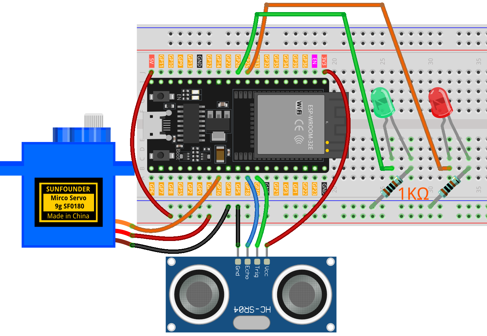

.. _barrier_gate1.0:

Barrier Gate 1.0
==============================================================

.. note::
  
  🌟 Welcome to the SunFounder Facebook Community! Whether you're into Raspberry Pi, Arduino, or ESP32, you'll find inspiration, help ideas here.
   
  - ✅ Be the first to get free learning resources. 
   
  - ✅ Stay updated on new products & exclusive giveaways. 
   
  - ✅ Share your creations and get real feedback.
   
  * 👉 Need faster updates or support? Click [|link_sf_facebook|] join our Facebook community 

  * 👉 Or join our WhatsApp group: Click [|link_sf_whatsapp|]
   
  * 🎁 Looking for parts?Check out our all-in-one kits below — packed with components, beginner-friendly guides, and tons of fun.
  
  .. list-table::
    :widths: 20 20 20
    :header-rows: 1

    *   - Name	
        - Includes ESP32 board
        - PURCHASE LINK
    *   - ESP32 Ultimate Starter Kit	
        - ESP32 WROOM 32E +
        - |link_esp32_kit_buy|
    *   - Universal Maker Sensor Kit
        - 
        - |link_umsk_buy|

Course Introduction
------------------------

In this lesson, you'll learn how to use an ultrasonic sensor module, a digital servo motor, and LEDs with the ESP32 Board to build an intelligent barrier gate system.

When the barrier is closed, the red LED turns on. If the ultrasonic sensor module detects an approaching vehicle, the digital servo motor raises the barrier, the green LED turns on, and the vehicle is allowed to pass.

.. raw:: html
 
  <iframe width="700" height="394" src="https://www.youtube.com/embed/OOJ-JKohtdA?si=WcHJe9lA5_uB_5kR" title="YouTube video player" frameborder="0" allow="accelerometer; autoplay; clipboard-write; encrypted-media; gyroscope; picture-in-picture; web-share" referrerpolicy="strict-origin-when-cross-origin" allowfullscreen></iframe>

.. note::

  If this is your first time working with an ESP32 project, we recommend downloading and reviewing the basic materials first.
  
  * :ref:`install_arduino`
  * :ref:`introduce_arduino`
  * :ref:`install_esp32`

**Required Components**

In this project, we need the following components:

.. list-table::
    :widths: 5 20 5 20
    :header-rows: 1

    *   - SN
        - COMPONENT INTRODUCTION	
        - QUANTITY
        - PURCHASE LINK

    *   - 1
        - ESP-WROOM-32 ESP32 ESP-32S Development Board
        - 1
        - |link_esp32_buy|
    *   - 2
        - USB Type-C cable
        - 1
        - 
    *   - 3
        - Breadboard
        - 1
        - |link_breadboard_buy|
    *   - 4
        - Wires
        - Several
        - |link_wires_buy|
    *   - 5
        - 1kΩ resistor
        - 2
        - |link_resistor_buy|
    *   - 6
        - Ultrasonic Sensor Module
        - 1
        - |link_ultrasonic_buy|
    *   - 7
        - LED
        - 2
        - |link_led_buy|
    *   - 8
        - Digital Servo Motor
        - 1
        - |link_motor_buy|

**Wiring**

**Common Connections:**

* **LED**

  - **Green**: Connect the LEDs **cathode** to a **1kΩ resistor** then to  the negative power bus on the breadboard, and the LED **anode** to **GPIO26** on the Arduino.
  - **Red**: Connect the LEDs **cathode** to a **1kΩ resistor** then to the negative power bus on the breadboard, and the LED **anode** to **GPIO25** on the Arduino.

* **Digital Servo Motor**

  - Connect to breadboard’s **5V** positive power bus.
  - Connect to breadboard’s negative power bus.
  - Connect to **GPIO16** on the ESP32.

* **Ultrasonic Sensor Module**

  - **Trig:** Connect to **GPIO19** on the ESP32.
  - **Echo:** Connect to **GPIO18** on the ESP32.
  - **GND:** Connect to breadboard’s negative power bus.
  - **VCC:** Connect to breadboard’s **3.3V** red power bus.

**Writing the Code**

.. note::

    * You can copy this code into **Arduino IDE**. 
    * To install the library, use the Arduino Library Manager and search for **ESP32Servo** and install it.
    * Don't forget to select the board(ESP32 Dev module) and the correct port before clicking the **Upload** button.

.. code-block:: arduino

      // ESP32 version
      #include <ESP32Servo.h>   // Use ESP32-specific Servo library (install ESP32Servo from Library Manager)

      // ---------- Pin map (ESP32 DevKit v1) ----------
      const int trigPin   = 19;   // HC-SR04 Trig pin (output)
      const int echoPin   = 18;   // HC-SR04 Echo pin (input, level-shifted to 3.3V)
      const int redLed    = 25;   // Red LED
      const int greenLed  = 26;   // Green LED
      const int servoPin  = 16;   // Servo signal pin (PWM capable)

      Servo barrierServo;                 // Servo object
      bool previousCarDetected = false;   // Record if a car was detected in last loop

      void setup() {
        pinMode(trigPin, OUTPUT);
        pinMode(echoPin, INPUT);          // Echo should be shifted down to 3.3V
        pinMode(redLed, OUTPUT);
        pinMode(greenLed, OUTPUT);

        // Attach servo with explicit pulse width range (adjust if needed)
        barrierServo.attach(servoPin, 500, 2500);
        barrierServo.write(0);            // Start with barrier down

        Serial.begin(115200);
        delay(100);
      }

      void loop() {
        long duration = 0;
        long distance = 0;

        // Send ultrasonic pulse
        digitalWrite(trigPin, LOW);
        delayMicroseconds(2);
        digitalWrite(trigPin, HIGH);
        delayMicroseconds(10);
        digitalWrite(trigPin, LOW);

        // Measure echo pulse (30ms timeout ~ 5m max range)
        duration = pulseIn(echoPin, HIGH, 30000UL);

        if (duration == 0) {
          // Timeout → no valid echo
          distance = 999;
        } else {
          // Convert time to distance (cm)
          distance = duration * 0.034 / 2;
        }

        Serial.print("Distance: ");
        Serial.println(distance);

        // Car detected within 15 cm
        bool carDetected = (distance > 0 && distance < 15);

        if (carDetected) {
          // Raise barrier and turn on green LED
          digitalWrite(redLed, LOW);
          digitalWrite(greenLed, HIGH);
          barrierServo.write(90);
        } else {
          // If the car just left, wait before lowering barrier
          if (previousCarDetected) {
            delay(1000);  // 1 second delay
          }
          // No car: lower barrier and turn on red LED
          digitalWrite(redLed, HIGH);
          digitalWrite(greenLed, LOW);
          barrierServo.write(0);
        }

        previousCarDetected = carDetected; // Update last state
        delay(300);                        // Small delay before next reading
      }
