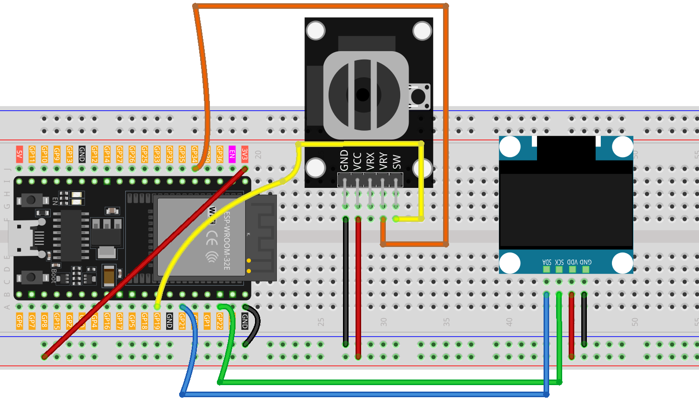

.. _brick_breaker:

Brick Breaker
==============================================================

.. note::
  
  🌟 Welcome to the SunFounder Facebook Community! Whether you're into Raspberry Pi, Arduino, or ESP32, you'll find inspiration, help ideas here.
   
  - ✅ Be the first to get free learning resources. 
   
  - ✅ Stay updated on new products & exclusive giveaways. 
   
  - ✅ Share your creations and get real feedback.
   
  * 👉 Need faster updates or support? Click [|link_sf_facebook|] join our Facebook community 

  * 👉 Or join our WhatsApp group: Click [|link_sf_whatsapp|]
   
  * 🎁 Looking for parts?Check out our all-in-one kits below — packed with components, beginner-friendly guides, and tons of fun.

  .. list-table::
    :widths: 20 20 20
    :header-rows: 1

    *   - Name	
        - Includes ESP32 board
        - PURCHASE LINK
    *   - ESP32 Ultimate Starter Kit	
        - ESP32 WROOM 32E +
        - |link_esp32_kit_buy|
    *   - Universal Maker Sensor Kit
        - 
        - |link_umsk_buy|

Course Introduction
------------------------

In this lesson, you’ll learn how to use a OLED Display Module, a Joystick Module with the ESP32 to create a brick breaker game. We’ll cover using the Adafruit SSD1306 and GFX libraries to display on the screen.

The OLED Screen will display the game screen, and players can use the joystick to control the game.

.. .. raw:: html

..    <iframe width="700" height="394" src="https://www.youtube.com/embed/HheaU9hlbW4" title="YouTube video player" frameborder="0" allow="accelerometer; autoplay; clipboard-write; encrypted-media; gyroscope; picture-in-picture; web-share" referrerpolicy="strict-origin-when-cross-origin" allowfullscreen></iframe>

.. note::

  If this is your first time working with an ESP32 project, we recommend downloading and reviewing the basic materials first.

  * :ref:`install_arduino`
  * :ref:`introduce_arduino`
  * :ref:`install_esp32`

**Required Components**

In this project, we need the following components:

.. list-table::
    :widths: 5 20 5 20
    :header-rows: 1

    *   - SN
        - COMPONENT INTRODUCTION	
        - QUANTITY
        - PURCHASE LINK

    *   - 1
        - ESP-WROOM-32 ESP32 ESP-32S Development Board
        - 1
        - |link_esp32_buy|
    *   - 2
        - USB Type-C cable
        - 1
        - 
    *   - 3
        - Breadboard
        - 1
        - |link_breadboard_buy|
    *   - 4
        - Wires
        - Several
        - |link_wires_buy|
    *   - 5
        - Joystick Module
        - 1
        - |link_joystick_buy|
    *   - 6
        - OLED Display Module
        - 1
        - |link_oled_buy|

**Wiring**

**Common Connections:**

* **Joystick Module**

  - **VRY:** Connect to **GPIO34** on the Arduino.
  - **SW:** Connect to **GPIO19** on the Arduino.
  - **GND:** Connect to breadboard’s negative power bus.
  - **VCC:** Connect to breadboard’s red power bus.

* **OLED Display Module**

  - **SDA:** Connect to **GPIO21** on the Arduino.
  - **SCK:** Connect to **GPIO22** on the Arduino.
  - **GND:** Connect to breadboard’s negative power bus.
  - **VCC:** Connect to breadboard’s red power bus.

**Writing the Code**

.. note::

    * You can copy this code into **Arduino IDE**. 
    * To install the library, use the Arduino Library Manager and search for **Adafruit SSD1306** and **Adafruit GFX** and install it.
    * Don't forget to select the board(ESP32 Dev module) and the correct port before clicking the **Upload** button.

.. code-block:: arduino

      #include <Wire.h>
      #include <Adafruit_GFX.h>
      #include <Adafruit_SSD1306.h>
      #include <esp_system.h>   // for esp_random()

      // ===== OLED =====
      #define SCREEN_WIDTH 128
      #define SCREEN_HEIGHT 64
      #define OLED_RESET   -1
      #define SCREEN_ADDRESS 0x3C

      // ESP32 I2C pins
      #define I2C_SDA 21
      #define I2C_SCL 22

      Adafruit_SSD1306 display(SCREEN_WIDTH, SCREEN_HEIGHT, &Wire, OLED_RESET);

      // ===== Inputs (ESP32) =====
      const int yPin  = 34;  // Joystick Y (ADC, input-only pin on ESP32)
      const int swPin = 19;  // Push button (to GND), with internal pull-up

      // ===== Paddle / Bricks =====
      int paddleX;
      const int paddleWidth = 30, paddleHeight = 3;
      const int brickRows = 3, brickCols = 6;
      const int brickWidth = SCREEN_WIDTH / brickCols;
      const int brickHeight = 5;
      bool bricks[brickRows][brickCols];

      // ===== Game settings =====
      const int deadZone12 = 400;   // dead zone for 12-bit ADC (center ~2048)
      const int speed = 8;
      float ballSpeed = 3.0;
      bool gameOver = false;
      bool gameWin  = false;

      // ===== Ball =====
      float ballX, ballY;
      float ballDX, ballDY;
      int   hitCount = 0;

      void resetGame();
      void normalizeBallSpeed();
      void drawGame();
      void showGameOverScreen();

      void setup() {
        // I2C for OLED (ESP32)
        Wire.begin(I2C_SDA, I2C_SCL);

        pinMode(swPin, INPUT_PULLUP);

        // OLED init
        if (!display.begin(SSD1306_SWITCHCAPVCC, SCREEN_ADDRESS)) {
          // If OLED init fails, stay here
          while (true) { delay(1000); }
        }

        // Random seed (ESP32 hardware RNG)
        randomSeed((uint32_t)esp_random() ^ micros());

        // (Optional) set ADC attenuation for full 0~3.3V range
        // analogSetPinAttenuation(yPin, ADC_11db);

        resetGame();
        Serial.begin(115200);
      }

      void loop() {
        if (gameOver || gameWin) {
          showGameOverScreen();
          return;
        }

        // Read joystick (ESP32 default ADC is 12-bit: 0..4095, center ~2048)
        int yValue = analogRead(yPin);

        // Move paddle by Y-axis (treat "up" as moving left for this sideways control)
        if (abs(yValue - 2048) > deadZone12) {
          if (yValue < (2048 - deadZone12))      paddleX -= speed;  // tilt up -> left
          else if (yValue > (2048 + deadZone12)) paddleX += speed;  // tilt down -> right
        }
        paddleX = constrain(paddleX, 0, SCREEN_WIDTH - paddleWidth);

        // Update ball
        int oldBallX = (int)ballX;
        int oldBallY = (int)ballY;
        ballX += ballDX;
        ballY += ballDY;

        // Bounds
        if (ballX <= 0 || ballX >= SCREEN_WIDTH - 2) ballDX = -ballDX;
        if (ballY <= 0)                               ballDY = -ballDY;

        // Paddle collision
        if (ballY >= SCREEN_HEIGHT - paddleHeight - 1 &&
            ballX >= paddleX && ballX <= paddleX + paddleWidth) {
          ballDY = -ballDY;
          hitCount++;

          // Speed up gradually
          if (hitCount == 2) ballSpeed = 4.0;
          if (hitCount == 4) ballSpeed = 5.0;
          if (hitCount == 6) ballSpeed = 6.0;
          ballSpeed = min(ballSpeed, 6.0f);
          normalizeBallSpeed();
        }

        // Brick collisions
        int remainingBricks = 0;
        for (int i = 0; i < brickRows; i++) {
          for (int j = 0; j < brickCols; j++) {
            if (bricks[i][j]) {
              remainingBricks++;
              int brickX = j * brickWidth;
              int brickY = i * brickHeight;

              bool hitX = ((int)ballX + 2 >= brickX) && ((int)ballX - 2 <= brickX + brickWidth);
              bool hitY = ((int)ballY + 2 >= brickY) && ((int)ballY - 2 <= brickY + brickHeight);

              if (hitX && hitY) {
                bricks[i][j] = false;

                if (oldBallX < brickX || oldBallX > brickX + brickWidth)  ballDX = -ballDX;
                if (oldBallY < brickY || oldBallY > brickY + brickHeight) ballDY = -ballDY;

                normalizeBallSpeed();
                break;
              }
            }
          }
        }

        if (remainingBricks == 0) gameWin = true;
        if (ballY > SCREEN_HEIGHT) gameOver = true;

        drawGame();
        delay(10);
      }

      void resetGame() {
        gameOver = false;
        gameWin  = false;

        paddleX = SCREEN_WIDTH / 2 - paddleWidth / 2;

        ballX = SCREEN_WIDTH / 2;
        ballY = SCREEN_HEIGHT / 2;

        ballSpeed = 3.0;
        hitCount  = 0;

        float angle;
        if (random(0, 2) == 0) angle = random(30, 60);
        else                   angle = random(120, 150);

        ballDX = ballSpeed * cos(radians(angle));
        ballDY = -ballSpeed * sin(radians(angle));

        for (int i = 0; i < brickRows; i++) {
          for (int j = 0; j < brickCols; j++) {
            bricks[i][j] = true;
          }
        }
        drawGame();
      }

      void normalizeBallSpeed() {
        float mag = sqrtf(ballDX * ballDX + ballDY * ballDY);
        if (mag < 1e-6f) {
          // Avoid divide-by-zero: give a small nudge
          ballDX = ballSpeed * 0.7071f;
          ballDY = -ballSpeed * 0.7071f;
          return;
        }
        ballDX = (ballDX / mag) * ballSpeed;
        ballDY = (ballDY / mag) * ballSpeed;
      }

      void drawGame() {
        display.clearDisplay();
        display.fillRect(paddleX, SCREEN_HEIGHT - paddleHeight, paddleWidth, paddleHeight, WHITE);
        display.fillCircle((int)ballX, (int)ballY, 2, WHITE);

        for (int i = 0; i < brickRows; i++) {
          for (int j = 0; j < brickCols; j++) {
            if (bricks[i][j]) {
              display.fillRect(j * brickWidth, i * brickHeight, brickWidth - 1, brickHeight - 1, WHITE);
            }
          }
        }
        display.display();
      }

      void showGameOverScreen() {
        display.clearDisplay();
        display.setTextSize(2);
        display.setTextColor(WHITE);
        display.setCursor(20, 30);
        if (gameWin)  display.println("You Win!");
        else          display.println("Game Over");
        display.display();

        // Wait for button press to reset
        while (digitalRead(swPin) == HIGH) { delay(10); }
        delay(500);
        resetGame();
      }
