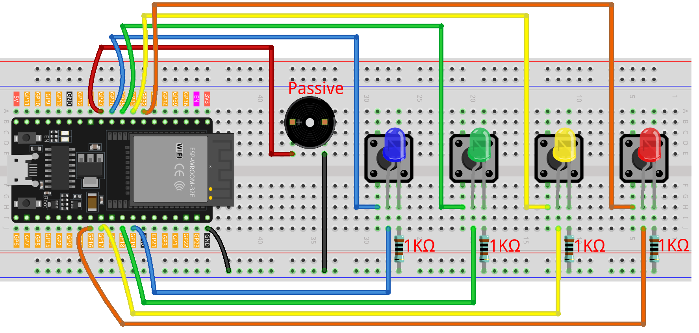

.. _color_memory:

Color Memory
==============================================================

.. note::
  
  🌟 Welcome to the SunFounder Facebook Community! Whether you're into Raspberry Pi, Arduino, or ESP32, you'll find inspiration, help ideas here.
   
  - ✅ Be the first to get free learning resources. 
   
  - ✅ Stay updated on new products & exclusive giveaways. 
   
  - ✅ Share your creations and get real feedback.
   
  * 👉 Need faster updates or support? Click [|link_sf_facebook|] join our Facebook community 

  * 👉 Or join our WhatsApp group: Click [|link_sf_whatsapp|]
   
  * 🎁 Looking for parts?Check out our all-in-one kits below — packed with components, beginner-friendly guides, and tons of fun.
  
  .. list-table::
    :widths: 20 20 20
    :header-rows: 1

    *   - Name	
        - Includes ESP32 board
        - PURCHASE LINK
    *   - ESP32 Ultimate Starter Kit	
        - ESP32 WROOM 32E +
        - |link_esp32_kit_buy|
    *   - Universal Maker Sensor Kit
        - 
        - |link_umsk_buy|

Course Introduction
------------------------

In this lesson, you'll use four LCDs, four buttons, and a passive buzzer with the ESP32 to create a color memory game.

At the start of the game, an LED lights up at random. The player must press the corresponding button to proceed. A wrong input ends the game.

.. raw:: html

  <iframe width="700" height="394" src="https://www.youtube.com/embed/kbp06kI-lWA?si=bFvfdP3aNfzN6mup" title="YouTube video player" frameborder="0" allow="accelerometer; autoplay; clipboard-write; encrypted-media; gyroscope; picture-in-picture; web-share" referrerpolicy="strict-origin-when-cross-origin" allowfullscreen></iframe>

.. note::

  If this is your first time working with an ESP32 project, we recommend downloading and reviewing the basic materials first.
  
  * :ref:`install_arduino`
  * :ref:`introduce_arduino`
  * :ref:`install_esp32`

**Required Components**

In this project, we need the following components:

.. list-table::
    :widths: 5 20 5 20
    :header-rows: 1

    *   - SN
        - COMPONENT INTRODUCTION	
        - QUANTITY
        - PURCHASE LINK

    *   - 1
        - ESP-WROOM-32 ESP32 ESP-32S Development Board
        - 1
        - |link_esp32_buy|
    *   - 2
        - USB Type-C cable
        - 1
        - 
    *   - 3
        - Breadboard
        - 1
        - |link_breadboard_buy|
    *   - 4
        - Wires
        - Several
        - |link_wires_buy|
    *   - 5
        - Passive Buzzer
        - 1
        - |link_passive_buzzer_buy|
    *   - 6
        - Button
        - 4
        - |link_button_buy|
    *   - 7
        - LED
        - 4
        - |link_led_buy|
    *   - 8
        - 220Ω resistor
        - 4
        - |link_resistor_buy|

**Wiring**

**Common Connections:**

* **LEDS**

  - **Blue:** Connect the LED **anode** to **GPIO19** on the ESP32, and the **cathode** to a **1kΩ resistor**, then to the negative power bus on the breadboard.
  - **Green:** Connect the LED **anode** to **GPIO18** on the ESP32, and the **cathode** to a **1kΩ resistor**, then to the negative power bus on the breadboard.
  - **Yellow:** Connect the LED **anode** to **GPIO17**on the ESP32 , and the **cathode** to a **1kΩ resistor**, then to the negative power bus on the breadboard.
  - **Red:** Connect the LED **anode** to **GPIO16** on the ESP32, and the **cathode** to a **1kΩ resistor**, then to the negative power bus on the breadboard.

* **Passive Buzzer**

  - **＋:** Connect to **GPIO27** on the ESP32.
  - **－:** Connect to breadboard’s negative power bus.

* **Buttons**

  - **Blue Button:** Connect to the **Blue LED's cathode** on the breadboard, and the other end to **GPIO26** on the ESP32 board.
  - **Green Butto:** Connect to the **Green LED's cathode** on the breadboard, and the other end to **GPIO25** on the ESP32 board.
  - **Yellow Butto:** Connect to the **Yellow LED's cathode** on the breadboard, and the other end to **GPIO33** on the ESP32 board.
  - **Red Butto:** Connect to the **Red LED's cathode** on the breadboard, and the other end to **GPIO32** on the ESP32 board.

**Writing the Code**

.. note::

    * You can copy this code into **Arduino IDE**. 
      * To install the library, use the Arduino Library Manager and search for **esp_system** and install it.
    * Don't forget to select the board(ESP32 Dev module) and the correct port before clicking the **Upload** button.

.. code-block:: arduino

      #include <esp_system.h>  // for esp_random()

      // ===== LED and button pin definitions (ESP32 safe GPIOs) =====
      // Avoid flash pins (6–11) and strapping pins (0/2/12/15) for reliability.
      const int redLED    = 16;
      const int yellowLED = 17;
      const int greenLED  = 18;
      const int blueLED   = 19;

      const int redButton    = 32;  // has internal pull-up
      const int yellowButton = 33;  // has internal pull-up
      const int greenButton  = 25;  // has internal pull-up
      const int blueButton   = 26;  // has internal pull-up

      const int buzzer = 27;        // works with tone() on ESP32

      // ===== Game state =====
      int sequence[100];     // Generated color sequence
      int playerInput[100];  // Player-entered sequence
      int level = 0;         // Current level (1..)
      bool gameOver = false; // Game over flag

      void startGame();
      void playSequence();
      bool getPlayerInput();
      void endGame();
      void lightUpLED(int color);

      void setup() {
        // LED outputs
        pinMode(redLED, OUTPUT);
        pinMode(yellowLED, OUTPUT);
        pinMode(greenLED, OUTPUT);
        pinMode(blueLED, OUTPUT);

        // Buttons as inputs with internal pull-ups (wire the other side to GND)
        pinMode(redButton,    INPUT_PULLUP);
        pinMode(yellowButton, INPUT_PULLUP);
        pinMode(greenButton,  INPUT_PULLUP);
        pinMode(blueButton,   INPUT_PULLUP);

        // Buzzer output
        pinMode(buzzer, OUTPUT);

        Serial.begin(115200);

        // Seed RNG from ESP32 hardware random generator
        randomSeed((uint32_t)esp_random());

        // Start the game
        startGame();
      }

      void loop() {
        if (!gameOver) {
          // Play current sequence and then check player's input
          playSequence();

          if (!getPlayerInput()) {
            endGame();
          } else {
            delay(500);  // brief pause before next level
          }
        } else {
          // Restart after a short delay
          delay(1500);
          startGame();
        }
      }

      void startGame() {
        level = 1;
        gameOver = false;

        // Power-on cue: all LEDs on + short beep
        digitalWrite(redLED, HIGH);
        digitalWrite(yellowLED, HIGH);
        digitalWrite(greenLED, HIGH);
        digitalWrite(blueLED, HIGH);
        tone(buzzer, 1000, 500);
        delay(500);

        // All off
        digitalWrite(redLED, LOW);
        digitalWrite(yellowLED, LOW);
        digitalWrite(greenLED, LOW);
        digitalWrite(blueLED, LOW);

        delay(300);
      }

      void playSequence() {
        // Append one random color (1..4) to the sequence for this level
        sequence[level - 1] = random(1, 5);

        // Play the sequence up to current level
        for (int i = 0; i < level; i++) {
          lightUpLED(sequence[i]);
          delay(300);
        }
      }

      bool getPlayerInput() {
        for (int i = 0; i < level; i++) {
          bool inputReceived = false;

          // Wait until any button is pressed (active LOW)
          while (!inputReceived) {
            if (digitalRead(redButton) == LOW) {
              playerInput[i] = 1;
              lightUpLED(1);
              inputReceived = true;
            } else if (digitalRead(yellowButton) == LOW) {
              playerInput[i] = 2;
              lightUpLED(2);
              inputReceived = true;
            } else if (digitalRead(greenButton) == LOW) {
              playerInput[i] = 3;
              lightUpLED(3);
              inputReceived = true;
            } else if (digitalRead(blueButton) == LOW) {
              playerInput[i] = 4;
              lightUpLED(4);
              inputReceived = true;
            }
            // simple debounce
            delay(5);
          }

          // Verify input against the sequence
          if (playerInput[i] != sequence[i]) {
            return false;  // mismatch -> fail
          }

          // Wait for button release before next input
          while (digitalRead(redButton)   == LOW ||
                digitalRead(yellowButton)== LOW ||
                digitalRead(greenButton) == LOW ||
                digitalRead(blueButton)  == LOW) {
            delay(5);
          }

          delay(200);
        }

        // Advance to next level after a full correct round
        level++;
        return true;
      }

      void endGame() {
        gameOver = true;

        // Flash all LEDs and beep to indicate game over
        for (int i = 0; i < 5; i++) {
          digitalWrite(redLED, HIGH);
          digitalWrite(yellowLED, HIGH);
          digitalWrite(greenLED, HIGH);
          digitalWrite(blueLED, HIGH);
          tone(buzzer, 1000, 300);
          delay(200);

          digitalWrite(redLED, LOW);
          digitalWrite(yellowLED, LOW);
          digitalWrite(greenLED, LOW);
          digitalWrite(blueLED, LOW);
          delay(200);
        }
      }

      void lightUpLED(int color) {
        // Light a specific LED and play a tone depending on color
        switch (color) {
          case 1: // Red
            digitalWrite(redLED, HIGH);
            tone(buzzer, 500, 300);
            break;
          case 2: // Yellow
            digitalWrite(yellowLED, HIGH);
            tone(buzzer, 600, 300);
            break;
          case 3: // Green
            digitalWrite(greenLED, HIGH);
            tone(buzzer, 700, 300);
            break;
          case 4: // Blue
            digitalWrite(blueLED, HIGH);
            tone(buzzer, 800, 300);
            break;
        }

        delay(300);

        // Turn all LEDs off
        digitalWrite(redLED, LOW);
        digitalWrite(yellowLED, LOW);
        digitalWrite(greenLED, LOW);
        digitalWrite(blueLED, LOW);
      }
