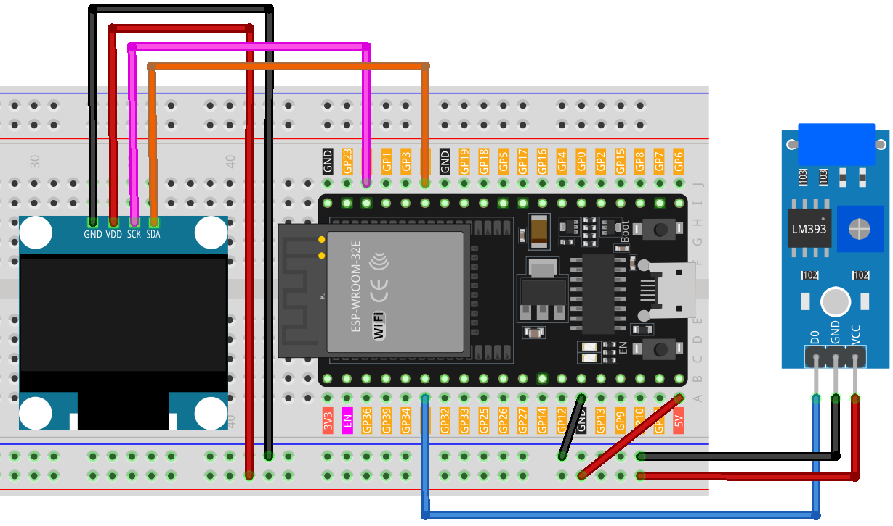

.. _digital_dice:

Digital Dice
==============================================================

.. note::
  
  🌟 Welcome to the SunFounder Facebook Community! Whether you're into Raspberry Pi, Arduino, or ESP32, you'll find inspiration, help ideas here.
   
  - ✅ Be the first to get free learning resources. 
   
  - ✅ Stay updated on new products & exclusive giveaways. 
   
  - ✅ Share your creations and get real feedback.
   
  * 👉 Need faster updates or support? Click [|link_sf_facebook|] join our Facebook community 

  * 👉 Or join our WhatsApp group: Click [|link_sf_whatsapp|]
   
  * 🎁 Looking for parts?Check out our all-in-one kits below — packed with components, beginner-friendly guides, and tons of fun.
  
  .. list-table::
    :widths: 20 20 20
    :header-rows: 1

    *   - Name	
        - Includes ESP32 board
        - PURCHASE LINK
    *   - ESP32 Ultimate Starter Kit	
        - ESP32 WROOM 32E +
        - |link_esp32_kit_buy|
    *   - Universal Maker Sensor Kit
        - 
        - |link_umsk_buy|

Course Introduction
------------------------

This program simulates a dice roll using an OLED display. The simulation is triggered by shaking the vibration switch, causing the display to cycle through numbers 1 to 6, akin to rolling a dice. The display halts after a short duration, revealing a randomly selected number that represents the dice roll outcome.

.. .. raw:: html

..  <iframe width="700" height="394" src="https://www.youtube.com/embed/Bvw7VVmUPvQ?si=EGGC9uoyRcbL6nZ9" title="YouTube video player" frameborder="0" allow="accelerometer; autoplay; clipboard-write; encrypted-media; gyroscope; picture-in-picture; web-share" referrerpolicy="strict-origin-when-cross-origin" allowfullscreen></iframe>

.. note::

  If this is your first time working with an Arduino project, we recommend downloading and reviewing the basic materials first.

  * :ref:`install_arduino`
  * :ref:`introduce_arduino`
  * :ref:`install_esp32`

**Required Components**

In this project, we need the following components:

.. list-table::
    :widths: 5 20 5 20
    :header-rows: 1

    *   - SN
        - COMPONENT INTRODUCTION	
        - QUANTITY
        - PURCHASE LINK

    *   - 1
        - ESP-WROOM-32 ESP32 ESP-32S Development Board
        - 1
        - |link_esp32_buy|
    *   - 2
        - USB Type-C cable
        - 1
        - 
    *   - 3
        - Breadboard
        - 1
        - |link_breadboard_buy|
    *   - 4
        - Wires
        - Several
        - |link_wires_buy|
    *   - 5
        - Vibration Switch Sensor Module
        - 1
        - |link_vibration_switch_buy|
    *   - 6
        - OLED Display Module
        - 1
        - |link_oled_buy|

**Wiring**

**Common Connections:**

* **OLED Display Module**

  - **SDA:** Connect to **GPIO21** on the ESP32.
  - **SCK:** Connect to **GPIO22** on the ESP32.
  - **GND:** Connect to breadboard’s negative power bus.
  - **VCC:** Connect to breadboard’s red power bus.

* **Vibration Switch Sensor Module**

  - **D0:** Connect to **GPIO35** on the ESP32.
  - **VCC:** Connect to breadboard’s red power bus.
  - **GND:** Connect to breadboard’s negative power bus.

**Writing the Code**

.. note::

    * You can copy this code into **Arduino IDE**. 
    * To install the library, use the Arduino Library Manager and search for **Adafruit SSD1306** and **Adafruit GFX** and install it.
    * Don't forget to select the board(ESP32 Dev module) and the correct port before clicking the **Upload** button.

.. code-block:: arduino

      /*
        This code simulates a dice roll on a OLED display. Shaking the device 
        (vib switch activation) starts the roll, displaying random numbers rapidly 
        and stopping after a short duration.

        Board: ESP32
        Component: OLED Display with 74HC595 and vib Switch
      */

      #include <SPI.h>
      #include <Wire.h>
      #include <Adafruit_GFX.h>
      #include <Adafruit_SSD1306.h>

      #define SCREEN_WIDTH 128  // OLED display width, in pixels
      #define SCREEN_HEIGHT 64  // OLED display height, in pixels

      // Declaration for SSD1306 display connected using I2C
      #define OLED_RESET -1  // Reset pin # (or -1 if sharing Arduino reset pin)
      #define SCREEN_ADDRESS 0x3C
      Adafruit_SSD1306 display(SCREEN_WIDTH, SCREEN_HEIGHT, &Wire, OLED_RESET);

      const int vibPin = 35;    // The pin where the vib switch is connected

      // State and timing variables
      volatile bool rolling = false;
      unsigned long lastShakeTime = 0;

      void setup() {
        // Initialize pins
        pinMode(vibPin, INPUT);  

        // initialize the OLED object
        if (!display.begin(SSD1306_SWITCHCAPVCC, SCREEN_ADDRESS)) {
          Serial.println(F("SSD1306 allocation failed"));
          for (;;)
            ;
        }

        // Attach an interrupt to the vibPin. When the vib switch is activated, the shakeDetected function will be called
        attachInterrupt(digitalPinToInterrupt(vibPin), rollDice, CHANGE);
      }

      void loop() {
        // Check if it's rolling
        if (rolling) {
          byte number = random(1, 7);  // Generate a random number between 1 and 6
          displayNumber(number);
          delay(80);  // Delay to make the rolling effect visible

          // Stop rolling after 1 second
          if ((millis() - lastShakeTime) > 1000) {
            rolling = false;
          }
        }
      }

      // Interrupt handler for shake detection
      void rollDice() {
        if (digitalRead(vibPin) == LOW) {
          lastShakeTime = millis();  // Record the time of shake
          rolling = true;            // Start rolling
        }
      }

      // Function to display a number on the 7-segment display
      void displayNumber(byte number) {
        display.clearDisplay();  // Clear the screen

        // Display Text
        display.setTextSize(4);       // Set text size
        display.setTextColor(WHITE);  // Set text color
        display.setCursor(54, 20);     // Set cursor position
        display.println(number);
        display.display();  // Display the content on the screen

      }
